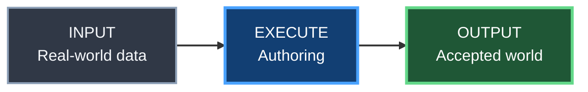

# YACS Blueprint diagram style

Status: **ACTIVE / AUTHORITATIVE VISUAL CONVENTION**

## Purpose

YACS uses the shared Gumball Mermaid visual language inspired by Unreal Engine Blueprint graphs.

The goal is not to imitate the Unreal Editor pixel-for-pixel. The goal is to make world architecture, simulation, tooling, CI and proof diagrams immediately recognizable, while keeping them text-based, diffable and reviewable in Git.

This convention is inherited from Gumball's `docs/DIAGRAM_STYLE.md` and specialized only where YACS needs product-specific semantics.

## Adoption rule

New or substantially revised diagrams for architecture, world generation, terrain/road authoring, PCG, simulation, tooling, data flow and proof should use this style.

Do **not** rewrite a correct existing diagram only for cosmetics. Migrate it when the owning SSOT is already being materially changed.

## Blueprint node classes

| Class | Meaning in YACS | Visual role |
|---|---|---|
| `input` | source data / external input | slate |
| `exec` | authoring / processing / execution step | Blueprint blue |
| `tool` | Unreal subsystem / DCC / adapter / integration tool | violet |
| `decision` | classifier / architecture decision / audit | amber |
| `success` | accepted generated result | green |
| `danger` | rejected / blocked / fail-closed state | red |
| `owned` | YACS-owned authority / implementation | graphite |
| `evidence` | provenance / screenshot / benchmark / proof | cyan |

## Canonical class definitions

Copy these definitions into Mermaid diagrams that use the shared style:



## Edge semantics

- solid edge — required data or execution flow;
- dashed edge — evidence, feedback, fallback or optional relationship;
- labelled edge — meaningful decision such as `PASS`, `FAIL`, `native works`, `gap remains`;
- thicker edge — primary execution spine when it improves readability.

Avoid decorative crossings. Prefer subgraphs when ownership would otherwise become ambiguous.

## Node wording

Prefer compact Blueprint-like labels:

```text
SOURCE
MASE DTM

CLASSIFY
Terrain facts

AUTHOR
Landscape Patch

VERIFY
Rider-close proof
```

Do not put paragraphs inside nodes.

## YACS-specific rule: authority must be visible

When a diagram mixes physical/source truth with presentation tools, make the authority boundary explicit.

Typical pattern:

```text
SOURCE DATA -> YACS AUTHORITY -> AUTHORING TOOL -> GENERATED PRESENTATION -> EVIDENCE
```

A tool node must never visually imply that it owns canonical route physics or source-data truth when it only authors presentation.

## Architecture evidence diagrams

When comparing architecture choices, visually distinguish:

- `evidence` — documented production/sample evidence;
- `decision` — YACS evaluation;
- `danger` — rejected or unproven shortcut;
- `success` — locally validated choice.

External evidence informs a decision. It does not replace YACS proof.

## Relationship to Gumball

Gumball owns the reusable visual language. YACS owns the product meaning of its diagrams.

If YACS develops a generally reusable diagram convention, evaluate it for promotion back into Gumball instead of allowing the visual language to drift independently.
