# Production world-generation architecture references

**Status:** evidence dossier / architecture reference  
**Authority:** informative evidence only; `WORLD_BUILDING_BIBLE.md` remains the world-building methodology SSOT  
**Diagram language:** [`DIAGRAM_STYLE.md`](DIAGRAM_STYLE.md)

This dossier reconstructs publicly documented production pipelines from **Far Cry 5** and **THE FINALS** as original YACS Mermaid diagrams.

The purpose is to learn architecture, not to redistribute another studio's artwork or implementation.

## 1. Copyright and provenance boundary

This document deliberately does **not** copy:

- presentation slides;
- screenshots;
- Houdini graph images;
- proprietary source code;
- proprietary assets;
- proprietary node implementations.

The diagrams below are original YACS reconstructions based on publicly described facts and workflows. Product names and tool names are used only to identify the referenced systems.

Copyright in the original presentations, articles, screenshots, game assets and artwork remains with their respective owners.

### Primary references

**Far Cry 5**

- GDC Vault — *Procedural World Generation of Far Cry 5*, Étienne Carrier, Ubisoft, GDC 2018:  
  https://www.gdcvault.com/play/1025557/Procedural-World-Generation-of-Far
- SideFX — *Procedural World Generation | Far Cry 5*:  
  https://www.sidefx.com/learn/talks/procedural-world-generation-far-cry-5/
- SideFX — *Far Cry 5*:  
  https://www.sidefx.com/community/far-cry-5/
- PlayStation Blog — *The Procedural World Generation of Far Cry 5*, authored by Étienne Carrier:  
  https://blog.playstation.com/2018/03/22/the-procedural-world-generation-of-far-cry-5/

**THE FINALS**

- SideFX / Embark Studios — *Making the Procedural Buildings of THE FINALS*, Adrian Björkerud:  
  https://www.sidefx.com/community/making-the-procedural-buildings-of-the-finals-using-houdini/

### Secondary reconstruction aid

The Far Cry 5 talk is also summarized in public technical notes that identify additional pipeline details and slide locations:

- Christian Mills — notes on the GDC/Houdini talk:  
  https://christianjmills.com/posts/procedural-tools-far-cry-5-notes/

Secondary notes are treated as a navigation/reconstruction aid, not as stronger evidence than Ubisoft/SideFX/Sony primary material.

---

# 2. Far Cry 5 — production world-generation architecture

## 2.1 What is production-proven

The publicly documented Far Cry 5 pipeline addressed an open world of roughly **100 km²** and was built to tolerate continuous terrain iteration during production.

Ubisoft describes an ecosystem of procedural tools for:

- biomes / vegetation;
- terrain texturing;
- freshwater networks;
- cliffs;
- fences and power lines;
- fog-density data;
- world-map generation.

Houdini Engine was integrated into Ubisoft's game editor so artists could use procedural tools from their normal editing environment.

The key architectural lesson is not "use Houdini". It is:

> **Treat the world as a network of data-producing tools whose outputs become inputs to later tools.**

## 2.2 Reconstructed high-level production loop

```mermaid
flowchart LR
    ART["ARTIST<br/>World edit"] --> TERRAIN["AUTHOR<br/>Terrain / terraforming"]
    TERRAIN --> WATER["GENERATE<br/>Freshwater"]
    WATER --> CLIFF["GENERATE<br/>Cliffs"]
    CLIFF --> BIOME["GENERATE<br/>Biomes"]
    BIOME --> POI["AUTHOR<br/>POIs · roads · buildings"]
    POI --> TEX["GENERATE<br/>Terrain textures"]
    TEX --> AUX["GENERATE<br/>Fog · world-map data"]
    AUX --> REVIEW["REVIEW<br/>Gameplay + art direction"]

    REVIEW -->|"terrain changes"| TERRAIN
    REVIEW -->|"local override"| POI
    REVIEW -->|"acceptable"| BAKE["BAKE<br/>Production world data"]

    NIGHTLY["AUTOMATION<br/>Nightly rebuild"] -.-> WATER
    NIGHTLY -.-> CLIFF
    NIGHTLY -.-> BIOME
    NIGHTLY -.-> TEX
    NIGHTLY -.-> AUX

    classDef input fill:#303846,stroke:#8ea1b8,color:#f7f9fc,stroke-width:2px;
    classDef exec fill:#123f73,stroke:#49a2ff,color:#ffffff,stroke-width:3px;
    classDef tool fill:#4b2f69,stroke:#b77cff,color:#ffffff,stroke-width:2px;
    classDef decision fill:#69470e,stroke:#f0a72f,color:#ffffff,stroke-width:3px;
    classDef success fill:#1f5736,stroke:#63d889,color:#ffffff,stroke-width:3px;
    classDef danger fill:#6b2429,stroke:#ff6b73,color:#ffffff,stroke-width:3px;
    classDef owned fill:#34373d,stroke:#9da4ae,color:#ffffff,stroke-width:2px;
    classDef evidence fill:#164d5c,stroke:#5bd6ef,color:#ffffff,stroke-width:2px;

    class ART input;
    class TERRAIN,WATER,CLIFF,BIOME,POI,TEX,AUX exec;
    class REVIEW decision;
    class NIGHTLY tool;
    class BAKE success;

    linkStyle default stroke-width:2px;
```

### Why this matters

The pipeline was explicitly designed around **iteration**, not a one-time world bake.

A terrain change is allowed to invalidate downstream generated content because the downstream content can be regenerated from rules.

That is directly relevant to YACS: changing the Passo Giau terrain or road corridor should not require manually repairing forests, rock scatter and other derived world content.

## 2.3 Reconstructed engine ↔ Houdini data exchange

Public descriptions of the talk identify a game-engine-to-Houdini bridge where the engine provides world context, splines/shapes, terrain sectors and file references, while disk-backed inputs provide heightmaps, painted biome information, terrain masks and data generated by previous tools.

The generated outputs include entity locations, terrain layers/data, geometry and logic-zone information.

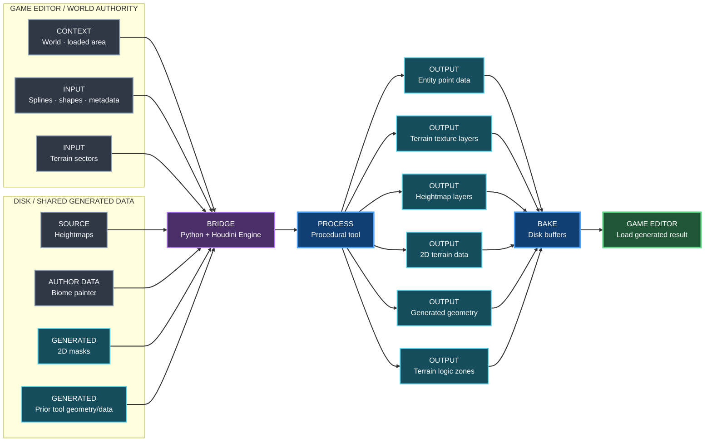

## 2.4 Tools communicate through data, not hidden coupling

One of the strongest Far Cry 5 patterns is that procedural tools can write data that later tools read.

A freshwater tool can produce a water mask. A later biome tool can consume it when deciding vegetation distribution. Road, cliff, fence and power-line information can likewise influence downstream biome generation.

Reconstructed dependency model:

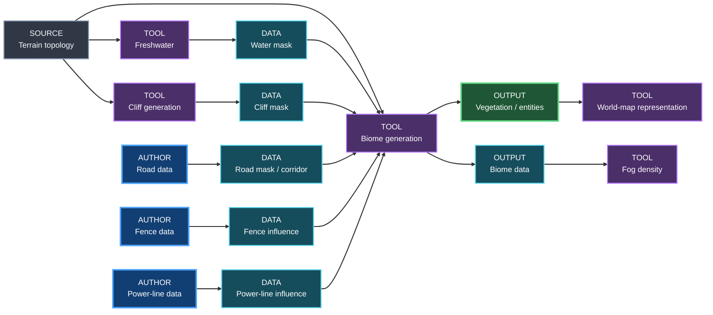

This is the closest production precedent for the YACS idea of a shared **World Data Layer / mask stack**.

## 2.5 Far Cry 5 biome architecture

Ubisoft publicly describes vegetation reacting to physical terrain conditions. The examples include exposed hills, valleys, north-facing slopes, humidity and wind.

Public talk notes further describe an **abiotic data** stage derived from terrain topology, including properties such as:

- occlusion;
- flow;
- slope;
- curvature;
- illumination;
- altitude;
- geographic position;
- wind-vector information.

Those data are combined with authored biome painting and procedural masks from other world tools.

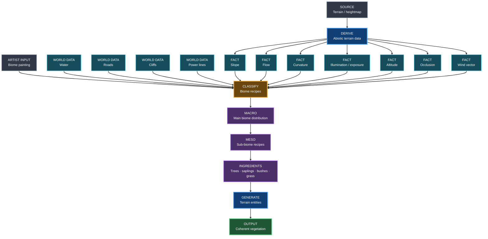

### Architectural takeaway for YACS

Do **not** hard-code:

```text
if elevation > X:
    place snow
if slope < Y:
    place trees
```

Instead, construct reusable environmental facts and let downstream recipes consume them.

For YACS that points toward:

```text
DTM/GIS
  -> elevation / slope / aspect / exposure / flow
  -> road / water / cliff / land-cover masks
  -> environment classification
  -> PCG/material recipes
  -> assets
```

## 2.6 Determinism and partial regeneration

Public notes from the talk describe two important production constraints:

- the same inputs should yield the same generated result;
- artists should be able to regenerate a bounded part of the world instead of rebuilding everything interactively.

The public reconstruction describes map subdivision down to small terrain sectors and both local/on-demand generation and full nightly rebuilds.

The exact sector dimensions are implementation details of Far Cry 5, not a YACS target. The transferable architecture is:

```mermaid
flowchart LR
    INPUTS["INPUT<br/>Versioned world data"] --> HASH["IDENTITY<br/>Stable inputs + seed"]
    HASH --> SCOPE{"SCOPE<br/>What changed?"}

    SCOPE -->|"local"| LOCAL["BAKE<br/>Affected region"]
    SCOPE -->|"full/nightly"| FULL["BAKE<br/>Whole world"]

    LOCAL --> OUT["OUTPUT<br/>Deterministic generated data"]
    FULL --> OUT

    OUT --> CACHE["STORE<br/>Reusable baked result"]
    CACHE --> NEXT["DOWNSTREAM<br/>Later tools"]

    classDef input fill:#303846,stroke:#8ea1b8,color:#f7f9fc,stroke-width:2px;
    classDef exec fill:#123f73,stroke:#49a2ff,color:#ffffff,stroke-width:3px;
    classDef tool fill:#4b2f69,stroke:#b77cff,color:#ffffff,stroke-width:2px;
    classDef decision fill:#69470e,stroke:#f0a72f,color:#ffffff,stroke-width:3px;
    classDef success fill:#1f5736,stroke:#63d889,color:#ffffff,stroke-width:3px;
    classDef danger fill:#6b2429,stroke:#ff6b73,color:#ffffff,stroke-width:3px;
    classDef owned fill:#34373d,stroke:#9da4ae,color:#ffffff,stroke-width:2px;
    classDef evidence fill:#164d5c,stroke:#5bd6ef,color:#ffffff,stroke-width:2px;

    class INPUTS input;
    class HASH owned;
    class SCOPE decision;
    class LOCAL,FULL exec;
    class OUT success;
    class CACHE,NEXT evidence;

    linkStyle default stroke-width:2px;
```

This strongly supports YACS exact-input / exact-SHA / deterministic-PCG thinking.

---

# 3. THE FINALS — production procedural-tool architecture

## 3.1 What is production-proven

Embark's Building Creator is documented as a production toolset used for shipped buildings in **THE FINALS**, and later for base-building generation in **ARC Raiders**.

The public production results reported by Embark include:

- roughly **4–6 minutes** from blockout to fractured asset per change;
- **100+ unique buildings** shipped across the two games;
- collision and occluder generation automated without manual authoring.

The important architecture lesson is:

> **Do not build one giant generator. Build a shared context plus small interoperable feature tools.**

## 3.2 Building Creator is context, not the whole generator

Embark describes the top-level Building Creator HDA as the shared context for one building. It exposes global parameters but delegates actual construction to Feature Nodes.


Feature order is generally flexible except where real dependencies exist.

That is a powerful distinction: **composition is modular, dependency is explicit**.

## 3.3 Dual-stream Feature Node contract

Embark documents Feature Nodes as generally carrying two logical streams:

1. the generated building geometry;
2. the blockout plus auxiliary data used by downstream nodes.

That is a reusable architecture pattern.

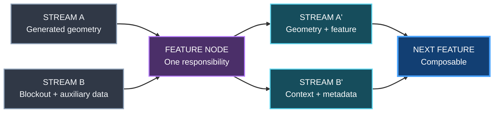

### YACS equivalent

The equivalent world-system contract could be:

```text
STREAM A = generated presentation
STREAM B = canonical world facts + masks + provenance
```

For example, a cliff tool could add cliff meshes to presentation while passing through terrain facts and adding a cliff mask for later vegetation/material rules.

## 3.4 Non-destructive artist overrides

Embark's public description emphasizes that viewport edits are stored as stable data rather than fragile references to generated geometry indices.

This means the procedural base can change while local artistic intent survives where the semantic feature still exists.

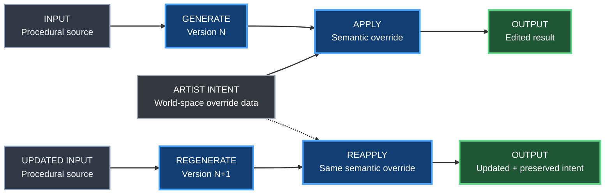

That is directly relevant to YACS `Local_Corrections` and later hero-composition overrides.

## 3.5 Generate expensive mechanical outputs at the end

THE FINALS pipeline delays collision and occluder generation until after creative feature assembly.

That follows a useful rule:

> **Put deterministic, non-creative derived outputs after the last creative dependency.**

Embark's collision pipeline stores simplified planar information per feature, derives convex collision from it, then post-processes collision after fracturing.

For YACS the analogous policy is:

- do not run expensive proof, collision rebuild, HLOD, derived nav or heavy bake before the authored geometry is stable enough to justify it;
- preserve compact semantic/intermediate data that lets mechanical outputs be regenerated.

## 3.6 Product rules constrain procedural freedom

Embark found that fully varied generated interiors could hurt wayfinding, so production rules were introduced to preserve gameplay readability.

That is an important correction to naive procedural generation:

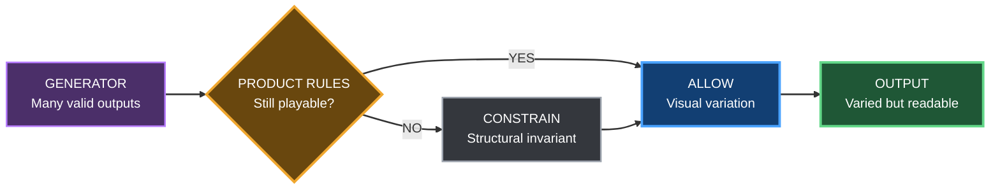

For YACS, road physics, sightlines, rideability, protected road corridor and rider-camera quality are exactly these kinds of product invariants.

---

# 4. Combined production pattern

Far Cry 5 and THE FINALS solve different content problems, but their architectures rhyme.

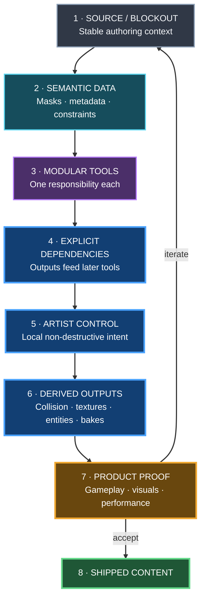

This is stronger evidence for YACS than copying the specific Houdini network topology of either project.

---

# 5. Direct YACS mapping

## 5.1 Proposed YACS world-data spine

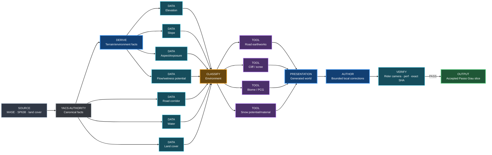

## 5.2 What YACS should copy as architecture

Copy the **patterns**, not proprietary implementation:

- stable source/authority data;
- semantic masks/facts as tool interfaces;
- modular generators;
- explicit downstream dependencies;
- deterministic regeneration;
- partial/local regeneration;
- non-destructive overrides;
- artist/product constraints above generator freedom;
- derived mechanical outputs late in the pipeline;
- production proof separate from generator success.

## 5.3 What YACS should not copy

Do not copy merely because it worked elsewhere:

- Dunia-specific buffer formats;
- Far Cry's sector sizes;
- Ubisoft's exact Houdini HDAs;
- Embark's building node taxonomy where it has no world-building analogue;
- THE FINALS collision/fracture implementation;
- another studio's asset layouts or proprietary content;
- screenshots or slide artwork.

## 5.4 Most important implication for the current road problem

The production lesson is **not** that YACS now needs Houdini everywhere.

It is that the road should be one tool in a data-driven world pipeline:

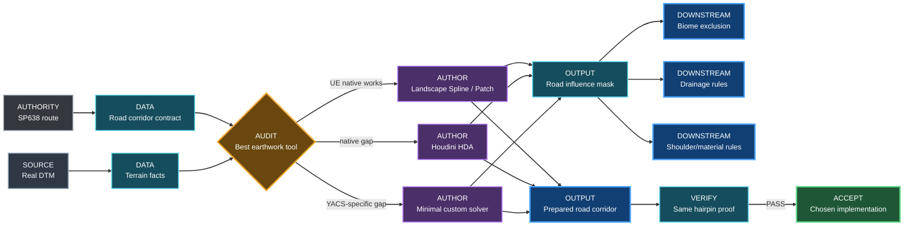

The chosen earthwork implementation should emit reusable world data for later systems instead of ending as an isolated geometry hack.

---

# 6. Production principles promoted into YACS

The following principles are supported by the public production evidence above and should be treated as architecture candidates already consistent with the World Building Bible:

1. **World generation is a dependency graph, not one generator.**
2. **Tools communicate through explicit data products.**
3. **Physical/environment facts should be derived once and reused downstream.**
4. **Generation must tolerate upstream iteration.**
5. **Local art direction must survive regeneration where possible.**
6. **Determinism matters when worlds are regenerated automatically or in pieces.**
7. **Build modular tools around one responsibility rather than a monolithic HDA/script.**
8. **Expose a simple author-facing workflow even if the underlying graph is complex.**
9. **Gameplay/product invariants constrain procedural freedom.**
10. **Use expensive derived processing after creative authoring dependencies.**
11. **Measure production value by iteration cost, not by how sophisticated the generator looks.**
12. **External evidence informs architecture; YACS proof decides adoption.**
