# YACS documentation

This directory is the navigation layer for YetAnotherCyclingSim documentation.

> **Rule:** use the document marked **authoritative** for the affected area. Experiments, old stage plans and proof history are evidence, not current architecture.

## Documentation map

```mermaid
flowchart TB
    INDEX["docs/README.md<br/>documentation router"]

    INDEX --> PRODUCT["Product & delivery"]
    INDEX --> SIM["Simulation & route"]
    INDEX --> WORLD["World building"]
    INDEX --> ENG["Engineering & proof"]
    INDEX --> HIST["History"]

    PRODUCT --> PRD["PRODUCT_REQUIREMENTS.md<br/>MVP scope"]
    PRODUCT --> ROADMAP["ROADMAP.md<br/>M0-M10 delivery"]

    SIM --> RUNTIME["STAGE_2_RUNTIME_CONTRACT.md"]
    SIM --> ROUTE["STAGE_3_ROUTE_GEOMETRY_CONTRACT.md"]
    SIM --> PHYS["ROAD_PHYSICS_PROFILE.md"]

    WORLD --> BIBLE["WORLD_BUILDING_BIBLE.md<br/>methodology"]
    WORLD --> AUTHOR["YACS_WORLD_AUTHORING_LIBRARY.md<br/>reusable authoring systems"]
    WORLD --> ASSETS["ASSET_PLAN.md"]

    ENG --> CI["CI_VALIDATION_TIERS.md"]
    ENG --> PLATFORM["ENGINEERING_PLATFORM.md"]
    ENG --> PERF["performance/"]

    HIST --> R41["STAGE3G_R4_1_*<br/>legacy M3 execution dossiers"]
    HIST --> ARCHIVE["archive/"]
    HIST --> EVIDENCE["visual/performance history"]
```

## Current focus

| Area | Current state |
|---|---|
| Delivery | **M3 — Route & World Foundation** |
| World method | **World Building Bible is authoritative** |
| Current priority | **real SP638 road + non-destructive Landscape earthworks** |
| Terrain source | **canonical real DTM path; presentation remains separate from physics truth** |
| Road authority | **canonical route / SP638 alignment; do not snap to Landscape grid** |
| Acceptance | **rider-camera visual review + exact-SHA technical/performance evidence** |
| Next product milestone | **M4 Cornering**, after M3 closes |

The old Stage 3G / R4.1 / B.x vocabulary is historical. Existing workflow names and evidence may retain it temporarily, but new planning uses M0-M10 plus named workstreams and GitHub Issues.

## Start here

| Need | Read first | Status |
|---|---|---|
| Product scope and MVP boundaries | [`PRODUCT_REQUIREMENTS.md`](PRODUCT_REQUIREMENTS.md) | **Authoritative** |
| Delivery order and current milestone | [`ROADMAP.md`](ROADMAP.md) | **Authoritative** |
| How to build terrain/roads/worlds | [`WORLD_BUILDING_BIBLE.md`](WORLD_BUILDING_BIBLE.md) | **Authoritative** |
| Road and cornering physics geometry | [`ROAD_PHYSICS_PROFILE.md`](ROAD_PHYSICS_PROFILE.md) | **Authoritative** |
| Reusable world-authoring systems | [`YACS_WORLD_AUTHORING_LIBRARY.md`](YACS_WORLD_AUTHORING_LIBRARY.md) | **Authoritative implementation library** |
| Asset plan / provenance | [`ASSET_PLAN.md`](ASSET_PLAN.md) | **Authoritative** |
| CI cost / proof cadence | [`CI_VALIDATION_TIERS.md`](CI_VALIDATION_TIERS.md) | **Authoritative** |
| Shared CI and governance platform | [`ENGINEERING_PLATFORM.md`](ENGINEERING_PLATFORM.md) | **Authoritative** |
| AI contributor rules | [`../AGENTS.md`](../AGENTS.md) | **Authoritative repository policy** |

## Authority map

### Product and delivery

- [`PRODUCT_REQUIREMENTS.md`](PRODUCT_REQUIREMENTS.md) — product intent and MVP boundaries.
- [`ROADMAP.md`](ROADMAP.md) — M0-M10 delivery order, current milestone and milestone acceptance.
- [`archive/ROADMAP_STAGE_TREE_2026-09-29.md`](archive/ROADMAP_STAGE_TREE_2026-09-29.md) — frozen legacy roadmap; history only.

### Simulation and route

- [`STAGE_2_RUNTIME_CONTRACT.md`](STAGE_2_RUNTIME_CONTRACT.md) — runtime ownership and fixed-step integration.
- [`STAGE_3_ROUTE_CONTEXT_CONTRACT.md`](STAGE_3_ROUTE_CONTEXT_CONTRACT.md) — route/environment context resolution.
- [`STAGE_3_ROUTE_GEOMETRY_CONTRACT.md`](STAGE_3_ROUTE_GEOMETRY_CONTRACT.md) — deterministic route geometry and presentation contract.
- [`ROAD_PHYSICS_PROFILE.md`](ROAD_PHYSICS_PROFILE.md) — canonical road-physics profile.

The `STAGE_*` filenames above are retained identifiers for established technical contracts. They are not permission to create new nested roadmap stages.

### World, terrain and authoring

- [`WORLD_BUILDING_BIBLE.md`](WORLD_BUILDING_BIBLE.md) — **authoritative methodology**: source terrain, Landscape Edit Layers, roads, earthworks, cliffs, materials, PCG, RVT, streaming and world acceptance.
- [`YACS_WORLD_AUTHORING_LIBRARY.md`](YACS_WORLD_AUTHORING_LIBRARY.md) — reusable authoring systems, semantic catalog, presets and generated-output boundary.
- [`ASSET_PLAN.md`](ASSET_PLAN.md) — source/technical asset ledger and provenance expectations.
- [`UE_MCP_WORLD_GENERATION.md`](UE_MCP_WORLD_GENERATION.md) — UE MCP orchestration workflow.
- [`YACS_REMOTE_EDITOR_AGENT.md`](YACS_REMOTE_EDITOR_AGENT.md) — remote editor-agent operating contract.
- [`UNREAL_TOOLING_PLUGIN_PLAN.md`](UNREAL_TOOLING_PLUGIN_PLAN.md) — plugin/tool plan; optional tooling never overrides the Bible.

### Performance

- [`performance/PERFORMANCE_FRAMEWORK.md`](performance/PERFORMANCE_FRAMEWORK.md) — cross-milestone performance lifecycle.
- [`performance/BUDGETS.md`](performance/BUDGETS.md) — budgets and budget-change rules.
- [`performance/STAGE3G_R5_RENDERING_TECH.md`](performance/STAGE3G_R5_RENDERING_TECH.md) — legacy-named M3 rendering/performance work packet.
- [`STAGE3G_ENVIRONMENT_PERFORMANCE.md`](STAGE3G_ENVIRONMENT_PERFORMANCE.md) — legacy-named environment performance contract.
- [`PERFORMANCE_MULTIPLAYER_ARCHITECTURE.md`](PERFORMANCE_MULTIPLAYER_ARCHITECTURE.md) — forward-looking architecture; not MVP scope authority.

### CI, runners and engineering platform

- [`CI_VALIDATION_TIERS.md`](CI_VALIDATION_TIERS.md) — lightweight, visual, performance and heavy-proof cadence.
- [`ENGINEERING_PLATFORM.md`](ENGINEERING_PLATFORM.md) — shared governance/security/CI contract.
- [`UNREAL_CI_RUNNER.md`](UNREAL_CI_RUNNER.md) — current Unreal runner operations.
- [`ci/BRANCH_HYGIENE.md`](ci/BRANCH_HYGIENE.md) — branch cleanup and hygiene.
- [`ci/CHANGE_CLASSIFIER.md`](ci/CHANGE_CLASSIFIER.md) — CI path classification.
- [`ci/GITHUB_ACTIONS_PLATFORM.md`](ci/GITHUB_ACTIONS_PLATFORM.md) — Actions conventions.
- [`ci/PROJECT_WORKFLOW.md`](ci/PROJECT_WORKFLOW.md) — project automation.

## Evidence, experiments and history

These documents remain valuable but no longer define the active roadmap hierarchy:

- [`STAGE3G_R4_1_ALPINE_VISUAL_RECOVERY.md`](STAGE3G_R4_1_ALPINE_VISUAL_RECOVERY.md) — detailed historical/current M3 visual-recovery dossier and proof record.
- [`STAGE3G_R4_1_TERRAIN_RESEARCH.md`](STAGE3G_R4_1_TERRAIN_RESEARCH.md) — terrain-source and Landscape research record.
- [`visual-history/README.md`](visual-history/README.md) — accepted/rejected visual evidence.
- [`performance-history/README.md`](performance-history/README.md) — performance evidence.
- [`experiments/README.md`](experiments/README.md) — bounded spikes.
- [`archive/`](archive/) — frozen/deprecated planning records.

When a legacy dossier disagrees with `WORLD_BUILDING_BIBLE.md` on **how new world work should be built**, the Bible wins unless a newer explicit architecture decision updates it.

## Complete top-level catalog

Every top-level Markdown document in `docs/` must appear here.

| Document | Role |
|---|---|
| [`ASSET_PLAN.md`](ASSET_PLAN.md) | Asset plan and provenance |
| [`CI_VALIDATION_TIERS.md`](CI_VALIDATION_TIERS.md) | CI/proof cadence |
| [`ENGINEERING_PLATFORM.md`](ENGINEERING_PLATFORM.md) | Shared engineering platform |
| [`PERFORMANCE_MULTIPLAYER_ARCHITECTURE.md`](PERFORMANCE_MULTIPLAYER_ARCHITECTURE.md) | Forward-looking architecture |
| [`PRODUCT_REQUIREMENTS.md`](PRODUCT_REQUIREMENTS.md) | Product/MVP SSOT |
| [`ROADMAP.md`](ROADMAP.md) | M0-M10 delivery SSOT |
| [`ROAD_PHYSICS_PROFILE.md`](ROAD_PHYSICS_PROFILE.md) | Road physics SSOT |
| [`STAGE3G_ENVIRONMENT_PERFORMANCE.md`](STAGE3G_ENVIRONMENT_PERFORMANCE.md) | Legacy-named M3 performance contract |
| [`STAGE3G_R4_1_ALPINE_VISUAL_RECOVERY.md`](STAGE3G_R4_1_ALPINE_VISUAL_RECOVERY.md) | Legacy M3 execution/proof dossier |
| [`STAGE3G_R4_1_TERRAIN_RESEARCH.md`](STAGE3G_R4_1_TERRAIN_RESEARCH.md) | Terrain research record |
| [`STAGE_2_RUNTIME_CONTRACT.md`](STAGE_2_RUNTIME_CONTRACT.md) | Runtime integration contract |
| [`STAGE_3_ROUTE_CONTEXT_CONTRACT.md`](STAGE_3_ROUTE_CONTEXT_CONTRACT.md) | Route-context contract |
| [`STAGE_3_ROUTE_GEOMETRY_CONTRACT.md`](STAGE_3_ROUTE_GEOMETRY_CONTRACT.md) | Route-geometry contract |
| [`UE_MCP_WORLD_GENERATION.md`](UE_MCP_WORLD_GENERATION.md) | UE MCP world generation |
| [`UNREAL_CI_RUNNER.md`](UNREAL_CI_RUNNER.md) | Current runner operations |
| [`UNREAL_RUNNER_PHASE1.md`](UNREAL_RUNNER_PHASE1.md) | Runner rollout history |
| [`UNREAL_SELF_HOSTED_RUNNER_PLAN.md`](UNREAL_SELF_HOSTED_RUNNER_PLAN.md) | Runner rollout plan/history |
| [`UNREAL_TOOLING_PLUGIN_PLAN.md`](UNREAL_TOOLING_PLUGIN_PLAN.md) | Unreal tooling plan |
| [`WORLD_BUILDING_BIBLE.md`](WORLD_BUILDING_BIBLE.md) | Authoritative world-building methodology |
| [`YACS_REMOTE_EDITOR_AGENT.md`](YACS_REMOTE_EDITOR_AGENT.md) | Remote editor-agent contract |
| [`YACS_WORLD_AUTHORING_LIBRARY.md`](YACS_WORLD_AUTHORING_LIBRARY.md) | World-authoring implementation library |

## Documentation maintenance

When behavior, architecture, CI, assets or acceptance criteria change:

1. start here and identify the authoritative document;
2. update that SSOT in the same PR;
3. keep experiments/proof history separate from current contracts;
4. do not create a new nested roadmap identifier for a task;
5. run the documentation guards required by `AGENTS.md`.

The documentation-index contract remains:

`python scripts/ci/check_docs_index.py`
