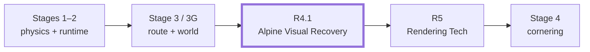
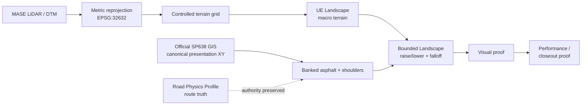

# YACS documentation

This directory is the navigation layer for YetAnotherCyclingSim documentation. Start here before changing code, Unreal assets, CI, physics, route geometry, or the world.

> **Rule of thumb:** use the document marked **authoritative** for the affected area. Working notes, experiments, proof history and rollout plans are supporting evidence, not a replacement for the current SSOT.

## Documentation map

```mermaid
flowchart TB
    INDEX["docs/README.md<br/>documentation router"]

    INDEX --> PRODUCT["Product & delivery"]
    INDEX --> SIM["Simulation & route"]
    INDEX --> WORLD["World & terrain"]
    INDEX --> ENG["Engineering & proof"]

    PRODUCT --> PRD["PRODUCT_REQUIREMENTS.md<br/>MVP scope"]
    PRODUCT --> ROADMAP["ROADMAP.md<br/>stage gates"]

    SIM --> RUNTIME["STAGE_2_RUNTIME_CONTRACT.md"]
    SIM --> ROUTE["STAGE_3_ROUTE_GEOMETRY_CONTRACT.md"]
    SIM --> PHYS["ROAD_PHYSICS_PROFILE.md"]

    WORLD --> R41["STAGE3G_R4_1_ALPINE_VISUAL_RECOVERY.md"]
    WORLD --> TERRAIN["STAGE3G_R4_1_TERRAIN_RESEARCH.md"]
    WORLD --> AUTHOR["YACS_WORLD_AUTHORING_LIBRARY.md"]

    ENG --> CI["CI_VALIDATION_TIERS.md"]
    ENG --> PLATFORM["ENGINEERING_PLATFORM.md"]
    ENG --> EVIDENCE["Visual / Performance History"]
```

The graph is a navigation aid, not a second source of truth. The linked documents below remain authoritative for their own areas.

## Current focus

| Area | Current state |
|---|---|
| Delivery | **Stage 3G R4.1 — Alpine Visual Recovery** |
| Golden visual slice | **1200 m** before full-route propagation |
| Terrain | **MASE DTM on `MASE_Base` + R4.1B.9 `SP638_Road` Landscape Edit Layer conform** |
| Road authority | **SP638 / route XY and Road Physics Profile remain authoritative; banking is real-data-first and never inferred from arbitrary render mesh or replaced by a fixed synthetic bank** |
| Acceptance | **human visual review + exact-SHA performance/proof evidence** |
| Next gate | **R5 stays blocked until R4.1 closeout is accepted** |

### Passo Giau terrain and proof pipeline

This pipeline deliberately keeps **terrain presentation**, **road presentation** and **route/physics authority** separate. A visually better Landscape must not silently become physics truth.

## Start here

| Need | Read first | Status |
|---|---|---|
| Product scope and MVP boundaries | [`PRODUCT_REQUIREMENTS.md`](PRODUCT_REQUIREMENTS.md) | **Authoritative** |
| Delivery order and current stage | [`ROADMAP.md`](ROADMAP.md) | **Authoritative** |
| Current Stage 3G R4.1 visual recovery | [`STAGE3G_R4_1_ALPINE_VISUAL_RECOVERY.md`](STAGE3G_R4_1_ALPINE_VISUAL_RECOVERY.md) | **Authoritative for R4.1** |
| Passo Giau terrain / DEM research | [`STAGE3G_R4_1_TERRAIN_RESEARCH.md`](STAGE3G_R4_1_TERRAIN_RESEARCH.md) | **Active working research** |
| Road and cornering physics geometry | [`ROAD_PHYSICS_PROFILE.md`](ROAD_PHYSICS_PROFILE.md) | **Authoritative** |
| CI cost / proof cadence | [`CI_VALIDATION_TIERS.md`](CI_VALIDATION_TIERS.md) | **Authoritative** |
| Shared CI and governance platform | [`ENGINEERING_PLATFORM.md`](ENGINEERING_PLATFORM.md) | **Authoritative** |
| AI contributor rules | [`../AGENTS.md`](../AGENTS.md) | **Authoritative repository policy** |

## Authority map

### Product, route and simulation

- [`PRODUCT_REQUIREMENTS.md`](PRODUCT_REQUIREMENTS.md) — product intent, MVP scope and simulation requirements.
- [`ROADMAP.md`](ROADMAP.md) — stage sequencing, Definition of Done and current delivery gates.
- [`STAGE_2_RUNTIME_CONTRACT.md`](STAGE_2_RUNTIME_CONTRACT.md) — Unreal/runtime ownership and fixed-step integration contract.
- [`STAGE_3_ROUTE_CONTEXT_CONTRACT.md`](STAGE_3_ROUTE_CONTEXT_CONTRACT.md) — route/environment context resolution at fixed-step boundaries.
- [`STAGE_3_ROUTE_GEOMETRY_CONTRACT.md`](STAGE_3_ROUTE_GEOMETRY_CONTRACT.md) — deterministic route geometry and spline presentation contract.
- [`ROAD_PHYSICS_PROFILE.md`](ROAD_PHYSICS_PROFILE.md) — canonical road-physics profile, curvature, banking and route-local coordinates.

### World, terrain and authoring

- [`STAGE3G_R4_1_ALPINE_VISUAL_RECOVERY.md`](STAGE3G_R4_1_ALPINE_VISUAL_RECOVERY.md) — current R4.1 visual-recovery acceptance contract.
- [`STAGE3G_R4_1_TERRAIN_RESEARCH.md`](STAGE3G_R4_1_TERRAIN_RESEARCH.md) — active Passo Giau terrain source and Unreal Landscape research.
- [`ASSET_PLAN.md`](ASSET_PLAN.md) — source/technical asset plan and provenance expectations.
- [`YACS_WORLD_AUTHORING_LIBRARY.md`](YACS_WORLD_AUTHORING_LIBRARY.md) — reusable world-authoring library contract.
- [`UE_MCP_WORLD_GENERATION.md`](UE_MCP_WORLD_GENERATION.md) — UE MCP world-generation workflow.
- [`YACS_REMOTE_EDITOR_AGENT.md`](YACS_REMOTE_EDITOR_AGENT.md) — remote editor-agent operating contract.
- [`UNREAL_TOOLING_PLUGIN_PLAN.md`](UNREAL_TOOLING_PLUGIN_PLAN.md) — Unreal tooling/plugin plan; treat as a plan unless a current SSOT explicitly promotes a section to contract.

### Performance

- [`performance/PERFORMANCE_FRAMEWORK.md`](performance/PERFORMANCE_FRAMEWORK.md) — cross-stage performance framework.
- [`performance/BUDGETS.md`](performance/BUDGETS.md) — current performance budgets and budget-change rules.
- [`performance/STAGE3G_R5_RENDERING_TECH.md`](performance/STAGE3G_R5_RENDERING_TECH.md) — Stage 3G R5 rendering-tech scope.
- [`STAGE3G_ENVIRONMENT_PERFORMANCE.md`](STAGE3G_ENVIRONMENT_PERFORMANCE.md) — Stage 3G environment performance contract.
- [`PERFORMANCE_MULTIPLAYER_ARCHITECTURE.md`](PERFORMANCE_MULTIPLAYER_ARCHITECTURE.md) — forward-looking performance/multiplayer architecture; not permission to pull post-MVP scope forward.

### CI, runners and engineering platform

- [`CI_VALIDATION_TIERS.md`](CI_VALIDATION_TIERS.md) — when lightweight, visual, performance and full proofs run.
- [`ENGINEERING_PLATFORM.md`](ENGINEERING_PLATFORM.md) — shared governance/security/CI contract.
- [`UNREAL_CI_RUNNER.md`](UNREAL_CI_RUNNER.md) — current Unreal CI runner operations.
- [`ci/BRANCH_HYGIENE.md`](ci/BRANCH_HYGIENE.md) — branch cleanup and hygiene.
- [`ci/CHANGE_CLASSIFIER.md`](ci/CHANGE_CLASSIFIER.md) — CI path classification.
- [`ci/GITHUB_ACTIONS_PLATFORM.md`](ci/GITHUB_ACTIONS_PLATFORM.md) — GitHub Actions platform conventions.
- [`ci/PROJECT_WORKFLOW.md`](ci/PROJECT_WORKFLOW.md) — project workflow automation.
- [`UNREAL_RUNNER_PHASE1.md`](UNREAL_RUNNER_PHASE1.md) and [`UNREAL_SELF_HOSTED_RUNNER_PLAN.md`](UNREAL_SELF_HOSTED_RUNNER_PLAN.md) — rollout/history documents; verify against `UNREAL_CI_RUNNER.md` before using them as current operations truth.

## Evidence, experiments and history

These directories are intentionally **not** the primary SSOT for current implementation decisions:

- [`visual-history/README.md`](visual-history/README.md) — accepted/rejected visual evidence and provenance.
- [`performance-history/README.md`](performance-history/README.md) — performance evidence over time.
- [`experiments/README.md`](experiments/README.md) — bounded spikes and experiment records.
- [`legal/AI_ASSISTED_DEVELOPMENT.md`](legal/AI_ASSISTED_DEVELOPMENT.md) — AI-assisted development policy.
- [`legal/DEPENDENCY_PROVENANCE.md`](legal/DEPENDENCY_PROVENANCE.md) — dependency and third-party provenance ledger.

Historical evidence may explain *why* a decision was made. It does not override a newer authoritative contract.

## Complete top-level catalog

Every top-level Markdown document in `docs/` must appear here. CI enforces this so a new document cannot become invisible and this index cannot silently disappear.

| Document | Role |
|---|---|
| [`ASSET_PLAN.md`](ASSET_PLAN.md) | Asset plan and provenance |
| [`CI_VALIDATION_TIERS.md`](CI_VALIDATION_TIERS.md) | CI/proof cadence |
| [`ENGINEERING_PLATFORM.md`](ENGINEERING_PLATFORM.md) | Shared engineering platform |
| [`PERFORMANCE_MULTIPLAYER_ARCHITECTURE.md`](PERFORMANCE_MULTIPLAYER_ARCHITECTURE.md) | Forward-looking architecture |
| [`PRODUCT_REQUIREMENTS.md`](PRODUCT_REQUIREMENTS.md) | Product/MVP SSOT |
| [`ROADMAP.md`](ROADMAP.md) | Delivery/stage SSOT |
| [`ROAD_PHYSICS_PROFILE.md`](ROAD_PHYSICS_PROFILE.md) | Road physics SSOT |
| [`STAGE3G_ENVIRONMENT_PERFORMANCE.md`](STAGE3G_ENVIRONMENT_PERFORMANCE.md) | Stage 3G performance contract |
| [`STAGE3G_R4_1_ALPINE_VISUAL_RECOVERY.md`](STAGE3G_R4_1_ALPINE_VISUAL_RECOVERY.md) | Active R4.1 visual contract |
| [`STAGE3G_R4_1_TERRAIN_RESEARCH.md`](STAGE3G_R4_1_TERRAIN_RESEARCH.md) | Active terrain research |
| [`STAGE_2_RUNTIME_CONTRACT.md`](STAGE_2_RUNTIME_CONTRACT.md) | Runtime integration contract |
| [`STAGE_3_ROUTE_CONTEXT_CONTRACT.md`](STAGE_3_ROUTE_CONTEXT_CONTRACT.md) | Route-context contract |
| [`STAGE_3_ROUTE_GEOMETRY_CONTRACT.md`](STAGE_3_ROUTE_GEOMETRY_CONTRACT.md) | Route-geometry contract |
| [`UE_MCP_WORLD_GENERATION.md`](UE_MCP_WORLD_GENERATION.md) | UE MCP world generation |
| [`UNREAL_CI_RUNNER.md`](UNREAL_CI_RUNNER.md) | Current runner operations |
| [`UNREAL_RUNNER_PHASE1.md`](UNREAL_RUNNER_PHASE1.md) | Runner rollout history |
| [`UNREAL_SELF_HOSTED_RUNNER_PLAN.md`](UNREAL_SELF_HOSTED_RUNNER_PLAN.md) | Runner rollout plan/history |
| [`UNREAL_TOOLING_PLUGIN_PLAN.md`](UNREAL_TOOLING_PLUGIN_PLAN.md) | Unreal tooling plan |
| [`YACS_REMOTE_EDITOR_AGENT.md`](YACS_REMOTE_EDITOR_AGENT.md) | Remote editor-agent contract |
| [`YACS_WORLD_AUTHORING_LIBRARY.md`](YACS_WORLD_AUTHORING_LIBRARY.md) | World-authoring library contract |

## Documentation maintenance

When a change affects behavior, architecture, CI, assets or acceptance criteria:

1. start from this index and identify the authoritative document for that area;
2. update that document in the same PR if the implementation changes its truth;
3. keep experiment/proof history separate from current contracts;
4. run the documentation index contract: `python scripts/ci/check_docs_index.py`.

The contract verifies the index exists, required authority links are present, local index links resolve, UTF-8 text is readable, and every top-level `docs/*.md` file is indexed.
