# YACS documentation

This directory is the navigation layer for YetAnotherCyclingSim documentation.

> **Rule:** use the document marked **authoritative** for the affected area. Experiments, old stage plans and proof history are evidence, not current architecture.

## Documentation map

```mermaid
flowchart TB
    INDEX["ROUTER<br/>docs/README.md"]

    INDEX --> PRODUCT["PRODUCT<br/>Scope · delivery"]
    INDEX --> SIM["SIMULATION<br/>Route · physics"]
    INDEX --> WORLD["WORLD<br/>Terrain · authoring"]
    INDEX --> ENG["ENGINEERING<br/>CI · proof"]
    INDEX -.-> HIST["HISTORY<br/>Evidence · archive"]

    PRODUCT --> PRD["SSOT<br/>PRODUCT_REQUIREMENTS"]
    PRODUCT --> ROADMAP["SSOT<br/>ROADMAP M0-M10"]

    SIM --> RUNTIME["CONTRACT<br/>Runtime"]
    SIM --> ROUTE["CONTRACT<br/>Route geometry"]
    SIM --> PHYS["SSOT<br/>Road physics"]

    WORLD --> BIBLE["SSOT<br/>World Building Bible"]
    WORLD --> AUTHOR["LIBRARY<br/>World authoring"]
    WORLD --> ASSETS["LEDGER<br/>Asset plan"]
    WORLD --> PRODREF["EVIDENCE<br/>Production pipelines"]
    WORLD --> STYLE["STYLE<br/>Blueprint diagrams"]

    ENG --> CI["CONTRACT<br/>CI validation tiers"]
    ENG --> PLATFORM["PLATFORM<br/>Gumball integration"]
    ENG --> PERF["EVIDENCE<br/>Performance"]

    HIST --> R41["LEGACY<br/>Stage / R / B dossiers"]
    HIST --> ARCHIVE["ARCHIVE<br/>Frozen history"]
    HIST --> EVIDENCE["EVIDENCE<br/>Visual + performance"]

    classDef input fill:#303846,stroke:#8ea1b8,color:#f7f9fc,stroke-width:2px;
    classDef exec fill:#123f73,stroke:#49a2ff,color:#ffffff,stroke-width:3px;
    classDef tool fill:#4b2f69,stroke:#b77cff,color:#ffffff,stroke-width:2px;
    classDef decision fill:#69470e,stroke:#f0a72f,color:#ffffff,stroke-width:3px;
    classDef success fill:#1f5736,stroke:#63d889,color:#ffffff,stroke-width:3px;
    classDef danger fill:#6b2429,stroke:#ff6b73,color:#ffffff,stroke-width:3px;
    classDef owned fill:#34373d,stroke:#9da4ae,color:#ffffff,stroke-width:2px;
    classDef evidence fill:#164d5c,stroke:#5bd6ef,color:#ffffff,stroke-width:2px;

    class INDEX decision;
    class PRODUCT,SIM,WORLD,ENG exec;
    class HIST input;
    class PRD,ROADMAP,RUNTIME,ROUTE,PHYS,BIBLE owned;
    class AUTHOR,ASSETS,STYLE,PLATFORM tool;
    class PRODREF evidence;
    class CI owned;
    class PERF,EVIDENCE evidence;
    class R41,ARCHIVE input;

    linkStyle default stroke-width:2px;
```

## Current focus

| Area | Current state |
|---|---|
| Delivery | **M3 — Route & World Foundation** |
| World method | **World Building Bible is authoritative** |
| Geographic fidelity | **1:1 real-world scale; no route compression, relocation or invented macro terrain** |
| Architecture policy | **Embark-first + tools-first + version-matched Epic/PCGEx API evidence + local proof** |
| Diagram language | **Gumball Blueprint Mermaid style** |
| Current priority | **Issue #337: import the remaining current-Landscape paved network with source/PNOA review, both-edge geometry gates, bounded CUT/support and explicit blocked coverage; preserve the accepted #332 hairpin** |
| Route reference | **sea-level Sa Calobra → Coll dels Reis → Ma-10 → Menut/Binifaldó → Coll des Pedregaret; ~29–30 km planning estimate, exact chainage pending** |
| Terrain source | **CNIG/IGN MDT50cm Sa Calobra 8 km × 8 km benchmark; bounded native UE import PASS, terrain visual accepted; performance pending** |
| Road authority | **verified Ma-2141 alignment; smooth presentation ribbon is evaluated against Landscape, never snapped/bent to native DTM facets; terrain-fit residuals drive cut/fill/structure review** |
| Acceptance | **exact-SHA terrain-fit + CUT/support geometry proof, mandatory Geometry Inspection, rider-camera human review and performance evidence; transient geometry does not grant durable road admission** |
| Next product milestone | **M4 Cornering**, after M3 closes |

The old Stage 3G / R4.1 / B.x vocabulary is historical. Existing workflow names and evidence may retain it temporarily, but new planning uses M0-M10 plus named workstreams and GitHub Issues.

## Start here

| Need | Read first | Status |
|---|---|---|
| Product scope and MVP boundaries | [`PRODUCT_REQUIREMENTS.md`](PRODUCT_REQUIREMENTS.md) | **Authoritative** |
| Delivery order and current milestone | [`ROADMAP.md`](ROADMAP.md) | **Authoritative** |
| How to build terrain/roads/worlds | [`WORLD_BUILDING_BIBLE.md`](WORLD_BUILDING_BIBLE.md) | **Authoritative** |
| First full-route visual/data reference | [`SA_CALOBRA_MENUT_ROUTE_REFERENCE.md`](SA_CALOBRA_MENUT_ROUTE_REFERENCE.md) | **Evidence / candidate** |
| Draw architecture/workflow diagrams | [`DIAGRAM_STYLE.md`](DIAGRAM_STYLE.md) | **Authoritative visual convention** |
| Inspect shipped production world pipelines | [`PRODUCTION_WORLD_ARCHITECTURE_REFERENCES.md`](PRODUCTION_WORLD_ARCHITECTURE_REFERENCES.md) | **Evidence dossier** |
| Road and cornering physics geometry | [`ROAD_PHYSICS_PROFILE.md`](ROAD_PHYSICS_PROFILE.md) | **Authoritative** |
| Reusable world-authoring systems | [`YACS_WORLD_AUTHORING_LIBRARY.md`](YACS_WORLD_AUTHORING_LIBRARY.md) | **Authoritative implementation library** |
| Asset plan / provenance | [`ASSET_PLAN.md`](ASSET_PLAN.md) | **Authoritative** |
| CI cost / proof cadence | [`CI_VALIDATION_TIERS.md`](CI_VALIDATION_TIERS.md) | **Authoritative** |
| Shared CI and governance platform | [`ENGINEERING_PLATFORM.md`](ENGINEERING_PLATFORM.md) | **Authoritative** |
| AI contributor rules | [`../AGENTS.md`](../AGENTS.md) | **Authoritative repository policy** |

## Authority map

### Product and delivery

- [`PRODUCT_REQUIREMENTS.md`](PRODUCT_REQUIREMENTS.md) — product intent and MVP boundaries.
- [`ROADMAP.md`](ROADMAP.md) — M0-M10 delivery order, current milestone and milestone acceptance.
- [`archive/ROADMAP_STAGE_TREE_2026-09-29.md`](archive/ROADMAP_STAGE_TREE_2026-09-29.md) — frozen legacy roadmap; history only.

### Simulation and route

- [`STAGE_2_RUNTIME_CONTRACT.md`](STAGE_2_RUNTIME_CONTRACT.md) — runtime ownership and fixed-step integration.
- [`STAGE_3_ROUTE_CONTEXT_CONTRACT.md`](STAGE_3_ROUTE_CONTEXT_CONTRACT.md) — route/environment context resolution.
- [`STAGE_3_ROUTE_GEOMETRY_CONTRACT.md`](STAGE_3_ROUTE_GEOMETRY_CONTRACT.md) — deterministic route geometry and presentation contract.
- [`ROAD_PHYSICS_PROFILE.md`](ROAD_PHYSICS_PROFILE.md) — canonical road-physics profile.

The `STAGE_*` filenames above are retained identifiers for established technical contracts. They are not permission to create new nested roadmap stages.

### World, terrain and authoring

- [`WORLD_BUILDING_BIBLE.md`](WORLD_BUILDING_BIBLE.md) — **authoritative methodology**: source terrain, tools-first/evidence-led architecture, Landscape Edit Layers, roads, earthworks, cliffs, materials, PCG, RVT, streaming and world acceptance.
- [`SA_CALOBRA_MENUT_ROUTE_REFERENCE.md`](SA_CALOBRA_MENUT_ROUTE_REFERENCE.md) — evidence dossier for the candidate 1:1 sea-to-forest route, visual identity, source acquisition and asset references; not route/physics authority.
- [`DIAGRAM_STYLE.md`](DIAGRAM_STYLE.md) — Gumball-derived Blueprint Mermaid language for new or substantially revised YACS architecture/workflow diagrams.
- [`PRODUCTION_WORLD_ARCHITECTURE_REFERENCES.md`](PRODUCTION_WORLD_ARCHITECTURE_REFERENCES.md) — copyright-safe reconstructions of public Far Cry 5 and THE FINALS production pipelines plus direct YACS mappings; evidence, not methodology authority.
- [`YACS_WORLD_AUTHORING_LIBRARY.md`](YACS_WORLD_AUTHORING_LIBRARY.md) — reusable authoring systems, semantic catalog, presets and generated-output boundary.
- [`ASSET_PLAN.md`](ASSET_PLAN.md) — source/technical asset ledger and provenance expectations.
- [`UE_MCP_WORLD_GENERATION.md`](UE_MCP_WORLD_GENERATION.md) — UE MCP orchestration workflow.
- [`YACS_REMOTE_EDITOR_AGENT.md`](YACS_REMOTE_EDITOR_AGENT.md) — remote editor-agent operating contract.
- [`UNREAL_TOOLING_PLUGIN_PLAN.md`](UNREAL_TOOLING_PLUGIN_PLAN.md) — plugin/tool plan; optional tooling never overrides the Bible.

### Performance

- [`performance/PERFORMANCE_FRAMEWORK.md`](performance/PERFORMANCE_FRAMEWORK.md) — cross-milestone performance lifecycle.
- [`performance/BUDGETS.md`](performance/BUDGETS.md) — budgets and budget-change rules.
- [`performance/STAGE3G_R5_RENDERING_TECH.md`](performance/STAGE3G_R5_RENDERING_TECH.md) — legacy-named M3 rendering/performance work packet.
- [`STAGE3G_ENVIRONMENT_PERFORMANCE.md`](STAGE3G_ENVIRONMENT_PERFORMANCE.md) — legacy-named environment performance contract.
- [`PERFORMANCE_MULTIPLAYER_ARCHITECTURE.md`](PERFORMANCE_MULTIPLAYER_ARCHITECTURE.md) — forward-looking architecture; not MVP scope authority.

### CI, runners and engineering platform

- [`CI_VALIDATION_TIERS.md`](CI_VALIDATION_TIERS.md) — lightweight, visual, performance and heavy-proof cadence.
- [`ENGINEERING_PLATFORM.md`](ENGINEERING_PLATFORM.md) — shared governance/security/CI contract.
- [`UNREAL_CI_RUNNER.md`](UNREAL_CI_RUNNER.md) — current Unreal runner operations.
- [`ci/BRANCH_HYGIENE.md`](ci/BRANCH_HYGIENE.md) — branch cleanup and hygiene.
- [`ci/CHANGE_CLASSIFIER.md`](ci/CHANGE_CLASSIFIER.md) — CI path classification.
- [`ci/GITHUB_ACTIONS_PLATFORM.md`](ci/GITHUB_ACTIONS_PLATFORM.md) — Actions conventions.
- [`ci/TEST_AND_PROOF_AUDIT.md`](ci/TEST_AND_PROOF_AUDIT.md) — Issue #320 hosted-test coverage and world-proof convergence audit.
- [`ci/WORKFLOW_LIFECYCLE.md`](ci/WORKFLOW_LIFECYCLE.md) — current/retired GitHub Actions workflow authority.
- [`ci/PROJECT_WORKFLOW.md`](ci/PROJECT_WORKFLOW.md) — project automation.

## Evidence, experiments and history

These documents remain valuable but no longer define the active roadmap hierarchy:

- [`STAGE3G_R4_1_ALPINE_VISUAL_RECOVERY.md`](STAGE3G_R4_1_ALPINE_VISUAL_RECOVERY.md) — detailed historical/current M3 visual-recovery dossier and proof record.
- [`STAGE3G_R4_1_TERRAIN_RESEARCH.md`](STAGE3G_R4_1_TERRAIN_RESEARCH.md) — terrain-source and Landscape research record.
- [`visual-history/README.md`](visual-history/README.md) — accepted/rejected visual evidence.
- [`performance-history/README.md`](performance-history/README.md) — performance evidence.
- [`experiments/README.md`](experiments/README.md) — bounded spikes.
- [`archive/`](archive/) — frozen/deprecated planning records.

When a legacy dossier disagrees with `WORLD_BUILDING_BIBLE.md` on **how new world work should be built**, the Bible wins unless a newer explicit architecture decision updates it.

## Complete top-level catalog

Every top-level Markdown document in `docs/` must appear here.

| Document | Role |
|---|---|
| [`ASSET_PLAN.md`](ASSET_PLAN.md) | Asset plan and provenance |
| [`CI_VALIDATION_TIERS.md`](CI_VALIDATION_TIERS.md) | CI/proof cadence |
| [`DIAGRAM_STYLE.md`](DIAGRAM_STYLE.md) | Gumball-derived Blueprint diagram convention |
| [`ENGINEERING_PLATFORM.md`](ENGINEERING_PLATFORM.md) | Shared engineering platform |
| [`PERFORMANCE_MULTIPLAYER_ARCHITECTURE.md`](PERFORMANCE_MULTIPLAYER_ARCHITECTURE.md) | Forward-looking architecture |
| [`PRODUCT_REQUIREMENTS.md`](PRODUCT_REQUIREMENTS.md) | Product/MVP SSOT |
| [`PRODUCTION_WORLD_ARCHITECTURE_REFERENCES.md`](PRODUCTION_WORLD_ARCHITECTURE_REFERENCES.md) | Production world-generation evidence dossier |
| [`ROADMAP.md`](ROADMAP.md) | M0-M10 delivery SSOT |
| [`ROAD_PHYSICS_PROFILE.md`](ROAD_PHYSICS_PROFILE.md) | Road physics SSOT |
| [`STAGE3G_ENVIRONMENT_PERFORMANCE.md`](STAGE3G_ENVIRONMENT_PERFORMANCE.md) | Legacy-named M3 performance contract |
| [`STAGE3G_R4_1_ALPINE_VISUAL_RECOVERY.md`](STAGE3G_R4_1_ALPINE_VISUAL_RECOVERY.md) | Legacy M3 execution/proof dossier |
| [`STAGE3G_R4_1_TERRAIN_RESEARCH.md`](STAGE3G_R4_1_TERRAIN_RESEARCH.md) | Terrain research record |
| [`STAGE_2_RUNTIME_CONTRACT.md`](STAGE_2_RUNTIME_CONTRACT.md) | Runtime integration contract |
| [`STAGE_3_ROUTE_CONTEXT_CONTRACT.md`](STAGE_3_ROUTE_CONTEXT_CONTRACT.md) | Route-context contract |
| [`STAGE_3_ROUTE_GEOMETRY_CONTRACT.md`](STAGE_3_ROUTE_GEOMETRY_CONTRACT.md) | Route-geometry contract |
| [`UE_MCP_WORLD_GENERATION.md`](UE_MCP_WORLD_GENERATION.md) | UE MCP world generation |
| [`UNREAL_CI_RUNNER.md`](UNREAL_CI_RUNNER.md) | Current runner operations |
| [`UNREAL_RUNNER_PHASE1.md`](UNREAL_RUNNER_PHASE1.md) | Runner rollout history |
| [`UNREAL_SELF_HOSTED_RUNNER_PLAN.md`](UNREAL_SELF_HOSTED_RUNNER_PLAN.md) | Runner rollout plan/history |
| [`UNREAL_TOOLING_PLUGIN_PLAN.md`](UNREAL_TOOLING_PLUGIN_PLAN.md) | Unreal tooling plan |
| [`WORLD_BUILDING_BIBLE.md`](WORLD_BUILDING_BIBLE.md) | Authoritative world-building methodology |
| [`YACS_REMOTE_EDITOR_AGENT.md`](YACS_REMOTE_EDITOR_AGENT.md) | Remote editor-agent contract |
| [`YACS_WORLD_AUTHORING_LIBRARY.md`](YACS_WORLD_AUTHORING_LIBRARY.md) | World-authoring implementation library |

## External Unreal / PCGEx technical authority

YACS documentation defines project intent, ownership and acceptance. When a task
also depends on what Unreal Engine or PCGEx **actually supports**, agents must use
version-matched primary technical sources rather than memory or secondary summaries.

- Unreal Engine: official Epic documentation and C++ API reference for the exact
  project/runner engine version.
- PCGEx: official GitBook for the exact YACS-approved plugin revision/version;
  agents should start from `llms.txt` / `llms-full.txt`, then read the exact
  system/node page.
- If PCGEx documentation and the pinned revision differ or the behavior is not
  documented, inspect the pinned upstream source/header and mark any remaining
  uncertainty explicitly.
- Vendor documentation establishes capability and semantics; it never overrides
  YACS route/physics/world authority or acceptance criteria.

The enforceable agent workflow is in [`../AGENTS.md`](../AGENTS.md), and the
world-specific application is in [`WORLD_BUILDING_BIBLE.md`](WORLD_BUILDING_BIBLE.md).
## Documentation maintenance

When behavior, architecture, CI, assets or acceptance criteria change:

1. start here and identify the authoritative document;
2. update that SSOT in the same PR;
3. keep experiments/proof history separate from current contracts;
4. do not create a new nested roadmap identifier for a task;
5. use [`DIAGRAM_STYLE.md`](DIAGRAM_STYLE.md) when materially revising architecture/workflow diagrams;
6. run the documentation guards required by `AGENTS.md`.

The documentation-index contract remains:

`python scripts/ci/check_docs_index.py`

Issue #331 closeout also validates hairpin entry/exit curvature and bounded 3D
road banking/height before regenerating CUT/support; see the World Building
Bible's Hairpin alignment and surface closeout subsection.

Owner acceptance now also requires the
[BOB single-direction bend contract](WORLD_BUILDING_BIBLE.md#bob-single-direction-bend-contract):
constant matching entry/exit widths, justified main-bend widening only, and no
reverse turns on either final pavement edge. The current 183a30e visual result
is rejected against that requirement. The native convex-cubic implementation
below that contract owns the replacement; fresh exact-SHA proof and owner visual
acceptance are required before admitting it.
