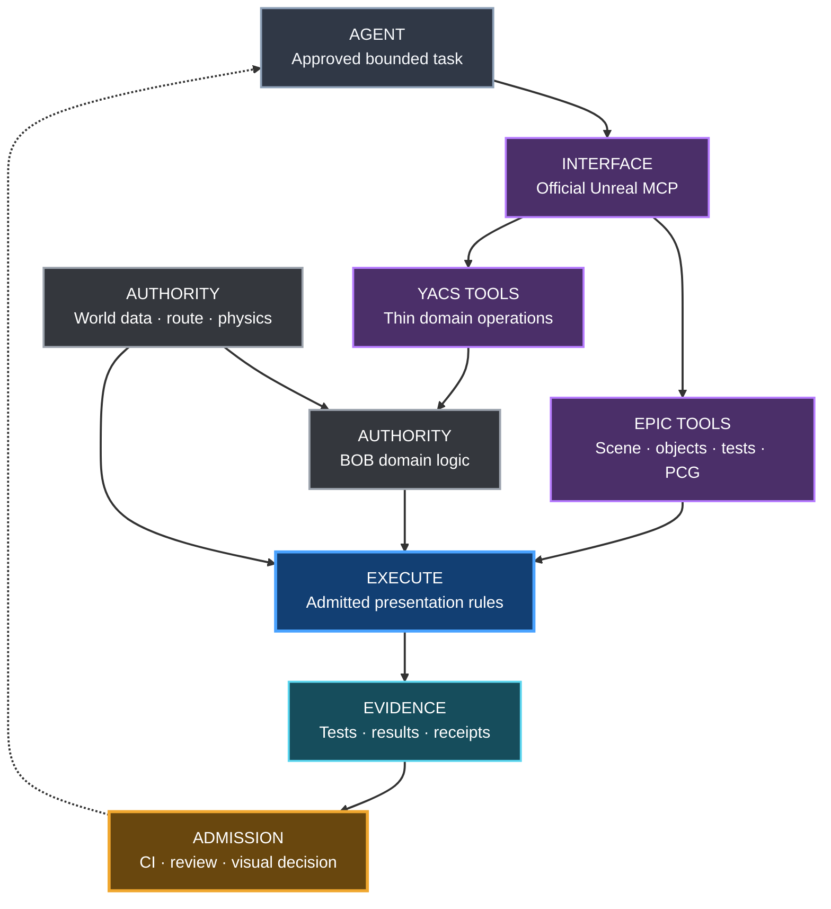

# YACS UE-MCP world-generation architecture

**Status:** official Epic MCP direction approved; #384's #363 entry gate satisfied on 2026-10-09, before #364. Draft PR #467 implements read-only source preflight and BOB domain preparation; official activation is blocked on unestablished argument restrictions and runtime proof.
**Tracking:** #384 adoption; #385 documentation; #85 historical integration; follow-ups #376 (Performance MCP), #377 (Buildings MCP)
**Retained integration:** `db-lyon/ue-mcp` at reviewed `v1.3.9`; unchanged until proven cutover
**Engine baseline:** project association 5.8; home engine inspected 2026-10-05: 5.8.2, changelist 56702186. Reverify exact project/runner versions at kickoff.

## Official Unreal MCP adoption

### Decision and status

**Entry gate satisfied — #363 completed through merged PR #446. #384 is open; its source preflight and domain adapter are the first implementation fragment. Official MCP is not yet admitted.**

The owner approved a small official Unreal MCP adoption workstream between world-finishing step 2 (#363) and step 3 (#364). "Step 2.5" is a shorthand inside **M3**, not a new product milestone or a renumbering of the existing 13 steps.

**Execution order:** #363 full acceptance and protected merge → this bounded spike → #364 asphalt/shoulder → #365 PCG/PCGEx world graph → the unchanged downstream sequence.

Keep the native GitHub `blocked_by` relationship to completed #363. Its material entry condition is satisfied and `lifecycle:blocked` was removed from #384; this does not claim a manual Project transition to Ready/In progress. #364 keeps its existing #363 dependency and also depends on this still-open spike. Dependencies and board states do not technically prevent PR creation: agents must enforce the gate below.

### Hard entry gate: what “step 2 complete” means

Before implementation, plugin activation, an implementation PR, or promotion to Ready/In progress, record and verify:

- #363 is closed **as completed**, with its implementation merged; closing as not planned, a draft PR or a green build is insufficient.
- Explicit owner visual acceptance covers the entire current 2,016.5 m × 2,016.5 m Sa Calobra Landscape (~4.07 km²), including representative environments/traversal and the additional Golden Kilometer check.
- Saved material/consumer identity and fresh rendered reopening are admitted. NullRHI or a screenshot alone does not establish rendered acceptance.
- Owner decision, 2026-10-09: performance measurement is deferred until after assembled M3 closeout and is not an entry gate for #384/#364. Record `DEFERRED_AFTER_M3` with `performance_pass: false`; retain the existing full-area/reference budgets and exact-SHA/default-branch provenance for the later benchmark.
- Required build, Automation, asset, review, documentation and protected Aggregate CI gates have passed; the handoff pins outputs, versions/hashes, limitations and proof links.

At creation on 2026-10-05, #363 was open and its then-current material was a rejected prototype. Subsequent owner acceptance on 2026-10-09 and protected PR #446 merge completed #363. The [current material handoff](tooling/SA_CALOBRA_WHOLE_MAP_SURFACE_PREPARATION.md) pins merge `ad9a487ba2177fd49bb2d90784bac9a9f661ab3b`, full-area saved/fresh-rendered evidence, native CI, limits and post-M3 performance debt. Historical rejected recipes remain rejected. Reverify the completed predecessor and actual delivered consumer at kickoff.

Documentation/issue planning does not complete this adoption issue, activate MCP or demonstrate its guard parity. The material prerequisite is satisfied independently of those documentation changes.

### Why the control plane changes

Epic supplies the engine-facing interface that YACS previously had to assemble around bridges, scripts and editor commands. The target is one official, development-time MCP entrypoint into Unreal, with stock Epic tools for generic operations and thin YACS tools for domain operations. This reduces duplicated integration code and makes editor inspection, test invocation and later authoring discoverable through the same interface.

**MCP is orchestration/interface, never authority.** An LLM tool response does not redefine a road, certify an asset, approve a scene or grant a proof PASS.

| Owner | Responsibility retained |
|---|---|
| Route/physics contracts | Canonical alignment, distance, profile, fixed-step simulation and ride semantics; Actor/Pawn transforms are presentation. |
| World Authority | Admitted GIS/DTM/masks, registration, geographic facts, provenance, unknowns and exclusions. |
| BOB (#303) | Deterministic road/earthworks inspection and domain decisions within its admitted policy; no new construction or verified-case learning authority. |
| Tests, proof producers and governance | Actual assertions, measured evidence, receipts, exact-SHA admission, review and human visual decisions. MCP requests/collects these; it does not replace them. |
| Native PCG / PCGEx | Reconstruction and presentation execution. Native PCG is the foundation; pinned PCGEx extends named spatial/path/filter gaps. Neither owns geography or physics. |




This is the future admitted architecture, not an implementation/proof claim.
The initial spike uses read-only inspection/test operations, not the diagram's
later world-generation capabilities.

Existing proven PCGEx work stays intact. This is not a road-builder rewrite, a new biome engine or a month-long automation platform.

### Official capabilities to reuse

Epic documentation checked on **2026-10-05**:

- **Unreal MCP** (`ModelContextProtocol`) with **All Toolsets / Toolset Registry**; select only the toolsets needed for the admitted task.
- **SceneTools / ActorTools / ObjectTools** for scene and object inspection; **MaterialInstanceTools** for later #364 material work.
- **AutomationTestToolset** for discovery, execution, status and results using the Session Frontend automation backend.
- **PCGToolset** for later graph work; load **Skill_PCGGraphGeneration** before PCG tasks, inspect existing PCG examples and reuse suitable graphs.
- The **shape grammar definition skill**, PCG Primitives and City Sample PCG patterns are candidates for #377; verify the exact installed skill identifier instead of inventing one.
- **Semantic Search** is documented for UE 5.8+ asset discovery. It does not replace Julka approval/provenance. Integrated Terminal is optional convenience.

These are an adoption map, **not a requirement to enable or prove every capability in this spike**. PCG generation, buildings, profiling and asset indexing remain separate work. Epic marks Unreal MCP/PCG tooling Experimental: version-match primary docs and verify the exact installed schemas.

### Current baseline and transition

At main commit `83b5281`, `YetAnotherCyclingSim.uproject` already uses `EngineAssociation: 5.8`. The inspected home engine reports **5.8.2, changelist 56702186**. Reverify the project/runner engine and plugin revisions at kickoff. This decision does not authorize an engine migration.

#85 concerns the older `db-lyon/ue-mcp` integration and is closed. Its code, reviewed `1.3.9` pin, guard configuration and evidence remain unchanged; its closure does not prove the official server works. The older “db-lyon remains the single orchestration surface” target is superseded by this owner decision **for the future admitted path**, not retroactively rewritten as an executed migration.

Do not run two independent agent-facing mutation servers. Before cutover, prove the old safety invariants on the official path. Native MCP must not be assumed to inherit `YacsStage3GGuard`. If the necessary restriction cannot be established with bounded existing mechanisms, stop with a gap report; do not compensate by building a generic gateway.

### Bounded spike

**Scope cap:** one approved local editor/client session, one admitted map, one Actor/UObject inspection, one existing small relevant Automation Test, one real read-only BOB operation and one evidence bundle. No new service, generic transport, universal tool framework or full suite of YACS toolsets.

1. Verify the entry gate and pin the accepted map, source inputs, repository SHA, engine/plugin versions and relevant BOB policy.
2. Discover the official server and actual tool schemas. Preserve the owner’s live/unsaved editor work. Use a local endpoint and serial calls.
3. Read the current map/scene identity and a stable Actor/UObject path/class/property; compare them with the admitted checkpoint.
4. Discover and run one existing relevant YACS Automation Test through `AutomationTestToolset`. Record the exact test name, final result and log/report; zero tests, timeout, unavailable workers or missing results fail the spike.
5. Expose only one thin YACS-domain operation, for example a proposed `bob.inspect_contact`. That is a candidate interface name, **not a claimed existing API**. Inspect the current implementation and delegate to the real BOB inspector (existing references include `scripts/worldgen/adaptive_terrain_solver.py::review_pavement_contact_trial` and `scripts/worldgen/bob_terrain_fit_inspector.py::inspect_terrain_fit`). Do not reimplement its calculations in MCP or fabricate a success-shaped response.
6. Return the actual BOB assessment, proof references and a structured receipt. Compare with direct execution on the same pinned inputs and record repeatability. `REJECT_CONTACT`, `REVIEW_PENDING` or `INSPECTOR_ONLY` must retain their meaning; successful orchestration is not road acceptance.
7. Verify the restricted surface and unchanged persistent content. Unsupported operations, paths outside scope, absent/stale evidence and denied mutations fail closed.
8. Record the bounded outcome and the handoff to #364. After success, **STOP infrastructure work and return to asphalt/shoulder**. If a capability is absent or unsafe, stop with an explicit blocker; retain the prior guarded workflow without silently treating the new gate as passed.

The receipt should bind repository SHA, actual UE/plugin versions, map/object identity, tool calls/arguments, input hashes, BOB policy/version, Automation test/run/status, domain result, artifact paths/hashes, timestamp and mutation scope. Reuse current proof/receipt conventions. A log claiming success without the referenced evidence is insufficient.

### Prepared kickoff after material acceptance — 2026-10-09

This is a static preparation checkpoint at
`bfbc48057b8b84d087a3685cd71972678a32d412`, not official MCP activation or
completion of #384. Both #384 and #364 retain their dependency gates. The
smallest implementation after the entry gate is the inspection/test spike
below; it needs no road rebuild, new transport service or expanded tool library.

1. **Bind the completed predecessor.** Record #363's completed issue state,
   protected merge SHA, admitted saved map/material identities and links to
   whole-area owner visual acceptance, fresh rendered reopening and technical
   admission, with performance explicitly deferred until after assembled M3
   closeout. Use that handoff's actual map; do not substitute an older
   session-only preview or Component 230 acceptance.
2. **Collect version-matched primary evidence before wiring.** Resolve the
   canonical engine with
   [`Resolve-YacsUnrealEngine.ps1`](../scripts/ci/Resolve-YacsUnrealEngine.ps1)
   and the workspace configuration. Retain `Engine/Build/Build.version`, the
   installed `ModelContextProtocol` and `AutomationTestToolset` plugin
   descriptors and the source declarations implementing registry selection,
   scene/object reads and test execution/results. Record paths and SHA-256
   hashes without copying Epic source into Git. The inspected baseline is
   UE **5.8.2 / CL 56702186**; prove that the running editor and these files
   identify the same build. Missing files or a version mismatch block wiring.
3. **Discover a restricted stock surface.** Retain the official server's
   actual tool names, input/output schemas and enabled registry entries.
   Admit only the map/object reads and one test invocation needed here. Exact
   RPC names, endpoint settings and a native allow-list mechanism remain
   unverified; public capability names are not executable schemas. If installed
   primary source cannot establish restrictions, return the gap and retain the
   guarded baseline. Do not implement a generic gateway to compensate.
4. **Read one object and run one existing test.** Use a stable object from the
   admitted map and compare its path/class/properties with the checkpoint.
   Discover the existing candidate test
   `CyclingPhysics.RoadPhysics.ProfileInterpolation`, declared in
   [`RoadPhysicsProfile.spec.cpp`](../Source/YetAnotherCyclingSim/Private/Tests/RoadPhysicsProfile.spec.cpp).
   It checks the route/physics presentation boundary without scene authoring.
   Require exactly one matching completed test, real assertions and its report;
   absence, timeout or missing results fail the spike.
5. **Delegate one BOB inspection.** The concrete read-only target is
   [`inspect_terrain_fit`](../scripts/worldgen/bob_terrain_fit_inspector.py),
   using nonempty hash-bound real native samples and its explicit `exact_sha`,
   `contact_band_max_m` and `structure_review_threshold_m` arguments. Bind
   thresholds to the admitted caller and
   [`adaptive_terrain_policy.json`](../worldgen/terrain/adaptive_terrain_policy.json),
   not user-supplied engineering overrides. Compare the domain-tool return with
   direct invocation on identical inputs. Preserve `INSPECTOR_ONLY`,
   `REVIEW_REQUIRED` / `INSPECTION_INCOMPLETE` and all false admission/authoring
   flags. Do not expose the entire
   [`bob_road_earthworks_cut.py`](../scripts/ue/bob_road_earthworks_cut.py)
   workflow: its separate `apply_cut_patch` operation changes earthworks.
6. **Prove denial and stop.** Reject a wrong map/object, missing or stale input
   hashes, an engine/plugin/schema mismatch, an absent test result, paths outside
   scope and attempted save/import/transform/earthworks or arbitrary execution.
   Retain before/after persistent-content hashes and the call/domain/test
   receipts. After protected technical closeout, hand off the admitted stock
   `MaterialInstanceTools` capability and its exact schemas to #364; stop MCP
   infrastructure expansion.

Preparation checks at the audited SHA: the existing BOB terrain-fit and adaptive
policy unit modules passed **18 tests**. These exercise domain behavior only;
official transport, installed Epic APIs, native scene identity, test invocation
and guard parity remain **unverified**. The current `.uproject` does not enable
an official MCP server, and `YacsStage3GGuard` belongs to the retained db-lyon
path; neither establishes restrictions on the future official path. The
read-only road/shoulder inventory is maintained in
[Asset Plan section 4.4](ASSET_PLAN.md#44-droga-i-pobocze).

### Implementation fragments and execution order

Keep all fragments under #384 and one implementation branch,
`codex/384-official-mcp-spike`. Independent preparation may proceed in parallel;
native editor calls and shared-host jobs remain serial. This table is an
execution checklist, not new milestone identifiers or evidence of completion.

| Fragment | Deliverable | Entry condition / remaining proof |
|---|---|---|
| Installed primary-source evidence | `official_mcp_source_probe.py`, its PowerShell launcher and the owner-only source-probe workflow; exact repository/engine/plugin identities, declaration hashes and bounded excerpts in ignored evidence | #363 closeout verified; run on the canonical UE 5.8.2 / CL 56702186 host; missing/mismatched source fails closed |
| BOB domain delegation | `bob_mcp_inspection.py` delegates to the existing inspector on nonempty hash-bound samples with existing caller/policy thresholds; result, proof and receipt preserve inspection-only states | Independent of engine API discovery; synthetic unit checks do not verify native capture or official MCP |
| Restricted official session | Verify the installed registry filters, server initialization and actual tool schemas, then perform the single map/object read | Source evidence reviewed; stock restriction and argument boundaries proved before activation; no replacement generic gateway |
| Native test and domain tool | Run `CyclingPhysics.RoadPhysics.ProfileInterpolation` through the official toolset; invoke the thin BOB operation and compare with direct execution on identical native inputs | Restricted official session and real native raw samples; aggregate/worst-sample reports are insufficient substitutes |
| Technical closeout and handoff | Persistent-content conservation, denial cases, exact-SHA receipts, relevant build/Automation, protected CI and review; admitted handoff to #364 | All adoption DoD items proved; otherwise #384 stays open and #364 stays blocked |

The source probe uses an isolated code-only Actions checkout and the existing
`Resolve-YacsUnrealEngine.ps1`; it never launches, closes or restarts Unreal,
builds code, enables plugins or changes the live project. Installed source
hashes/excerpts are retained as a seven-day Actions artifact and at most 500
source/identity lines in native job logs, not Epic source committed to Git.
Process command lines are excluded. `SOURCE_EVIDENCE_COLLECTED` is a filesystem observation, not
runtime schema discovery, guard parity, scene admission or a performance PASS.
The workflow is branch/path scoped and serializes in the existing
`yacs-unreal-ci` host lane. Local invocation:

```powershell
./scripts/ue/Invoke-YacsOfficialMcpSourceProbe.ps1 -ExpectedHead (git rev-parse HEAD)
```

Public Epic API evidence identifies `FToolsetRegistry` allow/block name filters,
`UToolsetRegistrySettings` and `FToolset::SetNameFilters`. Toolset-name matches
can admit an entire toolset; exact per-tool restrictions and the MCP adapter's
registry use still require installed source/runtime verification. Do not enable
whole `ActorTools`/`ObjectTools` toolsets based only on those public names.
Primary references:
[registry](https://dev.epicgames.com/documentation/unreal-engine/API/Plugins/ToolsetRegistry/FToolsetRegistry),
[settings](https://dev.epicgames.com/documentation/unreal-engine/API/Plugins/ToolsetRegistry/UToolsetRegistrySettings),
[filter semantics](https://dev.epicgames.com/documentation/unreal-engine/API/Plugins/ToolsetRegistry/FToolset/SetNameFilters).

The BOB helper's trusted caller supplies an evidence root; it accepts only an
explicit sample path/hash, repository SHA and fixed source inventory. Its
seven domain sources, including the adapter, must match the committed checkout.
The existing pavement producer supplies the contact band; the pinned adaptive
policy supplies the structure threshold. The policy has a narrow LF checkout
rule so Windows normalization cannot change its byte-bound identity. The helper
does not export native traces, register a tool or write its result bundle;
serialize the returned result/proof with `canonical_json_bytes` to preserve
their recorded output hashes. Native raw-sample capture and official routing
remain the next integration fragment.

### Windows source checkpoint and activation gap — 2026-10-09

[Source run 37989389864](https://github.com/karnalooch/YetAnotherCyclingSim/actions/runs/37989389864)
passed at `e6bfcf555c95ee0149594495c21479239783b7e2`, collecting **320
files / 2,520,076 bytes** from the resolved engine. The observed identity was
**UE 5.8.2 / CL 56702186**, root `D:\yacs\engine\UE_5.8`, with project
association `5.8`. `Build.version` SHA-256 was
`ff99fc3dd98e7c7fd2f5700334bc792dfb7baced3828cdee32940bb69581a6a4`.
The installed ModelContextProtocol, ToolsetRegistry, EditorToolset and
AutomationTestToolset descriptors each reported version **1 / 1.0**. Their
hashes and selected source evidence are in
[artifact 11644526383](https://github.com/karnalooch/YetAnotherCyclingSim/actions/runs/37989389864/artifacts/11644526383),
archive SHA-256
`a1a8e4766af5d8820f679c37c36b97ff8839c68c291a682b1da1ac585f17b4db`.

Installed `FToolset::ExecuteTool` checks toolset enablement and the qualified
tool name before forwarding JSON input to its implementation (`Toolset.cpp`,
lines 31–48, SHA-256
`3f3388429a6e210e2fd4557d787514609aacbaeb568dd6b81cf1c96a540f915e`).
The stock MCP adapter obtains the editor ToolsetRegistry and delegates execution
to it (`ModelContextProtocolToolsetRegistryAdapter.cpp`, lines 24–31 and 66,
SHA-256 `21d276181513d02e49355efed74bbe09156f8ee83fc564bce8bbad1a417717f1`).
This establishes a name-filter execution path, not a verified argument boundary
for the admitted map/object or the single test. The reviewed evidence does not
establish those restrictions; it does not prove that every installed capability
lacks a supported mechanism.

**Current outcome: `GUARD_PARITY_UNESTABLISHED`, before activation.** The
process observation at `2026-10-09T20:48:27.3197878Z` found **zero running
Unreal Editor processes**; it proves neither a live scene nor active plugin
state. The current cloud tools also expose no callable Unreal/Windows desktop
runtime. No official server, map/object read, native test or BOB capture was
started. Resume only after a supported argument restriction and an approved
local session can be verified, then collect actual schemas and the remaining
native proof. Retain the guarded baseline and Draft #467; #384 stays open and
#364 stays blocked. Do not substitute a generic gateway or treat synthetic
adapter tests as native admission.

### Safety and preserved governance

- Prove a narrow read/inspect/test surface. Loading All Toolsets is not blanket authorization for every registered operation.
- Keep the server local; no public/remote exposure, new authentication service or arbitrary caller-supplied Python/shell/console/CVAR execution.
- Frozen terrain/road geometry, canonical route/core assets and World Authority remain protected. This spike performs no persistent world mutation.
- Later separately admitted persistent outputs remain under `/Game/Generated/YACS/**`; preserve snapshots/rollback, deterministic seeds and reproducibility.
- Keep exact-SHA evidence, compile-reuse rules, trusted Proof Broker intent, current performance budgets, serial heavy jobs and isolated CI. A warm editor test is not a substitute for required cold/fresh-load proof.
- Preserve normal provenance, build/Automation/asset, documentation, review and Aggregate gates. No changes to branch protection, required checks or proof policy.
- From **step 3 onward**, do not create custom generic Unreal-control workarounds when official Epic MCP supports the case within YACS safety constraints. YACS toolsets contain only YACS domain knowledge/contracts. Existing deterministic producers, CI commandlets and proof collectors keep their jobs; no wholesale rewrite.
- Any genuinely unsupported case needs primary-source evidence and a bounded, reviewed decision. Do not silently use a new generic bridge as fallback.

### Definition of Done

- [x] #363 entry gate is verified with completed state, merged implementation, linked owner visual/render/technical evidence and the explicit post-M3 performance deferral (2026-10-09 handoff above; reverify at kickoff).
- [ ] Exact environment, one map and the permitted official tool surface are pinned.
- [ ] Agent sees the admitted map/scene through official Unreal MCP.
- [ ] Agent reads an actual Actor/UObject and verifies its identity.
- [ ] One existing relevant Automation Test completes through the official toolset, with real results/logs.
- [ ] One real BOB inspector executes through a thin domain tool and matches the direct invocation on identical inputs.
- [ ] Result + proof + receipt are retrievable, hash/identity-bound and explicit about domain FAIL/review states.
- [ ] Fail-closed behavior and absence of unauthorized persistent/authority changes are verified; guard parity is proven before any cutover.
- [ ] Required integration/build/Automation, documentation, protected CI and review gates pass for the candidate; implementation is merged.
- [ ] #364 receives the admitted interface, environment, evidence and limits. Optional #376/#377/#365 work remains deferred. **STOP infrastructure expansion.**

A documentation merge, plugin enablement, connection handshake, mock BOB result or list of tool names alone cannot close this issue.

### Related work

- #363 — sole immediate prerequisite: full Landscape material closeout.
- #85 — historical controlled MCP integration and safety baseline.
- #303 — BOB authority and verified-case boundaries.
- #364 — next delivery: asphalt/shoulder, first real consumer after this spike.
- #365 — later native-PCG foundation plus PCGEx extensions; preserve its #364 gate.
- #376 — bounded performance toolset; optional follow-up, not spike scope.
- #377 — source-faithful procedural buildings; optional follow-up, not spike scope.

### Agent starting context and sources

Start with [the documentation index](README.md), [Roadmap](ROADMAP.md), [World Building Bible](WORLD_BUILDING_BIBLE.md), [plugin plan](UNREAL_TOOLING_PLUGIN_PLAN.md), [CI Validation Tiers](CI_VALIDATION_TIERS.md) and canonical [performance framework](performance/PERFORMANCE_FRAMEWORK.md)/[budgets](performance/BUDGETS.md). Issue #384 is the execution checklist; #385 delivers this planning record without activating MCP.

Primary Epic references:

- [Unreal MCP](https://dev.epicgames.com/documentation/unreal-engine/unreal-mcp-in-unreal-editor)
- [AutomationTestToolset](https://dev.epicgames.com/documentation/unreal-engine/API/Plugins/AutomationTestToolset/UAutomationTestToolset)
- [PCGToolset](https://dev.epicgames.com/documentation/unreal-engine/API/PluginIndex/PCGToolset)
- [PCG and LLM workflow / Skill_PCGGraphGeneration / Semantic Search](https://dev.epicgames.com/documentation/unreal-engine/working-with-pcg-and-llms-using-unreal-mcp-in-unreal-engine)
- [City Sample PCG and MCP / shape grammar skill](https://dev.epicgames.com/documentation/unreal-engine/city-sample-pcg-and-mcp-server-interaction-in-unreal-engine)

## Retained integration baseline and operating history

The numbered sections below describe the existing db-lyon integration and its
historical phases, plus independently admitted local/remote workflows. They are
not permission to execute those phases now or an alternative roadmap to #384.
The decision above governs future MCP adoption; the Bible, Roadmap and AGENTS
remain authoritative for methodology, delivery and admission.

## 1. Purpose

YACS uses UE-MCP as a **development-time Unreal Editor execution layer** for bounded M3 world authoring and validation.

UE-MCP does not replace the existing Stage 3 architecture. Route profile, geometry, persisted spline, fixed-step route context and `FSimulationState::DistanceM` remain authoritative.

```text
authoritative YACS route
        |
        v
     WorldSpec
        |
        v
   YACS MCP flows
        |
        v
UE-MCP bridge/actions
        |
        +--> Landscape / PCG
        +--> foliage / rocks / props
        +--> materials
        +--> lighting / atmosphere
        +--> proof capture
        |
        v
generated presentation
```

Actor or Pawn transforms remain presentation state and must never become authoritative route progress.

## 2. Architectural boundary

### Authoritative / protected

World generation must not redefine:

- route profile and route-distance boundaries;
- `FRouteGeometryProfile`;
- Stage 3 spline geometry;
- fixed-step context resolution;
- `FSimulationState::DistanceM`;
- physics;
- start/sector/finish semantics;
- Stage 4 cornering mechanics.

### Generated presentation

Persistent world-generation output will eventually be restricted to:

```text
/Game/Generated/YACS/**
```

Existing authored/prototype content outside that root is input/reference, not an autonomous write target.

The Stage 3G spike is stricter: it starts with inspection and transient verification only. Persistent writes are intentionally not enabled yet.

**Recovery note (28.09.2026):** PR #155 proved the Stage 3G CI/authoring harness and PR #162 is merged, providing the first real conifer baseline plus persisted `PCG_RouteExclusion` and `PCG_Forest` assets. Issue #230 now builds the YACS World Authoring Library above those assets: semantic presets, approved-provider discovery/acquisition, deterministic layout and a guarded Scene Composer. This does **not** mean persistent MCP-driven generation is already approved. #85 remains the controlled agent-orchestration track.

## Live local editor review

Owner decision, 2026-10-04 (Issue #335): work through both reproducible preparation
scripts and the already open Unreal Editor. The installed Windows Computer Use
plugin was verified for window discovery, activation, observation and closing an
obscuring Content Browser panel. This establishes local UI access only; it does
not establish PCGEx execution, controller support or persistent authoring admission.

The working loop is:

1. Prepare and verify source/derived data with existing repository tools; keep
   raw and generated payloads in their contracted cache and record Julka identity.
2. Read the installed Computer Use skill, discover its runtime and select the
   actual returned Unreal window. Check the current map, dialogs and unsaved state.
3. Explain the next meaningful action briefly in Polish. Observe, act once and
   refresh; use live navigation to inspect masks, source disagreements and close
   views together with the owner. Reobserve after owner interaction or focus changes.
4. Record findings and the scope of owner acceptance. Move repeatable production
   steps into tested repository scripts, then collect required exact-SHA proof.

Prefer the existing editor session; preserve unsaved user work and do not close
or restart the editor merely to regain control. Check a separate desktop plugin
before interpreting browser-only limitations as absence of Windows access. If
control fails, report the operation/error and use an authorized supported fallback.
Follow the plugin's safety/confirmation requirements; never use UI control to
bypass a blocked action or execute terminal commands through desktop controls.

The mask reviewer must reuse the expected map already open in the editor. It
must not call `load_map` to reopen its saved baseline: the accepted road,
earthworks and supports can exist only as transient session objects and are not
present in the saved baseline. A different or missing current map is an error,
not permission to replace the owner's world. Road restoration was explicitly
authorized on 2026-10-04; it replayed fixed CUT files and existing support recipes
without saving the map. This does not admit fresh road/earthworks authoring.

For #335, the preview remains session-only: no Save/Save All, terrain sculpting,
heightmap import, road movement or earthworks generation. Masks fit the frozen
Landscape/road contract. Sky and diagnostic overlays are review aids. Live review
does not replace provenance, determinism, CI, trusted performance or human visual
acceptance. This local workflow does not extend the remote #228 command allowlist
or the MCP spike's persistent-write boundary.

Owner exception, later on 2026-10-04: persist the accepted scene and consolidate
local work under `D:\yacs`. The explicit checkpoint operation may save the
existing fixed geometry, CUT assets and diagnostic materials. Ordinary mask
review remains no-save. Follow [the persistent workspace workflow](tooling/LOCAL_WORKSPACE.md)
and verify saved state by reopening; never treat transient actors as a backup.

For the unresolved #335 stream candidates, prepare the hash-pinned queue using
`scripts/assets/prepare_sa_calobra_mask_review_queue.py --transition-manifest
<transition-manifest.json> --pcg-manifest <pcg-mask-manifest.json> --output
<external-cache>/mask-review-queue.json`. Its `focus_world_xy_cm` locates each
gap for closer inspection in the existing session; it deliberately supplies no
invented elevation or automatic repair. Use a separately verified terrain height
when setting a 3D camera. Conservative overlaps are review hints, not culvert
proof. Julka profile `sa-calobra-mask-review-queue-candidate` retains the queue
and full transition parent closure. Owner acceptance remains pending.

## 3. Why UE-MCP

The selected upstream already provides the Unreal Editor bridge, MCP categories for world authoring, YAML flows, retries/rollback, git snapshots, configurable guards and context strategies. We reuse those capabilities rather than creating a second editor automation framework.

UE-MCP is an **optional controlled execution/orchestration surface**, not the only legal way to author PCG. Deterministic project-owned C++/Python/editor workflows may create and validate the same technical assets when they are easier to test and review. The invariant is shared: route authority, deterministic inputs, generated-content boundaries, proof and rollback remain the same regardless of which editor automation surface performs the mutation.

## 4. Dependency policy

The toolchain pins `ue-mcp` **1.3.9** and records upstream commit `d79a34bb6e7a5883457efe8f33c9f85b1ba3e136`. Do not float `latest`. The npm graph is committed in `tools/ue-mcp/package-lock.json`, and setup must use `npm ci --ignore-scripts`. YACS additionally pins the transitive `fast-uri` security override to **3.1.8**: the upstream 1.3.9 graph resolved 3.1.6 (blocked by the HIGH-severity Dependency Review gate), and 3.1.7 remains affected by GHSA-hrr3-gc8f-f4qj. The 3.1.8 update is verified with encoded-host normalization and Hono request regression checks; it does not change the UE-MCP bridge or editor API. Upgrades require provenance review, lock refresh and integration proof because UE-MCP has direct write access to the editor project.

The upstream repository is MIT licensed. The full upstream repository is not vendored into YACS.

The bridge deployed by `ue-mcp init` is treated as reproducible local development tooling during the spike and is ignored by Git. If later validation shows setup-time deployment is insufficient, vendoring can be reconsidered separately.

## 4.1. UE 5.8 native tooling strategy

The 2026-10-05 [official MCP decision](#official-unreal-mcp-adoption) supersedes
the earlier target of keeping db-lyon as the permanent single orchestration
surface and routing native tools through it. #384 selects the official server
after full #363 closeout and bounded proof. This is not an executed cutover.

Keep the tracked db-lyon configuration, including `nativeTools.enabled: false`,
unchanged until admitted implementation. Do not run two independent agent-facing
mutation servers. Safety/guard parity and exact-SHA evidence remain mandatory;
Experimental tooling must be reverified after version changes. Do not execute
the historical Phase A-D schedule below as an alternative to the #384 gate.

Detailed plugin schedule: [`UNREAL_TOOLING_PLUGIN_PLAN.md`](UNREAL_TOOLING_PLUGIN_PLAN.md).

Issue #382 defines an independent
[Texture Material Prep foundation](tooling/TEXTURE_MATERIAL_PREP.md). Texture
Graph owns image processing; the opt-in YACS Texture MCP Toolset only controls
validated recipes, render/export and evidence. Delivery includes a disabled
editor plugin, explicit native tool registration, an isolated guard profile and
offline diagnostics.
It does not enable native routing, replace this orchestration surface, extend
the remote command allowlist or modify world materials/assets. UE activation
requires the isolated graph/adapter/export proof specified there.

## 4.2. Embark-first read/write tooling boundary

World-authoring automation follows the repository-wide Embark-first tooling
policy, but separates **project knowledge** from **project mutation**.

The preferred architecture is:

```text
                 +--> Embark-style project index/search
agent / Kilo ----+        READ / DISCOVER
                 |
                 +--> guarded YACS execution surface
                          INSPECT / MUTATE / PROVE
                               |
                               v
                    Unreal Editor / PCG / Geometry Script
```

The public Embark `UnrealClaudeFileHelper` project
(`embark-claude-index`) is a strong reference for the read side: indexing
Unreal code/assets so an agent can discover the project quickly instead of
scanning it ad hoc. It is **not** permission to let an index service mutate
Unreal content, and its source must not be copied into YACS until provenance
and license-artifact review explicitly permits that.

Embark SkyHook is the corresponding DCC-integration reference: keep transport
and commands small, explicit and tool-oriented instead of creating a giant
general-purpose remote-control API.

For the mutation side, the existing YACS guards, generated-content boundaries,
rollback and proof rules remain authoritative regardless of whether the eventual
executor is db-lyon `ue-mcp`, selected UE-native Toolset Registry capabilities,
or a later bounded replacement. Any attempt to replace the current executor
must prove parity for guards, rollback, deterministic flows and exact-SHA proof
before the old path is removed.

Public Embark repositories are architecture references unless explicitly
adopted through provenance. They must not be represented as the complete
internal ARC Raiders authoring stack.

## 4.3. Bounded performance engineering through MCP

Issue #376 extends the MCP architecture with a **read-mostly YACS Performance Toolset**. MCP is the orchestration surface, not a replacement for the existing Performance Framework, budgets or exact-SHA evidence.

Preferred escalation path:

```text
cheap sample
  -> Frame / Game / Draw / RHI / GPU
  -> CSV Profiler
  -> Unreal Insights
  -> optional PIX / NVIDIA Nsight Graphics
  -> exact-SHA comparison against YACS budgets
```

The MCP-facing API should expose named, bounded actions such as quick sampling, scoped CSV/Insights capture, baseline comparison and a canonical performance gate. Heavy vendor tools are opt-in diagnostics for a measured bottleneck, not a per-run dependency. RenderDoc remains useful for frame-level graphics diagnosis; GPU crash tooling such as Nsight Aftermath remains separate from normal admission.

The caller must never provide arbitrary shell, Python, console-command or CVAR text. Repository-owned wrappers select the allowed scenario, checkpoint, resolution and capture mode. Every admitted result records the exact repository SHA plus map/location, resolution, quality preset, hardware identity and relevant world/scenario fingerprint.

The canonical policy remains [`performance/PERFORMANCE_FRAMEWORK.md`](performance/PERFORMANCE_FRAMEWORK.md) and [`performance/BUDGETS.md`](performance/BUDGETS.md). MCP may collect and compare evidence; it may not lower quality automatically or reinterpret a failing budget as PASS.

## 4.4. Source-faithful procedural buildings through MCP

Issue #377 defines a separate **YACS Buildings MCP Toolset**. Its central rule is that the LLM may help author presentation rules, but it does not decide where real buildings exist.

```text
DG Catastro / BTN / LiDAR / admitted source evidence
                  |
                  v
        Building Authority record
 footprint / parts / height / confidence
                  |
                  v
        guarded Buildings MCP tools
                  |
                  v
 UE 5.8 PCG Primitives + Shape Grammar
                  |
                  v
 /Game/Generated/YACS/Buildings/**
                  |
                  v
 alignment / visual / performance proof
```

UE 5.8 City Sample PCG is the primary native reference. Epic documents the PCG Primitive framework as designed to work with Unreal MCP/LLMs, including polygon/shape operations, building-oriented primitives and Shape Grammar Definition skills. The City Sample building primitive accepts footprint splines and can extrude from an explicit height attribute, which matches YACS's source-first authority model well.

YACS must adapt the method, not the City Sample geography or art direction. Mallorca-specific facade, roof and material grammars remain project-owned presentation assets. Footprint XY and other admitted geographic facts remain owned by World Authority; unknown height or roof evidence stays explicit rather than being silently promoted to fact.

The initial tool surface should stay bounded to source inspection, volume preview, approved-style selection, deterministic generation/regeneration of one building or one small cluster, alignment/exclusion validation and proof capture. Persistent writes remain restricted to the generated-content sandbox, with buildings further scoped below `/Game/Generated/YACS/Buildings/**`.

Official references:
- https://dev.epicgames.com/documentation/unreal-engine/city-sample-pcg-for-unreal-engine
- https://dev.epicgames.com/documentation/unreal-engine/city-sample-pcg-and-mcp-server-interaction-in-unreal-engine
- https://dev.epicgames.com/documentation/unreal-engine/unreal-mcp-in-unreal-editor

## 5. Initial MCP surface

The tracked `ue-mcp.yml` exposes only:

- `level`;
- `asset`;
- `editor`.

Everything else is disabled initially, including project/source mutation, Blueprints, PCG, landscape, foliage, materials, demo and Epic native-tool routing.

`nativeTools.enabled` is false and context strategy is `lean`.

## 6. Initial guard policy

`YacsStage3GGuard` applies to all editor mutations during the spike.

Allowed mutations are limited to:

- spawning transient verification actors with labels starting `YACS_MCP_`;
- destroying UE-MCP transient verification actors;
- proof screenshots under `Saved/`;
- a small set of transient viewport controls.

Everything else is denied. The connected agent can inspect the project and prove editor control, but it cannot persistently place actors, modify the route, create assets or save the map.

## 7. WorldSpec

A `WorldSpec` is deterministic text input describing environment intent rather than Unreal implementation details.

Initial spec:

```text
worldgen/specs/stage3g_alpine_reference.worldspec.yml
```

It records route/map identity, seed, biome ranges, proof distances, generated-content root and protected boundaries.

The same spec + approved asset set + generator version should produce equivalent placement.

## 8. Phased implementation

### Phase A — safe connection spike

1. Install pinned UE-MCP locally.
2. Deploy the bridge on the home PC.
3. Build it with UE 5.8.2.
4. Run `ue-mcp doctor`.
5. Open `L_CyclingTest` manually and make sure there is no unsaved editor work that should be preserved.
6. Run `yacs_stage3g_inspect` and confirm it reports the expected map.
7. Run `yacs_stage3g_transient_smoke`; the flow deliberately does not load or save a map.
8. Verify no persistent map/content change remains.
9. Re-run Stage 3 Automation/proof.

No persistent world generation is enabled in Phase A.

### Phase B — generated-content sandbox

This phase applies to **persistent mutations performed through the MCP/agent surface**. It does not forbid separately reviewed deterministic editor scripts/workflows such as the in-flight #162 PCG authoring path.

After Phase A is green:

1. add a generated-content write guard for `/Game/Generated/YACS/**`;
2. keep route/core/prototype inputs protected;
3. enable only the additional categories required by 3G: `material`, `landscape`, `pcg`, `foliage`;
4. enable the native UE **PCG** plugin and **Editor Scripting Utilities**;
5. enable **Geometry Script**; add **PCG Geometry Script Interop** only when a graph needs mesh interop;
6. evaluate **PCGToolset** only after the stock PCG bridge path is proven;
7. add deterministic cleanup/regeneration;
8. enable git snapshot around persistent generation flows.

### Phase C — M3 generator flows (legacy command names retained)

Prefer focused YACS flows:

- `yacs.inspect_route`;
- `yacs.generate_valley_baseline`;
- `yacs.generate_forest_baseline`;
- `yacs.generate_high_alpine_baseline`;
- `yacs.populate_roadside`;
- `yacs.capture_stage3g_proof`;
- `yacs.clean_generated_world`;
- `yacs.regenerate_world`.

Stock UE-MCP actions remain the execution substrate.

### Phase D — thin YACS extension only if justified

Create `ue-mcp-yacs` only when repeated flows reveal a real abstraction gap, for example route-distance-aware placement, route-clearance validation or proof manifests tied to WorldSpec seed.

Do not create a custom MCP layer merely to rename stock UE-MCP actions.

## 9. Proof and validation

Reuse Stage 3 proof points:

- 1200 m — valley/meadow;
- 4900 m — forest;
- 8000 m — high Alpine.

Persistent generation must eventually prove deterministic seed behavior, no route/simulation regressions, editor build, relevant Automation, map save/reopen, Map Check, LFS/fresh checkout where needed, comparable BEFORE/AFTER screenshots and 1080p performance sanity on RTX 2070 Super.

## 10. Home/office split

Office/lightweight work may edit docs, WorldSpecs, flow definitions, guards and setup scripts.

The home/reference PC owns bridge deployment, UE 5.8.2 compilation, editor connection proof, runtime/editor proof, screenshot validation and performance sanity.

Per `AGENTS.md`, an Unreal integration checkpoint may be pushed, but an implementation PR is not opened until required home-PC validation is green.

## 11. Kilo usage

Kilo should connect to YACS UE-MCP as an additional controlled tool source. It does not replace the existing Kilo responsibilities for code, Git, build logs and tests.

For routine world generation, prefer named YACS flows over free-form chains of low-level actions.

## 12. Non-goals

This integration does not change physics ownership, Stage 3 route geometry ownership, begin Stage 4 mechanics, turn 3G into final Stage 7 art, authorize broad autonomous writes, authorize arbitrary Python/console execution, require a backend service, or monopolize world authoring by forcing all PCG creation through MCP.

## 13. Remote GitHub runner transport

Issue #228, under the broader #85 architecture track, owns the controlled
chat-to-runner transport spike documented in
[`YACS_REMOTE_EDITOR_AGENT.md`](YACS_REMOTE_EDITOR_AGENT.md).

The transport is deliberately separated from the agent-facing MCP surface:

```text
ChatGPT / repository owner
        |
        | exact allowlisted command
        v
GitHub Issue #228
        |
        v
GitHub Actions
        |
        v
[self-hosted, yacs-ue58]
        |
        v
repository-owned allowlist wrapper
        |
        v
UnrealEditor-Cmd.exe + fixed Unreal Python
        |
        v
proof JSON + Unreal log artifact
```

The transport does **not** expose UE-MCP to the network. GitHub Actions remains
the only remote control plane; the trusted `yacs-ue58` host executes
repository-owned allowlisted commands locally.

The initial command is exactly:

```text
/yacs-editor smoke-cube
```

Its behavior is intentionally non-persistent:

- only the repository owner may trigger it;
- only Issue #228 is accepted;
- comment text is compared to one exact literal and is never interpolated into
  PowerShell, Python or Unreal arguments;
- the PowerShell wrapper exposes a fixed `ValidateSet`;
- the Unreal script spawns `YACS_REMOTE_SMOKE_CUBE` with `transient=true`;
- the actor is destroyed before exit;
- no level is saved and no persistent asset is created;
- repository permissions remain read-only;
- the worktree must be clean before/after execution and is cleaned unconditionally.

The branch-only owner push canary exists only to prove the bridge before the
`issue_comment` workflow lands on `main`. It must not be broadened to forks or
pull-request-controlled execution.

This transport is complementary to the existing MCP architecture. Later named
commands may call guarded YACS MCP flows on localhost only after their own
write-boundary and proof gates are green. Persistent editor/MCP mutations still
require the Phase B `/Game/Generated/YACS/**` sandbox, rollback/proof rules and
an explicit work item.

The first proven headless transport command is not visual acceptance. A later
interactive/GPU proof must separately demonstrate visual capture before remote
world-art authoring is claimed to work.

## 14. World Authoring Library intent layer

Issue #230 introduces the repo-owned semantic layer documented in
[`YACS_WORLD_AUTHORING_LIBRARY.md`](YACS_WORLD_AUTHORING_LIBRARY.md).

The library sits **above** the transport/MCP surface and **above** raw provider
APIs:

```text
natural-language request
        -> repo-owned intent preset
        -> semantic asset selection / approved acquisition
        -> deterministic Scene Composer
        -> existing YACS PCG graphs or transient proof backend
        -> screenshot/proof
```

The agent never passes arbitrary Python, shell, asset URLs or Unreal paths
through this interface. Automatic provider discovery is candidate discovery;
only qualified catalog assets may be used by the first visual composer.

The initial #230 proof remains transient. Persistent output keeps the existing
Phase B requirement: writes only under `/Game/Generated/YACS/**`, with
rollback/proof and separate acceptance.
