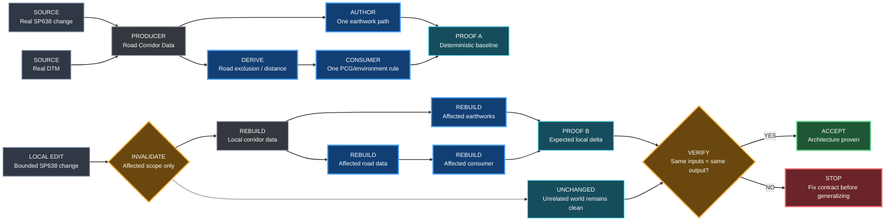
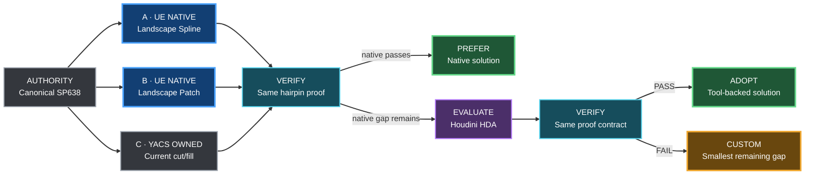
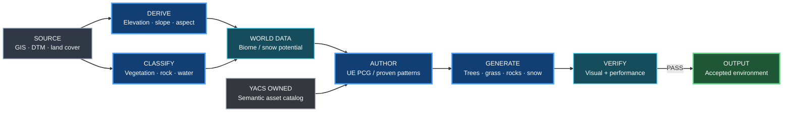
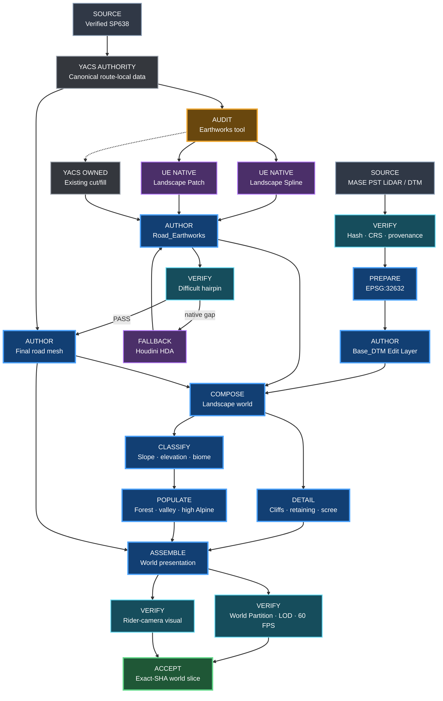

# YACS World Building Bible

**Status:** authoritative world-building methodology  
**Applies to:** all terrain, road, earthwork, vegetation, material, world-streaming and environment-authoring work  
**Product milestone:** M3 now, reused by later world-content milestones  
**Supersedes as methodology:** ad-hoc Stage 3G / R4.1 / B.x world-building decisions  
**Does not supersede:** `ROAD_PHYSICS_PROFILE.md`, route geometry contracts, provenance rules or CI proof contracts

This document answers one question:

> **How do we build a believable, performant YACS world without fighting Unreal Engine?**

It is the architectural source of truth for world construction. Experiments and historical proof documents may explain how we arrived here, but new world work starts from this document.

Architecture and workflow diagrams in this document follow the shared [YACS Blueprint diagram style](DIAGRAM_STYLE.md), inherited from Gumball.

---

## 1. The 12-year-old mental model

Think of the world as a model made from clay.

- **DTM / DEM** is the mold that tells the clay where the mountains and valleys are.
- **Unreal Landscape** is the big piece of clay.
- **Landscape Edit Layers** are transparent sheets placed on top of the clay. One sheet keeps the real terrain, another can contain the road earthworks, another manual corrections.
- **Road spline** is a string showing where the road goes.
- **Landscape Spline / road earthworks layer** is a small bulldozer that cuts or fills the clay around that string.
- **Road mesh** is the actual asphalt placed on the prepared corridor.
- **Static meshes / Nanite meshes** are rocks, cliffs, retaining walls and other shapes that a heightfield cannot represent well.
- **Landscape Material** paints grass, dirt, scree and rock.
- **PCG** is the gardener that places trees, grass, rocks and roadside props according to rules.
- **RVT** helps different surfaces visually blend together. It is makeup, not geometry.
- **World Partition / HLOD / culling** make sure the computer does not render the whole mountain range at full cost all the time.

The important rule is:

> **The road does not fight the terrain. The road defines its local corridor, and the presentation terrain adapts around it.**

Far away from the road, the terrain remains faithful to the real DTM. Near the road, controlled earthworks create a believable cut/fill transition.

---

## 2. Authority: what is allowed to define what

YACS deliberately separates physical truth from visual presentation.

| Domain | Authority | May presentation override it? |
|---|---|---|
| Route XY | canonical route / verified road GIS geometry | **No** |
| Physics grade / distance / curvature / banking inputs | `ROAD_PHYSICS_PROFILE.md` and route contracts | **No** |
| Macro mountain shape | licensed canonical DTM/DEM | only bounded presentation corrections |
| Road visual surface | generated road mesh from canonical alignment | yes, within presentation tolerances |
| Road cut / fill / shoulders | Landscape Edit Layer / local geometry | yes |
| Cliffs / rocks / scree | dedicated meshes / PCG / materials | yes |
| Vegetation | PCG / authored hero placement | yes |
| Weather / lighting | environment systems | yes |

A prettier Landscape must never silently become physics truth.

A road mesh must never be snapped to Landscape vertices just because that makes a seam disappear.

---

## 3. Core technology stack

### Required architecture

**GIS / preprocessing**
- QGIS/GDAL/Python for source inspection, crop, reprojection, deterministic conversion and provenance.
- Metric CRS before metric operations.
- Immutable hashes for canonical external source packages.

**Unreal Engine**
- Landscape for macro terrain.
- Landscape Edit Layers for non-destructive world authoring.
- Landscape Splines or an equivalent controlled spline-earthwork path for road corridor deformation.
- Custom road mesh generation for the actual drivable asphalt geometry.
- Geometry Script / Landscape patches / explicit helper meshes for bounded local geometry where Landscape alone is insufficient.
- Landscape Materials for broad surface classification.
- PCG for deterministic repeated placement.
- World Partition, HLOD, culling and instancing for scale.
- Nanite where measured and appropriate.

### Optional tools

These can accelerate production but are not architecture:

- Gaea / World Creator: procedural terrain creation, masks, erosion references.
- Brushify or similar packs: materials, brushes, cliffs, road dressing.
- Megascans / Fab content: rocks, cliffs, surfaces and vegetation.
- Ultra Dynamic Sky or similar weather/sky packages.
- Houdini: advanced procedural world production if later justified by scale.

Do not adopt an optional tool merely because it is fashionable or appears in a tutorial. Prefer it when a bounded evaluation shows that it solves a real YACS production problem better than a smaller or more native solution.

### 3.1 Tools-first authoring policy

YACS owns the **truth and the acceptance contract**. It does not need to own every world-building algorithm.

The default rule is:

> **No custom world-building system before a tool audit.**

Before creating a new terrain, road-earthwork, biome, vegetation, snow, erosion, scatter or world-generation subsystem, evaluate the problem in this order:

1. **Unreal Engine native first** — use current engine systems such as Landscape Edit Layers, Landscape Splines, Landscape Patch, PCG, World Partition, HLOD and material layers when they satisfy the contract.
2. **Epic reference/sample second** — inspect Epic-provided examples and reference implementations before inventing an equivalent architecture. Experimental examples such as PCG Biome Core are valuable design references, but they are not automatically production dependencies.
3. **Mature external/DCC tooling third** — evaluate established tools such as Houdini Engine when the problem is genuinely procedural or GIS-heavy and native Unreal is insufficient.
4. **Open-source/reference implementations fourth** — inspect GitHub projects for proven patterns, algorithms and failure modes. Reuse code only after license/provenance review; otherwise treat it as reference material.
5. **Custom YACS last** — write bespoke code only for the remaining gap that is specific to YACS or cannot meet the required quality, determinism, provenance, performance or automation contract with the options above.

The intended architecture is:

```mermaid
flowchart LR
    SRC["SOURCE<br/>Real-world data"] --> AUTH["YACS AUTHORITY<br/>Route · physics · provenance"]
    AUTH --> AUDIT["AUDIT<br/>Smallest capable tool"]

    AUDIT --> NATIVE["UE NATIVE<br/>Landscape · Patch · PCG"]
    AUDIT -.-> EXT["MATURE TOOL<br/>Houdini · Gaea · World Creator"]

    NATIVE --> ADAPT["INTEGRATE<br/>Thin YACS adapter"]
    EXT --> ADAPT

    ADAPT --> GEN["GENERATE<br/>Deterministic presentation"]
    GEN --> VERIFY["VERIFY<br/>Visual · technical · performance"]
    VERIFY -->|"PASS"| WORLD["OUTPUT<br/>Accepted world slice"]
    VERIFY -->|"FAIL"| FIX["FAIL CLOSED<br/>Change tool or contract"]

    classDef input fill:#303846,stroke:#8ea1b8,color:#f7f9fc,stroke-width:2px;
    classDef exec fill:#123f73,stroke:#49a2ff,color:#ffffff,stroke-width:3px;
    classDef tool fill:#4b2f69,stroke:#b77cff,color:#ffffff,stroke-width:2px;
    classDef decision fill:#69470e,stroke:#f0a72f,color:#ffffff,stroke-width:3px;
    classDef success fill:#1f5736,stroke:#63d889,color:#ffffff,stroke-width:3px;
    classDef danger fill:#6b2429,stroke:#ff6b73,color:#ffffff,stroke-width:3px;
    classDef owned fill:#34373d,stroke:#9da4ae,color:#ffffff,stroke-width:2px;
    classDef evidence fill:#164d5c,stroke:#5bd6ef,color:#ffffff,stroke-width:2px;

    class SRC input;
    class AUTH owned;
    class AUDIT decision;
    class NATIVE,EXT tool;
    class ADAPT,GEN,VERIFY exec;
    class WORLD success;
    class FIX danger;

    linkStyle default stroke-width:2px;
```



What remains YACS-owned even when an external tool performs authoring:

- canonical route XY and route-local identity;
- Road Physics Profile and simulation authority;
- verified DTM/LiDAR/GIS source data and provenance;
- road visual profile constraints such as width, longitudinal profile and regularized crossfall/camber;
- deterministic seeds/configuration where generation must be reproducible;
- performance budgets;
- exact-SHA technical proof and human rider-camera acceptance.

The tool may shape presentation. It may not silently become the source of physical truth.

### 3.2 Architecture evidence ladder

YACS must distinguish a proven production pattern from an attractive demo.

Use this evidence order when evaluating a world-building architecture:


The arrow means **decreasing evidentiary strength**, not a mandatory implementation order.

A stronger external precedent increases confidence that a pattern is viable. It does **not** prove that the same tool or configuration works for Passo Giau. YACS still requires its own bounded proof against its own inputs and acceptance contract.

Current reference points:

| Reference | Evidence tier | What it supports | What it does **not** prove |
|---|---|---|---|
| **Far Cry 5 / Ubisoft** | shipped product + documented production pipeline | procedural tools can generate biomes, terrain texturing, freshwater networks, cliffs and other large-world layers while artists retain control | that Ubisoft's exact tools or terrain assumptions fit YACS |
| **THE FINALS / Embark** | shipped product + production case study | procedural Houdini tooling can automate expensive repeated environment-authoring work while exposing artist-friendly controls | that its building/destruction workflow directly solves terrain or roads |
| **Unreal Engine 5.8 City Sample PCG** | official working sample | large procedural world construction can be authored entirely inside current Unreal using PCG, uneven terrain, roads, vegetation and World Partition | shipped-game production maturity for every demonstrated Experimental/Beta subsystem |
| **Project Pegasus / SideFX** | integrated tech demo | Houdini + Unreal can form a coherent open-world terrain, paths, material and foliage pipeline | shipped-product evidence |

Sources:

- SideFX / Ubisoft — Far Cry 5 procedural world generation:  
  https://www.sidefx.com/learn/talks/procedural-world-generation-far-cry-5/
- SideFX / Embark Studios — procedural buildings of THE FINALS:  
  https://www.sidefx.com/community/making-the-procedural-buildings-of-the-finals-using-houdini/
- Epic Games — Unreal Engine 5.8 City Sample PCG update:  
  https://www.unrealengine.com/learning/city-sample-gets-a-major-update-with-pcg-and-unreal-mcp-workflows
- SideFX — Project Pegasus:  
  https://www.sidefx.com/pegasus/

### 3.3 Implementation proof gate

The architecture is now mature enough that further generalization must be earned by implementation evidence.

> **Do not generalize the world-data model before one complete producer → derived data → consumer → regeneration path has been proven.**

> **A world-generation architecture is not validated until a local source change produces a deterministic, bounded downstream rebuild.**

Before introducing or materially expanding a reusable world-generation subsystem, answer these five production questions with evidence from the smallest working vertical slice:

| Question | Required answer |
|---|---|
| **Data contract** | What exact data crosses the boundary? Define ownership, units, CRS/coordinate space, resolution/sampling and version identity only for fields the slice actually needs. |
| **Invalidation** | If one source changes locally, what becomes dirty, and what explicitly stays clean? |
| **Stable intermediate representation** | Which derived facts are computed once and reused by downstream systems, and in what concrete representation? |
| **Override survival** | Which local authored corrections must survive regeneration, and how is that intent stored independently from regenerated output? |
| **Reproducibility metadata** | Which source hashes, generator/config versions, seed and spatial scope are sufficient to reproduce the generated result? |

Do **not** answer these questions by designing a large speculative schema. Add fields and abstractions only when a proven producer or consumer requires them.

The first proof target is intentionally narrow:



This is an **implementation proof target**, not permission to pre-design a universal world schema. The concrete data contract should emerge from this slice and then be generalized only when a second real consumer or producer demonstrates the need.

#### Tools-first decision flow

A tools audit is itself a fail-closed architecture decision:

```mermaid
flowchart LR
    PROBLEM["INPUT<br/>Bounded world problem"] --> NATIVE["TRY<br/>UE native"]
    NATIVE --> D1{"MEETS<br/>YACS contract?"}
    D1 -->|"YES"| ADOPT["ADOPT<br/>Smallest solution"]
    D1 -->|"NO"| EPIC["INSPECT<br/>Epic references"]
    EPIC --> EXT["EVALUATE<br/>Mature DCC / plugin"]
    EXT --> D2{"MEETS<br/>YACS contract?"}
    D2 -->|"YES"| ADOPT
    D2 -->|"NO"| OSS["INSPECT<br/>OSS patterns"]
    OSS --> CUSTOM["IMPLEMENT<br/>Minimal YACS gap"]
    CUSTOM --> VERIFY["VERIFY<br/>Same proof contract"]
    ADOPT --> VERIFY
    VERIFY -->|"PASS"| ACCEPT["OUTPUT<br/>Validated architecture"]
    VERIFY -->|"FAIL"| BLOCK["FAIL CLOSED<br/>Revise approach"]
    BLOCK -.-> PROBLEM

    classDef input fill:#303846,stroke:#8ea1b8,color:#f7f9fc,stroke-width:2px;
    classDef exec fill:#123f73,stroke:#49a2ff,color:#ffffff,stroke-width:3px;
    classDef tool fill:#4b2f69,stroke:#b77cff,color:#ffffff,stroke-width:2px;
    classDef decision fill:#69470e,stroke:#f0a72f,color:#ffffff,stroke-width:3px;
    classDef success fill:#1f5736,stroke:#63d889,color:#ffffff,stroke-width:3px;
    classDef danger fill:#6b2429,stroke:#ff6b73,color:#ffffff,stroke-width:3px;
    classDef owned fill:#34373d,stroke:#9da4ae,color:#ffffff,stroke-width:2px;
    classDef evidence fill:#164d5c,stroke:#5bd6ef,color:#ffffff,stroke-width:2px;

    class PROBLEM input;
    class NATIVE,ADOPT,CUSTOM,VERIFY exec;
    class EPIC,EXT,OSS tool;
    class D1,D2 decision;
    class ACCEPT success;
    class BLOCK danger;

    linkStyle default stroke-width:2px;
```



#### Road / earthworks decision ladder

For road-terrain adaptation, do not extend the custom earthwork solver merely because a difficult hairpin exposes another edge case.

For a representative difficult corridor, compare the smallest viable approaches against the **same** canonical road input and the **same** rider-camera proof:



Compare at minimum:

- cut/fill plausibility;
- road/terrain continuity and absence of black wedges/light leaks;
- preservation of canonical route and road profile authority;
- behavior at stacked/nearby hairpin branches;
- reproducibility and editability;
- authoring complexity;
- runtime/editor cost.

If a native Unreal path satisfies the contract, prefer it and delete or avoid bespoke machinery that no longer adds value.

If native Unreal cannot satisfy the contract, evaluate an established procedural route such as a bounded Houdini HDA **before** adding another layer of custom earthwork mathematics.

#### Biome / environment decision ladder

Do not build a separate YACS biome engine before exhausting the existing PCG ecosystem.

Biome decisions should start from real or derived spatial inputs such as:

- elevation;
- slope;
- aspect / sun exposure;
- land-cover or vegetation masks;
- forest type / density;
- distance from road;
- exclusion zones;
- season/weather state where relevant.

The preferred pattern is:



Epic's PCG Biome Core/Sample should be inspected as a reference implementation for biome maps, generators, filters and composition. Because it is Experimental in UE 5.8, adopting it as a hard runtime/editor dependency requires a separate bounded evaluation. Its patterns may be reused without requiring YACS to depend on the plugin itself.

The same principle applies to snow: first represent *where snow may accumulate* as terrain/material/environment data; only use custom PCG or meshes for details that actually need geometry.

---

## 4. Canonical world-building pipeline

Every new YACS route/world follows this order.

```mermaid
flowchart LR
    SRC["SOURCE<br/>Verified real data"] --> GIS["PREPARE<br/>Metric GIS"]
    GIS --> LAND["AUTHOR<br/>Macro Landscape"]
    LAND --> LAYERS["AUTHOR<br/>Edit Layers"]
    LAYERS --> ROAD["AUTHOR<br/>Road + earthworks"]
    ROAD --> MESO["AUTHOR<br/>Cliffs · retaining · meso"]
    MESO --> MAT["SHADE<br/>Landscape materials"]
    MAT --> PCG["POPULATE<br/>PCG environment"]
    PCG --> BLEND["BLEND<br/>RVT if justified"]
    BLEND --> ATM["LIGHT<br/>Atmosphere · weather"]
    ATM --> PERF["SCALE<br/>Partition · HLOD · culling"]
    PERF --> PROOF["VERIFY<br/>Visual + technical proof"]
    PROOF -->|"PASS"| DONE["OUTPUT<br/>Accepted world slice"]
    PROOF -->|"FAIL"| FIX["FAIL CLOSED<br/>Fix owning layer"]
    FIX -.-> ROAD

    classDef input fill:#303846,stroke:#8ea1b8,color:#f7f9fc,stroke-width:2px;
    classDef exec fill:#123f73,stroke:#49a2ff,color:#ffffff,stroke-width:3px;
    classDef tool fill:#4b2f69,stroke:#b77cff,color:#ffffff,stroke-width:2px;
    classDef decision fill:#69470e,stroke:#f0a72f,color:#ffffff,stroke-width:3px;
    classDef success fill:#1f5736,stroke:#63d889,color:#ffffff,stroke-width:3px;
    classDef danger fill:#6b2429,stroke:#ff6b73,color:#ffffff,stroke-width:3px;
    classDef owned fill:#34373d,stroke:#9da4ae,color:#ffffff,stroke-width:2px;
    classDef evidence fill:#164d5c,stroke:#5bd6ef,color:#ffffff,stroke-width:2px;

    class SRC input;
    class GIS,LAND,LAYERS,ROAD,MESO,MAT,PCG,BLEND,ATM,PERF exec;
    class PROOF evidence;
    class DONE success;
    class FIX danger;

    linkStyle default stroke-width:2px;
```



Changing the order requires an explicit architecture decision.

---

## 5. Terrain foundation

### 5.1 Source rules

For a real-world YACS route:

1. prefer official/licensed DTM or DEM;
2. record provenance and license;
3. verify CRS, axis order, vertical interpretation and NoData;
4. reproject to an appropriate metric CRS before metric sampling;
5. preserve the original source package and hash;
6. produce deterministic derived inputs.

Do not treat geographic degrees as metres.

Do not claim a Landscape is higher fidelity merely because it has more vertices than the source raster.

### 5.2 Landscape is macro terrain

Landscape represents:

- valleys;
- slopes;
- ridgelines;
- broad road surroundings;
- large terrain continuity.

Landscape is **not** responsible for:

- overhangs;
- vertical rock faces;
- undercuts;
- detailed retaining structures;
- every roadside boulder;
- high-frequency geological detail.

Those belong to meshes and material/PCG layers.

---

## 6. Landscape Edit Layers contract

Worlds intended for production must use non-destructive Landscape Edit Layers unless a documented engine limitation blocks them.

Recommended logical layers:

| Layer | Purpose |
|---|---|
| `Base_DTM` | imported canonical macro terrain; normally not hand-edited |
| `Road_Earthworks` | spline-driven road cut/fill and shoulder tie-in |
| `Local_Corrections` | small bounded visual corrections with documented reason |
| `Water_or_Special` | only when a later feature actually requires it |

Rules:

- `Base_DTM` remains recoverable and inspectable.
- Road work must not destructively bake itself into the only terrain source.
- Manual corrections must be bounded and explainable.
- Do not use manual sculpting to hide a systemic road pipeline error.
- If a layer is generated, its inputs must be reproducible.

This is the default YACS answer to "how do people on YouTube avoid destroying their whole Landscape while building roads?"

---

## 7. Road architecture

The road has three separate concepts.

### 7.1 Canonical alignment

The line saying **where the road is**.

For Passo Giau this comes from verified SP638/GIS route geometry plus the canonical route contract.

Never derive the canonical road XY from Landscape vertices.

### 7.2 Earthworks corridor

The terrain adaptation around the road:

- cut into uphill slopes;
- fill or embankment on downhill sides;
- shoulder;
- ditch / verge where required;
- soft transition into untouched macro terrain.

This belongs primarily to the `Road_Earthworks` Landscape Edit Layer. The first implementation choice should be a native Landscape Spline / spline edit-layer or Landscape Patch workflow when it satisfies the corridor contract. Use helper meshes where a heightfield is the wrong representation. Extend the custom YACS cut/fill solver only for a demonstrated gap that survives the tools-first comparison in section 3.1.

### 7.3 Final road mesh

The actual visible asphalt:

- width;
- longitudinal profile;
- crossfall/camber;
- banking transition;
- shoulder edge;
- markings;
- surface material.

The road mesh is generated independently from the Landscape grid.

The road presentation may use real cross-section evidence, but noisy LiDAR samples must be regularized before they become a road surface. Dense mesh stations are not automatically independent survey observations.

---

## 8. The road/terrain rule that prevents black wedges

Avoid designing two unrelated surfaces that must meet perfectly along one mathematical edge.

Bad model:

```text
terrain mesh edge  == exact seam ==  road/earthwork mesh edge
```

Preferred model:

```text
macro Landscape
    \
     \ controlled earthwork falloff
      \_________________
         prepared corridor
         [road mesh above/within it]
```

The terrain should continue underneath / into a controlled corridor, while the road mesh owns the visible drivable surface.

Use deliberate overlap, burial or falloff where visually appropriate. Do not rely on zero-width coplanar seams.

At hairpins, cross-section construction must understand that nearby road branches can be geometrically close while belonging to different elevations. Corridor logic must be route-local, not "nearest arbitrary road point wins."

---

## 9. Cut, fill, cliffs and retaining geometry

### Use Landscape for

- smooth cuts;
- broad embankments;
- shoulders;
- gentle ditching;
- transitions over several metres.

### Use dedicated meshes for

- near-vertical rock;
- undercuts;
- sharp retaining walls;
- exposed layered cliffs;
- complex drainage structures;
- geometry inspected from rider-close cameras where the heightfield grid becomes visible.

Do not globally blur a good DTM to hide a local cliff problem.

Do not scatter cliff meshes over the whole map. Place meso geometry where slope, visibility and composition justify it.

---

## 10. Landscape materials

A production Landscape Material should be rule-driven first and hand-painted second.

Useful inputs include:

- slope;
- elevation;
- macro masks;
- biome;
- road-distance masks;
- wetness / weather state later.

Typical classes:

- meadow / grass;
- forest ground;
- exposed dirt;
- scree;
- rock;
- high-Alpine sparse ground.

Materials cannot fix incorrect geometry. If a silhouette is wrong, fix geometry first.

---

## 11. PCG vegetation and rocks

PCG is the default for repeated world content.

PCG rules should be based on explicit inputs such as:

- elevation band;
- slope;
- biome mask;
- distance from road;
- visibility/composition zone;
- deterministic seed;
- exclusion areas.

Minimum road rule:

> mass vegetation must respect a deterministic protected road corridor.

Use manual placement for hero objects and composition exceptions, not for thousands of repeated trees.

Generated PCG output must remain reproducible from its graph, inputs and seed.

Do not create a parallel custom biome engine merely to classify where these graphs should run. Prefer GIS/terrain-derived masks plus existing UE PCG capabilities and proven biome patterns; add YACS-specific code only for the remaining integration gap.

---

## 12. RVT and visual blending

Runtime Virtual Texturing can help blend:

- road shoulder into terrain;
- cliff/rock base into Landscape;
- decal-like surface variation;
- material information between Landscape and meshes.

RVT is **not**:

- a replacement for road earthworks;
- a geometry repair tool;
- a reason to leave floating meshes;
- mandatory before a visible blending problem exists.

YACS uses RVT when a bounded visual problem justifies it.

---

## 13. Nanite

Nanite is a rendering technology, not a data-resolution generator.

Use it for suitable static meshes and evaluate Landscape Nanite only by measurement.

Never say:

> "Nanite will turn the DTM into more detailed terrain."

It will not recover elevation information that the source never contained.

---

## 14. World Partition, HLOD and streaming

Large worlds must be designed so the entire route does not remain equally expensive.

Use:

- World Partition for spatial streaming;
- HLOD where it reduces distant-world cost;
- foliage/PCG cull distances;
- instancing;
- sensible texture and material budgets;
- bounded high-detail zones near the rider.

The rider camera defines what deserves expensive detail.

---

## 15. Spatial quality rings

World detail should increase toward the rider and route.

A useful model:

**Macro**
- mountain mass;
- skyline;
- valley form;
- broad materials.

**Meso**
- road cuts;
- cliff masses;
- scree;
- tree groups;
- retaining elements.

**Micro**
- roadside grass;
- gravel;
- stones;
- surface normals;
- markings.

Do not spend micro-detail budget on mountains the rider only sees kilometres away.

---

## 16. Asset policy

Before an external asset enters YACS:

1. verify source and license;
2. record provenance;
3. identify exact use;
4. import only what is required;
5. check scale, material count, collision, LOD/Nanite suitability and texture cost;
6. measure repeated-world performance where relevant.

Preferred order if paid assets become necessary:

1. coherent Alpine surface/material foundation;
2. vegetation;
3. rocks/cliffs;
4. road/roadside props;
5. Alpine buildings;
6. weather/audio polish.

Do not buy a pack merely because a tutorial used it.

---

## 17. Lighting, atmosphere and weather

Lighting comes after geometry and material readability.

Order:

1. readable terrain silhouettes;
2. material separation;
3. sky/sun/fog baseline;
4. only then dynamic weather polish.

A dramatic sunset must not be used to hide broken road/terrain geometry.

Weather systems belong to later product milestones, but world architecture must not make them impossible.

---

## 18. Performance contract

Target remains 1920x1080 / 60 FPS on the reference PC defined in `AGENTS.md`.

Performance rules:

- measure; do not guess;
- optimize after identifying the limiting domain;
- prefer deterministic A/B evidence;
- separate visual acceptance from performance acceptance;
- a green build does not prove a good world;
- a pretty screenshot does not prove a performant world.

Heavy proof cadence is defined in `CI_VALIDATION_TIERS.md`.

---

## 19. Visual acceptance

World success is judged from the rider camera.

Reject visible:

- Landscape component/grid structure;
- staircase / Minecraft-like terrain;
- floating road;
- severe road-terrain penetration;
- black wedges or light leaks caused by broken seams;
- obviously repeated vegetation patterns;
- cliffs represented as implausible terraced heightfields;
- road crossfall that looks physically absurd;
- scenery clipping through the protected road corridor.

Top-down editor views are diagnostic, not final acceptance.

---

## 20. Passo Giau production recipe

For the current YACS world:



The road may request bounded local terrain adaptation. It may not rewrite route/physics authority.

---

## 21. Forbidden shortcuts

Do not:

- snap canonical road XY to Landscape vertices;
- interpret a denser resampled Landscape as new source detail;
- destructively sculpt the only copy of imported terrain for every road revision;
- solve a local cliff problem with global terrain blur;
- use material tricks to hide wrong silhouettes;
- make physics depend on render mesh noise;
- use a zero-width seam between independently generated surfaces as the primary road/terrain joining strategy;
- place thousands of repeated assets manually when PCG can express the rule;
- buy a plugin before identifying the problem it solves;
- build a custom world-authoring subsystem before completing the tools-first audit;
- generalize a universal world-data schema before one complete producer → derived data → consumer → regeneration path is proven;
- rebuild the whole world when a bounded source change can be represented by a bounded invalidation contract;
- treat a tutorial or tech demo as if it were shipped-product evidence;
- choose an architecture only because another studio used it without proving it against YACS inputs;
- keep bespoke machinery merely because it already exists when a simpler validated native/tool-based path replaces it;
- call a technical proof "visual acceptance";
- create a new planning identifier like `Stage 3G R4.1B.4.3.2`.

---

## 22. Work-item naming

World architecture is stable; tasks are not architecture levels.

Use:

- product milestone: `M3`;
- named workstream: `Terrain`, `Road & Earthworks`, `Materials`, `Biomes`, `Proof`, `Tooling`;
- concrete work: GitHub Issue number and human-readable title.

Example:

```text
M3 / Road & Earthworks / #253
```

Do **not** create recursive roadmap numbering for individual experiments.

Legacy Stage/R/B identifiers remain searchable historical aliases only.

---

## 23. Definition of Done for a world slice

A route slice is acceptable when:

- canonical route/physics authority is unchanged unless intentionally revised;
- source provenance is recorded;
- Landscape base can be regenerated;
- road earthworks are on a non-destructive layer or equivalent reproducible path;
- road mesh and terrain form a believable corridor from rider view;
- cliffs use the correct representation;
- materials and biome are coherent;
- mass placement respects route exclusion;
- no obvious grid/seam/floating-road artifact remains;
- performance meets the relevant budget;
- exact-SHA proof exists where required;
- human visual acceptance exists for changes whose success depends on image quality;
- when a reusable generation subsystem is introduced or materially changed, a local source edit has demonstrated deterministic bounded downstream regeneration before the abstraction is generalized.

---

## 24. Learning references

### Production architecture evidence

For detailed copyright-safe reconstructions of the public Far Cry 5 and THE FINALS pipelines, including data-flow graphs and direct YACS mappings, see [`PRODUCTION_WORLD_ARCHITECTURE_REFERENCES.md`](PRODUCTION_WORLD_ARCHITECTURE_REFERENCES.md).

- Ubisoft / SideFX — Far Cry 5 procedural world generation:  
  https://www.sidefx.com/learn/talks/procedural-world-generation-far-cry-5/
- Embark Studios / SideFX — procedural buildings of THE FINALS:  
  https://www.sidefx.com/community/making-the-procedural-buildings-of-the-finals-using-houdini/
- Epic Games — UE 5.8 City Sample PCG update:  
  https://www.unrealengine.com/learning/city-sample-gets-a-major-update-with-pcg-and-unreal-mcp-workflows
- SideFX — Project Pegasus tech demo:  
  https://www.sidefx.com/pegasus/

### Official tool references

Official Unreal Engine references are architecture references:

- Epic Games — Landscape Splines:  
  https://dev.epicgames.com/documentation/unreal-engine/landscape-splines-in-unreal-engine
- Epic Games — Landscape Edit Layers:  
  https://dev.epicgames.com/documentation/unreal-engine/landscape-edit-layers-in-unreal-engine
- Epic Games — Landscape Technical Guide:  
  https://dev.epicgames.com/documentation/unreal-engine/landscape-technical-guide-in-unreal-engine
- Epic Games — Importing and Exporting Landscape Heightmaps:  
  https://dev.epicgames.com/documentation/unreal-engine/importing-and-exporting-landscape-heightmaps-in-unreal-engine
- Epic Games — Runtime Virtual Texturing:  
  https://dev.epicgames.com/documentation/unreal-engine/runtime-virtual-texturing-in-unreal-engine
- Epic Games — World Partition:  
  https://dev.epicgames.com/documentation/unreal-engine/world-partition-in-unreal-engine
- Epic Games — Nanite with Landscapes:  
  https://dev.epicgames.com/documentation/unreal-engine/using-nanite-with-landscapes-in-unreal-engine
- Epic Games — PCG framework:  
  https://dev.epicgames.com/documentation/unreal-engine/procedural-content-generation-framework-in-unreal-engine
- Epic Games — Landscape Patch System:  
  https://dev.epicgames.com/documentation/unreal-engine/landscape-patch-system
- Epic Games — PCG Biome Core and Sample:  
  https://dev.epicgames.com/documentation/unreal-engine/procedural-content-generation-pcg-biome-core-and-sample-plugins-in-unreal-engine
- SideFX — Houdini Engine for Unreal Landscapes:  
  https://www.sidefx.com/docs/houdini/unreal/landscape/index.html

Learning/tutorial references that illustrate the workflow:

- UNF Games — long-form UE5 Landscape workflow:  
  https://www.youtube.com/watch?v=V54kqpy1Q-Q
- Aziel Arts — Landscape Splines / road / PCG workflow:  
  https://www.youtube.com/watch?v=_NEybBdACCo
- Unreal Sensei — Landscape material / environment workflow:  
  https://www.youtube.com/watch?v=5ju7wyvZGBI
- Smart Poly — Landscape road spline / Edit Layers concepts:  
  https://www.youtube.com/watch?v=8WIWuybAKj4

Tutorials are examples, not source of truth. When tutorial advice conflicts with current Epic documentation or YACS contracts, the official/current contract wins.

---

## 25. One-page cheat sheet

When confused, ask in this order:

1. **What is truth?** DTM? route profile? verified road GIS?
2. **What is presentation?** Landscape, road mesh, cliffs, vegetation?
3. **What is the evidence tier?** Shipped product, production case, sample, demo, tutorial or hypothesis?
4. **Has one complete producer → derived data → consumer → regeneration path been proven before I generalize the model?**
5. **Have I completed the tools-first audit before writing custom world-building code?**
6. **Am I editing non-destructively?**
7. **Should this be Landscape or a mesh?**
8. **Should this be generated by spline/PCG instead of hand-built?**
9. **Am I trying to fix geometry with a material?**
10. **Can I see the problem from the rider camera?**
11. **Did I measure performance?**
12. **Can the result be reproduced from source inputs?**

If those answers are clear, world building is usually straightforward.
