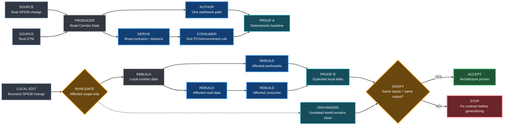
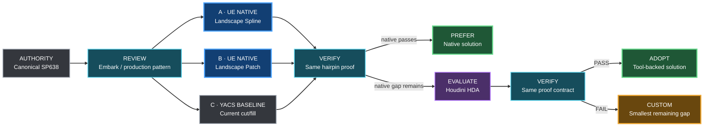
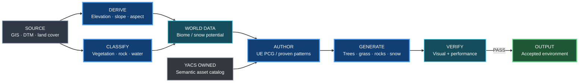
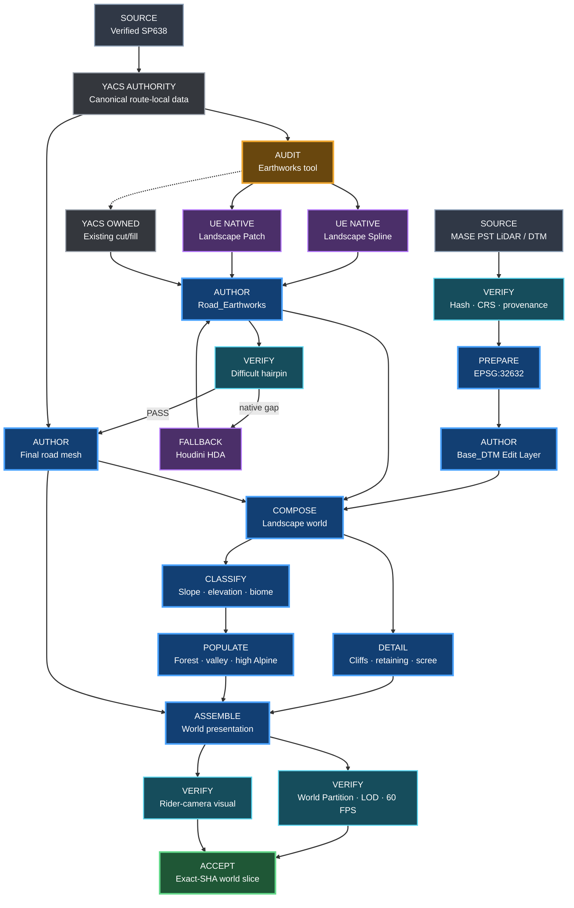

# YACS World Building Bible

**Status:** authoritative world-building methodology  
**Applies to:** all terrain, road, earthwork, vegetation, material, world-streaming and environment-authoring work  
**Product milestone:** M3 now, reused by later world-content milestones  
**Supersedes as methodology:** ad-hoc Stage 3G / R4.1 / B.x world-building decisions  
**Does not supersede:** `ROAD_PHYSICS_PROFILE.md`, route geometry contracts, provenance rules or CI proof contracts

This document answers one question:

> **How do we build a believable, performant YACS world without fighting Unreal Engine?**

It is the architectural source of truth for world construction. Experiments and historical proof documents may explain how we arrived here, but new world work starts from this document.

Architecture and workflow diagrams in this document follow the shared [YACS Blueprint diagram style](DIAGRAM_STYLE.md), inherited from Gumball.

---

## 1. The 12-year-old mental model

Think of the world as a model made from clay.

- **DTM / DEM** is the mold that tells the clay where the mountains and valleys are.
- **Unreal Landscape** is the big piece of clay.
- **Landscape Edit Layers** are transparent sheets placed on top of the clay. One sheet keeps the real terrain, another can contain the road earthworks, another manual corrections.
- **Road spline** is a string showing where the road goes.
- **Landscape Spline / road earthworks layer** is a small bulldozer that cuts or fills the clay around that string.
- **Road mesh** is the actual asphalt placed on the prepared corridor.
- **Static meshes / Nanite meshes** are rocks, cliffs, retaining walls and other shapes that a heightfield cannot represent well.
- **Landscape Material** paints grass, dirt, scree and rock.
- **PCG** is the gardener that places trees, grass, rocks and roadside props according to rules.
- **RVT** helps different surfaces visually blend together. It is makeup, not geometry.
- **World Partition / HLOD / culling** make sure the computer does not render the whole mountain range at full cost all the time.

The important rule is:

> **The road does not fight the terrain. The road defines its local corridor, and the presentation terrain adapts around it.**

Far away from the road, the terrain remains faithful to the real DTM. Near the road, controlled earthworks create a believable cut/fill transition.

---

## 2. Authority: what is allowed to define what

YACS deliberately separates physical truth from visual presentation.

| Domain | Authority | May presentation override it? |
|---|---|---|
| Route XY | canonical route / verified road GIS geometry | **No** |
| Physics grade / distance / curvature / banking inputs | `ROAD_PHYSICS_PROFILE.md` and route contracts | **No** |
| Macro mountain shape | licensed canonical DTM/DEM | only bounded presentation corrections |
| Road visual surface | generated road mesh from canonical alignment | yes, within presentation tolerances |
| Road cut / fill / shoulders | Road/Earthworks Authority + Landscape Edit Layer / local geometry | yes |
| Buildings: existence and footprint | verified cadastral / authoritative building geometry | only bounded reconstruction fallback |
| Buildings: height / roof form | measured or derived LiDAR / surface evidence, with confidence | yes, if marked inferred |
| Forest / grassland / cropland extent | World Authority spatial masks derived from verified source layers | PCG may dress, not move the boundary silently |
| Individual vegetation structure | LiDAR-derived canopy evidence where available | presentation may vary asset identity within confidence |
| Hydrology / major infrastructure | authoritative GIS / classified LiDAR where available | only bounded presentation corrections |
| Snow cover | Snow Authority state, calibrated by dated observation products | dynamic simulation may evolve it |
| Cliffs / rocks / scree | terrain-derived masks + dedicated meshes / PCG / materials | yes |
| Weather / lighting | environment systems | yes |

### 2.1 Real-world reconstruction and World Authority

YACS uses a **real-world-first** world-building model:

> **Verified or derived real-world data decides what exists and where it exists. Procedural systems decide mainly how that truth is represented efficiently and believably in Unreal.**

This is not a promise of a literal centimetre-perfect scan. The target is a **source-faithful 1:1 geographic reconstruction optimized for a game**: preserve real-world metric scale, positions, route length and macro terrain geometry within the accuracy of admitted sources, then use deterministic procedural presentation only for detail that the source data does not justify.

### 2.1.1 Geographic fidelity contract

Owner decision, 2026-10-02: YACS must reconstruct the real place rather than create a Mallorca-inspired substitute.

**Hard invariants:**

- **1 real-world metre = 1 YACS world metre.** No geographic distance compression, route shortening or horizontal scaling for convenience.
- Canonical road chainage, junctions, hairpins and spacing come from admitted real-world route geometry. A presentation system may not relocate the route to make terrain authoring easier.
- Mountain ranges, valleys, ridges, passes and other macro terrain forms come from admitted DTM/DEM/LiDAR. They may be represented at different runtime detail levels, but their geographic position, scale and source-faithful macro shape may not be artistically moved or invented.
- Road/Earthworks Authority adapts presentation terrain to the verified road where justified. It does not move the road to fit the Landscape.
- Forest edges, fields, buildings, walls, infrastructure and other geographically meaningful features must come from hard facts or reproducible derived measurements when such sources are available. Procedural placement may not silently invent a different spatial layout.
- PCG, PCGEx, Houdini, Landscape tools and future generators are **reconstruction executors**, not geographic authorities. They consume World Authority outputs and may vary asset identity or sub-source decorative detail only within explicit confidence bounds.
- Lower-detail macro terrain, HLOD, World Partition cells, streaming proxies, caches and processing tiles are implementation choices. Their boundaries must not be visible as changes to geography and must not alter metric route distance.

**Allowed presentation freedom** includes exact foliage mesh variants, bark/material variation, grass blades, small scatter rocks and other details that are not asserted as measured geographic facts. Where LiDAR or another source provides a measured object position, canopy structure, building footprint or similar evidence, presentation should preserve that evidence rather than replace it with unconstrained random placement.

Source uncertainty remains explicit. If two sources disagree, YACS records and resolves the conflict according to evidence strength; it does not hide uncertainty by moving terrain or objects until the image looks plausible.

A useful end-state fidelity proof is a distance-synchronized real-world/YACS ride comparison. At the same chainage, the rider should encounter the same durable geographic cues—road bends, ridges, valleys, forest boundaries, structures and other landmarks—within the resolution, acquisition date and accuracy limits of the admitted sources.

#### Responsibility boundaries

`World Authority` is an orchestration and provenance boundary, not one giant generator. It delegates to focused domains:

| Domain authority | Owns | Explicitly does not own |
|---|---|---|
| **Road / Earthworks Authority ("BOB")** | road corridor, cuts, fills, shoulders, retaining needs, road/terrain tie-in | trees, forests, crops, snow, building style |
| **Terrain Authority** | canonical ground elevation, source validity, slope/roughness derivatives | road physics truth or decorative rock placement |
| **Building Authority** | building presence, footprint, terrain contact, measured/derived height and roof evidence | arbitrary relocation for composition |
| **Vegetation Authority** | forest/grass/shrub masks, canopy height/density evidence, vegetation exclusions | road earthworks |
| **Agriculture / Land-cover Authority** | field boundaries, crop/grassland/land-cover evidence and temporal validity | final mesh/foliage asset choice |
| **Snow Authority** | dynamic snow mask/state from weather, terrain and dated observations | permanent painting of one historical snow image |
| **Hydrology Authority** | coast, water bodies, streams and drainage evidence | fake water used to hide terrain errors |
| **Infrastructure Authority** | bridges, power lines/towers and other verified linear/point infrastructure | road alignment authority |
| **Rock / Surface Authority** | exposed-rock, scree, cliff and bare-ground masks derived from terrain and source data | fixing incorrect macro geometry with materials |

**BOB remains the road and earthworks specialist.** Do not grow it into a general world generator just because it already understands terrain near roads.

#### Evidence classes

Every generated world fact that can affect placement should be classified before it reaches PCG/PCGEx:

| Class | Meaning | Examples | Procedural freedom |
|---|---|---|---|
| **Hard fact** | directly supplied by an authoritative/verified source | cadastral footprint, verified road XY, ground-class DTM elevation | very low |
| **Derived measurement** | deterministic calculation from source data | building height from LiDAR, canopy height, slope, roughness, road-distance mask | low, derivation must be reproducible |
| **Inference** | plausible interpretation with uncertainty | roof type from roof-plane fitting, shrub vs low tree, likely regional species | medium, confidence required |
| **Decorative presentation** | visual choice not asserted as geographic truth | exact tree mesh variant, bark material, window trim, small scatter rocks | high within domain constraints |

A renderer must never promote an **inference** or **decorative** choice into a new hard fact.

#### Required provenance record

Spatial world inputs and important derived products must retain enough metadata to reproduce and challenge the result:

- source provider and product/dataset name;
- license / attribution requirement;
- acquisition or reference date when the data is time-dependent;
- original CRS, axis order and vertical interpretation;
- source resolution / point density where meaningful;
- NoData / invalid-value semantics;
- immutable source hash or equivalent version identity;
- derivation step/version for generated masks or measurements;
- evidence class and confidence for non-hard facts.

#### Photogrammetry, LiDAR, DTM, DSM and orthophoto are different things

Do not use these terms interchangeably:

- **photogrammetry** reconstructs geometry or image products from overlapping photographs; it is useful for orthophoto, meshes and detailed visible surfaces;
- **LiDAR point clouds** are direct 3D measurements and can include classified ground, vegetation, buildings and other objects;
- **DTM / MDT** represents the ground surface after non-ground objects have been removed or filtered;
- **DSM / MDS** represents the visible/top surface and can include buildings and vegetation;
- **orthophoto** is geometrically corrected imagery; it is excellent visual/context evidence but is not itself a ground-height authority.

Photogrammetry can be a strong source for hero surfaces or visible structure, but it must not silently replace a validated ground DTM when the required truth is bare-earth elevation.

#### Mallorca / Spain source stack

The initial Sa Calobra import is a **bounded terrain-only diagnostic**, not
full-area acceptance. `worldgen/terrain/benchmarks/sa_calobra/terrain_import_profile.json`
pins the source LFS hash, EPSG:25831, 0.5 m spacing, NoData and source/baseline
bounds. `scripts/assets/prepare_region_terrain.py` reads 4033 x 4033 native samples
around Coll dels Reis without interpolation. Any masked or non-finite sample
rejects the window before R16 generation; coastal or other missing-data regions
require an explicit separate source/mask decision, never implicit median filling.
The 2016 m vertex extent is intentionally smaller than the 8 km source area and
does not reduce the final world or road-network coverage target.

The current three-scope overview is rendered in
[the Sa Calobra working-area map](assets/sa_calobra_working_aoi.webp): retained
8 km source coverage, the bounded ~2 km Unreal import and the active 300 m
Ma-2141 diagnostic. The image is explanatory only; manifests, source geometry
and proof artifacts remain authoritative.

Expansion must stay evidence-led. A west / north-west follow-up toward the Sa
Calobra descent is the first candidate when the objective is additional
Ma-2141 length and hairpins. When the objective is network richness, subdivide
the retained source coverage into candidate windows and score source-derived
road length, distinct road identities, junctions, curvature/hairpins, delivery
priority, NoData/terrain validity and source confidence. If the retained 8 km
source area cannot provide enough distinct-road coverage, admit a second source
AOI instead of moving canonical roads or making one monolithic native-resolution
8 km Landscape. Multi-window growth should use bounded regeneration and
streaming/partitioning appropriate to the measured Unreal cost.

The candidate first full-route reference now extends the geographic intent from
the sea at Sa Calobra through Coll dels Reis and Ma-10 to the public forest
estates of Menut/Binifaldó, ending at the confirmed paved limit near Coll des
Pedregaret. Its evidence, visual references, acquisition checklist and
REFERENCE_ONLY asset candidates live in
[SA_CALOBRA_MENUT_ROUTE_REFERENCE.md](SA_CALOBRA_MENUT_ROUTE_REFERENCE.md).

This reference does **not** authorize a fictional biome transition. Terrain,
canopy, forest edge, buildings, walls, roads and infrastructure along that
corridor must be reconstructed from admitted source coverage. Marketplace
assets may supply presentation meshes/material variants only after provenance,
license and performance review; they never decide where a tree, wall or cliff
exists.

The producer emits a hash-bearing `terrain-import.json` and little-endian R16.
Raster pixel centres define the local origin: UE X increases east and UE Y
increases south. The manifest retains the metric origin for later GIS consumers;
it does not grant road/physics authority. Height encoding uses the exact inverse
of Unreal's `(encoded - 32768) / 128` transform to preserve source elevations.

`scripts/ue/Invoke-YacsRegionTerrainImport.ps1` requires a built editor at the
specified SHA and creates `/Game/Worlds/SaCalobra/L_SaCalobraTerrainBaseline`.
The existing Landscape commandlet accepts this explicitly admitted manifest
through `-TerrainManifest=`; the legacy Passo Giau invocation remains historical.
The new path preserves `Base_DTM` and `Road_Earthworks`, admits no road yet and
refuses existing evidence/map targets rather than deleting payloads. Technical
import PASS is separate from human visual and performance acceptance. Exact-SHA runtime evidence is now available: run `36967539981` imported all
16,265,089 native samples with reader parity PASS, 1024 Landscape components and
the two named edit layers. Run `36968109437` repeated import and captured two
3840 x 2160 neutral-engine-material views. Those captures prove execution, not
human visual or performance acceptance; both remain PENDING. Neither run
authored a road. The latter run also produced the bounded 300 m official Ma-2141
alignment diagnostic; its native-DTM Z is not asphalt-height authority.

Terrain benchmark, profile, BOB policy and verified-case changes require render
classification. They do not by themselves invalidate compiled C++ binaries.

For a Mallorca world slice, the preferred candidate stack is:

| Need | Preferred source role |
|---|---|
| bare-earth terrain | PNOA-LiDAR **MDT50cm 3rd coverage** or validated equivalent; 0.5 m grid derived from classified ground points |
| visible/top surface | PNOA MDS / LiDAR point cloud |
| vegetation height/structure | PNOA classified LiDAR and normalized vegetation-surface products where available |
| building footprint | Dirección General del Catastro INSPIRE **BU Buildings** |
| building height / roof evidence | PNOA LiDAR / normalized building-surface products |
| forest density/type | Copernicus Tree Cover Density / Forest Type |
| grassland | Copernicus High Resolution Layer Grassland |
| agricultural parcels | SIGPAC |
| crop class / seasonal agricultural state | Copernicus High Resolution Layer Croplands |
| dated snow observation | Copernicus Fractional Snow Cover or an equivalent validated observation product |
| hydrology / infrastructure | official GIS plus classified LiDAR when the class/product is fit for purpose |

The current PNOA-LiDAR third-coverage MDT50cm product is described by the provider as a 0.5 m DTM interpolated from the **ground class** of third-coverage LiDAR flights. For Illes Balears the source coordinate framework is ETRS89 with the corresponding UTM zone and orthometric heights. Import/preprocessing must therefore prove CRS, vertical interpretation and NoData handling before Unreal import.

#### Domain reconstruction rules

**Buildings**

- keep the verified footprint in the real location;
- derive terrain contact from Terrain Authority, not from a random PCG trace against an unverified surface;
- use LiDAR/surface evidence for height when available;
- roof form may be inferred from point-cloud planes, but must stay marked as inference;
- façade material, windows, shutters and small architectural detail may come from a Mallorca/regional asset grammar;
- procedural generation may simplify a building for performance but must not silently move it or invent a different footprint.

**Trees, forest and shrubs**

- use real forest/vegetation extent where source coverage supports it;
- use LiDAR-derived canopy height/density to constrain placement when available;
- individual crown detection may produce candidate tree locations, but those locations are **derived measurements**, not perfect botanical truth;
- forest type products may constrain broadleaf/coniferous selection;
- exact species and exact mesh variant remain inference/presentation unless a stronger source proves them;
- roadside exclusion comes from the road/world contract, not from arbitrary post-generation deletion.

**Grassland and meadows**

- source land-cover/grassland masks decide the eligible area;
- Terrain Authority can further constrain by slope/wetness/exposure where the source requires refinement;
- PCG selects density, clump variation and mesh instances inside the eligible mask.

**Fields and crops**

- use real agricultural parcel geometry where available;
- crop products may constrain the main crop or seasonal state, but their reference year/date must travel with the data;
- never turn one year's crop classification into timeless land-use truth;
- row direction, stubble, bare soil and growth-stage presentation may be procedural when consistent with the source state.

**Snow**

A dated snow raster is an **observation**, not a permanent level-design mask.

Snow Authority should ultimately combine:

- elevation;
- slope;
- aspect;
- temperature;
- precipitation;
- solar exposure / melt tendency;
- wind redistribution later if justified;
- dated satellite snow observations for calibration/validation.

This lets the same real mountain behave differently under different YACS weather instead of freezing one historical Sentinel observation into the map.

**Rock, scree and exposed ground**

Use terrain derivatives such as slope, curvature and roughness together with land-cover/imagery evidence. Dedicated meshes own overhangs, cliffs and shapes that a heightfield cannot represent. Materials may classify/read the surface; they may not repair a wrong silhouette.

**Hydrology and other infrastructure**

Prefer authoritative geometry or correctly classified LiDAR for water, bridges, power infrastructure and similar features. If source classes are incomplete or ambiguous, preserve the uncertainty instead of fabricating precise infrastructure.

#### Conflict and fail-closed policy

When sources disagree:

1. keep all original inputs inspectable;
2. compare acquisition/reference dates and stated product purpose;
3. prefer the source whose semantics match the question — for example, DTM for ground and DSM/LiDAR for top-of-object height;
4. do not assume "newer" automatically means "more correct" for a different semantic layer;
5. emit a bounded conflict/invalid mask with provenance;
6. for route, terrain continuity, building footprint or other placement-critical truth, **fail closed** instead of generating confident nonsense;
7. decorative consumers may fall back to a generic regional asset, but may not rewrite hard spatial truth.

Specific import checks for terrain must catch at minimum:

- NoData treated as a real elevation;
- CRS/axis mismatch;
- degree/metre confusion;
- incorrect vertical scale or double Z scaling;
- datum/vertical-reference mismatch;
- seam discontinuities between tiles;
- implausible local elevation jumps.

These checks exist precisely to prevent a source/preprocessing defect from becoming a "canyon", "viaduct" or other fake earthwork that BOB then tries to solve downstream.

#### PCG / PCGEx role under World Authority

PCG/PCGEx is primarily a **presentation executor** for world reconstruction.

It should consume authoritative or derived masks such as:

- building footprints and buildable volumes;
- forest/grass/shrub/crop eligibility;
- canopy height/density;
- rock/scree masks;
- road and water exclusions;
- infrastructure locations;
- temporal environment state.

Its job is then to choose efficient meshes, variants, density, scatter detail and deterministic dressing.

> **If reliable source data already says what is there and where it is, PCG must not invent a different geography merely because a random seed produces a prettier result.**

---

A prettier Landscape must never silently become physics truth.

A road mesh must never be snapped to Landscape vertices just because that makes a seam disappear.

---

## 3. Core technology stack

### Required architecture

**GIS / preprocessing**
- QGIS/GDAL/Python for source inspection, crop, reprojection, deterministic conversion and provenance.
- Metric CRS before metric operations.
- Immutable hashes for canonical external source packages.

**Unreal Engine**
- Landscape for macro terrain.
- Landscape Edit Layers for non-destructive world authoring.
- Landscape Splines or an equivalent controlled spline-earthwork path for road corridor deformation.
- Road presentation mesh generated independently from the Landscape grid; the implementation is selected through the tooling admission policy rather than assumed to be bespoke.
- Geometry Script / Landscape patches / explicit helper meshes for bounded local geometry where Landscape alone is insufficient.
- Landscape Materials for broad surface classification.
- PCG for deterministic repeated placement.
- World Partition, HLOD, culling and instancing for scale.
- Nanite where measured and appropriate.

### Optional tools

These can accelerate production but are not architecture:

- Gaea / World Creator: procedural terrain creation, masks, erosion references.
- Brushify or similar packs: materials, brushes, cliffs, road dressing.
- Megascans / Fab content: rocks, cliffs, surfaces and vegetation.
- Ultra Dynamic Sky or similar weather/sky packages.
- Houdini: advanced procedural world production if later justified by scale.

Do not adopt an optional tool merely because it is fashionable or appears in a tutorial. Prefer it when a bounded evaluation shows that it solves a real YACS production problem better than a smaller or more native solution.

### 3.1 Tools-first authoring policy

YACS owns the **truth and the acceptance contract**. It does not need to own every world-building algorithm.

The default rule is:

> **No custom world-building system before a tool audit.**

Before creating a new terrain, road-earthwork, biome, vegetation, snow, erosion, scatter or world-generation subsystem, evaluate the problem in this order:

1. **Embark production-pattern review first** — inspect the closest public Embark tool or documented workflow and extract the relevant production boundary, data-flow and authoring lessons. This is evidence review, not automatic dependency adoption.
2. **Epic-native capability second** — use current Unreal systems and official Epic samples/reference implementations such as Landscape Edit Layers, Landscape Splines, Landscape Patch, PCG, World Partition, HLOD and material layers when they satisfy the contract.
3. **Proven external / open-source / DCC tooling third** — evaluate established tools such as Houdini Engine or reviewed OSS when Epic-native capabilities leave a concrete gap. Reuse source only after license/provenance review.
4. **Custom YACS last** — write bespoke code only for the smallest remaining gap that is specific to YACS or cannot meet the required quality, determinism, provenance, performance or automation contract with the options above.

The intended architecture is:

```mermaid
flowchart LR
    SRC["SOURCE<br/>Real-world data"] --> AUTH["YACS AUTHORITY<br/>Route · physics · provenance"]
    AUTH --> EMBARK["REVIEW<br/>Embark public pattern"]
    EMBARK --> AUDIT["AUDIT<br/>Smallest capable tool"]

    AUDIT --> NATIVE["EPIC NATIVE<br/>Landscape · Patch · PCG"]
    AUDIT -.-> EXT["PROVEN TOOL<br/>OSS · Houdini · DCC"]
    AUDIT -.-> CUSTOM["YACS GAP<br/>Minimal custom"]

    NATIVE --> ADAPT["INTEGRATE<br/>Thin YACS adapter"]
    EXT --> ADAPT
    CUSTOM --> ADAPT

    ADAPT --> GEN["GENERATE<br/>Deterministic presentation"]
    GEN --> VERIFY["VERIFY<br/>Visual · technical · performance"]
    VERIFY -->|"PASS"| WORLD["OUTPUT<br/>Accepted world slice"]
    VERIFY -->|"FAIL"| FIX["FAIL CLOSED<br/>Change tool or contract"]

    classDef input fill:#303846,stroke:#8ea1b8,color:#f7f9fc,stroke-width:2px;
    classDef exec fill:#123f73,stroke:#49a2ff,color:#ffffff,stroke-width:3px;
    classDef tool fill:#4b2f69,stroke:#b77cff,color:#ffffff,stroke-width:2px;
    classDef decision fill:#69470e,stroke:#f0a72f,color:#ffffff,stroke-width:3px;
    classDef success fill:#1f5736,stroke:#63d889,color:#ffffff,stroke-width:3px;
    classDef danger fill:#6b2429,stroke:#ff6b73,color:#ffffff,stroke-width:3px;
    classDef owned fill:#34373d,stroke:#9da4ae,color:#ffffff,stroke-width:2px;
    classDef evidence fill:#164d5c,stroke:#5bd6ef,color:#ffffff,stroke-width:2px;

    class SRC input;
    class AUTH owned;
    class EMBARK evidence;
    class AUDIT decision;
    class NATIVE,EXT,CUSTOM tool;
    class ADAPT,GEN,VERIFY exec;
    class WORLD success;
    class FIX danger;

    linkStyle default stroke-width:2px;
```



What remains YACS-owned even when an external tool performs authoring:

- canonical route XY and route-local identity;
- Road Physics Profile and simulation authority;
- verified DTM/LiDAR/GIS source data and provenance;
- road visual profile constraints such as width, longitudinal profile and regularized crossfall/camber;
- deterministic seeds/configuration where generation must be reproducible;
- performance budgets;
- exact-SHA technical proof and human rider-camera acceptance.

The tool may shape presentation. It may not silently become the source of physical truth.

### 3.2 Architecture evidence ladder

YACS must distinguish a proven production pattern from an attractive demo.

Use this evidence order when evaluating a world-building architecture:


The arrow means **decreasing evidentiary strength**, not a mandatory implementation order.

A stronger external precedent increases confidence that a pattern is viable. It does **not** prove that the same tool or configuration works for Passo Giau. YACS still requires its own bounded proof against its own inputs and acceptance contract.

Current reference points:

| Reference | Evidence tier | What it supports | What it does **not** prove |
|---|---|---|---|
| **Far Cry 5 / Ubisoft** | shipped product + documented production pipeline | procedural tools can generate biomes, terrain texturing, freshwater networks, cliffs and other large-world layers while artists retain control | that Ubisoft's exact tools or terrain assumptions fit YACS |
| **THE FINALS / Embark** | shipped product + production case study | procedural Houdini tooling can automate expensive repeated environment-authoring work while exposing artist-friendly controls | that its building/destruction workflow directly solves terrain or roads |
| **Unreal Engine 5.8 City Sample PCG** | official working sample | large procedural world construction can be authored entirely inside current Unreal using PCG, uneven terrain, roads, vegetation and World Partition | shipped-game production maturity for every demonstrated Experimental/Beta subsystem |
| **Project Pegasus / SideFX** | integrated tech demo | Houdini + Unreal can form a coherent open-world terrain, paths, material and foliage pipeline | shipped-product evidence |

Sources:

- SideFX / Ubisoft — Far Cry 5 procedural world generation:  
  https://www.sidefx.com/learn/talks/procedural-world-generation-far-cry-5/
- SideFX / Embark Studios — procedural buildings of THE FINALS:  
  https://www.sidefx.com/community/making-the-procedural-buildings-of-the-finals-using-houdini/
- Epic Games — Unreal Engine 5.8 City Sample PCG update:  
  https://www.unrealengine.com/learning/city-sample-gets-a-major-update-with-pcg-and-unreal-mcp-workflows
- SideFX — Project Pegasus:  
  https://www.sidefx.com/pegasus/

### 3.3 Implementation proof gate

The architecture is now mature enough that further generalization must be earned by implementation evidence.

> **Do not generalize the world-data model before one complete producer → derived data → consumer → regeneration path has been proven.**

> **A world-generation architecture is not validated until a local source change produces a deterministic, bounded downstream rebuild.**

Before introducing or materially expanding a reusable world-generation subsystem, answer these five production questions with evidence from the smallest working vertical slice:

| Question | Required answer |
|---|---|
| **Data contract** | What exact data crosses the boundary? Define ownership, units, CRS/coordinate space, resolution/sampling and version identity only for fields the slice actually needs. |
| **Invalidation** | If one source changes locally, what becomes dirty, and what explicitly stays clean? |
| **Stable intermediate representation** | Which derived facts are computed once and reused by downstream systems, and in what concrete representation? |
| **Override survival** | Which local authored corrections must survive regeneration, and how is that intent stored independently from regenerated output? |
| **Reproducibility metadata** | Which source hashes, generator/config versions, seed and spatial scope are sufficient to reproduce the generated result? |

Do **not** answer these questions by designing a large speculative schema. Add fields and abstractions only when a proven producer or consumer requires them.

The first proof target is intentionally narrow:



This is an **implementation proof target**, not permission to pre-design a universal world schema. The concrete data contract should emerge from this slice and then be generalized only when a second real consumer or producer demonstrates the need.

#### Tools-first decision flow

A tools audit is itself a fail-closed architecture decision:

```mermaid
flowchart LR
    PROBLEM["INPUT<br/>Bounded world problem"] --> EMBARK["REVIEW<br/>Closest Embark pattern"]
    EMBARK --> NATIVE["TRY<br/>Epic-native path"]
    NATIVE --> D1{"MEETS<br/>YACS contract?"}
    D1 -->|"YES"| ADOPT["ADOPT<br/>Smallest solution"]
    D1 -->|"NO"| EXT["EVALUATE<br/>Proven OSS / DCC"]
    EXT --> D2{"MEETS<br/>YACS contract?"}
    D2 -->|"YES"| ADOPT
    D2 -->|"NO"| CUSTOM["IMPLEMENT<br/>Minimal YACS gap"]
    CUSTOM --> VERIFY["VERIFY<br/>Same proof contract"]
    ADOPT --> VERIFY
    VERIFY -->|"PASS"| ACCEPT["OUTPUT<br/>Validated architecture"]
    VERIFY -->|"FAIL"| BLOCK["FAIL CLOSED<br/>Revise approach"]
    BLOCK -.-> PROBLEM

    classDef input fill:#303846,stroke:#8ea1b8,color:#f7f9fc,stroke-width:2px;
    classDef exec fill:#123f73,stroke:#49a2ff,color:#ffffff,stroke-width:3px;
    classDef tool fill:#4b2f69,stroke:#b77cff,color:#ffffff,stroke-width:2px;
    classDef decision fill:#69470e,stroke:#f0a72f,color:#ffffff,stroke-width:3px;
    classDef success fill:#1f5736,stroke:#63d889,color:#ffffff,stroke-width:3px;
    classDef danger fill:#6b2429,stroke:#ff6b73,color:#ffffff,stroke-width:3px;
    classDef owned fill:#34373d,stroke:#9da4ae,color:#ffffff,stroke-width:2px;
    classDef evidence fill:#164d5c,stroke:#5bd6ef,color:#ffffff,stroke-width:2px;

    class PROBLEM input;
    class EMBARK evidence;
    class NATIVE,ADOPT,CUSTOM,VERIFY exec;
    class EXT tool;
    class D1,D2 decision;
    class ACCEPT success;
    class BLOCK danger;

    linkStyle default stroke-width:2px;
```



#### Passo Giau Embark escalation — selected after native visual failure

The direct Unreal-native Passo Giau baseline is now a **failed visual baseline**,
not an open architecture question.

Evidence from PR #256 established that the implementation can:

- import the 4033 x 4033 Passo Giau R16 through Unreal's native Landscape reader;
- persist a real `Base_DTM` edit layer;
- author `Road_Earthworks` with the verified SP638 spline using
  `EditorApplySpline`;
- persist an independent spline road mesh;
- generate technical proof and rider-view evidence.

The same rider-view proof showed unacceptable blocky/stair-stepped terrain.
Therefore the tools-first ladder has moved past the direct-DTM/native-only
terrain-foundation tier for this route. Repeating cosmetic variations of the
same direct import is not the default next action.

The selected Passo Giau authoring chain is based on Embark's publicly documented
landscape workflow, while keeping unpublished Embark internals out of scope:

```mermaid
flowchart LR
    RAW["SOURCE<br/>MASE LiDAR + Veneto fallback"] --> PDG["HOUDINI PDG<br/>Ingest · reconcile · condition"]
    PDG --> WORK["WORKING TERRAIN<br/>32-bit metric heightfield"]
    WORK --> GAEA["GAEA BRIDGE<br/>Terrain shaping"]
    GAEA --> HUTIL["HOUDINI HEIGHTFIELD<br/>Utility / validation pass"]
    HUTIL --> HDA["BRIDGE<br/>Houdini → Unreal export/import"]
    HDA --> BASE["UNREAL<br/>Base_DTM Edit Layer"]
    BASE --> EARTH["UNREAL<br/>Road_Earthworks"]
    EARTH --> ROAD["PRESENTATION<br/>Independent SP638 mesh"]
    ROAD --> MESO["PRESENTATION<br/>Cliffs · retaining · meso"]
    MESO --> RVT["BLEND<br/>RVT when geometry is correct"]
    RVT --> WP["SCALE<br/>World Partition when justified"]
    WP --> PROOF["VERIFY<br/>Rider view · exact SHA · perf"]
    PROOF -->|"PASS"| ACCEPT["OUTPUT<br/>Accepted Passo Giau terrain"]
    PROOF -->|"FAIL"| OWNER{"DIAGNOSE<br/>Owning stage"}
    OWNER -.-> PDG
    OWNER -.-> GAEA
    OWNER -.-> HUTIL
    OWNER -.-> EARTH
    OWNER -.-> MESO

    classDef input fill:#303846,stroke:#8ea1b8,color:#f7f9fc,stroke-width:2px;
    classDef exec fill:#123f73,stroke:#49a2ff,color:#ffffff,stroke-width:3px;
    classDef tool fill:#4b2f69,stroke:#b77cff,color:#ffffff,stroke-width:2px;
    classDef decision fill:#69470e,stroke:#f0a72f,color:#ffffff,stroke-width:3px;
    classDef success fill:#1f5736,stroke:#63d889,color:#ffffff,stroke-width:3px;
    classDef danger fill:#6b2429,stroke:#ff6b73,color:#ffffff,stroke-width:3px;
    classDef owned fill:#34373d,stroke:#9da4ae,color:#ffffff,stroke-width:2px;
    classDef evidence fill:#164d5c,stroke:#5bd6ef,color:#ffffff,stroke-width:2px;

    class RAW input;
    class PDG,HUTIL,HDA tool;
    class GAEA tool;
    class WORK evidence;
    class BASE,EARTH,ROAD,MESO,RVT,WP exec;
    class PROOF evidence;
    class OWNER decision;
    class ACCEPT success;

    linkStyle default stroke-width:2px;
```



Public evidence supporting this escalation:

- Embark Landscape Creation, Darko Pracic, GDC HIVE 2023 — Embark publicly
  describes LiDAR terrain input, PDG LiDAR processing, the Gaea bridge,
  in-house heightfield utility HDAs, and export/import from Houdini to Unreal:
  https://www.sidefx.com/learn/talks/embark-landscape-creation/
- SideFX Houdini Engine for Unreal — current plugin documentation supports
  Landscape input/output, Height Fields, Edit Layers and World Partition:
  https://www.sidefx.com/docs/houdini/unreal/landscape/basics.html
- Epic / Embark ARC Raiders production interview — Embark identifies Runtime
  Virtual Texturing and World Partition as key UE5 worldbuilding systems for
  large terrain-heavy worlds:
  https://www.unrealengine.com/developer-interviews/embark-studios-build-the-award-winning-arc-raiders-with-unreal-engine

This does **not** authorize invention of Embark's proprietary HDA internals.
YACS must use official Houdini/Gaea primitives and its own explicit contracts
for source reconciliation, terrain shaping, masks and export. Unknown Embark
parameters remain unknown.

##### Passo Giau data contract

The pipeline must keep these boundaries explicit:

1. **Canonical source evidence** — original MASE/Veneto packages, hashes,
   licenses, CRS and coverage reports remain immutable.
2. **PDG working heightfield** — 32-bit metric terrain in EPSG:32632, with source
   masks and reconciliation metadata. This is derived, reproducible data.
3. **Gaea shaping result** — 32-bit terrain output with a fixed seed/build
   recipe and explicit input/output paths. It is presentation authoring, not
   route or physics authority.
4. **Houdini final heightfield** — validated dimensions, bounds, min/max domain,
   masks and export attributes suitable for the documented Houdini → Unreal
   export/import boundary. The exact bridge implementation is YACS-owned unless
   stronger public Embark evidence proves their internal choice.
5. **Unreal `Base_DTM`** — engine representation of the conditioned terrain.
   It remains separate from `Road_Earthworks` and later
   `Local_Corrections`.
6. **Route authority** — canonical road XY/profile/physics stay outside the
   terrain generator and may not be moved by Gaea/Houdini shaping. For the
   active Sa Calobra world, the first bounded corridor is Ma-2141.

Every stage must record:

- tool executable/version identity;
- recipe/HIP/HDA/terrain-file hash;
- input hashes;
- output hashes;
- CRS / spatial bounds / resolution;
- deterministic seed or explicit statement that the stage is deterministic
  without a seed;
- stage duration and exit code;
- the exact downstream artifact that consumed the output.

##### No-shortcut rule for this escalation

For Passo Giau, do not replace the selected chain with:

- another direct cubic R16 import with different smoothing constants;
- a custom NumPy blur sold as "terrain conditioning";
- material/RVT camouflage for geometric defects;
- helper meshes that merely hide the failed macro terrain;
- guessed recreations of Embark proprietary nodes.

A deviation is allowed only when a documented tool is unavailable/incompatible
or a bounded YACS proof demonstrates that a stage adds no value. Record that
evidence before removing the stage.

##### Current bounded substitution — PCGEx-first proof

Issue #287 / PR #288 currently use a **bounded PCGEx-first substitution** for the
first procedural authoring proof. The public Embark evidence still defines the
production pattern we are preserving — deterministic source ingest, procedural
derived-data authoring, explicit authority boundaries, reproducible handoff to
Unreal and rider-camera proof — but **PCGEx is not claimed to be an Embark Studios dependency**.

This substitution is selected because the exact Houdini/Gaea DCC chain is not a
current runner prerequisite and its commercial/tooling setup would block the
bounded YACS proof before we know whether an Unreal-native, MIT-licensed authoring
tool can satisfy the immediate road/corridor need. Houdini/Gaea remain the
documented optional escalation when the bounded PCGEx proof leaves a demonstrated
terrain-authoring gap.

The current PCGEx proof is deliberately narrow:

- bootstrap the reviewed PCGEx revision at an immutable commit and keep it
  authoring-only;
- compile the YACS Editor module against that exact plugin API;
- generate a deterministic PCG graph from YACS-owned C++ rather than hand-edited
  graph state;
- consume the prepared official SP638 presentation data while preserving the
  canonical route or physics authority outside PCGEx;
- derive bounded resample/smooth/offset corridor paths without moving the
  authoritative road;
- keep `Base_DTM` and `Road_Earthworks` separate and non-destructive;
- record exact-SHA evidence, presentation deviation and rider-camera visual proof
  before accepting any generated road/earthworks result.

The current Gate B proof is now an **established road-authoring baseline**.
At exact repository state `eb33c583...`, the pinned PCGEx path executed against
the prepared official SP638 presentation data and fed the rider-close consumer.
The measured presentation deviation remained bounded (about 0.176 m horizontal
p95, about 0.8 m horizontal max and about 7.5 mm vertical p95 for the proven
corridor). This is sufficient to stop treating PCGEx road smoothing as the default
suspect for the current visual failure.

Gate C.1 then separated two independent terrain-presentation defects at the
same exact-SHA hairpin. Variant A proved that rider-close faceting already exists
with the macro Landscape alone. Variant C proved that the previous local terrain
skin is independently invalid even with the Landscape hidden, so the failure is
not explained by coincident-surface overlap alone. Variants B/D/E preserve those
failures while adding the corridor/combined ownership states.

Therefore, until a concrete regression says otherwise, **freeze the proven PCGEx
road path and diagnose terrain source/near-field ownership instead of tuning road
smoothing**. The active Gate C.3 proof reads a bounded 512 m x 512 m, 1 m working
grid directly from the prepared native metric DTM, transfers only that patch to
the Unreal proof runner, performs no Landscape collision sampling and no terrain
smoothing, hides the macro Landscape, and renders the resulting DynamicMesh with
the road corridor disabled. Its purpose is diagnostic: distinguish source quality
from DynamicMesh transform/winding/rendering defects before road constraints are
introduced.

If the terrain-ownership recovery later proves a real PCGEx boundary, document
that evidence and then use the tools-first ladder. Do not hide the failure with
material camouflage, another bespoke smoothing stack or a road-alignment change.

#### Historical Passo Giau surface-ownership recovery after Gate B

Issue #287 / PR #288 established a useful separation of concerns:

- official SP638 -> YACS source -> PCGEx resample/smooth -> bounded corridor is a
  working presentation path;
- the road/corridor can be technically healthy while the surrounding terrain is
  still visually unacceptable;
- the historical rider proof depended on the now-retired
  `/Game/Prototype/Maps/L_PassoGiauTerrainSpike` macro Landscape and a local
  terrain surface sampled back from that Landscape.

The proof remains useful methodology evidence, but its map and DTM are not an
active YACS world input. New terrain evidence uses the Sa Calobra MDT50cm source
and must reproduce the same surface-ownership controls rather than copying the
retired map.

The immediate architecture problem is therefore **surface ownership**, not
another road-centerline algorithm.

##### One visual owner per place

Do not render two independently modified ground surfaces in the same rider-close
space and rely on a tiny Z offset to keep them ordered. If a local near-field
surface is the rider-visible ground owner, the macro Landscape must stop owning
that same patch.

The target ownership model is:

| Zone / concern | Geometry authority |
|---|---|
| distant mountains / valley mass | Macro Landscape / `Base_DTM` |
| medium distance | Macro Landscape plus meso meshes |
| broad road accommodation | `Road_Earthworks` |
| rider-close ground requiring higher fidelity | native-DTM-derived bounded near-field surface |
| asphalt | independent road mesh |
| shoulders | road/shoulder presentation geometry |
| unusual cut/fill | local earthwork geometry or constrained local ground |
| cliffs / walls / rocks / scree | dedicated mesh / PCG geometry |
| simulation | Road Physics Profile / route contracts, separately |

PCGEx does not become physics authority. Landscape does not become road XY
authority. A visually better terrain mesh does not become simulation truth.

##### Diagnostic matrix before another generator

Before changing the terrain architecture again, capture the same exact-SHA
hairpin, camera pose, FOV and lighting with only ownership toggled:

| Variant | Macro Landscape | near-field/local ground | road corridor | Purpose |
|---|---:|---:|---:|---|
| A | ON | OFF | OFF | isolate macro-terrain faceting |
| B | ON | OFF | ON | macro terrain + road |
| C | OFF | ON | OFF | isolate local ground quality |
| D | OFF | ON | ON | local ground + road without macro overlap |
| E | ON | ON | ON | current combined baseline |

Observed Gate C.1 result is evidence-driven:

- A fails with macro-Landscape faceting before any road/local surface is present;
- C fails independently with the Landscape hidden, so the old
  `Landscape -> line trace -> 4 m grid -> smoothing -> DynamicMesh` path is not a
  valid near-field foundation;
- B/D/E combine those failures with corridor/ownership interactions and do not
  justify changing the frozen road authority.

Gate C.3 therefore changes exactly one causal variable: the local terrain source.
It uses the prepared 1 m metric DTM directly as a bounded neutral mesh and keeps
macro Landscape, road corridor, cut/fill, smoothing, materials camouflage and
route/physics changes out of the proof.

The proof location is versioned explicitly. Do not let the DTM-preparation stage
and the post-PCGEx Unreal renderer independently choose a "most curved" hairpin:
bounded smoothing can change which hairpin wins that heuristic without changing
road authority. Gate C uses the representative hairpin recorded in
`worldgen/embark/passo_giau_terrain_pipeline.json`; the native patch is cut at
that official-SP638 station and the renderer still fails closed unless its actual
PCGEx-selected focus lands inside the patch with the required margin. Proof
location selection is test infrastructure, not route or physics truth.

Do not replace this diagnostic with guessed smoothing percentages.

##### Capture resource readiness — Issue #293

A fixed screenshot delay is not evidence that the engine has loaded the height
textures needed by the rider view. The bounded capture path primes the existing
rider camera in the editor viewport and invokes Epic's native
`AutomationLibrary.finish_loading_before_screenshot()` immediately before
submitting A-E/C3 screenshots. It records map-owned height-texture metadata
before/after in `capture-readiness.json` and in the proof. Missing viewport,
failed native loading or still-placeholder/compiling height textures fail closed.
No height pixels, source resolution, LOD policy, road geometry, materials or
persisted map assets are changed by this preparation.

This is a capture-validity experiment, not acceptance of the macro terrain.
Mip readback is taken before screenshot-task submission, not on the exact GPU
capture frame; completed texture compilation alone does not establish full mip
residency or visual quality. Compare the unchanged camera and road hashes and
inspect the PNG before attributing stair-stepping to this stage. Never respond
to a failed result with a hidden global streaming disable or DTM smoothing.

M3 run 92 completed the native loading barrier but retained macro stepping;
64 combined height textures still reported 7 of 10 resident mips. The controlled
run 94 at `b22ea83432c96dc7796cba9b802fe4c049001536` requested full height mips
for variant A only. All 64 became 10/10 and the pronounced macro staircase
artifact disappeared from that same-camera A image. B/E retained 7/10 and the
coarse terrain. The sampled height-texture source exports were byte-identical,
and camera, PCGEx output and corridor hashes were unchanged. This establishes
height-mip residency as a cause of the observed capture defect, not source-data
quantization or a reason to replace the established road pipeline.

The bounded capture preparation therefore requests a transient 120-second native
mip-residency lease for map-owned, mipmapped height textures whenever the macro
Landscape is visible (A/B/E). C/D/C3 do not request macro mip residency. The native
loading barrier must finish and full-mip readback must pass before capture;
partial/placeholder results fail closed. The lease expires after the process or
duration, does not serialize `NeverStream`, and does not disable streaming globally.

This fixes a forced-LOD proof resource precondition; it is not a blanket production
runtime policy, performance acceptance or a cure for every terrain/road seam.
Keep the single-owner near-field and road/earthwork acceptance gates independent.
The A-only causal result does not substitute for reviewing the combined A-E/C3
candidate, additional representative locations and performance where required.

Official API references:
- https://dev.epicgames.com/documentation/en-us/unreal-engine/API/Runtime/Engine/UStreamableRenderAsset
- https://dev.epicgames.com/documentation/en-us/unreal-engine/python-api/class/AutomationLibrary
- https://dev.epicgames.com/documentation/en-us/unreal-engine/python-api/class/UnrealEditorSubsystem

##### Native metric DTM for rider-close ground

The production candidate for near-field ground should be:

`prepared native metric DTM -> bounded rider patch -> road/earthwork constraints -> transition -> mesh`

not:

`Landscape -> vertical trace -> replacement terrain skin`.

MASE remains the primary terrain source and the documented Veneto source remains
fallback where required by coverage/provenance. Road and terrain preprocessing
must meet in the same metric coordinate system before Unreal Landscape-grid
quantization.

Start with a bounded representative hairpin at native or near-native spacing
(typically around 1-2 m for the current proof) rather than making the entire
8 km world equally dense. The rider corridor and distant mountain mass have
different spatial-quality budgets.

##### Deterministic transition to macro terrain

The local owner must transition to macro Landscape through a deliberate band,
not by coincident overlap or an arbitrary lift. A suitable bounded pattern is:

- high-fidelity native-DTM interior;
- transition band;
- outer ring pinned/constrained to macro-terrain height;
- measurable seam delta and no competing surface inside the owned patch.

Reuse proven local primitives such as existing pinned-border-cell behavior where
they satisfy this contract instead of inventing another world system.

##### Road constraints before local triangulation

Where practical, apply the proven PCGEx centerline/corridor and YACS road-profile
constraints to the near-field terrain before final triangulation:

`native terrain -> road corridor constraints -> cut/fill transition -> single local ground mesh -> asphalt/shoulders`.

The goal is to avoid stacking road mesh + earthwork mesh + terrain skin +
Landscape as four independent surfaces at the same location.

##### Edit-layer semantics are explicit

Never select a Landscape edit layer by API-return order. For road work:

- `Base_DTM` must exist and remain semantic source terrain;
- exactly one `Road_Earthworks` layer must exist;
- road cut/fill selects `Road_Earthworks` explicitly by name;
- missing/duplicate `Road_Earthworks`, or accidental `Base_DTM` selection,
  fails closed;
- proof output records available edit layers and the selected earthworks layer.

##### Acceptance and scaling order

Neutral geometry passes before materials/foliage/RVT/lighting camouflage.
The first accepted hairpin is only a bounded proof. Before route propagation,
repeat the rider proof on at least:

- a difficult hairpin;
- a normal/moderate slope corridor;
- a high-elevation-difference / strong-earthworks section.

Only after neutral geometry is visually accepted should the relevant performance
proof set thresholds for the chosen representation. Meso cliffs/rocks/retaining,
materials, vegetation and final weather follow after the ground ownership contract
is proven.

##### BOB — Builder Of Berms: adaptive terrain policy and verified-case learning

Route-wide terrain adaptation must not become a growing list of location-specific
patches. The production direction is a deterministic adaptive solver that observes
road/terrain context, chooses among already-admitted terrain strategies, records
why it made that choice, and may reuse parameters only from previously verified
proof cases.

The initial decision vector includes at least:

- longitudinal grade;
- left/right cross-slope;
- road-to-native-DTM elevation delta;
- local native-DTM roughness;
- signed curvature/radius;
- distance and height separation to a competing road branch;
- required cut/fill magnitude.

The strategy library is intentionally small:

- native blend / minor correction;
- constrained cut/fill corridor;
- tight-hairpin clearance corridor;
- retaining/cliff or other non-heightfield escalation when one heightfield cannot
  represent the geometry safely.

The adaptive layer is a **policy/orchestration layer**, not permission to bypass
the tools-first decision ladder below. A strategy may invoke only an already
admitted native/custom authoring path. If a heightfield is structurally wrong for
the observed geometry, the solver escalates instead of learning to hide the defect.

PCGEx is the preferred **spatial feature engine**, not the owner of the adaptive
policy. Reuse its strengths in filters, attributes, sampling, graph/path operations,
heuristics and—only where separately proven useful—tensor/vector-field operations
to measure or propagate corridor context. Normalize those results into the
versioned `adaptive_terrain_feature_contract.json` packet. The packet must record
its source artifact and exact PCGEx revision, preserve canonical road XY, and
explicitly remain non-authoritative for route geometry and physics.

The YACS-owned architect for this layer is **BOB — Builder Of Berms**.
BOB is the deterministic road-earthworks decision system; the technical module
and schemas retain descriptive adaptive-terrain names so implementation details
remain searchable and backend-neutral.

BOB owns the next layer:

- safe baseline strategy selection;
- strategy-specific bounded parameters;
- verified-case similarity matching;
- learning eligibility;
- non-heightfield escalation;
- the final explainable decision report.

This separation is deliberate. A PCGEx graph may answer **"what spatial situation
is this?"** and may provide reusable scores/attributes. It must not answer **"this
proof is accepted, add it to memory"** and must not silently rewrite the policy.

Embark's public `texture-synthesis` project is useful only as an architectural
analogy for **example-based generation**: multiple examples may inform a new
result while the generator remains explicit about its inputs. It is not evidence
that Embark uses an equivalent terrain-learning system, and YACS does not copy or
depend on that repository for terrain generation. The transferable lesson is to
keep examples as explicit inputs instead of burying successful one-off fixes in
location-specific code.

Learning is review-gated and deterministic:

1. baseline policy chooses a safe strategy from versioned thresholds;
2. only cases with exact-SHA technical PASS **and** human visual PASS are eligible
   learning examples;
3. sufficiently similar accepted cases may tune bounded parameters **inside the
   same safe strategy**;
4. case memory cannot override a retaining/cliff or ambiguity escalation;
5. proof output records the feature vector, baseline strategy, final parameters,
   contributing case IDs and similarity/confidence;
6. accepted cases enter a versioned repository ledger through normal review;
7. threshold/model calibration happens offline and produces a reviewed candidate
   config change; runtime/editor generation never rewrites its own policy.

Contact-trial diagnosis is executable in BOB's `review_pavement_contact_trial`.
It reads both triangle-interior R16 failures and native Landscape trace evidence.
Passing vertex samples cannot cancel failed triangle interiors. Missing, invalid
or empty sample evidence stays pending. The review lists source reconciliation,
profile regularization, bounded native `Road_Earthworks` and escalation checks;
it does not execute an unvalidated repair or grant road/learning admission.

Owner direction, 2026-10-02: operate BOB as an **inspector now**; autonomous
construction and learning are later work. The existing profile assessment calls
`scripts/worldgen/bob_profile_inspector.py` and embeds `bob_inspection` in
`ma2141-profile-candidate.json`, already uploaded by the native terrain CI.
This is a read-only extension of the admitted offline assessment and BOB policy,
not another geometry solver, dependency, terrain writer or PCGEx replacement.

The inspector validates declared hash syntax and the source-XY preservation
flag, not their independent truth. Source identity/XY verification remains an
explicit unverified check of this inspector; producer admission is separate.
It requires finite full-width samples and the complete 0–300 m domain at 0.5 m
spacing (601 sections), including both endpoints. It checks every transverse sample against the candidate-plane contract and
checks the declared center against the plane-derived center (1 micrometre
consistency tolerance, not source accuracy). A nonplanar section is unsupported
evidence and cannot claim inspection completion. It recomputes cut/fill sample
differences, transverse slope and plane-derived longitudinal grade instead of
trusting summary metrics or a supplied list of flagged stations. Consecutive
exceedances become findings with start/end chainage, peak location, peak value,
units, sample count and the actual experimental review trigger. Disjoint ranges
stay separate; grade findings cover both ends of their measured segment.
Causes remain `UNRESOLVED`: a height discrepancy cannot identify a wall, an
incorrect footprint or an epoch mismatch by itself.

`INSPECTION_INCOMPLETE` means required evidence is invalid/missing;
`REVIEW_REQUIRED` means measured symptoms exceed experimental triggers;
`REVIEW_PENDING` means none exceed them. None means road acceptance.
`inspection_complete` refers only to these numeric profile checks. Geographic
edges, curve/edge smoothness, retaining structures, competing-branch clearance,
continuous contact, native contact of the regularized candidate, collision,
rider visuals, bounded ride and performance remain explicitly unverified.
Passing contact of the raw DTM-conforming preview does not prove contact of the
regularized profile. Inspector source hash and candidate provenance are retained.

Every inspection keeps authoring permission, repair execution, road admission
and learning eligibility false. It neither calls a construction strategy nor
changes terrain or verified-case memory. Its work list directs source/structure
review and plan/rider inspection; it does not prescribe an unmeasured wall or
ordinary shoulder fill. On the revision-4 benchmark the first local inspection
finds 22 ranges: 3 cut differences, 15 fill differences and 4 crossfall ranges;
no grade exceedance. The largest fill difference is 2.477 m at 150.5 m and
largest crossfall is 14.58% at 142 m. These are diagnostics, not construction
measurements or acceptance thresholds.

Keep rejected cases as diagnostic evidence, separate from verified-case memory.
The first Spanish example is
[`ma2141_contact_failure_5826507.json`](../worldgen/terrain/benchmarks/sa_calobra/ma2141_contact_failure_5826507.json).
Its 28,800 R16 triangle centroids contain 456 unsupported and 712 penetrating
samples; surface-minus-DTM ranges from -1.124 m to +1.506 m. These are measured
symptoms, not proven root causes or accepted earthwork parameters. The native
contact test did not run because the capture entrypoint lacked `__file__`.
That tooling failure is separate from the geometric failure. The capture fix
resolves scripts through Unreal's project directory; subsequent exact-SHA proof
must confirm it. Never turn a failed render into evidence that geometry passed.

Update this methodology and the linked work item with each observed failure,
repair attempt and proof result. Record what remains unknown. The successful
repair recipe may enter reviewed case memory only after its own acceptance.

Do not auto-promote failed, merely green, or unreviewed visual evidence into the
learning memory. Do not infer successful terrain behavior from a single hairpin.
The first route-general policy requires accepted cases for the difficult hairpin,
a normal/moderate slope and a major-earthworks section already required by the
acceptance order above.

```mermaid
flowchart LR
    OBS["OBSERVE<br/>Road + native DTM"] --> FEAT["MEASURE<br/>Deterministic features"]
    FEAT --> POLICY["DECIDE<br/>Versioned safe policy"]
    CASES["MEMORY<br/>Verified PASS cases"] --> MATCH["MATCH<br/>Similar same-strategy cases"]
    POLICY --> MATCH
    MATCH --> STRAT["AUTHOR<br/>Admitted terrain strategy"]
    STRAT --> PROOF["VERIFY<br/>Exact-SHA rider proof"]
    PROOF -->|"PASS"| ACCEPT["ACCEPT<br/>Reviewed case"]
    PROOF -->|"FAIL"| FIX["FAIL CLOSED<br/>Owning layer / escalation"]
    ACCEPT --> CASES
    FIX -.-> POLICY

    classDef input fill:#303846,stroke:#8ea1b8,color:#f7f9fc,stroke-width:2px;
    classDef exec fill:#123f73,stroke:#49a2ff,color:#ffffff,stroke-width:3px;
    classDef tool fill:#4b2f69,stroke:#b77cff,color:#ffffff,stroke-width:2px;
    classDef decision fill:#69470e,stroke:#f0a72f,color:#ffffff,stroke-width:3px;
    classDef success fill:#1f5736,stroke:#63d889,color:#ffffff,stroke-width:3px;
    classDef danger fill:#6b2429,stroke:#ff6b73,color:#ffffff,stroke-width:3px;
    classDef owned fill:#34373d,stroke:#9da4ae,color:#ffffff,stroke-width:2px;
    classDef evidence fill:#164d5c,stroke:#5bd6ef,color:#ffffff,stroke-width:2px;

    class OBS input;
    class FEAT,STRAT exec;
    class POLICY,MATCH decision;
    class CASES owned;
    class PROOF evidence;
    class ACCEPT success;
    class FIX danger;

    linkStyle default stroke-width:2px;
```



#### Road / earthworks decision ladder

For road-terrain adaptation, do not extend the custom earthwork solver merely because a difficult hairpin exposes another edge case.

For a representative difficult corridor, compare the smallest viable approaches against the **same** canonical road input and the **same** rider-camera proof:



Compare at minimum:

- cut/fill plausibility;
- road/terrain continuity and absence of black wedges/light leaks;
- preservation of canonical route and road profile authority;
- behavior at stacked/nearby hairpin branches;
- reproducibility and editability;
- authoring complexity;
- runtime/editor cost.

If a native Unreal path satisfies the contract, prefer it and delete or avoid bespoke machinery that no longer adds value.

If native Unreal cannot satisfy the contract, evaluate an established procedural route such as a bounded Houdini HDA **before** adding another layer of custom earthwork mathematics.

#### Biome / environment decision ladder

Do not build a separate YACS biome engine before exhausting the existing PCG ecosystem.

Biome decisions should start from real or derived spatial inputs such as:

- elevation;
- slope;
- aspect / sun exposure;
- land-cover or vegetation masks;
- forest type / density;
- distance from road;
- exclusion zones;
- season/weather state where relevant.

The preferred pattern is:



Epic's PCG Biome Core/Sample should be inspected as a reference implementation for biome maps, generators, filters and composition. Because it is Experimental in UE 5.8, adopting it as a hard runtime/editor dependency requires a separate bounded evaluation. Its patterns may be reused without requiring YACS to depend on the plugin itself.

The same principle applies to snow: first represent *where snow may accumulate* as terrain/material/environment data; only use custom PCG or meshes for details that actually need geometry.

### 3.4 Legacy prototype-world retirement boundary

`AStage3PrototypeTerrainActor` and the HISM-heavy prototype-world presentation in `L_CyclingTest` are now **frozen legacy regression scaffolding**, not a second production world architecture.

Rules:

- do not add new terrain, road, biome, asset-pipeline or visual features to the prototype actor;
- new M3 world work must use the real-data Landscape / SP638 / PCG architecture defined by this Bible;
- legacy code may receive only the smallest compatibility or regression-proof fix needed to keep an already-required proof valid;
- no new subsystem may depend on `AStage3PrototypeTerrainActor`;
- removal is allowed only after the M3 production world replacement demonstrates equivalent route continuity, fresh-load/save-reopen behavior, rider-camera acceptance, required performance evidence and exact-SHA technical proof;
- deletion/cleanup may be a separate housekeeping change after that parity evidence exists; historical proof artifacts and workflow names remain preserved for traceability.

This freezes the old path without deleting a regression oracle before the replacement has earned it.

---

## 4. Canonical world-building pipeline

Every new YACS route/world follows this order.

```mermaid
flowchart LR
    SRC["SOURCE<br/>Verified real data"] --> GIS["PREPARE<br/>Metric GIS"]
    GIS --> AUTH["AUTHORITY<br/>World facts · confidence · provenance"]
    AUTH --> LAND["AUTHOR<br/>Macro Landscape"]
    LAND --> LAYERS["AUTHOR<br/>Edit Layers"]
    LAYERS --> ROAD["AUTHOR<br/>Road + earthworks"]
    ROAD --> MESO["AUTHOR<br/>Cliffs · retaining · meso"]
    MESO --> MAT["SHADE<br/>Landscape materials"]
    MAT --> PCG["POPULATE<br/>PCG environment"]
    PCG --> BLEND["BLEND<br/>RVT if justified"]
    BLEND --> ATM["LIGHT<br/>Atmosphere · weather"]
    ATM --> PERF["SCALE<br/>Partition · HLOD · culling"]
    PERF --> PROOF["VERIFY<br/>Visual + technical proof"]
    PROOF -->|"PASS"| DONE["OUTPUT<br/>Accepted world slice"]
    PROOF -->|"FAIL"| FIX["FAIL CLOSED<br/>Fix owning layer"]
    FIX -.-> ROAD

    classDef input fill:#303846,stroke:#8ea1b8,color:#f7f9fc,stroke-width:2px;
    classDef exec fill:#123f73,stroke:#49a2ff,color:#ffffff,stroke-width:3px;
    classDef tool fill:#4b2f69,stroke:#b77cff,color:#ffffff,stroke-width:2px;
    classDef decision fill:#69470e,stroke:#f0a72f,color:#ffffff,stroke-width:3px;
    classDef success fill:#1f5736,stroke:#63d889,color:#ffffff,stroke-width:3px;
    classDef danger fill:#6b2429,stroke:#ff6b73,color:#ffffff,stroke-width:3px;
    classDef owned fill:#34373d,stroke:#9da4ae,color:#ffffff,stroke-width:2px;
    classDef evidence fill:#164d5c,stroke:#5bd6ef,color:#ffffff,stroke-width:2px;

    class SRC input;
    class GIS,LAND,LAYERS,ROAD,MESO,MAT,PCG,BLEND,ATM,PERF exec;
    class AUTH owned;
    class PROOF evidence;
    class DONE success;
    class FIX danger;

    linkStyle default stroke-width:2px;
```



Changing the order requires an explicit architecture decision.

---

## 5. Terrain foundation

### 5.1 Source rules

For a real-world YACS route:

1. prefer official/licensed DTM or DEM;
2. record provenance and license;
3. verify CRS, axis order, vertical interpretation and NoData;
4. reproject to an appropriate metric CRS before metric sampling;
5. preserve the original source package and hash;
6. produce deterministic derived inputs.

Do not treat geographic degrees as metres.

Do not claim a Landscape is higher fidelity merely because it has more vertices than the source raster.

### 5.2 Landscape is macro terrain

Landscape is the macro continuity representation, not a requirement that every
rider-visible centimetre of ground be owned by the heightfield. A bounded
native-DTM-derived near-field surface may own rider-close ground when a proof
shows that Landscape resolution/topology is visually insufficient. In that case,
ownership must be exclusive inside the patch and transition deterministically
back to the macro Landscape.

Landscape represents:

- valleys;
- slopes;
- ridgelines;
- broad road surroundings;
- large terrain continuity.

Landscape is **not** responsible for:

- overhangs;
- vertical rock faces;
- undercuts;
- detailed retaining structures;
- every roadside boulder;
- high-frequency geological detail.

Those belong to meshes and material/PCG layers.

---

## 6. Landscape Edit Layers contract

Worlds intended for production must use non-destructive Landscape Edit Layers unless a documented engine limitation blocks them.

Recommended logical layers:

| Layer | Purpose |
|---|---|
| `Base_DTM` | imported canonical macro terrain; normally not hand-edited |
| `Road_Earthworks` | spline-driven road cut/fill and shoulder tie-in |
| `Local_Corrections` | small bounded visual corrections with documented reason |
| `Water_or_Special` | only when a later feature actually requires it |

Rules:

- `Base_DTM` remains recoverable and inspectable.
- Road work must not destructively bake itself into the only terrain source.
- Manual corrections must be bounded and explainable.
- Do not use manual sculpting to hide a systemic road pipeline error.
- If a layer is generated, its inputs must be reproducible.

This is the default YACS answer to "how do people on YouTube avoid destroying their whole Landscape while building roads?"

---

## 7. Road architecture

The road has three separate concepts.

### Rider-camera direction is route-local

The terrain diagnostic keeps its selected camera station, XY and 1.6 m eye
height fixed. Camera orientation uses the forward tangent at that same station,
not a chord to a point far beyond a hairpin. A route-ahead point can already be
behind the rider in world space; such a view is not forward-riding evidence.
Record the old target and its angle to the local tangent in `camera_frame` so
the change remains auditable. This changes proof-camera orientation only; it
must not lift/reposition the camera to hide geometry or change the established
PCGEx road, earthworks, source terrain or simulation. Historical same-pose
captures remain comparison evidence, not deleted or reclassified as accepted.
A forward camera still requires review for real road/terrain penetration,
exclusive surface ownership, fresh loading and representative locations.

### Bounded transient-edit isolation

M3 #98 at `bb15df0003c7ad22025844f3ca8b8e93d42a9fca` completed the forward-camera
experiment. Native spline data measured the old look-ahead chord at 135.616 degrees
from forward. B now reveals the road and severe adjacent walls; E partly covers
those with its legacy collision-derived skin. Neither image is accepted geometry.
Camera correctness did not cure surface ownership. Do not tune the established
PCGEx alignment or hide the exposed walls with the skin.

Keep A/B/C/D/E/C3 unchanged and optionally add F/G at the same pose, material,
height-mip readiness, prepared inputs and corridor hash:

| Control | Additional transient spline edit | Corridor meshes | Local skin |
|---|---|---|---|
| A | off | off | off |
| F | on | off | off |
| G | off | on | off |
| B | on | on | off |

All four keep the persisted map and its original edit layers; `off` means not
executing the additional `editor_apply_spline` in this capture, not clearing
existing `Road_Earthworks`. F can attribute a regression to that operation; it
cannot by itself distinguish layer blending, geometry or resource-update causes.
G tests corridor visibility against the persisted terrain without the extra edit.
No camera repositioning, terrain smoothing or parameter tuning is part of this
isolation. F/G are evidence controls, never substitute production ground owners.
They require explicit `include_surface_isolation=true` in a manual M3 dispatch;
the normal broker still requests the six baseline captures. No additional proof
runs on ordinary pushes. Technical receipts record whether F/G were requested.

### 7.1 Canonical alignment

The line saying **where the road is**.

For Sa Calobra this comes from verified Ma-2141/GIS route geometry plus the canonical route contract.

Never derive the canonical road XY from Landscape vertices.

### 7.2 Earthworks corridor

The terrain adaptation around the road:

- cut into uphill slopes;
- fill or embankment on downhill sides;
- shoulder;
- ditch / verge where required;
- soft transition into untouched macro terrain.

This belongs primarily to the `Road_Earthworks` Landscape Edit Layer. The first implementation choice should be a native Landscape Spline / spline edit-layer or Landscape Patch workflow when it satisfies the corridor contract. Use helper meshes where a heightfield is the wrong representation. Extend the custom YACS cut/fill solver only for a demonstrated gap that survives the tools-first comparison in section 3.1.

### 7.3 Final road mesh

The actual visible asphalt:

- width;
- longitudinal profile;
- crossfall/camber;
- banking transition;
- shoulder edge;
- markings;
- surface material.

The road mesh is generated independently from the Landscape grid.

The road presentation may use real cross-section evidence, but noisy LiDAR samples must be regularized before they become a road surface. Dense mesh stations are not automatically independent survey observations.

### 7.4 Full-area real-road network target

**Owner-approved destination, 2026-10-01; requirement record: Issue #295.** [Product Requirements section 3.1](PRODUCT_REQUIREMENTS.md#31-docelowo-wszystkie-rzeczywiste-drogi-obszaru) requires every real road within the project's Passo Giau area, not just SP638. SP638 is the first validated producer/consumer slice, not the final world inventory. This section records requirements, not an implemented network subsystem or a new prerequisite for terrain-recovery PR #294.

Coverage and source evidence must preserve:

- one explicit, versioned world area of interest, with CRS, boundary and reference data date; do not silently shrink it to a rider corridor or screenshot;
- all real road classes where present, including minor/access/service and unpaved roads; retain cycleways and paths as separately classified features rather than silently dropping them or pretending they are asphalt;
- source identities, geometry, surface/access evidence and unresolved attributes; retain immutable source packages and complete the existing license/provenance review before importing a new dataset;
- actual junction connectivity, dead ends and boundary continuations; a bridge, tunnel or nearby hairpin must not become a junction merely because lines overlap in XY;
- a coverage ledger mapping source segments to represented, pending, uncertain or verified-not-a-road states, with counts and length by class and explicit discrepancy review. Pending/missing roads are not completed coverage. A complete import from one dataset alone is not proof that all real roads have been captured.

World coverage is distinct from playable-route activation. Do not reduce the final network to decorative lines, but activate riding only through the established route/physics contracts and validated topology, surface and access semantics. Roads not suitable or permitted for riding may still require faithful world representation. No presentation mesh, PCGEx output or sampled Landscape becomes simulation authority.

Reuse the established pinned, authoring-only PCGEx road/corridor path and Epic-native capabilities under the tools-first gate. Embark remains production-pattern evidence, not a claim that Embark uses PCGEx. Neither Houdini nor Gaea is a prerequisite for this target. Prove a second real road and junction through the existing producer -> derived data -> consumer -> regeneration gate before generalizing; do not build a universal schema in anticipation of the full network.

Expansion must preserve independent alignment, non-destructive Road_Earthworks, route-local handling of vertically separated roads and one rider-close ground owner. An accepted source edit must regenerate only affected road/earthwork/PCG scope and justified dependencies, with source/config fingerprints and unrelated outputs remaining reusable. Full-area coverage does not require full-detail residency everywhere: spatial streaming and quality budgets must preserve visible roads while respecting the measured 1080p/60 target.

Before claiming the expanded network accepted, require a reviewed full-area coverage ledger and discrepancy resolution, true-junction/grade-separation checks, representative rider-camera proofs (including normal slopes and major earthworks), fresh-load/regeneration evidence and applicable exact-SHA performance proof. A good SP638 hairpin or green build cannot substitute for whole-area coverage.

### 7.5 Mixed-surface riding destination

Owner approval of 2026-10-01 (Issue #297) extends the network destination to rideable asphalt/gravel combinations; [Product Requirements section 3.2](PRODUCT_REQUIREMENTS.md#32-jazda-mieszana-szosa-i-gravel) owns this scope. This is not an additional closure requirement for terrain PR #294.

Preserve surface evidence separately from road class, roughness/obstacles, width, topology and bicycle access. Distinguish asphalt, compacted aggregate, loose gravel, earth and unknown at inventory/authoring boundaries without treating them as calibrated physics presets. Unknown or conflicting inputs remain unresolved; neither a path label nor the appearance of a mesh establishes safe/legal ride activation. Review actual source licenses before any new dataset enters the project.

Reuse the pinned authoring-only PCGEx corridor and existing route/physics boundaries. Surface-aware presentation must not manufacture asphalt widths, move road XY, merge grade-separated branches or layer competing ground surfaces to hide seams. No separate gravel generator, global streaming disable, arbitrary speed penalty or new dependency is authorized by this requirement.

The first real mixed-route proof must establish source-backed surface transitions and true road connections, continuous rider state, explicit rolling/grip configuration, neutral rider-camera geometry, regeneration and relevant performance. Keep source coverage, physics calibration, technical tests and visual acceptance distinct. A synthetic reference example cannot stand in for these proofs.

The current support exercise is `physics_reference/examples/run_mixed_surface.py`, tested through the existing reference-test discovery. It composes RoadPhysicsProfile, SurfaceGripPolicy, Environment and the unchanged step_simulation. Fixture coefficients are explicitly synthetic. Surface selection occurs at current S/D before each fixed substep; batching cannot alter the result. The last substep may pass the test endpoint slightly without resetting distance or velocity. The straight-line exercise reports grip but does not execute a corner/braking solver or prove UE/runtime parity. Detailed tyre/roughness physics and actual network activation remain separate work after the applicable foundation gate.

---

### Bounded scout and focused traversal evidence

Owner-approved Issue #293 tooling adds an opt-in light traversal followed by a
single +/-2-second detail window. The operational contract and limits live in
[CI Validation Tiers](CI_VALIDATION_TIERS.md#bounded-traversal-diagnostics-issue-293).
Reuse the current exact-SHA PCGEx scene, native route-local camera and transient
height-mip preparation. The camera is not raised or moved to avoid faults.
Collision-derived suspects only locate candidate stations; missing signals do
not pass the world. Inspect both clips and original PNGs before attributing a
render defect. The light/focus receipt is NOT the full A-E/C3 acceptance receipt.
These settled camera samples do not measure live gameplay FPS, streaming hitches
or the full road network. Normal rider-camera, surface-owner, representative
location and performance gates still apply.

## 8. The road/terrain rule that prevents black wedges

Avoid designing two unrelated surfaces that must meet perfectly along one mathematical edge.

Bad model:

```text
terrain mesh edge  == exact seam ==  road/earthwork mesh edge
```

Preferred model:

```text
macro Landscape
    \
     \ controlled earthwork falloff
      \_________________
         prepared corridor
         [road mesh above/within it]
```

The terrain should continue underneath / into a controlled corridor, while the road mesh owns the visible drivable surface.

Use deliberate overlap, burial or falloff where visually appropriate. Do not rely on zero-width coplanar seams.

At hairpins, cross-section construction must understand that nearby road branches can be geometrically close while belonging to different elevations. Corridor logic must be route-local, not "nearest arbitrary road point wins."

---

## 9. Cut, fill, cliffs and retaining geometry

### Use Landscape for

- smooth cuts;
- broad embankments;
- shoulders;
- gentle ditching;
- transitions over several metres.

### Use dedicated meshes for

- near-vertical rock;
- undercuts;
- sharp retaining walls;
- exposed layered cliffs;
- complex drainage structures;
- geometry inspected from rider-close cameras where the heightfield grid becomes visible.

Do not globally blur a good DTM to hide a local cliff problem.

Do not scatter cliff meshes over the whole map. Place meso geometry where slope, visibility and composition justify it.

---

## 10. Landscape materials

A production Landscape Material should be rule-driven first and hand-painted second.

Useful inputs include:

- slope;
- elevation;
- macro masks;
- biome;
- road-distance masks;
- wetness / weather state later.

Typical classes:

- meadow / grass;
- forest ground;
- exposed dirt;
- scree;
- rock;
- high-Alpine sparse ground.

Materials cannot fix incorrect geometry. If a silhouette is wrong, fix geometry first.

---

## 11. PCG vegetation and rocks

PCG is the default for repeated **presentation content**, but it is not the default authority for real-world geography.

Where reliable source data exists, PCG rules should consume `World Authority` outputs such as:

- elevation, slope, aspect and roughness derivatives;
- verified/derived forest, grassland, shrub and cropland masks;
- LiDAR-derived canopy height/density or candidate crown locations;
- building footprints / buildable volumes;
- road, water and infrastructure exclusion masks;
- dated environment state such as snow eligibility;
- visibility/composition zone;
- deterministic seed.

Minimum road rule:

> mass vegetation must respect a deterministic protected road corridor.

Minimum geography rule:

> PCG may vary **how** an eligible area is dressed; it must not silently change **what/where** authoritative data says exists.

Use manual placement for hero objects and composition exceptions, not for thousands of repeated trees.

Generated PCG output must remain reproducible from its graph, source-derived inputs and seed. When a source mask changes, the downstream affected area should regenerate deterministically and stay bounded.

Do not create a parallel custom biome engine merely to classify where these graphs should run. Prefer World Authority outputs built from GIS/LiDAR/terrain-derived masks plus existing UE PCG capabilities and proven biome patterns; add YACS-specific code only for the remaining integration gap.

---

## 12. RVT and visual blending

Runtime Virtual Texturing can help blend:

- road shoulder into terrain;
- cliff/rock base into Landscape;
- decal-like surface variation;
- material information between Landscape and meshes.

RVT is **not**:

- a replacement for road earthworks;
- a geometry repair tool;
- a reason to leave floating meshes;
- mandatory before a visible blending problem exists.

YACS uses RVT when a bounded visual problem justifies it.

---

## 13. Nanite

Nanite is a rendering technology, not a data-resolution generator.

Use it for suitable static meshes and evaluate Landscape Nanite only by measurement.

Never say:

> "Nanite will turn the DTM into more detailed terrain."

It will not recover elevation information that the source never contained.

---

## 14. World Partition, HLOD and streaming

Large worlds must be designed so the entire route does not remain equally expensive.

Use:

- World Partition for spatial streaming;
- HLOD where it reduces distant-world cost;
- foliage/PCG cull distances;
- instancing;
- sensible texture and material budgets;
- bounded high-detail zones near the rider.

The rider camera defines what deserves expensive detail.

---

## 15. Spatial quality rings

World detail should increase toward the rider and route.

A useful model:

**Macro**
- mountain mass;
- skyline;
- valley form;
- broad materials.

**Meso**
- road cuts;
- cliff masses;
- scree;
- tree groups;
- retaining elements.

**Micro**
- roadside grass;
- gravel;
- stones;
- surface normals;
- markings.

Do not spend micro-detail budget on mountains the rider only sees kilometres away.

---

## 16. Asset policy

Before an external asset enters YACS:

1. verify source and license;
2. record provenance;
3. identify exact use;
4. import only what is required;
5. check scale, material count, collision, LOD/Nanite suitability and texture cost;
6. measure repeated-world performance where relevant.

Preferred order if paid assets become necessary:

1. coherent Alpine surface/material foundation;
2. vegetation;
3. rocks/cliffs;
4. road/roadside props;
5. Alpine buildings;
6. weather/audio polish.

Do not buy a pack merely because a tutorial used it.

---

## 17. Lighting, atmosphere and weather

Lighting comes after geometry and material readability.

Order:

1. readable terrain silhouettes;
2. material separation;
3. sky/sun/fog baseline;
4. only then dynamic weather polish.

A dramatic sunset must not be used to hide broken road/terrain geometry.

Snow is treated as dynamic environment state, not a permanently painted historical mask. The future Snow Authority should combine terrain properties and weather state, then use dated satellite snow observations for calibration/validation where useful.

Weather systems belong to later product milestones, but world architecture must not make them impossible.

---

## 18. Performance contract

Target remains 1920x1080 / 60 FPS on the reference PC defined in `AGENTS.md`.

Performance rules:

- measure; do not guess;
- optimize after identifying the limiting domain;
- prefer deterministic A/B evidence;
- separate visual acceptance from performance acceptance;
- a green build does not prove a good world;
- a pretty screenshot does not prove a performant world.

Heavy proof cadence is defined in `CI_VALIDATION_TIERS.md`.

---

## 19. Visual acceptance

World success is judged from the rider camera.

Reject visible:

- Landscape component/grid structure;
- staircase / Minecraft-like terrain;
- floating road;
- severe road-terrain penetration;
- black wedges or light leaks caused by broken seams;
- obviously repeated vegetation patterns;
- cliffs represented as implausible terraced heightfields;
- road crossfall that looks physically absurd;
- scenery clipping through the protected road corridor.

Top-down editor views are diagnostic, not final acceptance.

---

## 20. Passo Giau production recipe

For the current YACS world:



The road may request bounded local terrain adaptation. It may not rewrite route/physics authority.

---

## 21. Forbidden shortcuts

Do not:

- snap canonical road XY to Landscape vertices;
- interpret a denser resampled Landscape as new source detail;
- destructively sculpt the only copy of imported terrain for every road revision;
- solve a local cliff problem with global terrain blur;
- use material tricks to hide wrong silhouettes;
- make physics depend on render mesh noise;
- use a zero-width seam between independently generated surfaces as the primary road/terrain joining strategy;
- place thousands of repeated assets manually when PCG can express the rule;
- buy a plugin before identifying the problem it solves;
- build a custom world-authoring subsystem before completing the tools-first audit;
- generalize a universal world-data schema before one complete producer → derived data → consumer → regeneration path is proven;
- rebuild the whole world when a bounded source change can be represented by a bounded invalidation contract;
- treat a tutorial or tech demo as if it were shipped-product evidence;
- choose an architecture only because another studio used it without proving it against YACS inputs;
- keep bespoke machinery merely because it already exists when a simpler validated native/tool-based path replaces it;
- call a technical proof "visual acceptance";
- create a new planning identifier like `Stage 3G R4.1B.4.3.2`.

---

## 22. Work-item naming

World architecture is stable; tasks are not architecture levels.

Use:

- product milestone: `M3`;
- named workstream: `Terrain`, `Road & Earthworks`, `Materials`, `Biomes`, `Proof`, `Tooling`;
- concrete work: GitHub Issue number and human-readable title.

Example:

```text
M3 / Road & Earthworks / #253
```

Do **not** create recursive roadmap numbering for individual experiments.

Legacy Stage/R/B identifiers remain searchable historical aliases only.

---

## 23. Definition of Done for a world slice

A route slice is acceptable when:

- canonical route/physics authority is unchanged unless intentionally revised;
- source provenance is recorded;
- Landscape base can be regenerated;
- road earthworks are on a non-destructive layer or equivalent reproducible path;
- road mesh and terrain form a believable corridor from rider view;
- cliffs use the correct representation;
- materials and biome are coherent;
- mass placement respects route exclusion;
- no obvious grid/seam/floating-road artifact remains;
- performance meets the relevant budget;
- exact-SHA proof exists where required;
- human visual acceptance exists for changes whose success depends on image quality;
- when a reusable generation subsystem is introduced or materially changed, a local source edit has demonstrated deterministic bounded downstream regeneration before the abstraction is generalized.

---

## 24. Learning references

### Production architecture evidence

For detailed copyright-safe reconstructions of the public Far Cry 5 and THE FINALS pipelines, including data-flow graphs and direct YACS mappings, see [`PRODUCTION_WORLD_ARCHITECTURE_REFERENCES.md`](PRODUCTION_WORLD_ARCHITECTURE_REFERENCES.md).

- Ubisoft / SideFX — Far Cry 5 procedural world generation:  
  https://www.sidefx.com/learn/talks/procedural-world-generation-far-cry-5/
- Embark Studios / SideFX — procedural buildings of THE FINALS:  
  https://www.sidefx.com/community/making-the-procedural-buildings-of-the-finals-using-houdini/
- Epic Games — UE 5.8 City Sample PCG update:  
  https://www.unrealengine.com/learning/city-sample-gets-a-major-update-with-pcg-and-unreal-mcp-workflows
- SideFX — Project Pegasus tech demo:  
  https://www.sidefx.com/pegasus/

### Official real-world data references

These links describe candidate source products and semantics. They do not waive the per-source license/provenance review required by the asset policy.

- PNOA-LiDAR downloadable products, including third-coverage MDT50cm / MDS and LiDAR products:  
  https://pnoa.ign.es/pnoa-lidar/productos-a-descarga
- Dirección General del Catastro INSPIRE, including BU Buildings:  
  https://www.catastro.hacienda.gob.es/webinspire/index.html
- SIGPAC national agricultural parcel viewer:  
  https://www.mapa.gob.es/es/agricultura/temas/sistema-de-informacion-geografica-de-parcelas-agricolas-sigpac-/visor-sigpac
- Copernicus Tree Cover and Forests:  
  https://land.copernicus.eu/en/products/high-resolution-layer-forests-and-tree-cover
- Copernicus Grasslands:  
  https://land.copernicus.eu/en/products/high-resolution-layer-grasslands
- Copernicus Croplands:  
  https://land.copernicus.eu/en/products/high-resolution-layer-croplands
- Copernicus Fractional Snow Cover:  
  https://land.copernicus.eu/en/products/snow/fractional-snow-cover

### Official tool references

Official Unreal Engine references are architecture references:

- Epic Games — Landscape Splines:  
  https://dev.epicgames.com/documentation/unreal-engine/landscape-splines-in-unreal-engine
- Epic Games — Landscape Edit Layers:  
  https://dev.epicgames.com/documentation/unreal-engine/landscape-edit-layers-in-unreal-engine
- Epic Games — Landscape Technical Guide:  
  https://dev.epicgames.com/documentation/unreal-engine/landscape-technical-guide-in-unreal-engine
- Epic Games — Importing and Exporting Landscape Heightmaps:  
  https://dev.epicgames.com/documentation/unreal-engine/importing-and-exporting-landscape-heightmaps-in-unreal-engine
- Epic Games — Runtime Virtual Texturing:  
  https://dev.epicgames.com/documentation/unreal-engine/runtime-virtual-texturing-in-unreal-engine
- Epic Games — World Partition:  
  https://dev.epicgames.com/documentation/unreal-engine/world-partition-in-unreal-engine
- Epic Games — Nanite with Landscapes:  
  https://dev.epicgames.com/documentation/unreal-engine/using-nanite-with-landscapes-in-unreal-engine
- Epic Games — PCG framework:  
  https://dev.epicgames.com/documentation/unreal-engine/procedural-content-generation-framework-in-unreal-engine
- Epic Games — Landscape Patch System:  
  https://dev.epicgames.com/documentation/unreal-engine/landscape-patch-system
- Epic Games — PCG Biome Core and Sample:  
  https://dev.epicgames.com/documentation/unreal-engine/procedural-content-generation-pcg-biome-core-and-sample-plugins-in-unreal-engine
- SideFX — Houdini Engine for Unreal Landscapes:  
  https://www.sidefx.com/docs/houdini/unreal/landscape/index.html

Learning/tutorial references that illustrate the workflow:

- UNF Games — long-form UE5 Landscape workflow:  
  https://www.youtube.com/watch?v=V54kqpy1Q-Q
- Aziel Arts — Landscape Splines / road / PCG workflow:  
  https://www.youtube.com/watch?v=_NEybBdACCo
- Unreal Sensei — Landscape material / environment workflow:  
  https://www.youtube.com/watch?v=5ju7wyvZGBI
- Smart Poly — Landscape road spline / Edit Layers concepts:  
  https://www.youtube.com/watch?v=8WIWuybAKj4

Tutorials are examples, not source of truth. When tutorial advice conflicts with current Epic documentation or YACS contracts, the official/current contract wins.

---

## 25. One-page cheat sheet

When confused, ask in this order:

1. **What is truth?** DTM? route profile? verified road GIS? cadastral footprint? dated land-cover observation?
2. **Who owns this domain?** Terrain, BOB/road-earthworks, Buildings, Vegetation, Agriculture/Land-cover, Snow, Hydrology, Infrastructure or Rock/Surface?
3. **Is this a hard fact, derived measurement, inference or decorative presentation?**
4. **What is presentation?** Landscape, road mesh, building asset, foliage instance, cliffs, materials?
5. **What is the evidence tier?** Shipped product, production case, sample, demo, tutorial or hypothesis?
6. **Has one complete producer → derived data → consumer → regeneration path been proven before I generalize the model?**
7. **Have I completed the tools-first audit before writing custom world-building code?**
8. **Am I editing non-destructively?**
9. **Should this be Landscape or a mesh?**
10. **Should this be generated by spline/PCG instead of hand-built?**
11. **Am I trying to fix geometry with a material?**
12. **Can I see the problem from the rider camera?**
13. **Did I measure performance?**
14. **Can the result be reproduced from source inputs?**

If those answers are clear, world building is usually straightforward.

## Terrain recovery asset retention

The official CartoCiudad Ma-2141 source review is pinned under the Sa Calobra
benchmark. Keep its six multipart lines and source SHA intact. One closed part
meets two other parts at identical XY; road elevation separation is unknown from
this 2D service. Do not turn that graph into a flattened DTM-carved route or
silently discard its loop. A bounded first corridor can be selected away from
that ambiguity; it still needs native-DTM alignment, width/access/surface review
and independent Road Physics Profile admission.

Owner update, 2026-10-02: obsolete Italian LFS payloads may now be retired after
exact-path/hash inventory and dependency review. This supersedes the earlier
retention directive for those obsolete Italy assets only. Spanish terrain inputs,
generated Spanish maps and shared/unknown assets remain protected. Removing
tracked pointers is not proof that runner disk bytes were reclaimed; record both
operations separately. Do not rewrite history or blanket-prune shared LFS storage.

The PR #319 native-import CI checkpoint preserves the Spanish source/map under
`_yacs-sa-calobra-assets/<run>-<attempt>/`, with verified size/hash receipts,
before cleanup. It is a terrain-only diagnostic, not road or visual acceptance.

Owner directive of 2026-10-01 (Issue #308): rebuilding the DTM baseline must preserve downloaded LFS payloads on the runner disk. The trusted terrain workflow uses `_terrain-recovery-worktree`; the earlier `_embark-terrain-worktree` is left untouched. Before checkout and again before final reset/clean, `scripts/ci/retain_unreal_assets.py` moves materialized `.umap`/`.uasset` files into the sibling `_yacs-retained-lfs/<run>-<attempt>/` archive and records verified SHA-256/byte counts in `retention.json`. Git LFS pointers remain valid in the code-only lane, and its local `.git/lfs/objects` cache is never pruned. Archive collisions, unsafe paths or failed verification stop cleanup. Retention is a byte-preservation prerequisite, not acceptance of the current terrain geometry.

The additional IGN IGR-RT source review for the bounded Ma-2141 diagnostic
provides third coordinates and source claims of two lanes / paved surface.
Its `fictitious=true` flag, vertical datum and feature-specific accuracy are
unresolved. The producer compares it numerically with native DTM and preserves
its source hash; it does not use it to carve terrain, establish asphalt heights
or authorize physics. Matching CartoCiudad XY is not independent validation.


### Sa Calobra owner review and first pavement contact trial

On 2026-10-02 the owner accepted the appearance of the bounded terrain-only
views from PR #319 commit `f49d877656f452a2d36de1c0acc33dc78fa39806`,
CI run 36970754781, artifact 11211213434. This closes that terrain visual review
only; road, earthworks, collision, ride and performance remain separate gates.
Preserve the accepted `Base_DTM`. Finished at-grade pavement must be supported by
Landscape across its full width, including both edges and hairpins. Any necessary
local cuts/fills belong to `Road_Earthworks`; no arbitrary road lift may hide gaps.

The first Ma-2141 pavement contact trial reuses the asymmetric corridor kernel
and UE Geometry Script consumer. Thirteen approximate edge observations on a
pinned PNOA image provide an explicitly **inferred preview**, not surveyed widths.
The 0.125 m WMS request pixel spacing is not native imagery GSD. Acquisition date,
shadowed edges, access and final surface/profile admission remain unresolved.
The GIS line stays fixed; distinct left/right offsets avoid assuming it is the
pavement midpoint. Do not promote these observations into geographic width truth.

The trial samples native DTM across 25 transverse points at 0.5 m longitudinal
spacing. It is deliberately an unregularized contact diagnostic, not a final
asphalt profile. The closed 80 mm nominal visual slab is embedded 40 mm in the
sampled ground; this construction parameter is not a measured pavement thickness.
It is not an adaptive clearance offset. Source geometry is never raised in
response to failed support tests. Triangle-centroid R16 tests and native Landscape
traces report penetration/support failures separately from successful capture.
Native vertex traces are not proof of continuous triangle contact or road collision.

Capture produces the two original terrain-only views first, then spawns a transient
road trial and produces overview/rider images. No map, `Base_DTM` or
`Road_Earthworks` is saved or modified by this trial. Mesh JSON and contact receipts
are reproducible evidence; they do not make a playable road. Failed contact must
be resolved before carving, final road admission or BOB verified-case learning.


#### Contact-trial follow-up: separate source and tooling defects

Run 36974574263 at `41d90df294480a5b69076c75dac1d967ad5065b9`
executed all 15,025 native Landscape traces without misses. It measured 232
unsupported and 203 penetrating vertex samples (-0.884 m to +1.033 m).
BOB emitted `REJECT_CONTACT`; no verified learning case was created. The
`__file__` issue was resolved, but the third capture reported no usable PNG.
The capture transition is now fenced against Slate re-entry, and task completion
must also await the actual PNG under the existing bounded timeout. The fix was subsequently verified by run 36975493667 at
`65cddce9565c102d6c18c548b620f329f27027b1`: all four PNGs were produced.
This verifies capture tooling, not road geometry.

Magnified review of the pinned PNOA transects identified incorrect initial edge
interpretations near stations 125 m and 175 m: their inferred footprints extended
into roadside ground. Preview profile revision 2 records the corrected readings
and their history. The 13 observations/interpolation remain coarse and unadmitted;
this is not an assertion of survey accuracy. The transferable BOB lesson is to
recheck the road footprint before compensating for its error with earthworks.
Do not lower/raise accepted terrain to fit a mistaken pavement boundary.


#### Reference acquisition and latest contact evidence (2026-10-02)

Run [36975493667](https://github.com/karnalooch/YetAnotherCyclingSim/actions/runs/36975493667)
completed successfully at `65cddce9565c102d6c18c548b620f329f27027b1`.
Artifact 11212644839 contains the four terrain/road views and contact receipts.
All 15,025 native traces hit Landscape, but 179 samples were floating and 181
penetrating (surface-minus-Landscape range -0.515 to +0.303 m).
R16 triangle-centroid checks independently found 299 unsupported and 581
penetrating samples, range -0.425 to +0.447 m. BOB remains `REJECT_CONTACT`;
continuous contact and road collision are unproven, final road is not admitted,
and no verified learning case is eligible. Neither terrain layer was modified.

The owner supplied the [CNIG catalogue](https://centrodedescargas.cnig.es/CentroDescargas/catalogo)
and authorized Street View reference inspection. Direct catalogue retrieval
returned HTTP 502 in this session; official IGN product/status pages were readable.
Use these sources in this order for the bounded Ma-2141 repair:

- [PNOA LiDAR project status](https://pnoa.ign.es/web/portal/pnoa-lidar/tercera-cobertura):
  the September 2026 table lists Illes Balears flight March–May 2024, NPC03
  published and MDT/MDS v1 published. This is regional availability, not a
  downloaded or verified tile for our clip.
- [LiDAR products](https://pnoa.ign.es/pnoa-lidar/productos-a-descarga):
  third-coverage LAZ is distributed in 1 km blocks with nominal 5 points/m².
  Inspect classified points around both pavement edges and the worst contact
  failures before deciding whether the cause is footprint error, interpolation,
  roadside vegetation, or a real retaining structure. Check the downloaded
  tile's classification level, CRS, vertical reference, flight date and hash.
- [PNOA imagery](https://centrodedescargas.cnig.es/CentroDescargas/fotos-imagenes-aereas):
  seek dated rigorous orthophotos to refine independent left/right boundaries.
  Expedited LiDAR orthophotos can assist interpretation but are less precise;
  request pixel spacing is never native GSD or an accuracy guarantee.
- MDS/DSM includes objects and vegetation. Use it as a comparison layer, not
  a replacement for the accepted ground model or an automatic asphalt height.

Street View was attempted near WGS84 39.83040946, 2.81367791. Google returned
an unusual-traffic reCAPTCHA before any panorama loaded. **No Street View
observation, acquisition date, wall geometry or pavement measurement was obtained.**
When accessible, record panorama location/date and qualitative shoulder,
drainage and retaining-wall observations separately from surveyed evidence.
Do not infer metric dimensions from perspective imagery alone.

BOB's repair order remains source/footprint review, bounded road-profile work,
local `Road_Earthworks` where justified, then renewed full-width and interior
contact checks. Preserve `Base_DTM`. A promising catalogue entry or photograph
cannot convert this rejected diagnostic into an accepted road.


#### Street View inspection and identified CNIG tile (2026-10-02 follow-up)

The owner made the panorama available after the earlier access block.
The same session then successfully opened the CNIG catalogue in the browser.
Street View was visually inspected in three directions at 39.8304352, 2.8136241,
panorama `ISNWmsDuk5pvjtG_JAUMtQ`, labelled **July 2026**.
[Inspected panorama](https://www.google.com/maps/@39.8304352,2.8136241,3a,90y,124.22h,90t/data=!3m7!1e1!3m5!1sISNWmsDuk5pvjtG_JAUMtQ!2e0!6shttps:%2F%2Fstreetviewpixels-pa.googleapis.com%2Fv1%2Fthumbnail%3Fcb_client%3Dmaps_sv.tactile%26w%3D900%26h%3D600%26pitch%3D0%26panoid%3DISNWmsDuk5pvjtG_JAUMtQ%26yaw%3D124.21905563141159!7i16384!8i8192?entry=ttu&g_ep=EgoyMDI2MDkyOS4wIKXMDSoASAFQAw%3D%3D).

Observed qualitatively: a rock/gravel/vegetation island between the two hairpin
arms; a narrow roadside strip outside the painted edge line; an outer guardrail
beside a steep drop; exposed rock cuts and a masonry wall along the higher slope.
The painted line is not itself the asphalt boundary. The wall's exact function,
dimensions and extent are not established from these views. No panorama pixels
were imported as project assets, and no metric road profile was extracted.

Engineering implication for BOB: classify the two sides and the space between
hairpin arms before earthworks. Preserve the island; do not merge competing
branch falloffs across it. Separate an ordinary shoulder transition from a rock
cut or retaining-structure candidate. Confirm geometry with orthophoto/LiDAR
before choosing local cut-fill or explicit retaining geometry. This instruction
now appears in executable contact-review next actions; it is not an automatic
wall detector or a completed geometric repair.

The CNIG catalogue search `484-4409` returned a Balearic H31 tile and an
unrelated H30 mainland tile. The verified Balearic record is
[CNIG file 13021922](https://centrodedescargas.cnig.es/CentroDescargas/detalleArchivo?sec=13021922):
`PNOA_2024_BAL_484-4409_H31_NPC03.LAZ`, year 2024, nominal 5 points/m²,
36.74 MB, LAZ, advanced classification NPC03. The product description specifies
ETRS89/UTM, orthometric heights and 1 km blocks. The listing uses hyphens while
the detail record uses underscores; retain the actual downloaded filename later.

Download was attempted but browser URL policy blocked a non-HTTP(S) action.
No LAZ bytes, checksum, header bounds or class distribution were obtained.
Tile identity is verified in the catalogue; exact clip coverage and point quality
remain pending file inspection. Do not bypass the browser policy. Continue with
the already pinned official orthophoto and native DTM while acquisition is blocked.
Attribution for any later derived LiDAR product: **Obra derivada de
LiDAR-PNOA-cob3 2022-2025 CC-BY 4.0 scne.es**.

The 2024 LiDAR and July 2026 panorama are different acquisition epochs.
Their apparent agreement must not be assumed. These observations do not change
the rejected native-contact result or admit a BOB verified learning case.


#### Apex footprint and native interpolation isolation

Preview revision 3 adds eight 5 m transects around stations 130–170 m, bringing
manual observations to 21. They refine the footprint from the same pinned PNOA
image; they do not establish surveyed boundaries. Native capture now compares
both possible R16 quad diagonals against actual Landscape traces and records the
worst vertex locations. This isolates bilinear sampling error from footprint
error before changing road geometry. No diagonal is admitted until native proof
identifies it; terrain layers, road admission and BOB verified memory are unchanged.


#### Native-facet pavement contact repair candidate

Run 36978626576, commit `b20463aa52f5f999f6eab9e95848ea4b8ec36295`,
artifact 11214277220 measured all 15,025 native samples without misses.
R16 quad diagonal A–D matched Landscape with maximum error 0.001347462 m
(mean 0.000418253 m); B–C reached 0.533299793 m. The bilinear road still failed
contact (176 floating, 154 penetrating vertices). This identifies a concrete
interpolation mismatch in the pavement producer, independently of inferred widths.

The bounded repair candidate retains the established corridor kernel's XY
footprint and clips its interior against the measured native 0.5 m A–D facets.
It reuses already-pinned Shapely 2.1 constrained triangulation in offline
preparation and the existing UE Geometry Script consumer; no dependency, global
terrain generator, runtime subsystem or alternative terrain skin is introduced.
A fixed 80 mm nominal slab remains embedded by 40 mm. No adaptive lift, terrain
smoothing, source XY relocation or edit-layer change occurs.

Coverage checks reject invalid polygons and lost/duplicated area. Tests cover a
nonplanar cell, both diagonal hypotheses, closed slab winding and a concave
footprint with an empty hairpin island. Native capture now traces every top
vertex and every triangle centroid before spawning pavement. Model contact PASS
does not imply native contact PASS, continuous support, final asphalt quality,
collision, ride or performance. Raw terrain roughness is intentionally retained;
profile regularization and justified local earthworks remain later work.
The repair is unverified in UE until its own immutable run completes. BOB verified
memory remains unchanged; this is a candidate, not a learned successful solution.


#### Verified sampled-contact repair — 10ad3c7

[Full CI 36979234157](https://github.com/karnalooch/YetAnotherCyclingSim/actions/runs/36979234157)
succeeded at `10ad3c78584c9ae28b658a8302de3d96585151ba`, artifact
11214422563. The native-facet repair produced all four captures and passed
27,552 native traces: 10,412 top vertices and 17,140 triangle centroids, zero
misses, zero floating and zero penetrating samples. Surface-minus-Landscape
ranged from 0.039994717 to 0.041401386 m, inside the unchanged nominal 80 mm
slab. All R16 centroid tests also passed. Base_DTM and Road_Earthworks were
unmodified. The closed presentation mesh contains 20,824 vertices / 41,644 triangles.

The immutable [native contact receipt](../worldgen/terrain/benchmarks/sa_calobra/ma2141_native_contact_10ad3c7.json)
is preserved with its original exact SHA; SHA-256 of the original artifact receipt:
`01386a0b63da4b98cc6153586420c88f271d62d7aa60a722a689681fab693768`.
It supersedes the preceding candidate's pending native-contact status only.
BOB correctly changes from REJECT_CONTACT to REVIEW_PENDING. Its
geometry_repair_executed=false means the review function itself did not author
the repair; the pavement producer did.

AI inspection of both new road images shows removal of the prior visible
pavement punctures in the rider view, but the surface retains raw terrain
roughness and is not accepted as final asphalt. This is not owner visual approval.
Continuous contact, geographic widths, saved road collision, ride and performance
remain unproven. No verified learning case is added. The next geometric task is a
bounded road profile and justified local Road_Earthworks, retaining this native
facet/contact comparison as a regression check.

#### Profile assessment before earthworks

The next bounded experiment is implemented by
`scripts/assets/prepare_ma2141_profile.py`, using the same immutable source XY,
inferred asymmetric edges, existing corridor kernel and verified A-D native
heightfield facets. It measures a candidate; it does not author terrain.

Tools-first review: retain the admitted offline producer -> derived data ->
Unreal consumer boundary. The existing native `EditorApplySpline` path remains
the first earthworks option to evaluate. It cannot determine whether an inferred
footprint or proposed profile is geographically sound. NumPy least-squares
assessment fills that narrow pre-authoring measurement gap; it adds no
dependency, runtime solver, terrain skin or alternative earthworks writer.
No Embark road-fitting algorithm is claimed or copied.

At 0.5 m chainage spacing, fit a transverse plane to the central half of the
inferred pavement width, then locally regularize its center elevation and
crossfall over a 5 m radius in chainage. A weighted linear fit preserves a
constant grade at the ends. Spatially adjacent but chainage-distant hairpin arms
never enter the same fit. This does not infer crown, survey-quality camber or
drainage. Full-width sample differences, including both edges excluded from the
fit, report proposed cut/fill without clamping heights or shrinking widths.

Review triggers (0.5 m adjustment, 25% longitudinal grade, 12% crossfall) are
explicit experimental triage values, not accepted engineering limits. Every
candidate remains `REVIEW_REQUIRED`, including one below all triggers. No
result is an earthworks command, physics profile, road admission or learning
case. A smoother profile cannot excuse a wrong footprint or retaining structure.

The first local candidate on the pinned native source proposed up to 0.923 m
cut and 3.633 m fill, maximum absolute grade 14.10% and crossfall 28.06%.
402 of 601 stations triggered review. Centerline second-difference RMS dropped
from 0.027246 m to 0.001155 m, but that numerical improvement is **not** a road
quality PASS. The candidate must not be applied to Landscape in this state.
Largest fill samples occur near stations 290.5 m, 60.5 m and 180.5 m. These are
proposed profile-minus-DTM differences, not observed construction heights.

Street View was inspected again on 2026-10-02. The July 2026 panorama
`ISNWmsDuk5pvjtG_JAUMtQ` confirms the separate rock/gravel island. A second July
2026 panorama, `CC1kFdwcYsGsX58vGXxG5Q`, at 39.8309598, 2.8142707 near the
largest proposed fill, shows a stone parapet beside a steep drop, an adjoining
guardrail and exposed rock on the uphill side. This is qualitative reference,
not a measurement of the wall foundation, height or exact pavement edge. The
pinned PNOA overlay places the suspect transect beside that outside edge;
footprint/epoch/DTM representation and structural support remain to be resolved.
Do not turn the discrepancy into a several-metre ordinary shoulder fill.

The existing CI emits the assessment JSON with exact commit and input hashes.
Its four UE images still depict the unchanged native-contact trial. No
regularized-candidate render or `Road_Earthworks` write is claimed. Review the
flagged transects and source/structure evidence before a bounded native authoring
trial; preserve `Base_DTM`, the hairpin island and the established contact proof.

#### Three-window footprint review — revision 4

After access resumed, the 2026-10-02 Street View review inspected July 2026
panoramas `4Isp6L1Nh0cNZRdy5VN0yg` (39.8299339, 2.8142938),
`N2iYXMWUwncrESOlsCmIuw` (39.8302633, 2.8139155), and
`CC1kFdwcYsGsX58vGXxG5Q` (39.8309598, 2.8142707), near requested stations
60.5, 180.5 and 290.5 m respectively. They show stone parapets beside drops,
roadside gravel, and uphill rock/vegetation. Camera positions are nearby, not
exact transects. These observations do not measure wall heights or boundaries.

Revision 4 of `ma2141_pavement_preview_profile.json` reinterprets both pavement
edges independently on the pinned PNOA image at 5 m spacing in 50–75, 175–200
and 275–300 m windows. A station/lateral image strip uses the existing corridor
transects and the pinned WMS extent; UE signed offsets convert to EPSG left
normal as `[min,max]=[-UEmax,-UEmin]`. The previous footprint included roadside
areas at the suspect sections. Corrections shift, narrow or widen the footprint
according to visible asphalt; they are not fitted to a cut/fill threshold.
There are now 33 observations. Canonical source XY, fitting method and review
triggers remain unchanged. Shadows, imagery epoch and the 1 m unmeasured edge
review allowance remain unresolved; this is still `INFERRED_PREVIEW_ONLY`.

Local assessment of revision 4 reports:

| Requested station | Previous proposed fill | Revised proposed fill |
| --- | ---: | ---: |
| 60.5 m | 3.239 m | 0.646 m |
| 180.5 m | 3.132 m | 1.596 m |
| 290.5 m | 3.633 m | 0.148 m |

Across all 601 sections, maximum proposed cut is 0.923 m, fill 2.477 m,
p95 absolute adjustment 0.265 m, RMS adjustment 0.153 m, maximum absolute
crossfall 14.58% and grade 14.10%; 276 stations still trigger review.
The largest fill is now at 150.5 m near the apex. These are model differences,
not observed construction dimensions. The remaining apex and 180.5 m
structure/footprint/DTM discrepancy prevents earthworks authorization. Do not
turn a retaining edge into ordinary shoulder fill or tune widths until it passes.

The revision changes only inferred preview edges and their review record.
`Base_DTM`, `Road_Earthworks`, source alignment, physics authority and BOB
verified memory remain unchanged. A new native contact/capture receipt is
required for this footprint; earlier 27,552-sample receipts describe revision 3.
Even a renewed contact PASS will not admit final asphalt, continuous support,
collision, ride or performance. Next review: the apex and retaining-side residual
at 180.5 m, including source epoch and native DTM representation.


#### Inspector runner recovery — isolated diagnostic logs

The first BOB inspector CI (`9d296f9`, run 36988818574) passed Python checks
but both native attempts failed before execution: Windows retained locks on
the canonical UE log and an older run's map-preparation stdout/stderr. No
native inspection result is claimed for those attempts. The recovery preserves
only canonical/RegionTerrain diagnostic logs during cleanup, uses per-run engine
logs for import/capture, and restricts artifact upload to the current run/attempt.
Old JSON/PNG evidence is not preserved or reused as current proof. Process
scoping, exact SHA, source/asset retention and authoring gates remain in force.
See [CI validation tiers](CI_VALIDATION_TIERS.md) for the diagnostic exceptions.


#### BOB inspector verification and policy correction

The first inspector audit reproduced four false-completion cases: truncated
endpoint coverage, a transverse interior bump with flat endpoints, a declared
center inconsistent with the sampled surface, and candidate-controlled raised
review triggers. All could yield REVIEW_PENDING with inspection_complete=true,
although authoring/road/learning permission remained false.

Inspector schema 2 (`ma2141-profile-inspection-v2`) closes these gaps. It owns
the versioned 0.5 m / 300 m sampling contract and 0.5 m difference, 25% grade,
12% crossfall review triggers, shared with the profile producer. Conflicting
parameters, missing domain endpoints, nonplanar cross sections or inconsistent
centers yield INSPECTION_INCOMPLETE. All 25 points must agree with the candidate
plane within 1e-6 m; grade uses its independently derived intercept. This tests
internal consistency, not survey accuracy, road crown or physical acceptance.
Malformed top-level input and numeric overflow also fail closed. Hash syntax
checks are explicitly labelled DECLARED_HASH_FORMAT_ONLY, not file verification.

Regression tests reproduce all four cases. Reinspection of the immutable
`ee9704e` native artifact preserves its 22 finding kinds and chainage ranges.
The fixes strengthen evidence validation; they do not correct road geometry,
verify curve smoothness, authorize earthworks or add a learned case.


#### First experimental BOB builder lesson — owner authorized

Owner direction, 2026-10-02: begin teaching construction on the present road,
then assign a subsequent section. The first recipe is deliberately bounded to
Ma-2141 70–90 m, where revision-4 full-width profile differences are at most
0.261 m. This does not authorize the unresolved apex/retaining-side cases.
The planner rejects incomplete profile evidence, differences above 0.5 m,
crossfall above 8%, widths outside 4–6 m and inconsistent metric XY transects.
These are experimental recipe limits, not geographic or engineering admission.

Tools-first decision: invoke the existing native Landscape `editor_apply_spline`
path in the sole named Road_Earthworks layer. No new terrain solver or dependency.
The lesson uses a pavement-midline presentation spline derived from unchanged
source transects; canonical route XY is not moved. Width is the maximum half
width plus 0.25 m, side falloff 1 m, endpoint roll is interpolated, and the native
spline has 256 subdivisions. Their representational error is measured rather
than presumed correct. The map is never saved: all construction stays in the
diagnostic editor session, preserving the saved baseline for the next run.

After native deformation, the existing native-facet mesh kernel's precomputed
footprint is sampled against Landscape and the existing Geometry Script consumer
builds its closed nominal 80 mm pavement slab. Before/after full-width traces
measure target-profile RMS, guard traces outside the section's expanded bounds
measure unintended changes, and top vertices/triangle centroids test contact.
Technical trial PASS requires improved RMS at most 0.08 m, contact within the
nominal slab, guard change at most 2 mm, and unchanged saved map hash. These
sampled checks do not prove continuous support or complete deformation bounds.
Base_DTM ownership is checked semantically; no per-layer pixel export is claimed.

CI retains the original four baseline/contact views, then captures the lesson
before and after from the same camera. The lesson receipt is
`bob-build-lesson-proof.json`; the plan is `bob-build-lesson.json`. Capture PASS
means images were produced; a REJECT_LESSON receipt remains a failed experiment.
`TECHNICAL_TRIAL_PASS` is not a learned recipe or production road admission.
Human visual, geographic widths, collision, ride and performance remain pending.
A verified-case ledger entry requires the established acceptance gates.

First native execution (`efad49a`, CI 36993912238) produced six captures but
correctly returned REJECT_LESSON: immediate post-spline collision traces were
identical to the pre-deformation samples (33.42 mm RMS, zero measured change).
The later render visibly differed, identifying an asynchronous-update risk;
that receipt is not valid evidence of final contact. The consumer now yields
to editor ticks, requires a measured terrain change and three stable collision
polls (0.1 mm tolerance, at least 3 s elapsed, 20 s deadline) before constructing
and measuring pavement. Timeout rejects the lesson. A capture-transition
regression prevents sampling/screenshot completion during this yield. The
lesson camera is overhead to avoid the foreground slope occluding the trial.

Settled native evidence at `6810589` (run 36995294129, lesson artifact
11221536650) exposed a separate layer-semantics defect: profile RMS 78.143 m
and maximum measured deformation 81.289 m, despite a sub-0.5 m planned change.
The default `ULandscapeEditLayer` created by the importer is additive; absolute
spline elevations must not be sent to that layer. The trial was rejected and
the map was not saved. Sa Calobra's empty Road_Earthworks is now created as
Epic's native `ULandscapeEditLayerSplines`, whose purpose is non-destructive
spline deformation. The consumer requires this exact native layer type and
also rejects measured changes above 0.5 m. Base_DTM import data, source route,
legacy Italy layer behavior and all earlier thresholds remain unchanged.
This correction requires new native proof; it is not a verified learning case.
API reference: [Epic native spline edit layer](https://dev.epicgames.com/documentation/unreal-engine/API/Runtime/Landscape/ULandscapeEditLayerSplines).
