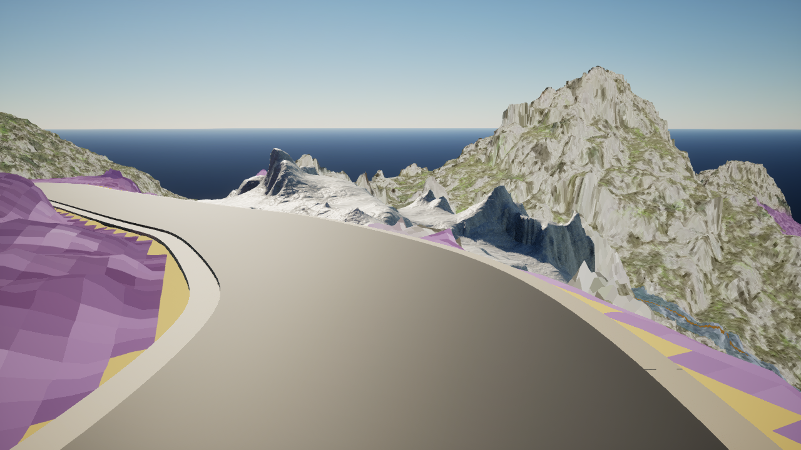
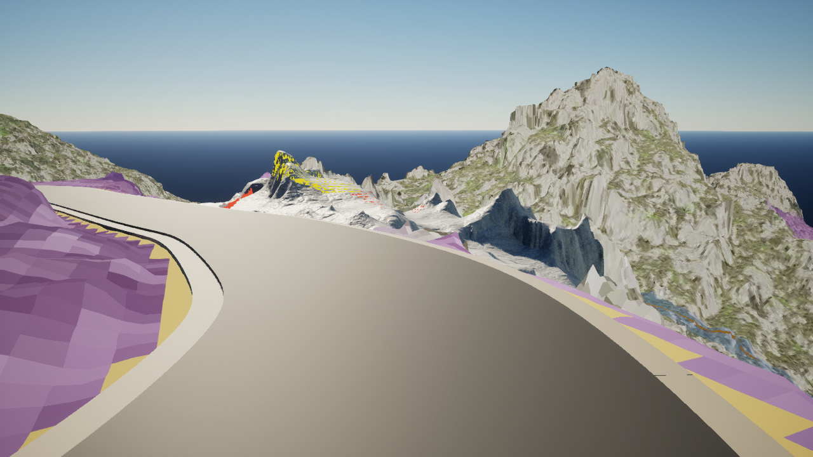
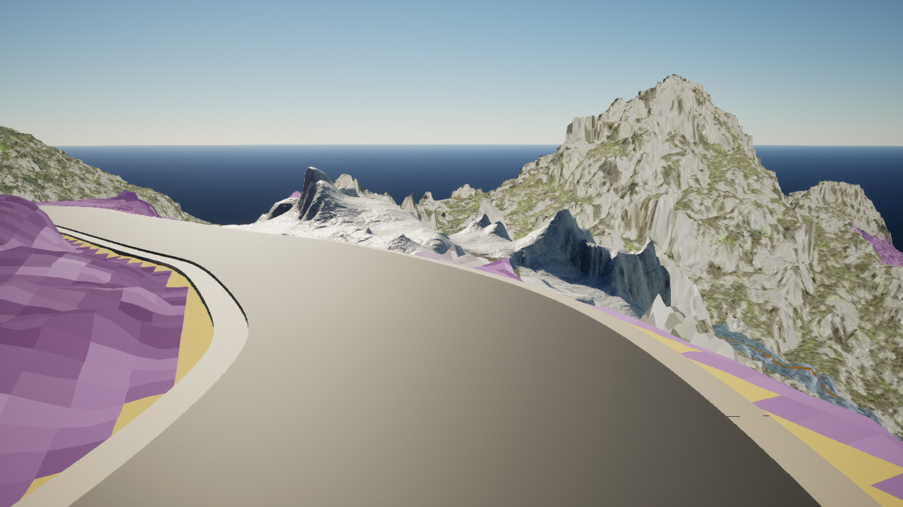
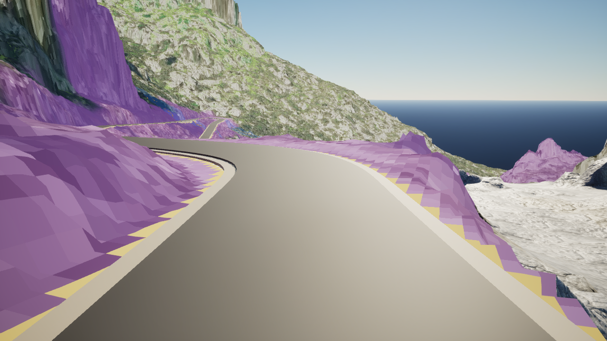
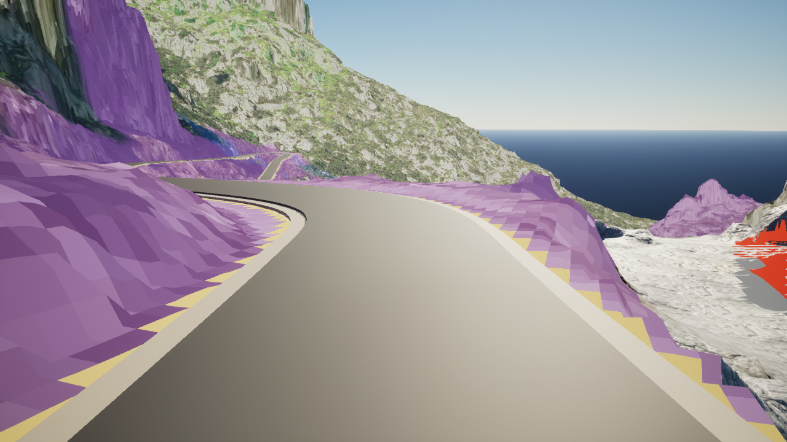

# Component 230: native detail mask and first bounded treatment

**Work item:** [#445](https://github.com/karnalooch/YetAnotherCyclingSim/issues/445),
[draft PR #446](https://github.com/karnalooch/YetAnotherCyclingSim/pull/446).
**Authority:** [World Building Bible](../../WORLD_BUILDING_BIBLE.md), selected
through [the documentation index](../../README.md).

## Purpose and execution status

Continue the [source-face pilot](../sa-calobra-component230-detail-pilot-20261008/README.md)
inside the existing Unreal v8 scene. The original CPU projection ignores other
scene occluders. This experiment must show the actual selected faces under
renderer depth and establish a visible witness for one local patch before its
native treatment is applied.

**Native execution passed** at implementation commit
[`520c7c98961b3a4be7fbb6eb7930e6dea8eb8b46`](https://github.com/karnalooch/YetAnotherCyclingSim/commit/520c7c98961b3a4be7fbb6eb7930e6dea8eb8b46).
The [native run 37842981347](https://github.com/karnalooch/YetAnotherCyclingSim/actions/runs/37842981347)
compiled UE 5.8.2 CL 56702186, passed all 28 scoped Automation tests, captured
all ten primary PNGs, applied the bounded trial after both visibility pairs,
and verified complete restoration. The
[implementation CI run 37842993840](https://github.com/karnalooch/YetAnotherCyclingSim/actions/runs/37842993840)
also passed.

The final local gate ran 86 focused Python tests: 85 passed and the PowerShell
parser check was skipped because this Linux environment has no `pwsh`. The
same check passed on the native runner. Ruff checks, Python compilation and all
four documentation guards passed. Both `YACS.DetailNative.PreservationAndRestore`
and `YACS.DetailNative.RejectBeforeMutation` have explicit `Success` entries,
with zero warnings and errors, in the retained
[Automation index](evidence/build-automation/Proof/AutomationReport/index.json).

The ten original PNGs were inspected and their bytes checked against the
downloaded artifact. Independent geometry comparison reproduced the 16 changed
vertices, 56 changed faces and zero outside/protected changes. Re-decoding the
paired PNGs reproduced both complete visibility-pixel lists. The 5.23 mm
treatment is visually very subtle at these two full-frame views; a clear
improvement in rock appearance is not established. Owner visual acceptance
remains pending and performance is not measured.

## Inspect the native views

The original proposed labels remain 324 A and 211 B. In the native mask,
orange/red shows the 229 eligible A faces, yellow shows the 210 eligible B
faces, and grey shows the 96 selected protected faces. Unselected faces retain
the baseline limestone material. Magenta/cyan mark only the 65-face trial
patch and are separate from the A/B classification.

### `window-0021-forward-00005`

The trial patch is small and distant, just beyond the road near the left edge
of the white Component 230 formation.

| Native v8 baseline | Native source-face mask | Bounded limestone trial |
| --- | --- | --- |
|  |  |  |

Visibility pair: [magenta](evidence/capture/detail-native/frames/window-0021-forward-00005-patch-magenta.png)
and [cyan](evidence/capture/detail-native/frames/window-0021-forward-00005-patch-cyan.png).

### `window-0023-forward-00000`

The same patch occupies the right edge of the frame. Its color witnesses make
the selected footprint easy to locate; baseline and trial look nearly
identical at this scale.

| Native v8 baseline | Native source-face mask | Bounded limestone trial |
| --- | --- | --- |
|  |  |  |

Visibility pair: [magenta](evidence/capture/detail-native/frames/window-0023-forward-00000-patch-magenta.png)
and [cyan](evidence/capture/detail-native/frames/window-0023-forward-00000-patch-cyan.png).

### Measured visibility before treatment

| Fixed camera | Conservative projected pixels | Corroborated paired-color pixels |
| --- | ---: | ---: |
| `window-0021-forward-00005` | 149 | 107 |
| `window-0023-forward-00000` | 2,045 | 2,045 |

Both poses exceed the required eight-pixel witness. The 42 uncorroborated
pixels in the first view are not individually classified as occluded;
sampling and antialiasing can also affect this threshold. These are selected
pixel witnesses, not percentages of visible faces or complete visibility
coverage. The immutable [pre-treatment witness](evidence/capture/detail-native/visibility-witness.json)
records `trial_applied: false` and binds all four source images before native
trial geometry was applied.

## Fixed inputs

| Input | Identity |
| --- | --- |
| Pilot implementation | `a05a4a727b4e1646649842ecb777e842e2984437` |
| Accepted v8 implementation | `4f2cba560d54931dc8ba080370d96a7aad24f15b` |
| Retained source capture | `b1ea05b33b9f3208e7aeb6884f1a67792d9c6121`, run `37800814004`, attempt `1` |
| Combined mesh SHA-256 | `a9d34dbfb32a59b592dca561a7d7b0e53f7d02d90c095cff7c0812c249247965` |
| Native source receipt SHA-256 | `35c76796924681c4d836388761bcc3ee83dd6e9fa544c3adb109e004e1c58225` |
| Camera CSV SHA-256 | `15e0a2350c613bf52bfb1354192043ca0c6cd785493c59e7721305b67de099a3` |

The source has 29,415 vertices and 58,216 ordered triangle rows. The pilot
proposes 324 A faces and 211 B faces. Of those selections, 96 touch protected
vertices and are excluded from treatment. Source-face row indices are never
silently interpreted as native Unreal triangle IDs.

The two frozen camera poses are `window-0021-forward-00005` and
`window-0023-forward-00000`, from the unchanged captured camera CSV. This is
selected-view evidence. It does not establish hidden surfaces across the world,
continuous traversal, reverse-direction completeness or band D.

## Treatment boundary

The producer selects the largest edge-connected eligible A patch with strict
interior vertices. `SILHOUETTE_CRITICAL` faces are excluded. Every vertex
incident to a face outside the selected patch remains fixed, including all
protected, B and U face interfaces. Selection is deterministic, with stable
face-row tie breaking.

The actual sparse pilot mask yields a 65-face patch with 51 vertices: 35 fixed
boundary vertices and 16 strict interior vertices. An additional frozen ring
would leave no movable vertex in any A component; the experiment therefore
freezes the exact outside-incident boundary without expanding the mask.

Only a gentle local normal-direction fairing candidate is prepared. The 5 cm
v8-relative displacement is a ceiling, not a target amplitude; the source
relative displacement must remain at most 50 cm, with numerical tolerance
recorded by the producer. Source XYZ, flags, vertex identity, triangle rows and
winding remain unchanged. Outside-face geometry and protected interfaces must
match exactly. Degenerate triangles, folded faces and nonmanifold output are
rejected. The treatment is an AI proposal, not inferred geology or a repaired
defect classification.

The verified retained input produces the following measured candidate:

| Measure | Result |
| --- | --- |
| Selected / actually changed faces | 65 / 56 |
| Changed vertices | 16 |
| Maximum additional movement | 0.5230451206 cm (5.23 mm) |
| Maximum source displacement among changed vertices | 32.3769206004 cm |
| Global source displacement maximum | 50.00000000000475 cm, within the retained 0.000001 cm numerical tolerance |
| Outside or protected geometry changes | 0 |
| Minimum 3D / XY triangle area ratio | 0.9992782462 / 0.9955198982 |
| XY orientation flips | 0 |
| Normal-direction fairing residual RMS | 0.4641598174 to 0.3343247926 cm |
| Trial mesh SHA-256 | `aed8f5ace6383f67004b5df6bb24da0db820cabd99ecb6186efc0b79f86d35b3` |

These values describe one factor-0.5 Jacobi normal-direction pass. The residual
is an algorithm measure, not a visual quality score. Global triangle
self-intersection testing is not performed; this bounded 2.5D trial checks
orientation and minimum area in both 3D and the source XY projection.

## Native comparison and visibility

The native consumer works on the existing v8 mesh and its native attributes.
It validates source geometry and an explicit face-row/native-ID mapping before
assigning diagnostic material IDs or moving vertices. It does not reconstruct
the accepted surface from OBJ, recalculate every normal or replace its UVs.

For each fixed pose the proof records the v8 limestone baseline,
colored A/B/protected mask, two patch-only color witnesses and the bounded
limestone trial. The patch witnesses change only the diagnostic patch color
between magenta and cyan, using ordinary scene depth. Corroborating changed
pixels must lie inside that patch's projected triangles. The trial requires a
minimum of eight corroborated pixels in at least one of the two poses. The
paired images and pixel inventory are hash-bound into an immutable witness
before trial geometry is applied. This tests the selected
patch against the scene occluders present in those rendered views; it does not
declare every selected face visible or validate all proposed bands.

Native normals referenced by any outside/protected face are preserved. Only
wholly patch-owned normal elements may be recomputed. The limestone baseline
and trial retain the existing material and 3 m physical UV scale. Diagnostic
colors do not imply production material changes.

## Remote proof and preservation

The existing Component 230 workflow uses a separate owner-only `[detail-native]`
push intent for the reviewed PR branch. It verifies the exact event SHA,
retained-source identities, idle host, accepted scene inputs and required
build/Automation before capture. The `YACS.DetailNative` tests exercise sparse
native triangle IDs, rejected source and boundary changes, exact untouched
positions, split UVs, shared normals and complete native snapshot restoration.
Unrelated PCGEx generation and the complete
1,338-frame survey are outside this narrow proof.

Outputs use a fresh directory under the configured persistent workspace work
tree. Uploads contain selected PNGs, manifests, candidate data and diagnostic
logs; they do not copy the full retained survey archive.

The native owner restores its mesh snapshot, transient actors, component
visibility, materials, lights and other scene state. Map bytes, source
heightfield, tracked checkout and frozen source inputs must remain unchanged.
`map_saved`, `assets_saved`, `canonical_landscape_mutation` and collision remain
false. Existing dynamic shadow settings are retained.

The [native receipt](evidence/capture/detail-native/detail-native-receipt.json)
records 16 changed vertices and 16 selectively recomputed normal elements;
outside/shared normal delta is zero, and UVs and topology are unchanged. Its
`native_restore` and `cleanup` results are both successful. The
[parent scene receipt](evidence/capture/component230-cliff-visual-receipt.json)
verifies the original source heightfield and scene restoration. The
[checkout receipt](evidence/checkout-restoration.json) records no tracked
changes and unchanged retained sources. Capture time was 123.735 seconds;
this is proof duration, not a runtime performance benchmark.

The previous combined lighting gate and separate PCGEx admission remain as
recorded in the [repair plan](../../tooling/SA_CALOBRA_COMPONENT230_REPAIR_PLAN.md).
This proof does not close them, replace v8, save production content, establish
whole-Landscape quality or measure the 1080p/60 budget. Owner visual acceptance
and protected merge remain separate decisions.

## Retained evidence and log scope

The [artifact provenance index](artifact-provenance.json) records 35 retained
files totaling 13,937,829 bytes, including every primary PNG and its referenced
readiness receipt. Each file is an exact byte copy of the
[12,234,191-byte original artifact](https://github.com/karnalooch/YetAnotherCyclingSim/actions/runs/37842981347/artifacts/11578816866).
Its ZIP SHA-256 is
`0bddb3a449665399e4f011ee1179c9ab71a27ba3bcc022cf28e9980af9275cd4`.
The complete artifact also retains the reproducible trial mesh, original mask
and pilot manifest, and the native startup/capture logs. The
[treatment manifest](evidence/input/treatment/treatment-manifest.json) and
[final proof verification](evidence/native-proof-verification.json) bind the
rendered candidate to its exact input hashes. Git attributes preserve the
original Windows-authored receipt bytes without newline conversion.

The log result is scoped. The build recorded a nonfatal C4701 warning for
`Tag` in the native validator. Editor startup reported unrelated Stage3F and
Stage3G prototype assets left as LFS pointers, plus two unnamed
`LogAutomationTest: Error: Condition failed` messages immediately before engine
initialization. Those asset paths have no overlap with the required accepted
scene dependency set, and the scene/material fallback gate passed. Both named
detail Automation tests independently report zero errors. The two warnings
in the 28-test Automation index belong to the existing `CyclingInput.ErrorSafety`
test's missing-route checks. These messages remain in the original logs;
this report does not describe the full startup log as error-free.

## Reproduce the pure candidate

```bash
python scripts/assets/prepare_sa_calobra_detail_treatment.py \
  --mesh /path/to/verified/combined-mesh.json \
  --mask docs/experiments/sa-calobra-component230-detail-pilot-20261008/pilot/triangle-bands.json \
  --output /path/to/fresh/detail-treatment
python -m unittest scripts.assets.test_sa_calobra_detail_treatment -v
python scripts/ci/check_docs_index.py
```

Native execution uses UE 5.8 and the repository's existing runner/proof
entrypoints. PCGEx remains pinned at 0.79 / commit
`39a8f1bdc65b2c4613a1e87b71d93b4576db0a66`; this experiment does not replace
or modify that topology producer.

Primary API references for the bounded native operations:

- [Epic UE 5.8 FDynamicMeshAttributeSet](https://dev.epicgames.com/documentation/en-us/unreal-engine/API/Runtime/GeometryCore/FDynamicMeshAttributeSet).
- [Epic UE 5.8 FMeshNormals](https://dev.epicgames.com/documentation/en-us/unreal-engine/API/Runtime/GeometryCore/FMeshNormals).
