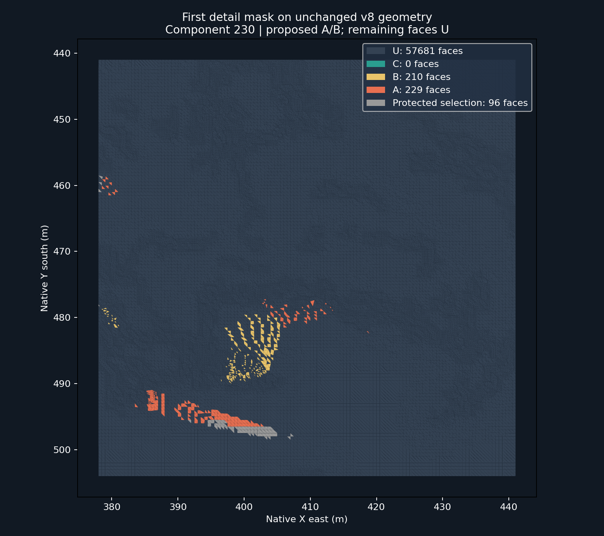

# Component 230: first working source-surface detail mask

This pilot converts three manually proposed image regions from two original TPP
frames into face groups on the existing accepted v8 mesh. It produces a real,
reproducible triangle selection and an unchanged-geometry OBJ/MTL preview.



| Proposed requirement | Selected faces | Protected: no treatment | Eligible for later review |
| --- | ---: | ---: | ---: |
| A: close rock and road contact | 324 | 95 | 229 |
| B: readable local crest | 211 | 1 | 210 |
| C: separate panorama | 0 | 0 | 0 |
| U: not assigned by this pilot | 57,681 | 5,263 | 52,418 |

Eligibility means only that all vertices are movable under the existing source
contract. It does not authorize treatment: owner review, whole-scene occlusion
and the native consumer remain pending. D is never inferred from missing hits.
The distant mountain at the right of the first frame is not this component.

## Inspect the result

- [Offline viewer with candidate overlays and optional diagnostic coverage](review.html).
- [Exact mesh-hash-scoped face bands, independent tag masks and protected flags](pilot/triangle-bands.json).
- [Generation manifest](pilot/manifest.json), [selection counts](selection-summary.json),
  [partial archive replay receipt](replay-receipt.json), [manual proposed regions](annotations.json).
- Original images: [local crest and road contact](source/window-0021-forward-00005.png),
  [exposed downhill surface](source/window-0023-forward-00000.png).
- Vector proposals: [first view](pilot/window-0021-forward-00005-projection.svg),
  [second view](pilot/window-0023-forward-00000-projection.svg).

Download the complete folder to use the offline viewer; it references byte-exact
original PNGs. Coral is A, yellow is B, gray selected faces are protected.
The diagnostic coverage overlay can cross asphalt because it tests only this
component; it is not an occlusion mask for the complete world.

## Reproduce

The existing Component 230 workflow has an owner-only `[detail-pilot]` push lane.
It runs hosted tests and replays fixed retained evidence, without starting Unreal
or the full Phase 2C/survey lanes. Its artifact includes the original source mesh,
unchanged candidate OBJ/MTL, PNGs, vector previews and complete selection data.

```bash
python -m unittest scripts.assets.test_sa_calobra_detail_pilot scripts.assets.test_run_sa_calobra_detail_pilot -v
python scripts/assets/run_sa_calobra_detail_pilot.py \
  --frames docs/experiments/sa-calobra-tpp-survey-20261008/frames.csv \
  --annotations docs/experiments/sa-calobra-component230-detail-pilot-20261008/annotations.json \
  --output /tmp/component230-detail-pilot
```

The output directory must not exist. The replay pins the captured camera CSV,
v8 mesh and native restoration receipt, verifies ZIP entry CRC/SHA and original
PNG size/dimensions, and downloads only needed HTTP ranges. The whole 1.6 GB
archive hash is not recomputed by this replay; previous complete retention is
separate evidence. Source capture: `b1ea05b33b9f3208e7aeb6884f1a67792d9c6121`.

## Consumer boundary

`bands[i]` addresses face row `i` only in the exact mesh named by `mesh_sha256`;
it is not a native Unreal triangle ID. Vertex rows contain source XYZ in fields
1–3, candidate XYZ in fields 4–6 and the original movable flag in field 7.
OBJ vertices remain in absolute UE centimetres; face order and winding remain
unchanged. Faces touching any locked vertex are protected.

The five tags are independent proposal bits in their declared order:
`GEO_FIX`, `SILHOUETTE_CRITICAL`, `HERO_DETAIL`, `BACKGROUND_LOW_PRIORITY`,
`MATERIAL_TEST_CANDIDATE`. Only explicitly annotated tags receive bits.
This pilot does not populate the canonical review CSV or imply a geometry defect.

Projection uses verified camera location/target, roll-zero orientation, horizontal
FOV and perspective-correct component nearest hits at 320×180 sample points.
Partial pixel sampling can leave holes; unhit faces remain U. Other components,
roads and scene occluders have not been resolved. All outputs are AI proposals.

**Delivered:** tested producer, actual source-face selection, protected flags,
diagnostic mesh preview and remote replay lane. **Pending:** native mask consumer,
whole-scene occlusion, owner visual acceptance and later detail treatment.
Accepted v8, roads, terrain, materials and existing draft/admission blockers stay
preserved. No new Unreal render or performance measurement is claimed.

Related: [full visibility prestudy](../sa-calobra-roadside-visibility-prestudy-20261008/README.md),
[off-road Landscape plan](../sa-calobra-roadside-visibility-prestudy-20261008/off-road-plan.md),
[surface detail atlas](../../tooling/SA_CALOBRA_SURFACE_DETAIL_ATLAS.md).
