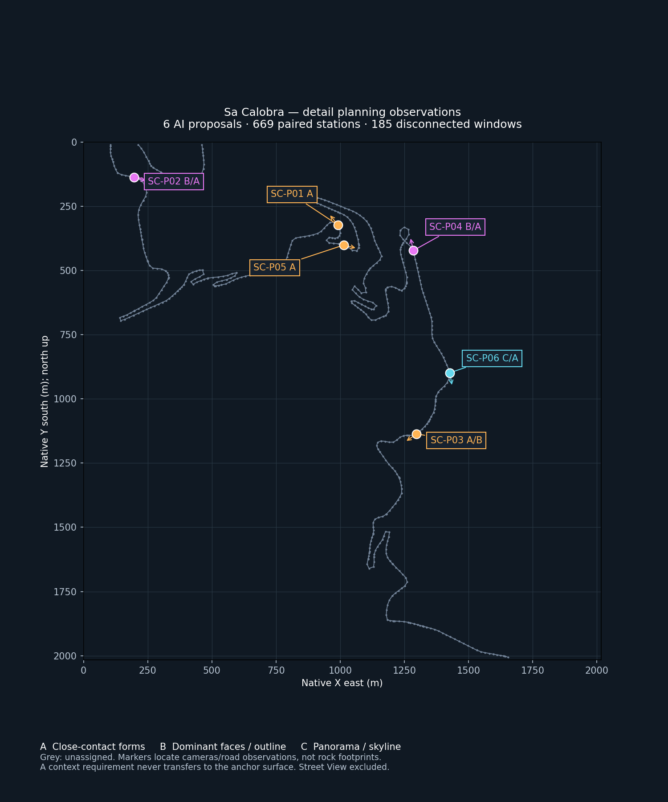

# Sa Calobra detail planning map — 2026-10-08

**Status:** first planning map from captured observations; six AI proposals, physical surface footprints unresolved. Street View excluded by owner direction.

Authority: [World Building Bible](../../WORLD_BUILDING_BIBLE.md), [surface atlas](../../tooling/SA_CALOBRA_SURFACE_DETAIL_ATLAS.md). Evidence: [six original-PNG cards](../sa-calobra-surface-detail-review-20261008/README.md) and [captured survey](../sa-calobra-tpp-survey-20261008/README.md).

[Open full vector map](planning-map.svg) · [Offline interactive planning map](planning-map.html) · [Map data and provenance](planning-data.json)

The vector map is readable on GitHub. To use the interactive version, download this directory and open `planning-map.html`; it supports zoom/pan, location selection, observation filters and export of separate planning notes. Linked original cards require the adjacent review directory or the remote links.

## Reading the map

A coloured marker locates the road station from which a candidate was observed. It does not locate the rock or assign detail to nearby land. Short strokes indicate the anchor viewing direction, not surface extent. A second A badge at 0132, 0181 or 0077 denotes a separate close bank/wall visible in the available frames; it does not turn the B/C candidate into an A surface.

| Mark | Plan | Candidate omissions |
|---|---|---|
| A — close contact | Corners, local planes, shelves and rock-ground contact | Pores/grain/tiny cracks by material where visible shape stays intact |
| B — dominant wall | Characteristic outline, broad faces, large fractures and ledges | Uniform fine geometric finishing unsupported by the view |
| C — panorama | Skyline, large divisions and coherent apparent material scale | Fine interior geometry unsupported in this view; check closer appearances first |
| Grey — unassigned | Review the source window | No inferred downgrade; grey does not mean D or background |

## First places to plan

| Location | Required attention | Open evidence |
|---|---|---|
| SC-P01 / window 0103 | Roadside wall — A | [Original-PNG card](../sa-calobra-surface-detail-review-20261008/cards/SC-P01.md) |
| SC-P02 / window 0132 | Upper-left massif B + separate close bank A | [Original-PNG card](../sa-calobra-surface-detail-review-20261008/cards/SC-P02.md) |
| SC-P03 / window 0168 | Close bank A + broad slope B | [Original-PNG card](../sa-calobra-surface-detail-review-20261008/cards/SC-P03.md) |
| SC-P04 / window 0181 | Peak B + separate reverse wall A | [Original-PNG card](../sa-calobra-surface-detail-review-20261008/cards/SC-P04.md) |
| SC-P05 / window 0039 | Near bank A; distant slope unresolved | [Original-PNG card](../sa-calobra-surface-detail-review-20261008/cards/SC-P05.md) |
| SC-P06 / window 0077 | Sea ridge C + separate foreground banks A | [Original-PNG card](../sa-calobra-surface-detail-review-20261008/cards/SC-P06.md) |

## How we turn this into surface assignments

Use the map to choose a location, open its card and identify the readable forms. Record the detail to retain and what may be omitted. Then find the same physical surface in other available views and establish its world boundary and scene ownership. Only after that review should a surface footprint receive the confirmed band and independent tags.

The interactive notes export is a planning derivative keyed by proposal ID, with no canonical tags, surface IDs or executable PCGEx selection. Editing a note does not confer visual acceptance or modify the original captured review template. The five supported tags remain GEO_FIX, SILHOUETTE_CRITICAL, HERO_DETAIL, BACKGROUND_LOW_PRIORITY and MATERIAL_TEST_CANDIDATE.

No full-area A–D polygon map is claimed yet. Unknown areas remain unassigned; no hidden D surface, confirmed geometry defect or approved background simplification is established. Fine-detail savings must retain outline, readable major forms, contact and needed indirect contributions. Accepted Component 230 v8 remains the baseline.

## Provenance and validation

The map uses all 669 forward road-station rows from the immutable captured `frames.csv`, paired with the reverse frames in the source survey. Samples are grouped into 185 construction windows and sorted by local station; no path connects different windows. Lines within windows are schematic sampled traces, not exact pavement geometry or route chainage. Local units are metres, X east/Y south, north up; stationing resets per window. Repeated world positions are not ruled out.

Six markers match the card anchor road positions; direction vectors match camera-to-target XY. The source CSV SHA-256 and exact source/capture revisions are in [planning-data.json](planning-data.json). Street View is excluded; retained legacy links in prior proposal evidence are not prerequisites for this planning work. No geometry, materials, source evidence or performance settings change.
