# Sa Calobra Material Forge production proof — 2026-10-07

## Status

**Technical status:** TECHNICAL PASS  
**Visual status:** PENDING OWNER ACCEPTANCE  
**Parent PR:** [#381](https://github.com/karnalooch/YetAnotherCyclingSim/pull/381)  
**Current exact SHA:** `d0eac27581bc56a4f8eb552f402f9cbab6bd73eb`  
**Primary final proof:** Material Forge Mallorca proof [#21 / run 37584113947](https://github.com/karnalooch/YetAnotherCyclingSim/actions/runs/37584113947)  
**Visual acceptance issue:** [#413](https://github.com/karnalooch/YetAnotherCyclingSim/issues/413)

This report records the productionization of the Sa Calobra Material Forge path from deterministic offline material generation through Blender reference rendering, exact-SHA Unreal admission, real Landscape assignment/rollback and owner-facing 4K visual evidence.

It is an evidence and decision record. It does not override the World Building Bible, route/terrain authority, PCG/PCGEx semantic ownership or the owner visual gate.

---

## 1. Executive summary

The Material Forge pipeline is now technically functional end to end on the real accepted Sa Calobra Landscape.

The final path proves all of the following on exact repository revisions:

- deterministic Material Forge generation for the refined limestone and dry-soil candidates;
- Blender 4.5.9 reference rendering;
- slim exact-SHA proof transfer to the Unreal consumer;
- persistent Git LFS reuse on the self-hosted runner;
- offscreen Unreal execution without a visible editor window;
- a fixed/precompiled Landscape master material;
- runtime creation of a Material Instance using the refined Material Forge textures;
- real Landscape assignment and rollback;
- whole-Landscape application across all 1024 components;
- four 3840 x 2160 lit owner-review captures;
- canonical accepted-map preservation;
- no geometry mutation and no world-semantic mutation.

The technical path is therefore no longer the blocker.

The remaining gate is visual/product admission. The current `refined_a` appearance is inspectable and stable, but human acceptance remains explicitly pending. PR #381 remains Draft for that reason.

---

## 2. Authority boundaries preserved

The production proof deliberately preserves the existing YACS ownership model.

| Domain | Authority |
|---|---|
| Terrain geometry / earthworks | BOB and accepted Landscape geometry |
| World semantics / classification / placement | PCG / PCGEx |
| Surface appearance | Material Forge |
| Appearance blend input | Existing 4033 x 4033 visual-fill mask |
| Final technical consumer | Unreal Engine 5.8 |
| Human visual acceptance | Owner |

Material Forge never becomes semantic authority.

The mask contract used by the final proof is:

- blue channel: limestone appearance weight;
- soil appearance weight: `1 - rock`;
- source mask size: 4033 x 4033;
- no geometry displacement;
- no generated semantic classification.

---

## 3. Refined production candidates

The admitted technical proof uses:

- rock: `regional_limestone/refined_a`;
- soil: `mediterranean_soil/refined_a`.

Each candidate is generated at 2048 x 2048 and provides:

- BaseColor;
- DirectX normal;
- ORM.

The Material Forge family catalog remains deterministic and CPU validated before Unreal consumption.

Height outputs remain offline authoring evidence and are not used to displace the accepted Landscape.

---

## 4. Why the original implementation failed

The first real Landscape implementation built a complete transient blended Material graph inside the same editor process that imported the Material Forge textures and attempted the Landscape assignment.

That path was technically correct in ownership terms but had unacceptable peak physical-memory behavior.

Representative failed runs showed:

| Stage | Free physical RAM |
|---|---:|
| before Landscape preparation | ~9.9–12.6 GiB |
| after transient material preparation | ~0.2–0.9 GiB |

The fail-closed Landscape apply gate requires at least 6 GiB free physical memory. The assignment was therefore correctly rejected before the next component was modified.

This was not fixed by weakening the gate.

The existing thresholds remained unchanged:

- preparation: 8 GiB physical / 12 GiB commit;
- apply: 6 GiB physical / 8 GiB commit.

That decision prevented an apparent “green” result from being purchased by unsafe memory pressure.

---

## 5. Compile-drain experiment

The first memory hypothesis was overlapping asynchronous texture/material/shader compilation.

The editor diagnostics library was extended to:

- finish selected texture compilation;
- call `FAssetCompilingManager::FinishAllCompilation()`;
- run full garbage collection;
- report remaining asset/shader jobs and memory before/after drain.

The experiment proved that compilation could be completely drained while the large physical-memory peak remained.

A representative receipt showed:

- `remaining_before = 1`;
- `remaining_after = 0`;
- free physical memory still remained below the Landscape apply gate.

This result was useful because it rejected the assumption that an in-flight compile queue was the dominant memory owner.

---

## 6. Final architecture: fixed master + Material Instance

The production solution separates expensive master-material authoring from the real Landscape consumer process.

```mermaid
flowchart LR
    MF["Material Forge<br/>refined rock + soil"] --> DET["Determinism / validation"]
    DET --> SLIM["Slim exact-SHA canary input"]

    BUILD["Isolated UE process<br/>build fixed master"] --> MASTER["M_MaterialForgeLandscapeBlend"]

    SLIM --> UE["Fresh offscreen UE consumer"]
    MASTER --> UE

    UE --> MI["MI_MF_ChunkedRockSoil<br/>bind refined textures + mask"]
    MI --> LAND["Accepted Sa Calobra Landscape"]
    LAND --> VERIFY["Assign / verify / rollback"]
    VERIFY --> CAP["Whole-Landscape 4K visual proof"]

    classDef input fill:#303846,stroke:#8ea1b8,color:#f7f9fc,stroke-width:2px;
    classDef exec fill:#123f73,stroke:#49a2ff,color:#ffffff,stroke-width:3px;
    classDef success fill:#1f5736,stroke:#63d889,color:#ffffff,stroke-width:3px;
    classDef evidence fill:#164d5c,stroke:#5bd6ef,color:#ffffff,stroke-width:2px;

    class MF,MASTER input;
    class DET,BUILD,UE,MI exec;
    class LAND,VERIFY success;
    class SLIM,CAP evidence;
```

The fixed master owns the stable material graph and parameter contract.

The per-proof Material Instance supplies:

- `WeightTex`;
- `RockBaseColorTex`;
- `RockNormalTex`;
- `RockORMTex`;
- `SoilBaseColorTex`;
- `SoilNormalTex`;
- `SoilORMTex`;
- rock tile size;
- soil tile size.

This removes repeated live master-graph construction from the real Landscape proof.

---

## 7. UE 5.8 compatibility fixes

### 7.1 Weight sampling

The first fixed-master attempt used a `MaterialExpressionTextureSample` path that expected a `TextureObject` input.

The pinned UE 5.8 Python material path did not expose that input as required by the attempted connection.

The fixed master now uses `MaterialExpressionTextureSampleParameter2D` for the five mask samples, sharing one `WeightTex` parameter while preserving independent UV offsets.

The five-tap appearance smoothing contract remains:

- center;
- +X;
- -X;
- +Y;
- -Y;
- arithmetic average;
- blue channel = rock.

### 7.2 ORM placeholder sampler contract

The fixed master declares rock and soil ORM parameters as mask samplers.

The first bootstrap defaults pointed at Stage3G roughness textures imported as Linear Color, so UE correctly rejected the master with a sampler-type mismatch.

The bootstrap now creates a disposable local placeholder:

`T_MF_ORMPlaceholder`

with:

`TC_MASKS`

The placeholder is only a bootstrap default. The final Material Instance replaces it with the real refined Material Forge ORM textures.

Original Stage3G assets are never modified.

### 7.3 Warm-runner stale output cleanup

The self-hosted workspace persists between jobs. After the first successful fixed-master proof, the generated master and ORM placeholder remained in the warm checkout and caused the next proof to fail closed on an existing-asset collision.

The workflow now removes only the exact disposable bootstrap outputs before rebuilding:

- `M_MaterialForgeLandscapeBlend.uasset/.uexp/.ubulk`;
- `T_MF_ORMPlaceholder.uasset/.uexp/.ubulk`.

Before deletion, the workflow verifies that these files are not tracked.

If they ever become repository-tracked assets, cleanup refuses to delete them.

---

## 8. Offscreen execution

Issue #404 is completed.

The non-visual Unreal proof runs with:

`UnrealEditor.exe -RenderOffscreen -Unattended -NoSplash -NoSound -NoP4`

The previous visible-window flags were removed:

- no `-windowed`;
- no explicit `-ResX`;
- no explicit `-ResY`.

The production proof still uses normal RHI/material/shader behavior. It does not use `-NullRHI`.

An additional `UnrealEditor-Cmd.exe` experiment was deliberately not pursued after the offscreen path satisfied the production requirement.

---

## 9. Proof-transfer optimization

Issue #402 is completed.

The UE consumer no longer downloads the complete Material Forge determinism bundle.

Final #21 artifact sizes:

| Artifact | Size |
|---|---:|
| slim UE canary input | 46,693,854 bytes |
| UE canary evidence | 34,451,875 bytes |
| whole-Landscape visual proof | 34,281,004 bytes |
| full archival Material Forge proof | 553,737,548 bytes |

The slim artifact contains only the exact data required by the UE canary plus the receipts that bind those bytes to the exact source SHA.

The full archive remains available for audit and review.

A later optional optimization may move the full ~554 MB archive to manual/nightly/failure-only retention, but that work is not required for current Material Forge production admission.

---

## 10. Persistent Git LFS cache

The self-hosted runner uses persistent LFS object storage under the D: drive.

The final observed cache receipt before the whole-Landscape proof reported:

- selected objects: 473;
- cache hits before fetch: 473;
- cache misses before fetch: 0;
- network fetch required: false;
- fetch verification elapsed: 0.391 s.

The cache never bypasses object/hash verification.

No new cache is placed on C:.

---

## 11. Exact technical admission checkpoint — proof #19

Before introducing the whole-Landscape visual capture, Material Forge proof #19 established the stable technical baseline.

Exact SHA:

`cc6b9fcb5b268e3dc884ed8cc47d589ec8f0bb99`

Material Forge Mallorca run:

[37580075697](https://github.com/karnalooch/YetAnotherCyclingSim/actions/runs/37580075697)

The aggregate UE receipt reported:

- `UE_MATERIAL_FORGE_SINGLE_SESSION_PASS`;
- `UE_CANARY_ASSIGN_ROLLBACK_PASS`;
- `UE_LANDSCAPE_BLEND_ASSIGN_ROLLBACK_PASS`;
- execution mode: `RenderOffscreen`;
- map load count: 1;
- template-builder process count: 1;
- canary process count: 1;
- total canary time: 27.076 s;
- `map_saved = false`;
- `assets_saved = false` in the canary process;
- `geometry_changed = false`;
- `world_semantics_changed = false`.

Memory:

| Stage | Free physical | Free commit |
|---|---:|---:|
| before | 18.77 GiB | 72.21 GiB |
| after Landscape | 12.50 GiB | 60.90 GiB |
| after GC | 12.50 GiB | 60.90 GiB |
| after importer canary | 12.77 GiB | 61.36 GiB |

This is the decisive memory comparison against the old dynamic-master path that dropped below 1 GiB free physical memory.

---

## 12. Whole-Landscape visual proof — proof #21

The owner-facing visual proof was added after the technical path was stable.

Exact SHA:

`d0eac27581bc56a4f8eb552f402f9cbab6bd73eb`

Material Forge Mallorca run:

[37584113947](https://github.com/karnalooch/YetAnotherCyclingSim/actions/runs/37584113947)

Final receipt:

`MF_LANDSCAPE_VISUAL_PROOF_PASS`

Scope:

- accepted map: `/Game/Worlds/SaCalobra/L_SaCalobraAccepted_20261004`;
- whole Landscape: 1024 components;
- fixed master: `/Game/Generated/YACS/MaterialForge/Templates/M_MaterialForgeLandscapeBlend`;
- Material Instance: transient, session-only;
- four lit captures;
- capture resolution: 3840 x 2160;
- human status: `PENDING_OWNER`.

Safety results:

- `map_saved = false`;
- `assets_saved = false`;
- `geometry_changed = false`;
- `world_semantics_changed = false`;
- `rollback_complete = true`;
- canonical map bytes unchanged after rollback;
- original global Landscape material restored;
- all component overrides restored.

The visual artifact is:

`material-forge-landscape-visual-d0eac27581bc56a4f8eb552f402f9cbab6bd73eb-1`

Artifact size:

34,281,004 bytes.

The heavy image files remain in GitHub Actions artifacts by policy; they are not committed to the repository merely because the technical capture succeeded.

---

## 13. Visual-proof camera set

The owner proof contains four fixed-purpose views.

| Capture | Resolution | FOV | Purpose |
|---|---:|---:|---|
| `01-sa-calobra-overview` | 3840 x 2160 | 58° | whole-area material distribution |
| `02-refined-material-oblique` | 3840 x 2160 | 60° | rock/soil readability and macro repetition |
| `03-refined-material-medium` | 3840 x 2160 | 55° | component-scale projection and blend quality |
| `04-refined-material-close` | 3840 x 2160 | 50° | surface scale, normal response and transition quality |

All four captures use `VMI_LIT`.

The capture process used one Directional Light and one SkyLight in the final scene state; one missing lighting role was supplied by a transient fallback actor for evidence generation only. That transient actor was destroyed during rollback and was never serialized.

---

## 14. Whole-Landscape visual-proof memory profile

The final visual receipt recorded:

| Stage | Free physical | Free commit |
|---|---:|---:|
| visual start | 18.19 GiB | 71.35 GiB |
| weight imported | 17.25 GiB | 70.11 GiB |
| fixed master loaded | 17.13 GiB | 69.82 GiB |
| rock textures imported | 17.02 GiB | 69.81 GiB |
| soil textures imported | 17.56 GiB | 71.26 GiB |
| texture compilation drained | 17.56 GiB | 71.26 GiB |
| Material Instance created | 17.26 GiB | 70.17 GiB |
| Material Instance updated | 12.14 GiB | 61.24 GiB |
| fixed-master instance drained | 12.04 GiB | 60.99 GiB |
| whole Landscape applied | 11.53 GiB | 60.38 GiB |
| capture textures resident | 15.38 GiB | 67.77 GiB |
| lit view ready | 15.38 GiB | 67.77 GiB |

At whole-Landscape application, the proof still retained approximately 11.53 GiB free physical memory.

This is comfortably above the existing 6 GiB apply gate and is the main technical evidence that the fixed-master architecture solved the production-blocking memory peak.

---

## 15. Final workflow health on current SHA

At `d0eac27581bc56a4f8eb552f402f9cbab6bd73eb`, the current PR branch is green across the relevant workflows:

- CyclingSim CI #1849 — SUCCESS;
- Blender Material Forge reference proof #21 — SUCCESS;
- Gumball Repository Ops #1265 — SUCCESS;
- Fail-closed PR orchestrator #3853 — SUCCESS;
- Material Forge Mallorca proof #21 — SUCCESS.

PR #381 remains Draft and mergeable.

The Draft state is intentional and no longer represents a technical pipeline failure.

---

## 16. PR / issue implementation history

The production path was assembled through a series of bounded changes.

| PR / issue | Result |
|---|---|
| #403 — optimize proof transfer and UE canary loop | merged |
| #405 — offscreen UE canary | merged |
| #406 — compilation drain before Landscape apply | merged |
| #407 — shader/material memory checkpoints | merged |
| #408 — isolate fixed-master authoring | merged |
| #409 — release transient texture source memory | closed without merge; superseded |
| #410 — UE 5.8 compatible weight sampler | merged |
| #411 — fixed-master builder proof trigger | merged |
| #412 — mask-compatible ORM bootstrap default | merged |
| #414 — production whole-Landscape visual proof | merged |
| #415 — warm-runner stale bootstrap cleanup | merged |
| #402 — proof transfer / persistent LFS optimization | closed completed |
| #404 — offscreen/headless canary | closed completed |
| #413 — production Landscape visual acceptance | open; owner gate |

The unmerged #409 experiment is intentionally excluded from the production path.

---

## 17. Current visual status

The technical visual proof passed, but the owner visual gate has not yet passed.

Therefore the current status is:

**TECHNICAL PASS / VISUAL PENDING**

The following observations are non-authoritative review notes for the next art pass, not owner acceptance decisions:

- the whole area currently reads too uniformly cream/beige at distance;
- limestone and dry soil need stronger large-scale separation;
- limestone is still warmer/yellower than the desired Mallorca reference direction;
- the close views show useful microstructure, but macro and medium-scale variation are comparatively weak;
- some steep-face areas show very dark cavities and streak-like response that should be separated into geometry, normal/shading and albedo causes before tuning;
- the next change should improve appearance, not rebuild the pipeline.

No visual failure is recorded until the owner explicitly rejects the current candidate.

---

## 18. Recommended next art pass

The next proposed candidate is **Refinement B**, scoped only to visible quality.

Recommended goals:

1. shift limestone toward a more neutral/slightly cooler pale mineral response;
2. preserve dry Mediterranean soil warmth while increasing separation from exposed rock;
3. strengthen macro variation without introducing semantic classification;
4. reduce the uniform procedural-noise coating impression at medium/close range;
5. diagnose dark cliff cavities before compensating them in BaseColor;
6. reuse the exact four #21 camera purposes for an A/B comparison.

The production comparison loop should now be:

`Material Forge candidate -> deterministic validation -> Blender reference -> fixed-master UE -> whole-Landscape 4K capture -> owner A/B decision`

No new tooling framework is required for Refinement B.

---

## 19. Merge policy for PR #381

PR #381 should remain Draft until the remaining owner-facing gates are explicitly resolved.

Current technical blockers:

**none identified**

Remaining admission work:

- owner whole-Landscape visual acceptance or explicit rejection/tuning request;
- final performance admission if required by the parent material-foundation definition of done.

A green technical proof must not silently convert `PENDING_OWNER` into visual acceptance.

---

## 20. Durable decisions

The following decisions should survive this experiment:

1. Do not dynamically build the expensive blended master inside the real Landscape consumer process.
2. Keep the fixed master and per-proof Material Instance separation.
3. Keep the physical-memory safety gates unchanged.
4. Keep Material Forge appearance-only; PCG/PCGEx remains semantic authority.
5. Keep the accepted map immutable during canary and visual evidence generation.
6. Use `RenderOffscreen` for non-interactive UE proofs.
7. Reuse the persistent D:-drive Git LFS cache with exact hash verification.
8. Keep heavy 4K captures in Actions artifacts until a human accepts a long-term visual baseline.
9. Preserve failed/superseded experiments instead of merging unnecessary fixes after the architecture changes.
10. Treat #21 as technical production evidence, not automatic artistic approval.

---

## 21. Evidence links

- [PR #381 — Sa Calobra Landscape material foundation](https://github.com/karnalooch/YetAnotherCyclingSim/pull/381)
- [Issue #402 — proof transfer and LFS optimization](https://github.com/karnalooch/YetAnotherCyclingSim/issues/402)
- [Issue #404 — offscreen Unreal execution](https://github.com/karnalooch/YetAnotherCyclingSim/issues/404)
- [Issue #413 — production Landscape visual acceptance](https://github.com/karnalooch/YetAnotherCyclingSim/issues/413)
- [Material Forge proof #19](https://github.com/karnalooch/YetAnotherCyclingSim/actions/runs/37580075697)
- [Material Forge proof #21](https://github.com/karnalooch/YetAnotherCyclingSim/actions/runs/37584113947)
- [Earlier material repair report](sa-calobra-material-repair-20261006-report.md)
- [Material reference review](sa-calobra-material-reference-review-2026-10-05.md)
- [Surface candidate comparison](sa-calobra-surface-candidates-2026-10-05.md)
