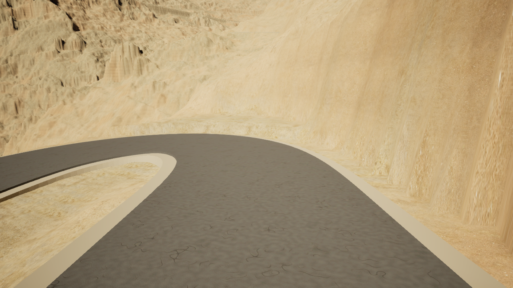
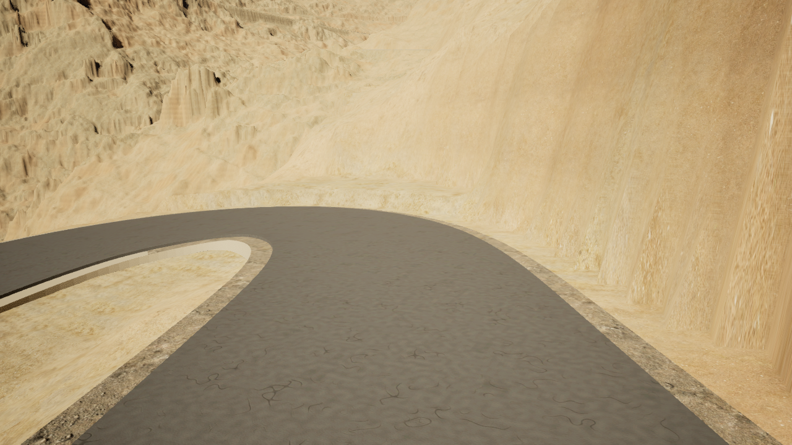

# Sa Calobra window 0112 — shoulder material comparison

## Verified result

The bounded shoulder canary at
`1ef46dacedba5ed1fc909422529be41808d3dbe4` passed
[protected CI 38084736631](https://github.com/karnalooch/YetAnotherCyclingSim/actions/runs/38084736631)
and [native/GPU 38084733503](https://github.com/karnalooch/YetAnotherCyclingSim/actions/runs/38084733503).
The native baseline, reversible assignment, saved consumer, separate fresh
reload and four final captures passed. The
[GPU host receipt](candidate/road-asphalt-gpu-host-receipt.json) records the
observed editor exit code **0**, resolving the preceding capture's failed
shutdown without changing its visual findings.

GPU PASS covers capture, texture readiness, conservation checks and observed
process exit 0. The separate admission flags remain
`gpu_shader_compilation_admitted=false` and
`road_pixel_visibility_admitted=false`.

| Evidence | Retained record |
|---|---|
| Asphalt baseline | `396861de0884135d18006e6d3f133edebef639aa`; [baseline GPU receipt](baseline/road-asphalt-gpu-host-receipt.json) |
| Saved shoulder selection and conservation | [Candidate manifest](candidate/road-asphalt-saved-manifest.json), including all 436 selected IDs and native API evidence |
| Independent fresh process | [Fresh-reload result](candidate/road-asphalt-saved-reloaded.json) and [saved-consumer host receipt](candidate/saved-road-host-receipt.json) |
| Four final frames and readiness | [Candidate capture receipt](candidate/road-asphalt-lit-review.json); four asphalt textures at 12/12 mips and three gravel textures at 11/11 mips before every final pose |

## Material scope and conservation

Only the **436 outer top triangles** of `YACS_PERSIST_SUPPORT_112`, source
window `reviewed-VIAL_TR70190001272-1-interval-24-0`, receive slot 1. The existing
staged `FillGravel` maps use Poly Haven `rock_ground`, **CC0-1.0**, at **150 cm**
world projection with DirectX normals. No source texture is imported or edited.
The remaining 5,772 triangles, including interior tops and walls, retain slot 0
and its literal original material instance.

The target has 4,050 vertices, 6,208 triangles and zero UV sets. Native checks
matched all 5,232 source interior triangles with zero coordinate delta, proved
rollback, and preserved the following hashes before/after assignment and after
fresh loading. Zero UV sets are recorded explicitly; no UV data was invented.

| Target invariant | SHA-256 |
|---|---|
| Positions and triangle indices | `aac7a97734192b30994916f2a521e14c1be0194741ec4111184a759e854e037f` |
| Rendered triangle-corner normals and UV inventory | `c4e55257197cc083ac1a75d495b93e86afd0ecb85acca4e5fbb526203228fdb1` |

Full buffer proof applies to this support. The other 185 supports and 1,024
Landscape components retain the existing inventory checks. Geometry, Base_DTM,
road physics, displacement and weather are unchanged.

## Same-camera final images

All images are original 1280 × 720 final captures with matching poses and full
mip warmup. The before view uses the verified asphalt baseline; the after view
adds the bounded shoulder material.

| Pose | Before: `396861de` | After: `1ef46da` |
|---|---|---|
| Forward 00001 | [PNG](baseline/road-asphalt-lit-review/frames/window-0112-forward-00001.png) | [PNG](candidate/road-asphalt-lit-review/frames/window-0112-forward-00001.png) |
| Forward 00002 | [PNG](baseline/road-asphalt-lit-review/frames/window-0112-forward-00002.png) | [PNG](candidate/road-asphalt-lit-review/frames/window-0112-forward-00002.png) |
| Reverse 00001 | [PNG](baseline/road-asphalt-lit-review/frames/window-0112-reverse-00001.png) | [PNG](candidate/road-asphalt-lit-review/frames/window-0112-reverse-00001.png) |
| Reverse 00002 | [PNG](baseline/road-asphalt-lit-review/frames/window-0112-reverse-00002.png) | [PNG](candidate/road-asphalt-lit-review/frames/window-0112-reverse-00002.png) |

**Before — forward 00002**

**After — forward 00002**

### Observations retained for further work

- Grey-brown aggregate replaces the flat beige foreground strips. The asphalt,
  high wall, visible vertical faces and rocky island show no visible repaint.
  The lower road in reverse views retains beige shoulders.
- Rhythmic light/dark patches remain visible at middle distance in both reverse
  views. There is no obvious square seam grid or grossly oversized stone, but
  the PNGs do not independently measure the 150 cm projection.
- Material boundaries remain sharp. The dark inner seam remains visible and
  belongs to **#459**; this material patch neither fixes nor conceals it.
- These findings also appeared in the preceding `8faed55c` captures and remain
  after the lifecycle correction. They do not establish whole-area appearance.

Owner status remains **`PENDING_FINAL_M3`**. Performance remains
**`DEFERRED_AFTER_M3` / `performance_pass: false`**; no owner, whole-area or FPS
admission is made by this technical canary.

## Retention and next bounded batch

[retained-files.json](retained-files.json) identifies the **30 byte-exact copies**
in this directory: eight final PNGs and 22 selected JSON receipts, with original
artifact-member paths, sizes and SHA-256 values. These are the original bytes,
without image recompression or receipt rewriting. The full native artifacts
retain the twelve priming images per run and complete engine/host logs:

- [Candidate artifact 11682625600](https://github.com/karnalooch/YetAnotherCyclingSim/actions/runs/38084733503/artifacts/11682625600).
- [Baseline artifact 11679925399](https://github.com/karnalooch/YetAnotherCyclingSim/actions/runs/38078459124/artifacts/11679925399).

Native `.umap` / `.uasset` binaries remain in the host's retained consumer.
Receipt paths keep their original host provenance; the retention index maps
the selected artifact members to these repository copies.

The next #364 batch should first map frozen source windows to native owners for
`SUPPORT_000`–`SUPPORT_180`, retaining `181`–`185` as explicit exceptions for
separate examination. Of all 186 supports, 183 have counts compatible with the
regular 27-column/full-wall recipe; **counts do not prove ownership or triangle
ordering**. Confirm each selected top domain from source before expanding the
same material, preserving wall slots and complete per-target buffer hashes
through fresh reload. Keep the documented repetition and #459 seam visible in
the next comparisons. Complete source mapping and resolve every exception
before claiming full shoulder coverage; no intermediate owner audit is needed.

Current delivery scope remains in the [Roadmap](../../ROADMAP.md),
[World Building Bible](../../WORLD_BUILDING_BIBLE.md) and
[#364 evidence record](../../evidence/ROAD_SURFACE_MATERIALS_364.md).
