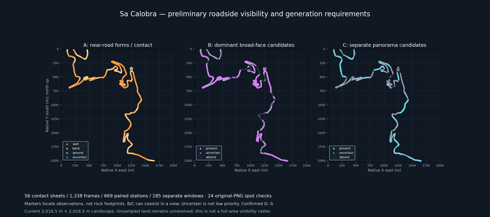

# Sa Calobra roadside visibility and detail prestudy — 2026-10-08

**Status:** preliminary AI screening of the complete captured survey, with 24 original-PNG spot checks. Physical mapping and owner review remain pending.

Authority: [World Building Bible](../../WORLD_BUILDING_BIBLE.md), [surface atlas](../../tooling/SA_CALOBRA_SURFACE_DETAIL_ATLAS.md). Work: [#445](https://github.com/karnalooch/YetAnotherCyclingSim/issues/445), [draft PR #446](https://github.com/karnalooch/YetAnotherCyclingSim/pull/446). Source: [retained TPP survey](../sa-calobra-tpp-survey-20261008/README.md). Street View is excluded; performance is not measured.

[Off-road whole-Landscape plan](off-road-plan.md) · [Generation guide: meshes, layers and existing work](generation-guide.md) · [Vector observation map](visibility-plan.svg) · [Interactive map/view review](review.html) · [669-row CSV](observations.csv) · [Full observation data](observations.json)

The static overview is readable on GitHub. Download `review.html` to switch A/B/C, zoom/pan and inspect any paired observation with its reason and near sides. Map/data work offline; unchanged remote JPEG previews require network access. GitHub shows HTML source rather than executing it. The [earlier six original-PNG cards](../sa-calobra-surface-detail-review-20261008/README.md) remain deeper examples.

## Beyond the road strip

The [whole-Landscape plan](off-road-plan.md) adds proposed macro/material coverage
across the entire current area, approximate owner-marked review sectors and two
unchanged original examples of off-road B/C forms. Empty observation-map space
is not empty terrain, automatic C or hidden D. Sector sketches are not surface
footprints, visibility extents or executable masks.

## What was actually inspected

Six agents visually inspected all 56 original contact sheets: 1,338 viewing aids / 669 forward-reverse pairs in 185 disconnected construction windows. Every pair has a separate preliminary record. They then inspected 24 selected original 1280 × 720 PNGs, verified against captured sizes and SHA-256 values, and corrected specific judgments where the originals resolved uncertainty. This does not claim inspection of all 1,338 original PNGs or human acceptance.

| Evidence requirement | Present / profile counts | Uncertain | Unsupported in sampled pair |
|---|---|---|---|
| A near profile | 487 wall; 176 bank; 5 ground/contact | 1 | Not a rock classification or a mapped footprint |
| B dominant readable broad face | 429 | 125 | 115 |
| C separate distant landform/panorama | 273 | 328 | 68 |
| D confirmed hidden | 0 | Coverage insufficient | No D inferred |

Counts overlap because a view can contain an A bank, B face and separate C ridge. They count observation requirements, not physical surfaces or area. B includes its own outline protection; C requires a separate distant landform, not sea/sky alone or the same B crest. `absent` means unsupported in that pair only. Uncertainty is preserved.

## How this changes generation planning

Near-road forms are widespread, but wall shaping and shallow-bank/contact treatment are different jobs. Do not run the accepted cliff recipe uniformly around every road. Broad readable slopes/rock faces often require B even across a valley; distance alone must not remove their large forms. C candidates can reduce fine interior detail only after checking whether the same surface is seen closer elsewhere.

The guide specifies what to generate and what may be omitted for A walls, A banks, B faces, C panoramas, D and unresolved coverage. It connects those requirements to existing Dynamic Mesh/v8 work, material masks, Landscape Edit Layers and a future bounded PCG/PCGEx handoff. It does not create a new consumer or alter the scene.

## Map meaning and limits

All maps cover the current 2,016.5 m × 2,016.5 m Landscape extent. Markers locate road observations; connecting lines are sampled traces within a single construction window. Gaps are never joined. Coloured dots do not locate cliffs, establish visibility depth or assign A/B/C to whole hills. Unsampled land is unresolved, not hidden D. No fixed-width buffer or field of view cone is treated as a visible surface footprint.

The contact screen is a coarse visual proposal. Small image aids cannot establish detailed defects, fine shape demands, material class, duration, camera clearance or occlusion across all allowed views. Look-around, stopping, other approaches and indirect shadow/reflection contributions remain unresolved. Raised near-side labels are image-local wall/bank observations, not flat shoulders, parapets or georegistered left/right treatment masks.

## Review provenance

[Exact source hashes](provenance.json) · [Original spot-check receipts and visual findings](original-spot-checks.json)

- [review-000-008.json](reviewers/review-000-008.json): 108 pairs, 9 sheets, four original checks.
- [review-009-017.json](reviewers/review-009-017.json): 108 pairs, 9 sheets, four original checks.
- [review-018-026.json](reviewers/review-018-026.json): 108 pairs, 9 sheets, four original checks.
- [review-027-035.json](reviewers/review-027-035.json): 108 pairs, 9 sheets, four original checks.
- [review-036-045.json](reviewers/review-036-045.json): 120 pairs, 10 sheets, four original checks.
- [review-046-055.json](reviewers/review-046-055.json): 117 pairs, 10 sheets, four original checks.

Captured CSV/template, source JPEGs/PNG archive, geometry, materials and accepted v8 are unchanged. Canonical `review_tags`, surface IDs and D assignments remain blank. Generated observation data is a separate proposal derivative; it is not an executable selector, complete world visibility raster or production acceptance.
