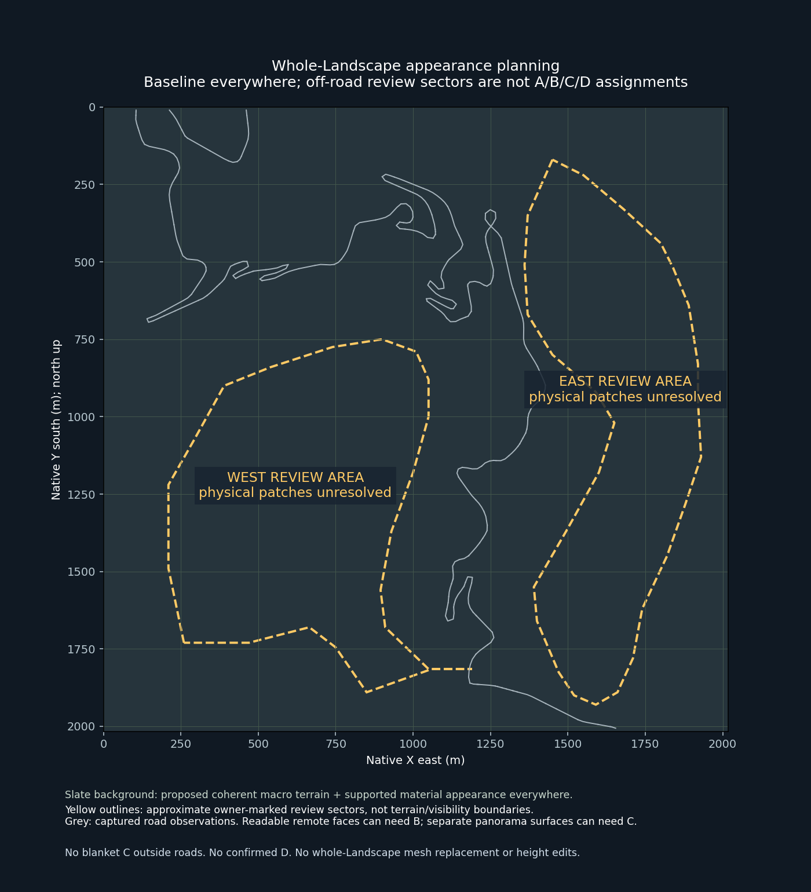
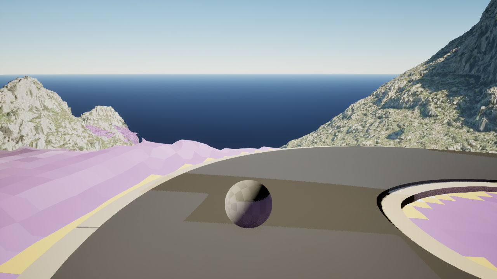
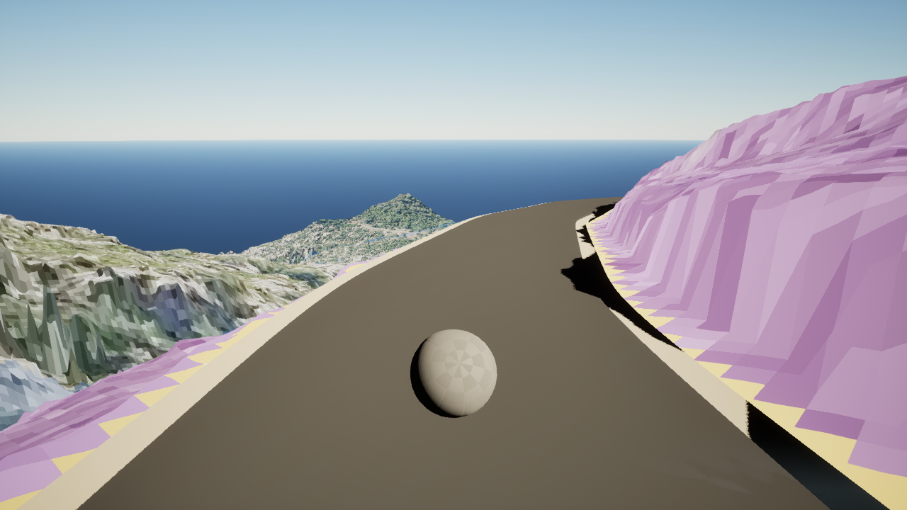

# Detail away from roads: the whole Landscape

[Full-survey review](README.md) · [Meshes and layers guide](generation-guide.md) · [World authority](../../WORLD_BUILDING_BIBLE.md)

**Status:** proposed whole-area appearance requirements; physical off-road patches still require registration. The owner's marked sectors are approximate review sketches, not classified regions.

[Review-sector data and limits](off-road-review-sectors.json). The slate background represents the planned coherent baseline across the current 2,016.5 × 2,016.5 m Landscape. It is not a vegetation class or a claim that all-area material work is accepted. Yellow envelopes approximate the owner's marked areas using the displayed map grid; they can include road edges and are not surveyed or registered surface boundaries.

## What the areas away from roads need

| Detail scale | Planned appearance | Where meshes or material layers belong |
|---|---|---|
| Macro terrain | Existing ridges, valleys, major slopes and source landform remain coherent everywhere | Preserve native Landscape / `Base_DTM`; no new height edits for detail priority |
| Broad material structure | Believable physical scale and broad variation, with rock/soil/ground-cover transitions where source evidence supports them | Existing material system plus semantic masks; a blank observation-map area is not a blank material area |
| Readable off-road outcrops — B | Major planes, ledges, recesses, characteristic fractures and their shading; protect outline | Justified owned rock-presentation patches and existing Dynamic Mesh foundations, only after footprint/eligibility review |
| Separate panorama — C | Skyline, large landform divisions, broad material pattern and coherent apparent scale | Keep macro Landscape; use only justified outline geometry, omit unsupported fine interior geometry after closer-view review |
| Fine surface appearance | Pores, grain and small roughness remain believable where discernible | Primarily material detail; no uniform tiny geometric cracks, micro-bevels or chips across hills |
| Later ground-cover dressing | Source-supported groups of vegetation, exposed rock and scree respecting natural boundaries and exclusions | Future gated dressing work; no uniform stones/grass scattered simply because land is away from the road |

A large wall across a valley can require B. Distance from asphalt does not decide the band. A nearby bank and a distant face can have different required detail scales, and the same face may be viewed close from another road. No fixed-width road strip or default C classification supplies that evidence.

## Two original examples of detail outside the road strip

### Large flank versus separate coastal ridge

Station 398 / `window-0110-forward-00001`: the broad right-hand mountain face has readable planes, recesses and outcrop bands requiring B attention. The separate coastal rocks on the left are a C candidate in this view: retain their outline and large divisions. Their finer treatment still depends on closer appearances. The near diagnostic-coloured bank/contact is a separate A observation. These image regions have not been assigned to either owner-marked map sector.

### Off-road face below the road and a distant ridge

Station 588 / `window-0163-reverse-00001`: the broad exposed terrain/rock face on the left needs readable large forms; the isolated central triangular ridge is a separate C candidate. The large near wall on the right requires A attention. Do not infer natural material classes from purple/yellow/blue diagnostics, nor infer GEO_FIX from dark areas.

Both PNGs are byte-identical originals from the retained capture; [hash and source receipt](off-road-originals.json). They illustrate treatment scales, not registered world footprints or accepted new material recipes.

## How to plan the marked areas

The west and east review sectors receive the same whole-area baseline requirement: source macro terrain, supported material appearance and coherent scale. Inside each, identify actual exposed-rock patches, dominant faces, skylines and supported ground-cover transitions. Register those patches against the scene/source owners and all relevant original views, then attach B/C/A requirements per surface and detail scale. Keep unresolved surfaces explicit.

Off-road material semantics remain governed by source evidence. The repository material-foundation configuration explicitly records presentation fallbacks and unverified limestone suitability; those settings do not prove current rock/soil/vegetation coverage or planting authority. This plan does not replace existing masks or classify natural cover from the capture colours.

Dynamic Mesh is for justified owned rock patches, building on accepted local v8 work. It does not turn the whole Landscape into a high-detail mesh or authorize shaping every mountain. Maintain one visible ground owner and protected interfaces. `Base_DTM` and `Road_Earthworks` keep their existing responsibilities; material/detail masks are separate from height Edit Layers.

D remains unconfirmed. Empty space on an observation map means missing physical registration, not invisible land. Hidden-surface finishing may be reduced only after camera/access coverage and indirect contributions are reviewed. Unknown areas retain their existing geometry and baseline appearance; they receive no inferred simplification.
