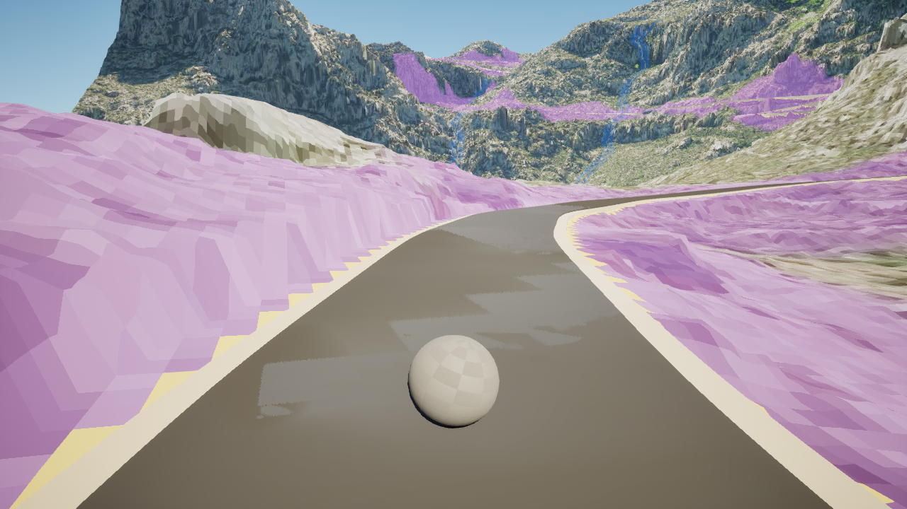
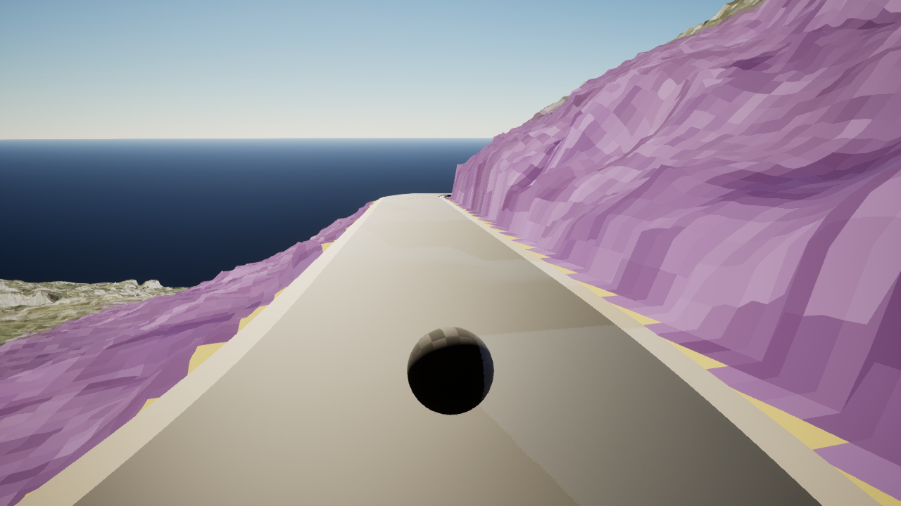
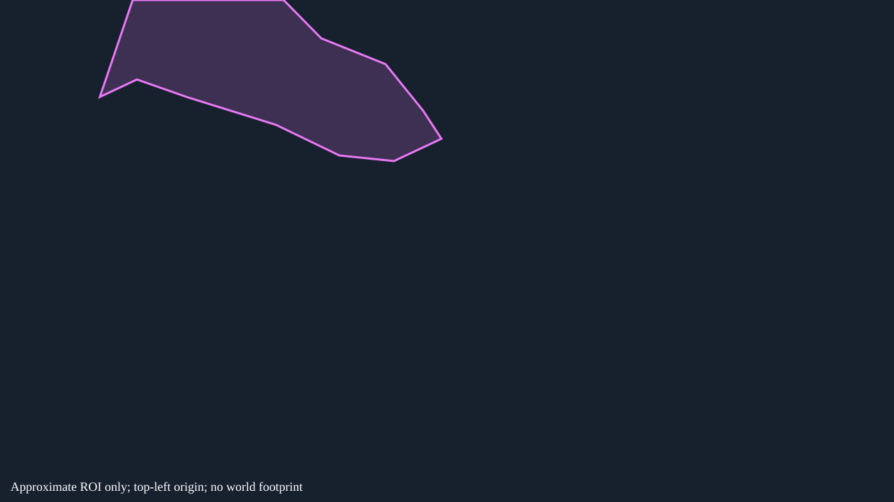

# SC-P02 — Dominant massif above a separate close bank

[Review index](../README.md) | [Atlas contract](../../../tooling/SA_CALOBRA_SURFACE_DETAIL_ATLAS.md)

**AI_PROPOSED · owner review PENDING · physical identity PROVISIONAL · world mapping UNRESOLVED**  
Window 0132, local station 33.35227 m; not route chainage. `surface_id`, canonical `review_tags` and patch relationships remain unassigned.

## Original evidence

The upper-left massif has a strong outline and readable broad faces. The lower close bank is a separate requirement. The paired forward wall does not establish a match to this massif.

Anchor: `window-0132-reverse-00004` (reverse, 1280 × 720).

Paired station context: `window-0132-forward-00002` (forward). **Correspondence: context_only**; this does not establish the same physical surface.

## Proposed treatment

| Region | Band | Proposed tags | Required detail | Candidate omissions |
|---|---|---|---|---|
| Upper-left massif | B | SILHOUETTE_CRITICAL | Characteristic outline, broad planes, shelves and large divisions; retain the shape that produces major shading. | Uniform pores and small geometric chips are unsupported in this view. The summit is clipped by the frame; its unseen continuation remains unresolved. |

## Approximate observation boundary

The following separate vector diagram marks an image ROI on the anchor, not a segmentation mask, physical boundary or PCGEx selector. Coordinates use unchanged 1280 × 720 pixels, top-left origin, x right/y down. Frame-edge truncation and intervening road/ground leave geometry unresolved.

**Upper-left massif (B):** `[[190,0],[406,0],[460,55],[552,92],[606,159],[632,199],[564,231],[486,223],[395,179],[270,140],[196,114],[143,139]]`

## Google Street View reference

Both requested views are **NOT_INSPECTED**. Interactive panoramas could not be opened through the available web tool. No actual pano ID, imagery date, camera match or visual comparison is recorded. The link may select the nearest available panorama; it does not prove coverage.

[Anchor direction](https://www.google.com/maps/@?api=1&map_action=pano&viewpoint=39.8342444%2C2.8036271&heading=106.246&pitch=-3.788&fov=76) · [Paired direction](https://www.google.com/maps/@?api=1&map_action=pano&viewpoint=39.8342444%2C2.8036271&heading=286.246&pitch=-11.939&fov=76)

The request uses the road station; heading/pitch are orientation hints copied from the displaced native camera, not matched rays from the eventual panorama. The requested 76° FOV is not verified panorama calibration. The capture target is not the ROI surface position. Coordinate provenance and camera offset are in [proposal data](../surface-proposals.json). Compare landform outline, exposed rock forms, road-side contact and broad rock/soil/vegetation distribution after recording the actual panorama/date; temporary vegetation, lighting and capture materials can differ.

## Remaining review

Resolve physical ownership and matching appearances before defining a world footprint. Review closer views, other roads, look-around and indirect shadow/reflection contribution. No confirmed D surface, GEO_FIX or BACKGROUND_LOW_PRIORITY assignment is supported here. Human confirmation is required before populating the original review annotation fields.

Original anchor SHA-256: `3d9dda78d5e449e80ec77acd850a16d679a91a2d4df947c0d237e57ac805c5ac`. Paired SHA-256: `67cd9c6a5f20228cb1c75858d0e991d97cfc6a01e55198742265d119d541cb82`. [Complete provenance](../manifest.json).
