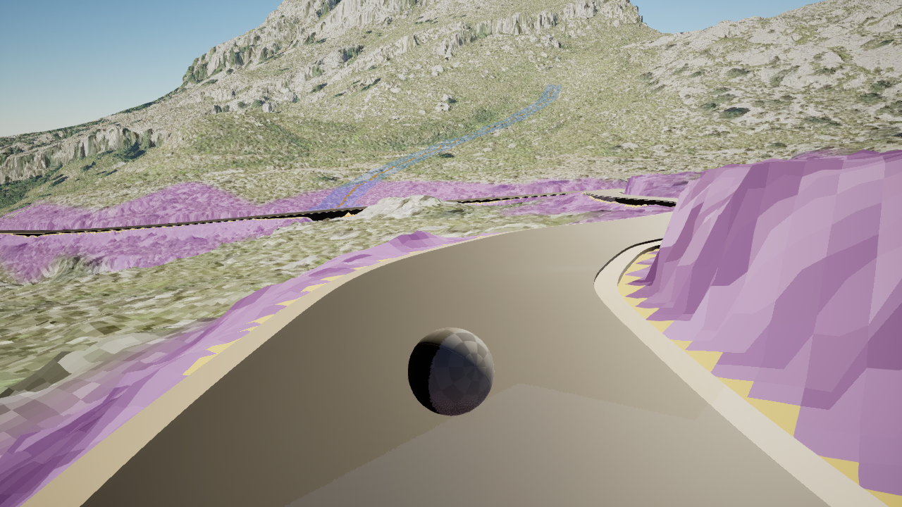
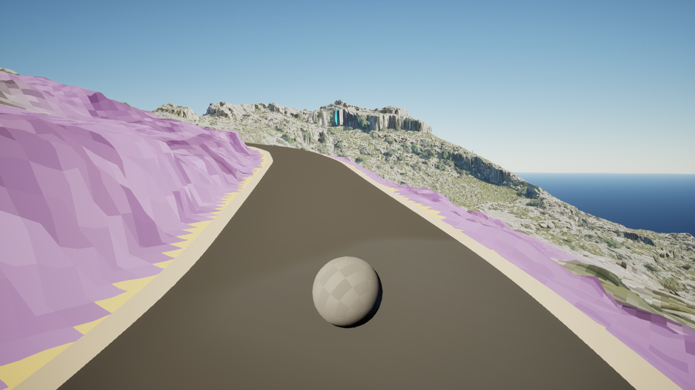
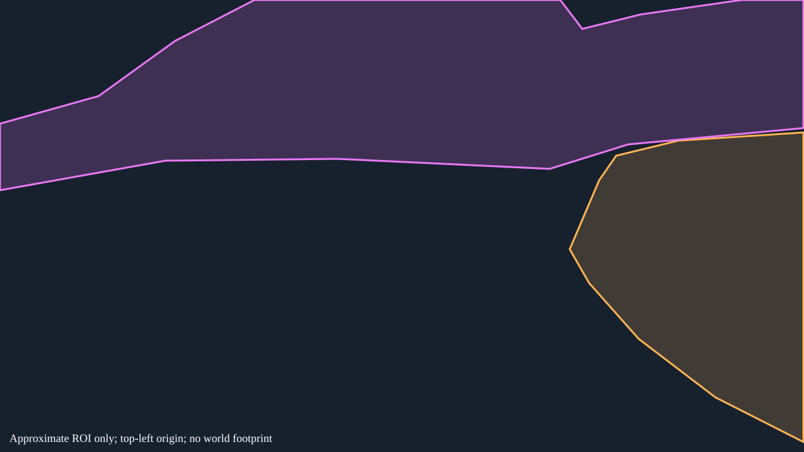

# SC-P03 — Close rock and broad slope need different scales

[Review index](../README.md) | [Atlas contract](../../../tooling/SA_CALOBRA_SURFACE_DETAIL_ATLAS.md)

**AI_PROPOSED · owner review PENDING · physical identity PROVISIONAL · world mapping UNRESOLVED**  
Window 0168, local station 30.99233 m; not route chainage. `surface_id`, canonical `review_tags` and patch relationships remain unassigned.

## Original evidence

A close right bank contrasts with a large upper slope and visible other road approaches. Opposing near-wall observations may be adjacent, but no shared bounded surface has been identified.

Anchor: `window-0168-reverse-00001` (reverse, 1280 × 720).

Paired station context: `window-0168-forward-00002` (forward). **Correspondence: possible_match**; this does not establish the same physical surface.

## Proposed treatment

| Region | Band | Proposed tags | Required detail | Candidate omissions |
|---|---|---|---|---|
| Near right bank | A | HERO_DETAIL;MATERIAL_TEST_CANDIDATE | Readable corners, plane changes, bank top/base transitions and coherent rock material scale. | Use materials for grain and microcracks; retain the visible bank shape. |
| Broad upper slope | B | MATERIAL_TEST_CANDIDATE | Broad landform, outcrop bands, ledges and spatial material variation. Review the additional road approaches before any downgrade. | Do not spread near-bank microrelief uniformly across the slope; diagnostic colours do not identify rock, soil or vegetation. |

## Approximate observation boundary

The following separate vector diagram marks an image ROI on the anchor, not a segmentation mask, physical boundary or PCGEx selector. Coordinates use unchanged 1280 × 720 pixels, top-left origin, x right/y down. Frame-edge truncation and intervening road/ground leave geometry unresolved.

**Near right bank (A):** `[[981,248],[1080,224],[1279,211],[1279,704],[1139,633],[1017,540],[938,451],[907,397],[954,287]]`

**Broad upper slope (B):** `[[0,197],[157,153],[279,65],[405,0],[892,0],[927,46],[1020,23],[1180,0],[1279,0],[1279,204],[1000,230],[875,269],[537,253],[263,256],[0,303]]`

## Google Street View reference

Both requested views are **NOT_INSPECTED**. Interactive panoramas could not be opened through the available web tool. No actual pano ID, imagery date, camera match or visual comparison is recorded. The link may select the nearest available panorama; it does not prove coverage.

[Anchor direction](https://www.google.com/maps/@?api=1&map_action=pano&viewpoint=39.8252659%2C2.8165108&heading=234.968&pitch=-11.890&fov=76) · [Paired direction](https://www.google.com/maps/@?api=1&map_action=pano&viewpoint=39.8252659%2C2.8165108&heading=54.968&pitch=-3.838&fov=76)

The request uses the road station; heading/pitch are orientation hints copied from the displaced native camera, not matched rays from the eventual panorama. The requested 76° FOV is not verified panorama calibration. The capture target is not the ROI surface position. Coordinate provenance and camera offset are in [proposal data](../surface-proposals.json). Compare landform outline, exposed rock forms, road-side contact and broad rock/soil/vegetation distribution after recording the actual panorama/date; temporary vegetation, lighting and capture materials can differ.

## Remaining review

Resolve physical ownership and matching appearances before defining a world footprint. Review closer views, other roads, look-around and indirect shadow/reflection contribution. No confirmed D surface, GEO_FIX or BACKGROUND_LOW_PRIORITY assignment is supported here. Human confirmation is required before populating the original review annotation fields.

Original anchor SHA-256: `fd042cfae53662ea4a713c7d861c1b2eee81f723713b6acebeec7ce69605865e`. Paired SHA-256: `ab81cd6eae3922a497e1752c0cb91a8c5e2a50c1414aeec796cee5b340424e59`. [Complete provenance](../manifest.json).
