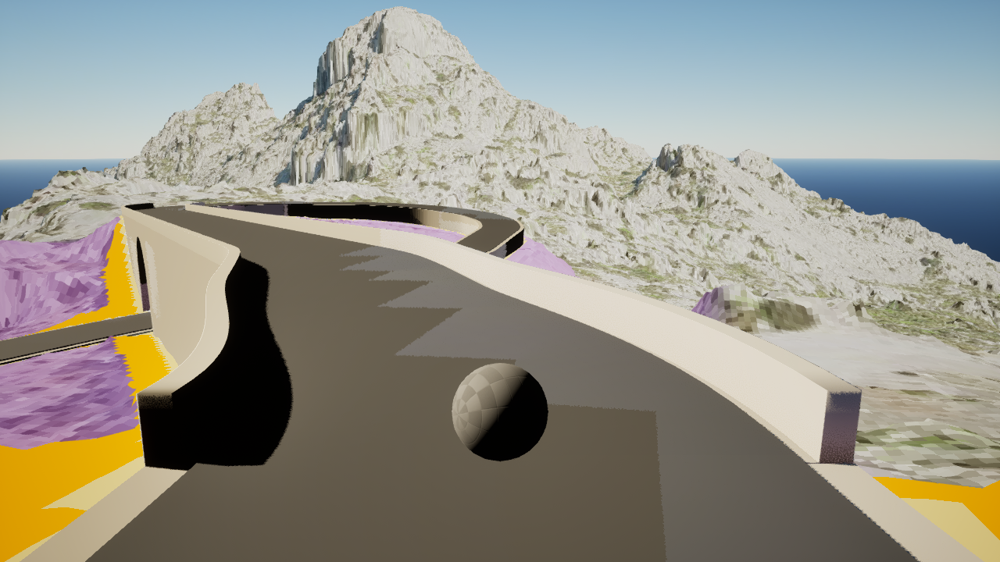
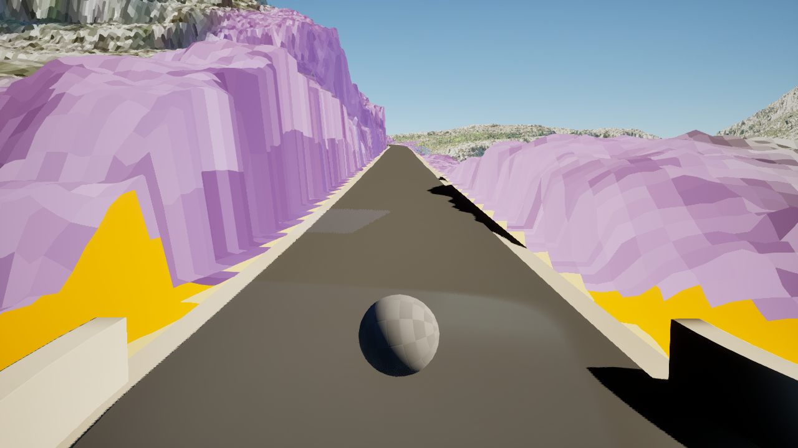
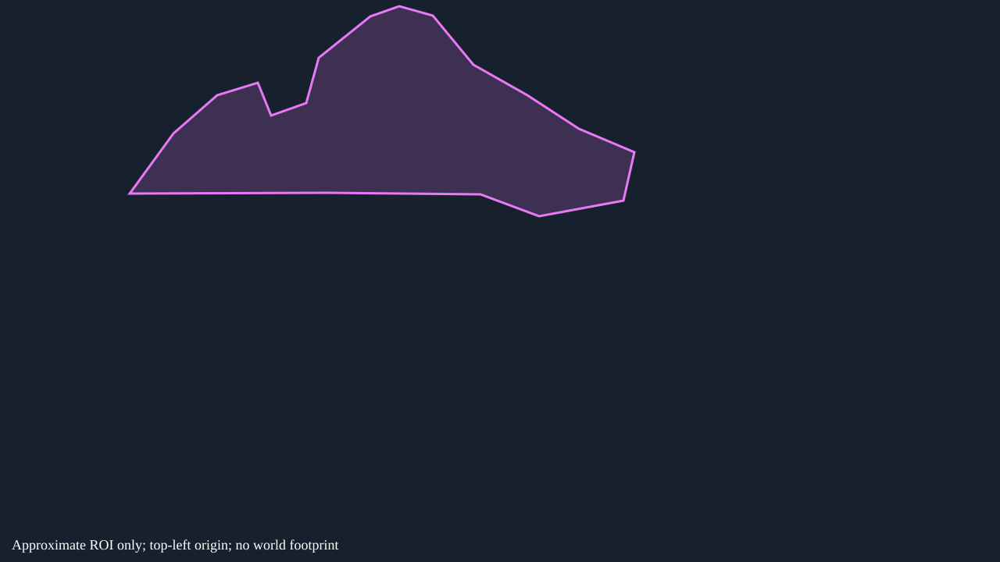

# SC-P04 — Dominant peak: protect faces as well as skyline

[Review index](../README.md) | [Atlas contract](../../../tooling/SA_CALOBRA_SURFACE_DETAIL_ATLAS.md)

**AI_PROPOSED · owner review PENDING · physical identity PROVISIONAL · world mapping UNRESOLVED**  
Window 0181, local station 68.80546 m; not route chainage. `surface_id`, canonical `review_tags` and patch relationships remain unassigned.

## Original evidence

Original pixels support B rather than the JPEG shortlist C proposal: the peak dominates the composition and its broad faces and ledges remain readable. The reverse close wall is a different region.

Anchor: `window-0181-forward-00004` (forward, 1280 × 720).

Paired station context: `window-0181-reverse-00000` (reverse). **Correspondence: context_only**; this does not establish the same physical surface.

## Proposed treatment

| Region | Band | Proposed tags | Required detail | Candidate omissions |
|---|---|---|---|---|
| Central peak | B | SILHOUETTE_CRITICAL | Skyline, characteristic large cuts, broad faces and ledges; preserve forms responsible for major shading. | Uniform fine cracks and pores are unsupported. Skyline-only treatment would omit readable faces; closer views remain unresolved. |

## Approximate observation boundary

The following separate vector diagram marks an image ROI on the anchor, not a segmentation mask, physical boundary or PCGEx selector. Coordinates use unchanged 1280 × 720 pixels, top-left origin, x right/y down. Frame-edge truncation and intervening road/ground leave geometry unresolved.

**Central peak (B):** `[[166,248],[222,171],[278,122],[330,106],[347,148],[392,132],[408,74],[474,21],[511,8],[554,20],[606,83],[675,122],[741,165],[812,195],[798,257],[690,277],[615,249],[418,247]]`

## Google Street View reference

Both requested views are **NOT_INSPECTED**. Interactive panoramas could not be opened through the available web tool. No actual pano ID, imagery date, camera match or visual comparison is recorded. The link may select the nearest available panorama; it does not prove coverage.

[Anchor direction](https://www.google.com/maps/@?api=1&map_action=pano&viewpoint=39.8316978%2C2.8163459&heading=347.324&pitch=-11.789&fov=76) · [Paired direction](https://www.google.com/maps/@?api=1&map_action=pano&viewpoint=39.8316978%2C2.8163459&heading=167.324&pitch=-3.941&fov=76)

The request uses the road station; heading/pitch are orientation hints copied from the displaced native camera, not matched rays from the eventual panorama. The requested 76° FOV is not verified panorama calibration. The capture target is not the ROI surface position. Coordinate provenance and camera offset are in [proposal data](../surface-proposals.json). Compare landform outline, exposed rock forms, road-side contact and broad rock/soil/vegetation distribution after recording the actual panorama/date; temporary vegetation, lighting and capture materials can differ.

## Remaining review

Resolve physical ownership and matching appearances before defining a world footprint. Review closer views, other roads, look-around and indirect shadow/reflection contribution. No confirmed D surface, GEO_FIX or BACKGROUND_LOW_PRIORITY assignment is supported here. Human confirmation is required before populating the original review annotation fields.

Original anchor SHA-256: `7902948733c046275e15952ab804c7c01146fda253aa074a378f6bb24d125d5d`. Paired SHA-256: `b2611a66f7fb2c18b81d9ad652fb9b9fe61b6364af0ac0c33ee1e56c65abba83`. [Complete provenance](../manifest.json).
