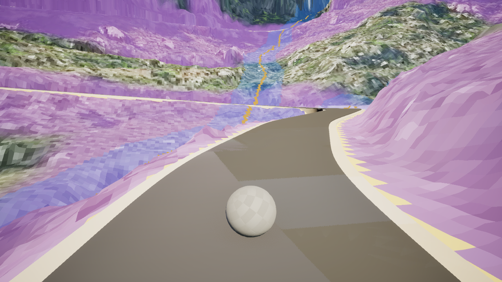
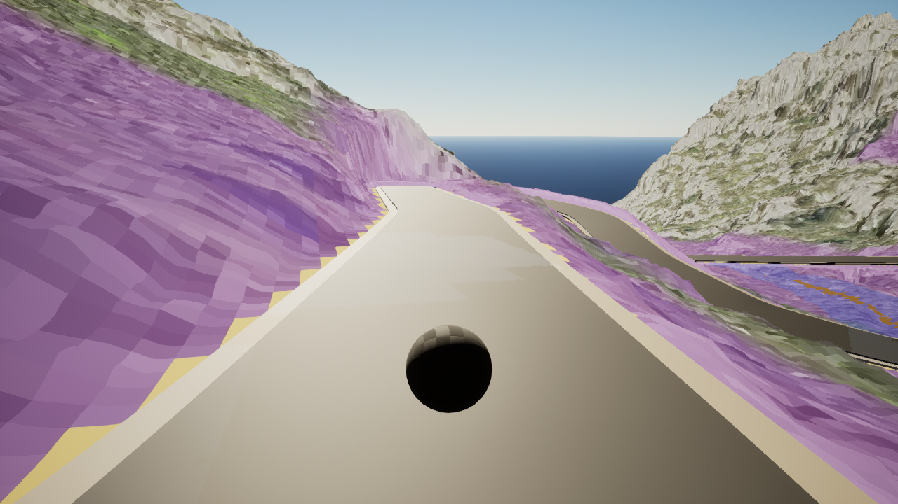
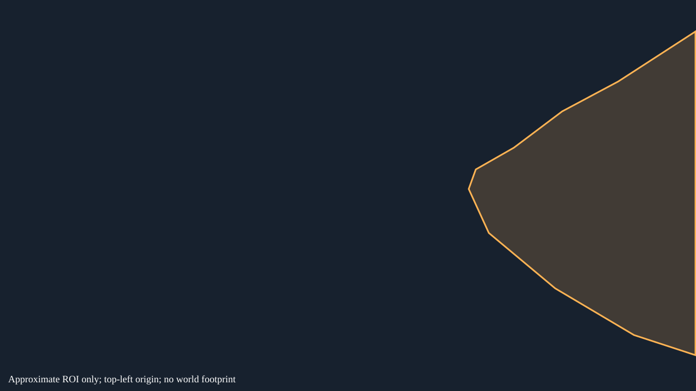

# SC-P05 — Near bank and distant slope: preserve transitions

[Review index](../README.md) | [Atlas contract](../../../tooling/SA_CALOBRA_SURFACE_DETAIL_ATLAS.md)

**AI_PROPOSED · owner review PENDING · physical identity PROVISIONAL · world mapping UNRESOLVED**  
Window 0039, local station 59.81688 m; not route chainage. `surface_id`, canonical `review_tags` and patch relationships remain unassigned.

## Original evidence

The near right bank requires readable shape and road-ground contact. The upper textured slope and visible other road approaches prevent a blanket background classification.

Anchor: `window-0039-reverse-00002` (reverse, 1280 × 720).

Paired station context: `window-0039-forward-00003` (forward). **Correspondence: possible_match**; this does not establish the same physical surface.

## Proposed treatment

| Region | Band | Proposed tags | Required detail | Candidate omissions |
|---|---|---|---|---|
| Near right bank | A | HERO_DETAIL;MATERIAL_TEST_CANDIDATE | Larger planes, convex changes, road-side contact and the transition into upper ground. Keep grain at a believable material scale. | Do not model repeated tiny chips unless they change readable shape. The coloured central strip does not establish a stream or material class. |

## Approximate observation boundary

The following separate vector diagram marks an image ROI on the anchor, not a segmentation mask, physical boundary or PCGEx selector. Coordinates use unchanged 1280 × 720 pixels, top-left origin, x right/y down. Frame-edge truncation and intervening road/ground leave geometry unresolved.

**Near right bank (A):** `[[1279,58],[1137,150],[1034,205],[945,272],[875,312],[862,348],[899,429],[1021,531],[1166,617],[1279,654]]`

## Historical Google Street View reference

**Excluded from current scope by owner.** These retained links are not a prerequisite for the [detail planning map](../../sa-calobra-detail-planning-map-20261008/README.md).

Both requested views are **NOT_INSPECTED**. Interactive panoramas could not be opened through the available web tool. No actual pano ID, imagery date, camera match or visual comparison is recorded. The link may select the nearest available panorama; it does not prove coverage.

[Anchor direction](https://www.google.com/maps/@?api=1&map_action=pano&viewpoint=39.8318844%2C2.8131714&heading=103.465&pitch=-3.538&fov=76) · [Paired direction](https://www.google.com/maps/@?api=1&map_action=pano&viewpoint=39.8318844%2C2.8131714&heading=283.465&pitch=-12.184&fov=76)

The request uses the road station; heading/pitch are orientation hints copied from the displaced native camera, not matched rays from the eventual panorama. The requested 76° FOV is not verified panorama calibration. The capture target is not the ROI surface position. Coordinate provenance and camera offset are in [proposal data](../surface-proposals.json). Compare landform outline, exposed rock forms, road-side contact and broad rock/soil/vegetation distribution after recording the actual panorama/date; temporary vegetation, lighting and capture materials can differ.

## Remaining review

Resolve physical ownership and matching appearances before defining a world footprint. Review closer views, other roads, look-around and indirect shadow/reflection contribution. No confirmed D surface, GEO_FIX or BACKGROUND_LOW_PRIORITY assignment is supported here. Human confirmation is required before populating the original review annotation fields.

Original anchor SHA-256: `c5bf064b66340b5ab0d580a02de8d407af9e30277459208bf2fa30dac8a8bdc0`. Paired SHA-256: `893046ab1e1bfb77a0efa69476d2cf3eaf2ac63106637831783c60c374770bf3`. [Complete provenance](../manifest.json).
