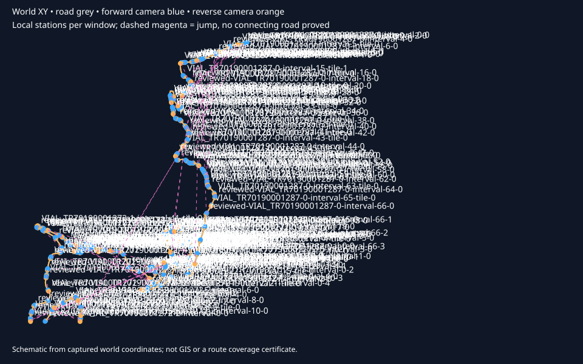

# Sa Calobra: captured bidirectional TPP survey

This directory contains actual viewing material from the completed sampled TPP survey of the accepted cliff presentation. It preserves the captured appearance and does not change terrain, roads or materials.

- Capture revision: `b1ea05b33b9f3208e7aeb6884f1a67792d9c6121`.
- Native capture run: [37800814004](https://github.com/karnalooch/YetAnotherCyclingSim/actions/runs/37800814004), attempt 1.
- Coverage: **1338 native frames, 185 disconnected construction windows, 669 forward/reverse station pairs**.
- Capture and restoration: technically validated. Visual review: **PENDING_REVIEW**. Performance: **NOT_MEASURED**.
- Accepted cliff implementation: `4f2cba560d54931dc8ba080370d96a7aad24f15b`; recipe `rounded-limestone-reshape-v8`.

Start with the [contact sheets](contact-sheets.md), then open a window below to compare both directions. Click any thumbnail to view its copied JPEG. Full-resolution PNGs, per-frame loading/mip receipts, and the complete offline HTML review are retained in the [original evidence ZIP](../component230-cliff/evidence/retained-37800814004.zip) through Git LFS.

After hydrating and extracting that ZIP, open `terrain-erosion-mesh/tpp-survey/review/index.html`. Original frame paths in the tables and CSV are relative to `terrain-erosion-mesh/tpp-survey/` inside the ZIP.

The map uses captured world XY coordinates. Blue/orange tracks show the two camera directions; dashed magenta segments indicate jumps between disconnected windows. Local metres reset per window. The samples do not prove continuous cycling, route-physics chainage, camera clearance, full-area network coverage, or a runtime FPS result.

[Frame index](frames.csv) · [Surface review template](surface-review-template.csv) · [Original review guide](review-guide.txt) · [Export and source hashes](manifest.json)

Surface annotations need a stable `surface_id`, a reason, and an original evidence frame. Multiple tags can describe one surface: `GEO_FIX`, `SILHOUETTE_CRITICAL`, `HERO_DETAIL`, `BACKGROUND_LOW_PRIORITY`, `MATERIAL_TEST_CANDIDATE`. The captured template keeps tags blank until human review. A tag does not authorize automatic geometry changes.

This is an inspection evidence entry, with no fabricated BEFORE/AFTER panels and no new visual acceptance. The accepted cliff appearance remains the baseline. The original ZIP is unchanged: SHA-256 `f9ad39ae59a16dc1fc4615ef10ca950096a94d443bea4dcb0e624284000a0cab`, 1609577808 bytes.

## Window pairs

| Window | Source ID | Station pairs | Local length |
| --- | --- | --- | --- |
| [1](windows/window-0000.md) | `VIAL_TR70190001272-0-interval-0-tile-0` | 3 | 20.94 m |
| [2](windows/window-0001.md) | `VIAL_TR70190001272-0-interval-10-tile-0` | 2 | 5.42 m |
| [3](windows/window-0002.md) | `VIAL_TR70190001272-0-interval-12-tile-0` | 2 | 19.33 m |
| [4](windows/window-0003.md) | `VIAL_TR70190001272-0-interval-14-tile-0` | 5 | 68.95 m |
| [5](windows/window-0004.md) | `VIAL_TR70190001272-0-interval-16-tile-0` | 4 | 42.67 m |
| [6](windows/window-0005.md) | `VIAL_TR70190001272-0-interval-18-tile-0` | 4 | 46.74 m |
| [7](windows/window-0006.md) | `VIAL_TR70190001272-0-interval-2-tile-0` | 2 | 15.02 m |
| [8](windows/window-0007.md) | `VIAL_TR70190001272-0-interval-4-tile-0` | 2 | 5.50 m |
| [9](windows/window-0008.md) | `VIAL_TR70190001272-0-interval-6-tile-0` | 2 | 15.20 m |
| [10](windows/window-0009.md) | `VIAL_TR70190001272-1-interval-1-tile-0` | 5 | 65.13 m |
| [11](windows/window-0010.md) | `VIAL_TR70190001272-1-interval-11-tile-0` | 2 | 12.44 m |
| [12](windows/window-0011.md) | `VIAL_TR70190001272-1-interval-13-tile-0` | 3 | 20.68 m |
| [13](windows/window-0012.md) | `VIAL_TR70190001272-1-interval-15-tile-0` | 7 | 100.25 m |
| [14](windows/window-0013.md) | `VIAL_TR70190001272-1-interval-15-tile-1` | 6 | 88.12 m |
| [15](windows/window-0014.md) | `VIAL_TR70190001272-1-interval-17-tile-0` | 3 | 26.52 m |
| [16](windows/window-0015.md) | `VIAL_TR70190001272-1-interval-19-tile-0` | 4 | 53.66 m |
| [17](windows/window-0016.md) | `VIAL_TR70190001272-1-interval-21-tile-0` | 2 | 2.48 m |
| [18](windows/window-0017.md) | `VIAL_TR70190001272-1-interval-25-tile-0` | 5 | 75.83 m |
| [19](windows/window-0018.md) | `VIAL_TR70190001272-1-interval-27-tile-0` | 2 | 2.00 m |
| [20](windows/window-0019.md) | `VIAL_TR70190001272-1-interval-29-tile-0` | 2 | 13.53 m |
| [21](windows/window-0020.md) | `VIAL_TR70190001272-1-interval-3-tile-0` | 2 | 7.01 m |
| [22](windows/window-0021.md) | `VIAL_TR70190001272-1-interval-31-tile-0` | 6 | 97.99 m |
| [23](windows/window-0022.md) | `VIAL_TR70190001272-1-interval-31-tile-1` | 3 | 25.40 m |
| [24](windows/window-0023.md) | `VIAL_TR70190001272-1-interval-33-tile-0` | 5 | 61.75 m |
| [25](windows/window-0024.md) | `VIAL_TR70190001272-1-interval-35-tile-0` | 2 | 11.52 m |
| [26](windows/window-0025.md) | `VIAL_TR70190001272-1-interval-37-tile-0` | 3 | 32.00 m |
| [27](windows/window-0026.md) | `VIAL_TR70190001272-1-interval-39-tile-0` | 3 | 38.52 m |
| [28](windows/window-0027.md) | `VIAL_TR70190001272-1-interval-41-tile-0` | 4 | 47.15 m |
| [29](windows/window-0028.md) | `VIAL_TR70190001272-1-interval-43-tile-0` | 2 | 3.50 m |
| [30](windows/window-0029.md) | `VIAL_TR70190001272-1-interval-45-tile-0` | 2 | 3.98 m |
| [31](windows/window-0030.md) | `VIAL_TR70190001272-1-interval-47-tile-0` | 3 | 21.28 m |
| [32](windows/window-0031.md) | `VIAL_TR70190001272-1-interval-49-tile-0` | 2 | 2.51 m |
| [33](windows/window-0032.md) | `VIAL_TR70190001272-1-interval-5-tile-0` | 2 | 6.51 m |
| [34](windows/window-0033.md) | `VIAL_TR70190001272-1-interval-51-tile-0` | 2 | 1.50 m |
| [35](windows/window-0034.md) | `VIAL_TR70190001272-1-interval-53-tile-0` | 2 | 16.05 m |
| [36](windows/window-0035.md) | `VIAL_TR70190001272-1-interval-55-tile-0` | 6 | 83.98 m |
| [37](windows/window-0036.md) | `VIAL_TR70190001272-1-interval-57-tile-0` | 2 | 10.53 m |
| [38](windows/window-0037.md) | `VIAL_TR70190001272-1-interval-59-tile-0` | 2 | 11.01 m |
| [39](windows/window-0038.md) | `VIAL_TR70190001272-1-interval-7-tile-0` | 2 | 1.00 m |
| [40](windows/window-0039.md) | `VIAL_TR70190001272-1-interval-9-tile-0` | 6 | 99.69 m |
| [41](windows/window-0040.md) | `VIAL_TR70190001272-1-interval-9-tile-1` | 2 | 17.01 m |
| [42](windows/window-0041.md) | `VIAL_TR70190001272-2-interval-1-tile-0` | 3 | 21.53 m |
| [43](windows/window-0042.md) | `VIAL_TR70190001272-2-interval-3-tile-0` | 6 | 84.65 m |
| [44](windows/window-0043.md) | `VIAL_TR70190001272-2-interval-5-tile-0` | 3 | 28.73 m |
| [45](windows/window-0044.md) | `VIAL_TR70190001272-2-interval-7-tile-0` | 4 | 59.66 m |
| [46](windows/window-0045.md) | `VIAL_TR70190001272-2-interval-9-tile-0` | 3 | 25.60 m |
| [47](windows/window-0046.md) | `VIAL_TR70190001287-0-interval-1-tile-0` | 2 | 5.00 m |
| [48](windows/window-0047.md) | `VIAL_TR70190001287-0-interval-11-tile-0` | 2 | 7.52 m |
| [49](windows/window-0048.md) | `VIAL_TR70190001287-0-interval-13-tile-0` | 2 | 5.02 m |
| [50](windows/window-0049.md) | `VIAL_TR70190001287-0-interval-15-tile-0` | 6 | 99.76 m |
| [51](windows/window-0050.md) | `VIAL_TR70190001287-0-interval-15-tile-1` | 4 | 48.13 m |
| [52](windows/window-0051.md) | `VIAL_TR70190001287-0-interval-17-tile-0` | 3 | 37.26 m |
| [53](windows/window-0052.md) | `VIAL_TR70190001287-0-interval-19-tile-0` | 2 | 2.01 m |
| [54](windows/window-0053.md) | `VIAL_TR70190001287-0-interval-21-tile-0` | 7 | 100.19 m |
| [55](windows/window-0054.md) | `VIAL_TR70190001287-0-interval-21-tile-1` | 4 | 56.87 m |
| [56](windows/window-0055.md) | `VIAL_TR70190001287-0-interval-23-tile-0` | 5 | 67.09 m |
| [57](windows/window-0056.md) | `VIAL_TR70190001287-0-interval-25-tile-0` | 6 | 98.98 m |
| [58](windows/window-0057.md) | `VIAL_TR70190001287-0-interval-25-tile-1` | 2 | 2.51 m |
| [59](windows/window-0058.md) | `VIAL_TR70190001287-0-interval-27-tile-0` | 2 | 6.02 m |
| [60](windows/window-0059.md) | `VIAL_TR70190001287-0-interval-29-tile-0` | 4 | 42.13 m |
| [61](windows/window-0060.md) | `VIAL_TR70190001287-0-interval-3-tile-0` | 5 | 67.04 m |
| [62](windows/window-0061.md) | `VIAL_TR70190001287-0-interval-31-tile-0` | 2 | 3.50 m |
| [63](windows/window-0062.md) | `VIAL_TR70190001287-0-interval-33-tile-0` | 4 | 48.33 m |
| [64](windows/window-0063.md) | `VIAL_TR70190001287-0-interval-35-tile-0` | 2 | 1.00 m |
| [65](windows/window-0064.md) | `VIAL_TR70190001287-0-interval-37-tile-0` | 2 | 17.55 m |
| [66](windows/window-0065.md) | `VIAL_TR70190001287-0-interval-39-tile-0` | 2 | 17.95 m |
| [67](windows/window-0066.md) | `VIAL_TR70190001287-0-interval-41-tile-0` | 2 | 4.51 m |
| [68](windows/window-0067.md) | `VIAL_TR70190001287-0-interval-43-tile-0` | 5 | 78.70 m |
| [69](windows/window-0068.md) | `VIAL_TR70190001287-0-interval-45-tile-0` | 4 | 42.89 m |
| [70](windows/window-0069.md) | `VIAL_TR70190001287-0-interval-49-tile-0` | 2 | 8.01 m |
| [71](windows/window-0070.md) | `VIAL_TR70190001287-0-interval-5-tile-0` | 3 | 39.07 m |
| [72](windows/window-0071.md) | `VIAL_TR70190001287-0-interval-51-tile-0` | 4 | 42.60 m |
| [73](windows/window-0072.md) | `VIAL_TR70190001287-0-interval-53-tile-0` | 2 | 1.50 m |
| [74](windows/window-0073.md) | `VIAL_TR70190001287-0-interval-55-tile-0` | 2 | 10.53 m |
| [75](windows/window-0074.md) | `VIAL_TR70190001287-0-interval-57-tile-0` | 2 | 13.51 m |
| [76](windows/window-0075.md) | `VIAL_TR70190001287-0-interval-59-tile-0` | 2 | 7.02 m |
| [77](windows/window-0076.md) | `VIAL_TR70190001287-0-interval-61-tile-0` | 2 | 18.51 m |
| [78](windows/window-0077.md) | `VIAL_TR70190001287-0-interval-63-tile-0` | 3 | 25.36 m |
| [79](windows/window-0078.md) | `VIAL_TR70190001287-0-interval-65-tile-0` | 5 | 68.80 m |
| [80](windows/window-0079.md) | `VIAL_TR70190001287-0-interval-7-tile-0` | 2 | 3.51 m |
| [81](windows/window-0080.md) | `VIAL_TR70190001287-0-interval-9-tile-0` | 2 | 14.04 m |
| [82](windows/window-0081.md) | `accepted-hairpin` | 17 | 307.73 m |
| [83](windows/window-0082.md) | `nudo-0` | 6 | 99.86 m |
| [84](windows/window-0083.md) | `nudo-1` | 6 | 99.94 m |
| [85](windows/window-0084.md) | `nudo-2` | 2 | 8.01 m |
| [86](windows/window-0085.md) | `reviewed-VIAL_TR70190001272-0-interval-1-0` | 3 | 35.97 m |
| [87](windows/window-0086.md) | `reviewed-VIAL_TR70190001272-0-interval-11-0` | 6 | 83.86 m |
| [88](windows/window-0087.md) | `reviewed-VIAL_TR70190001272-0-interval-13-0` | 2 | 9.50 m |
| [89](windows/window-0088.md) | `reviewed-VIAL_TR70190001272-0-interval-15-0` | 4 | 42.14 m |
| [90](windows/window-0089.md) | `reviewed-VIAL_TR70190001272-0-interval-17-0` | 2 | 8.82 m |
| [91](windows/window-0090.md) | `reviewed-VIAL_TR70190001272-0-interval-19-0` | 4 | 43.14 m |
| [92](windows/window-0091.md) | `reviewed-VIAL_TR70190001272-0-interval-3-0` | 5 | 78.57 m |
| [93](windows/window-0092.md) | `reviewed-VIAL_TR70190001272-0-interval-5-0` | 3 | 21.03 m |
| [94](windows/window-0093.md) | `reviewed-VIAL_TR70190001272-0-interval-7-0` | 2 | 9.93 m |
| [95](windows/window-0094.md) | `reviewed-VIAL_TR70190001272-0-interval-8-0` | 4 | 49.39 m |
| [96](windows/window-0095.md) | `reviewed-VIAL_TR70190001272-0-interval-9-0` | 2 | 9.77 m |
| [97](windows/window-0096.md) | `reviewed-VIAL_TR70190001272-1-interval-0-0` | 7 | 100.06 m |
| [98](windows/window-0097.md) | `reviewed-VIAL_TR70190001272-1-interval-0-1` | 7 | 100.18 m |
| [99](windows/window-0098.md) | `reviewed-VIAL_TR70190001272-1-interval-0-2` | 7 | 100.04 m |
| [100](windows/window-0099.md) | `reviewed-VIAL_TR70190001272-1-interval-0-3` | 7 | 100.20 m |
| [101](windows/window-0100.md) | `reviewed-VIAL_TR70190001272-1-interval-0-4` | 4 | 44.79 m |
| [102](windows/window-0101.md) | `reviewed-VIAL_TR70190001272-1-interval-10-0` | 3 | 33.62 m |
| [103](windows/window-0102.md) | `reviewed-VIAL_TR70190001272-1-interval-12-0` | 3 | 21.37 m |
| [104](windows/window-0103.md) | `reviewed-VIAL_TR70190001272-1-interval-14-0` | 5 | 69.09 m |
| [105](windows/window-0104.md) | `reviewed-VIAL_TR70190001272-1-interval-16-0` | 7 | 100.29 m |
| [106](windows/window-0105.md) | `reviewed-VIAL_TR70190001272-1-interval-16-1` | 3 | 29.44 m |
| [107](windows/window-0106.md) | `reviewed-VIAL_TR70190001272-1-interval-18-0` | 3 | 36.07 m |
| [108](windows/window-0107.md) | `reviewed-VIAL_TR70190001272-1-interval-2-0` | 4 | 41.06 m |
| [109](windows/window-0108.md) | `reviewed-VIAL_TR70190001272-1-interval-20-0` | 7 | 100.22 m |
| [110](windows/window-0109.md) | `reviewed-VIAL_TR70190001272-1-interval-20-1` | 3 | 24.03 m |
| [111](windows/window-0110.md) | `reviewed-VIAL_TR70190001272-1-interval-22-0` | 2 | 8.56 m |
| [112](windows/window-0111.md) | `reviewed-VIAL_TR70190001272-1-interval-23-0` | 4 | 58.51 m |
| [113](windows/window-0112.md) | `reviewed-VIAL_TR70190001272-1-interval-24-0` | 4 | 53.30 m |
| [114](windows/window-0113.md) | `reviewed-VIAL_TR70190001272-1-interval-26-0` | 3 | 39.57 m |
| [115](windows/window-0114.md) | `reviewed-VIAL_TR70190001272-1-interval-28-0` | 2 | 14.03 m |
| [116](windows/window-0115.md) | `reviewed-VIAL_TR70190001272-1-interval-30-0` | 3 | 33.55 m |
| [117](windows/window-0116.md) | `reviewed-VIAL_TR70190001272-1-interval-32-0` | 2 | 15.52 m |
| [118](windows/window-0117.md) | `reviewed-VIAL_TR70190001272-1-interval-34-0` | 3 | 22.51 m |
| [119](windows/window-0118.md) | `reviewed-VIAL_TR70190001272-1-interval-36-0` | 4 | 43.07 m |
| [120](windows/window-0119.md) | `reviewed-VIAL_TR70190001272-1-interval-38-0` | 6 | 83.61 m |
| [121](windows/window-0120.md) | `reviewed-VIAL_TR70190001272-1-interval-4-0` | 7 | 100.03 m |
| [122](windows/window-0121.md) | `reviewed-VIAL_TR70190001272-1-interval-4-1` | 4 | 48.54 m |
| [123](windows/window-0122.md) | `reviewed-VIAL_TR70190001272-1-interval-40-0` | 3 | 39.02 m |
| [124](windows/window-0123.md) | `reviewed-VIAL_TR70190001272-1-interval-42-0` | 4 | 46.03 m |
| [125](windows/window-0124.md) | `reviewed-VIAL_TR70190001272-1-interval-44-0` | 7 | 100.01 m |
| [126](windows/window-0125.md) | `reviewed-VIAL_TR70190001272-1-interval-44-1` | 6 | 87.60 m |
| [127](windows/window-0126.md) | `reviewed-VIAL_TR70190001272-1-interval-46-0` | 2 | 9.39 m |
| [128](windows/window-0127.md) | `reviewed-VIAL_TR70190001272-1-interval-48-0` | 6 | 85.69 m |
| [129](windows/window-0128.md) | `reviewed-VIAL_TR70190001272-1-interval-50-0` | 6 | 85.70 m |
| [130](windows/window-0129.md) | `reviewed-VIAL_TR70190001272-1-interval-52-0` | 4 | 41.13 m |
| [131](windows/window-0130.md) | `reviewed-VIAL_TR70190001272-1-interval-54-0` | 6 | 99.71 m |
| [132](windows/window-0131.md) | `reviewed-VIAL_TR70190001272-1-interval-54-1` | 2 | 1.00 m |
| [133](windows/window-0132.md) | `reviewed-VIAL_TR70190001272-1-interval-56-0` | 7 | 100.06 m |
| [134](windows/window-0133.md) | `reviewed-VIAL_TR70190001272-1-interval-56-1` | 4 | 48.06 m |
| [135](windows/window-0134.md) | `reviewed-VIAL_TR70190001272-1-interval-58-0` | 4 | 41.53 m |
| [136](windows/window-0135.md) | `reviewed-VIAL_TR70190001272-1-interval-6-0` | 2 | 9.44 m |
| [137](windows/window-0136.md) | `reviewed-VIAL_TR70190001272-1-interval-60-0` | 2 | 5.50 m |
| [138](windows/window-0137.md) | `reviewed-VIAL_TR70190001272-1-interval-8-0` | 2 | 13.76 m |
| [139](windows/window-0138.md) | `reviewed-VIAL_TR70190001272-2-interval-0-0` | 5 | 76.13 m |
| [140](windows/window-0139.md) | `reviewed-VIAL_TR70190001272-2-interval-10-0` | 2 | 17.05 m |
| [141](windows/window-0140.md) | `reviewed-VIAL_TR70190001272-2-interval-2-0` | 2 | 10.79 m |
| [142](windows/window-0141.md) | `reviewed-VIAL_TR70190001272-2-interval-4-0` | 5 | 68.04 m |
| [143](windows/window-0142.md) | `reviewed-VIAL_TR70190001272-2-interval-6-0` | 3 | 22.38 m |
| [144](windows/window-0143.md) | `reviewed-VIAL_TR70190001272-2-interval-8-0` | 4 | 52.13 m |
| [145](windows/window-0144.md) | `reviewed-VIAL_TR70190001287-0-interval-0-0` | 2 | 13.00 m |
| [146](windows/window-0145.md) | `reviewed-VIAL_TR70190001287-0-interval-10-0` | 2 | 15.56 m |
| [147](windows/window-0146.md) | `reviewed-VIAL_TR70190001287-0-interval-12-0` | 4 | 53.68 m |
| [148](windows/window-0147.md) | `reviewed-VIAL_TR70190001287-0-interval-14-0` | 3 | 24.33 m |
| [149](windows/window-0148.md) | `reviewed-VIAL_TR70190001287-0-interval-16-0` | 2 | 14.05 m |
| [150](windows/window-0149.md) | `reviewed-VIAL_TR70190001287-0-interval-18-0` | 5 | 73.70 m |
| [151](windows/window-0150.md) | `reviewed-VIAL_TR70190001287-0-interval-2-0` | 4 | 40.02 m |
| [152](windows/window-0151.md) | `reviewed-VIAL_TR70190001287-0-interval-20-0` | 2 | 14.04 m |
| [153](windows/window-0152.md) | `reviewed-VIAL_TR70190001287-0-interval-22-0` | 2 | 14.02 m |
| [154](windows/window-0153.md) | `reviewed-VIAL_TR70190001287-0-interval-24-0` | 2 | 9.50 m |
| [155](windows/window-0154.md) | `reviewed-VIAL_TR70190001287-0-interval-26-0` | 3 | 21.56 m |
| [156](windows/window-0155.md) | `reviewed-VIAL_TR70190001287-0-interval-28-0` | 2 | 14.06 m |
| [157](windows/window-0156.md) | `reviewed-VIAL_TR70190001287-0-interval-30-0` | 2 | 14.03 m |
| [158](windows/window-0157.md) | `reviewed-VIAL_TR70190001287-0-interval-32-0` | 3 | 25.02 m |
| [159](windows/window-0158.md) | `reviewed-VIAL_TR70190001287-0-interval-34-0` | 3 | 32.98 m |
| [160](windows/window-0159.md) | `reviewed-VIAL_TR70190001287-0-interval-36-0` | 4 | 54.12 m |
| [161](windows/window-0160.md) | `reviewed-VIAL_TR70190001287-0-interval-38-0` | 3 | 29.01 m |
| [162](windows/window-0161.md) | `reviewed-VIAL_TR70190001287-0-interval-4-0` | 5 | 77.61 m |
| [163](windows/window-0162.md) | `reviewed-VIAL_TR70190001287-0-interval-40-0` | 4 | 42.59 m |
| [164](windows/window-0163.md) | `reviewed-VIAL_TR70190001287-0-interval-42-0` | 4 | 44.58 m |
| [165](windows/window-0164.md) | `reviewed-VIAL_TR70190001287-0-interval-44-0` | 2 | 14.03 m |
| [166](windows/window-0165.md) | `reviewed-VIAL_TR70190001287-0-interval-46-0` | 5 | 65.43 m |
| [167](windows/window-0166.md) | `reviewed-VIAL_TR70190001287-0-interval-47-0` | 3 | 31.48 m |
| [168](windows/window-0167.md) | `reviewed-VIAL_TR70190001287-0-interval-48-0` | 2 | 12.99 m |
| [169](windows/window-0168.md) | `reviewed-VIAL_TR70190001287-0-interval-50-0` | 4 | 46.49 m |
| [170](windows/window-0169.md) | `reviewed-VIAL_TR70190001287-0-interval-52-0` | 2 | 9.51 m |
| [171](windows/window-0170.md) | `reviewed-VIAL_TR70190001287-0-interval-54-0` | 2 | 9.52 m |
| [172](windows/window-0171.md) | `reviewed-VIAL_TR70190001287-0-interval-56-0` | 2 | 19.04 m |
| [173](windows/window-0172.md) | `reviewed-VIAL_TR70190001287-0-interval-58-0` | 3 | 30.05 m |
| [174](windows/window-0173.md) | `reviewed-VIAL_TR70190001287-0-interval-6-0` | 7 | 100.26 m |
| [175](windows/window-0174.md) | `reviewed-VIAL_TR70190001287-0-interval-6-1` | 2 | 13.04 m |
| [176](windows/window-0175.md) | `reviewed-VIAL_TR70190001287-0-interval-60-0` | 2 | 13.96 m |
| [177](windows/window-0176.md) | `reviewed-VIAL_TR70190001287-0-interval-62-0` | 5 | 66.06 m |
| [178](windows/window-0177.md) | `reviewed-VIAL_TR70190001287-0-interval-64-0` | 5 | 65.59 m |
| [179](windows/window-0178.md) | `reviewed-VIAL_TR70190001287-0-interval-66-0` | 7 | 100.27 m |
| [180](windows/window-0179.md) | `reviewed-VIAL_TR70190001287-0-interval-66-1` | 7 | 100.42 m |
| [181](windows/window-0180.md) | `reviewed-VIAL_TR70190001287-0-interval-66-2` | 7 | 100.48 m |
| [182](windows/window-0181.md) | `reviewed-VIAL_TR70190001287-0-interval-66-3` | 5 | 68.81 m |
| [183](windows/window-0182.md) | `reviewed-VIAL_TR70190001287-0-interval-8-0` | 3 | 20.06 m |
| [184](windows/window-0183.md) | `reviewed-hairpin-entry-0` | 2 | 8.10 m |
| [185](windows/window-0184.md) | `reviewed-hairpin-exit-0` | 2 | 7.92 m |
