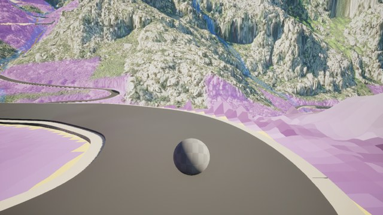
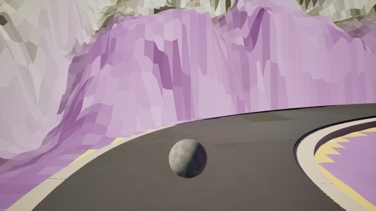
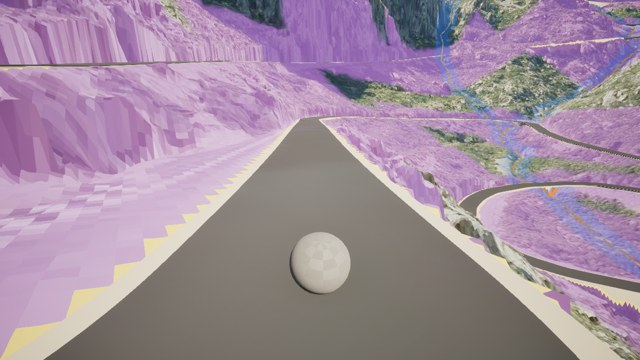
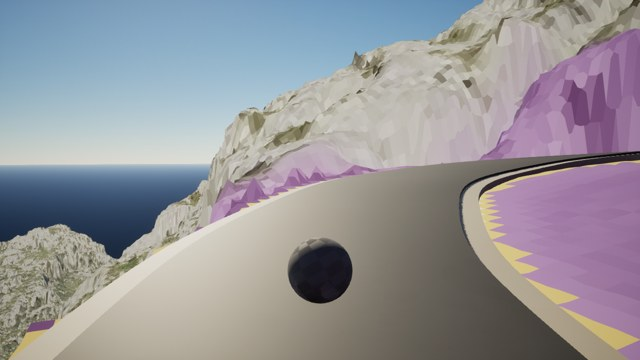
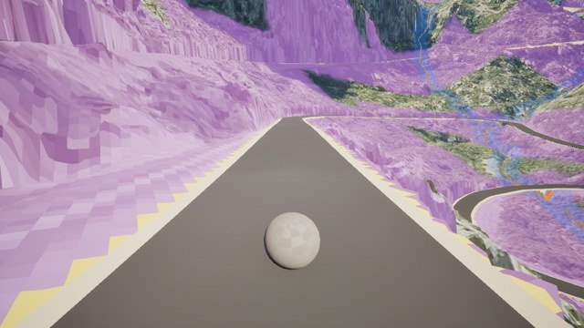
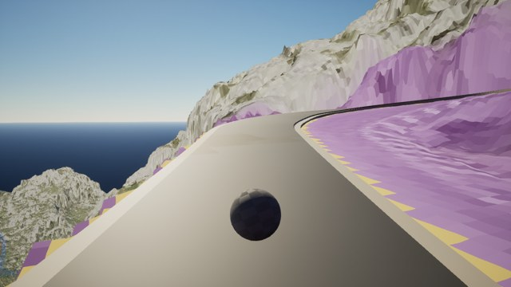
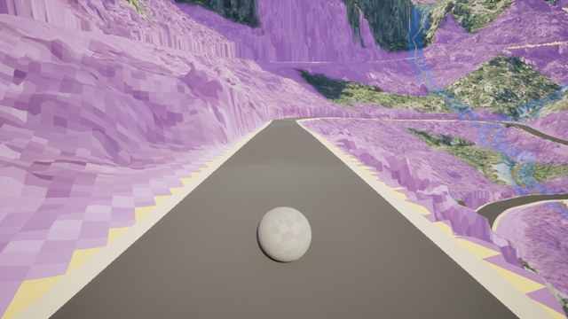
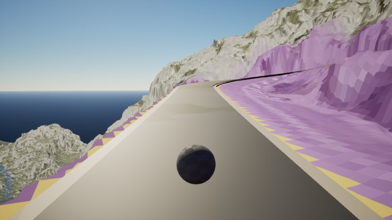
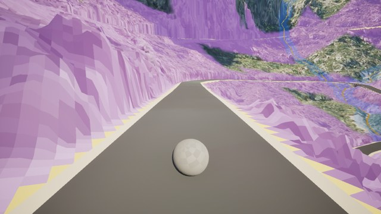
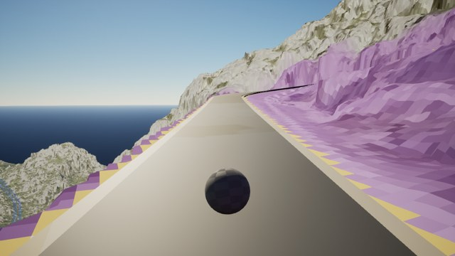

# TPP survey window: `VIAL_TR70190001272-1-interval-1-tile-0`

[Survey overview](../README.md)

Capture SHA: `b1ea05b33b9f3208e7aeb6884f1a67792d9c6121`. Both directions at the same local stations.

These JPEGs are copied viewing aids. Original PNGs and the offline HTML review are inside the full evidence ZIP linked from the overview.

Visual review: **PENDING_REVIEW**. Surface tags remain unassigned; camera stations are not surface boundaries.

| Local station | Forward | Reverse |
| --- | --- | --- |
| 0.00 m |  `frames/window-0009-forward-00000.png` |  `frames/window-0009-reverse-00004.png` |
| 16.28 m |  `frames/window-0009-forward-00001.png` |  `frames/window-0009-reverse-00003.png` |
| 32.57 m |  `frames/window-0009-forward-00002.png` |  `frames/window-0009-reverse-00002.png` |
| 48.85 m |  `frames/window-0009-forward-00003.png` |  `frames/window-0009-reverse-00001.png` |
| 65.13 m |  `frames/window-0009-forward-00004.png` |  `frames/window-0009-reverse-00000.png` |
