# TPP survey window: `accepted-hairpin`

[Survey overview](../README.md)

Capture SHA: `b1ea05b33b9f3208e7aeb6884f1a67792d9c6121`. Both directions at the same local stations.

These JPEGs are copied viewing aids. Original PNGs and the offline HTML review are inside the full evidence ZIP linked from the overview.

Visual review: **PENDING_REVIEW**. Surface tags remain unassigned; camera stations are not surface boundaries.

| Local station | Forward | Reverse |
| --- | --- | --- |
| 0.00 m | [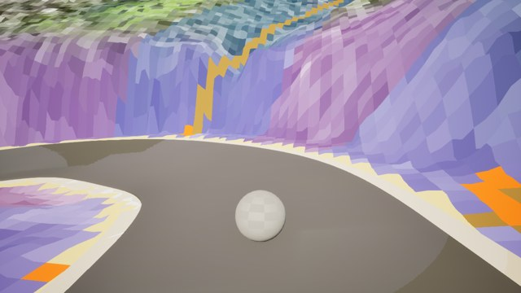](../thumbnails/window-0081-forward-00000.jpg) `frames/window-0081-forward-00000.png` | [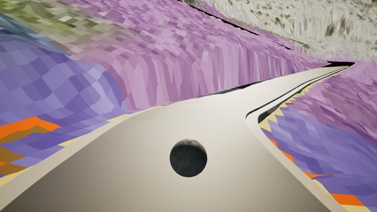](../thumbnails/window-0081-reverse-00016.jpg) `frames/window-0081-reverse-00016.png` |
| 19.23 m | [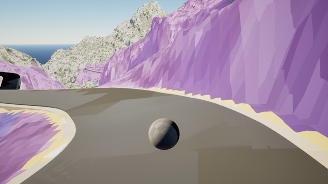](../thumbnails/window-0081-forward-00001.jpg) `frames/window-0081-forward-00001.png` | [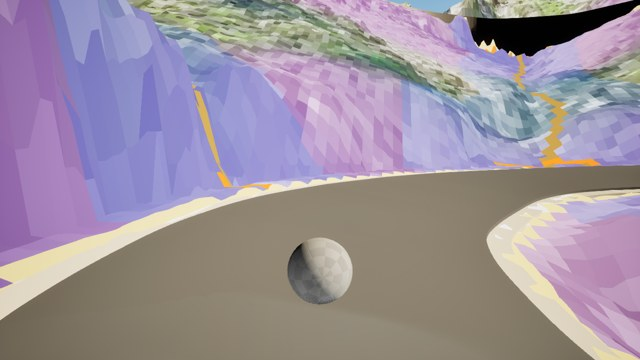](../thumbnails/window-0081-reverse-00015.jpg) `frames/window-0081-reverse-00015.png` |
| 38.47 m | [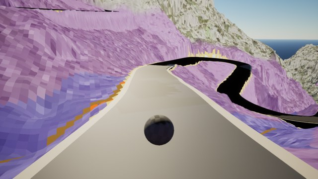](../thumbnails/window-0081-forward-00002.jpg) `frames/window-0081-forward-00002.png` | [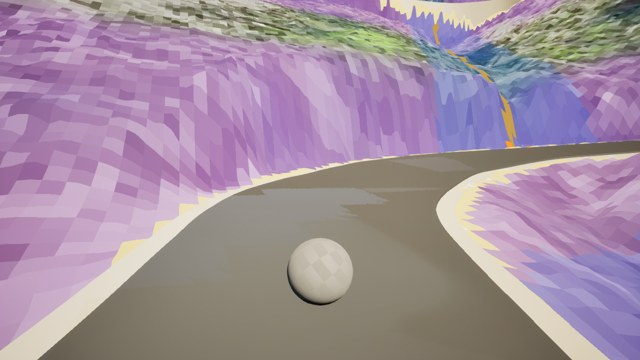](../thumbnails/window-0081-reverse-00014.jpg) `frames/window-0081-reverse-00014.png` |
| 57.70 m | [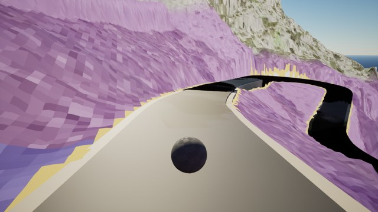](../thumbnails/window-0081-forward-00003.jpg) `frames/window-0081-forward-00003.png` | [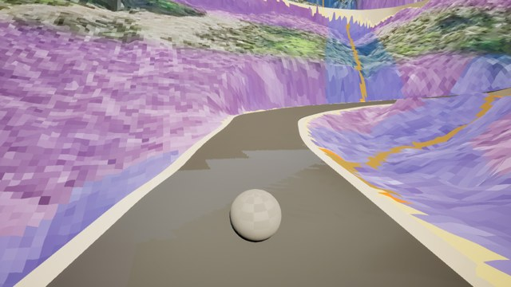](../thumbnails/window-0081-reverse-00013.jpg) `frames/window-0081-reverse-00013.png` |
| 76.93 m | [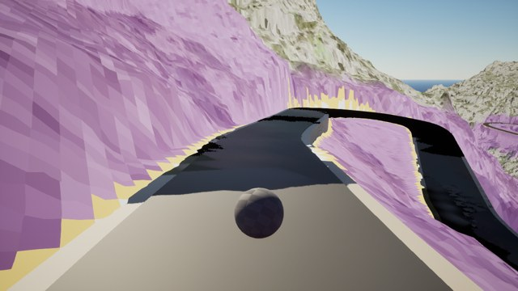](../thumbnails/window-0081-forward-00004.jpg) `frames/window-0081-forward-00004.png` | [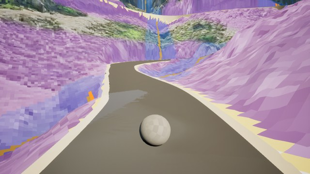](../thumbnails/window-0081-reverse-00012.jpg) `frames/window-0081-reverse-00012.png` |
| 96.17 m | [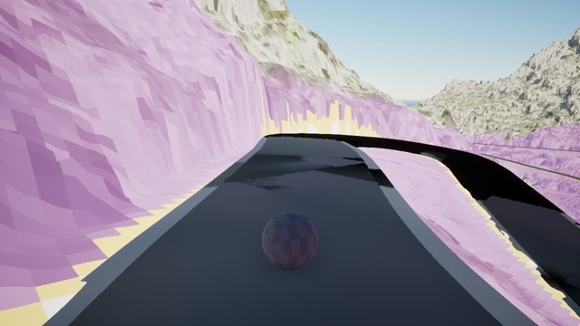](../thumbnails/window-0081-forward-00005.jpg) `frames/window-0081-forward-00005.png` | [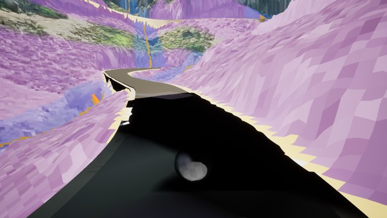](../thumbnails/window-0081-reverse-00011.jpg) `frames/window-0081-reverse-00011.png` |
| 115.40 m | [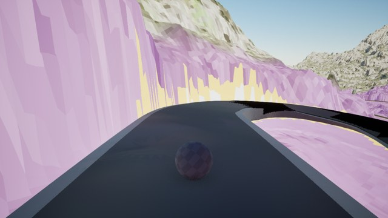](../thumbnails/window-0081-forward-00006.jpg) `frames/window-0081-forward-00006.png` | [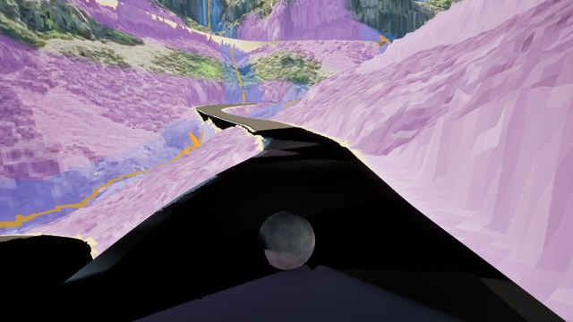](../thumbnails/window-0081-reverse-00010.jpg) `frames/window-0081-reverse-00010.png` |
| 134.63 m | [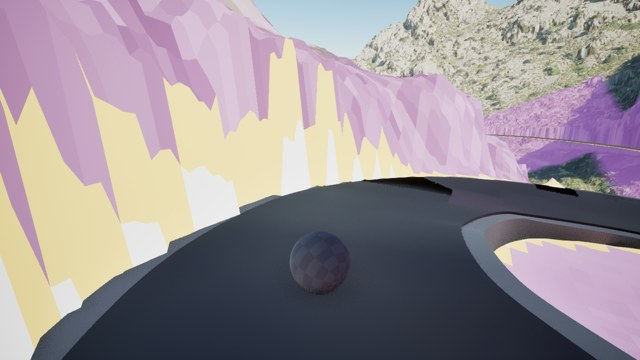](../thumbnails/window-0081-forward-00007.jpg) `frames/window-0081-forward-00007.png` | [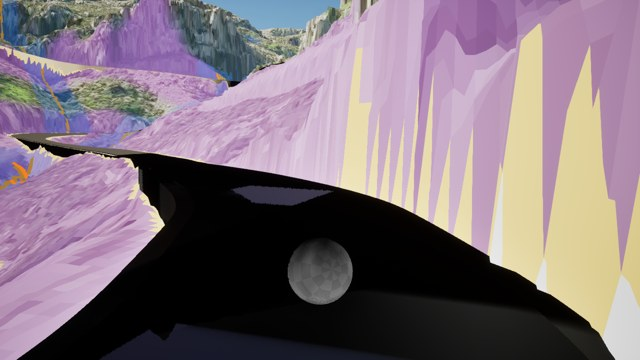](../thumbnails/window-0081-reverse-00009.jpg) `frames/window-0081-reverse-00009.png` |
| 153.87 m | [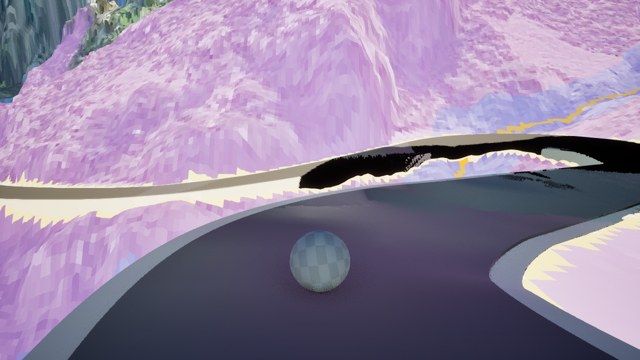](../thumbnails/window-0081-forward-00008.jpg) `frames/window-0081-forward-00008.png` | [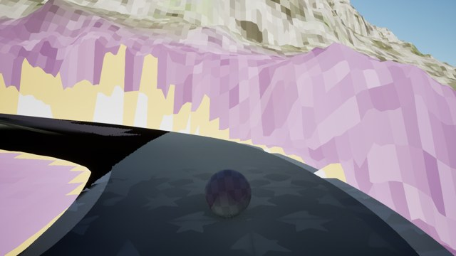](../thumbnails/window-0081-reverse-00008.jpg) `frames/window-0081-reverse-00008.png` |
| 173.10 m | [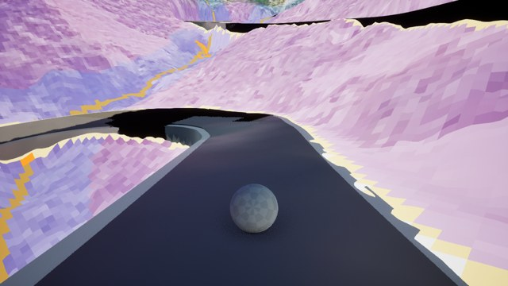](../thumbnails/window-0081-forward-00009.jpg) `frames/window-0081-forward-00009.png` | [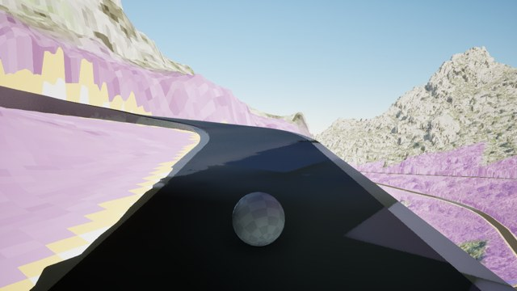](../thumbnails/window-0081-reverse-00007.jpg) `frames/window-0081-reverse-00007.png` |
| 192.33 m | [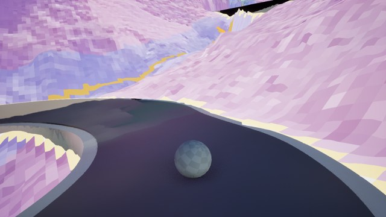](../thumbnails/window-0081-forward-00010.jpg) `frames/window-0081-forward-00010.png` | [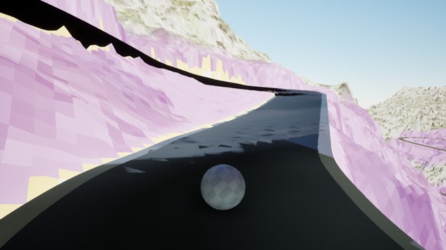](../thumbnails/window-0081-reverse-00006.jpg) `frames/window-0081-reverse-00006.png` |
| 211.56 m | [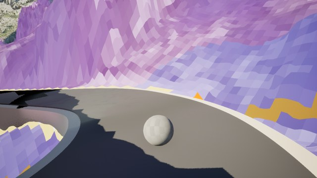](../thumbnails/window-0081-forward-00011.jpg) `frames/window-0081-forward-00011.png` | [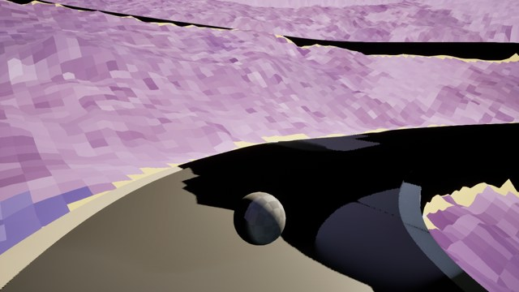](../thumbnails/window-0081-reverse-00005.jpg) `frames/window-0081-reverse-00005.png` |
| 230.80 m | [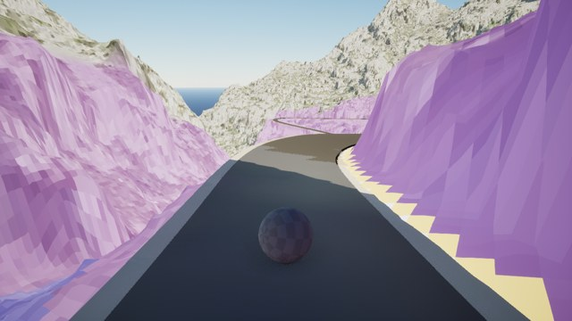](../thumbnails/window-0081-forward-00012.jpg) `frames/window-0081-forward-00012.png` | [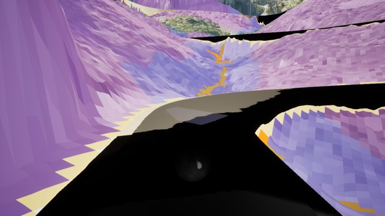](../thumbnails/window-0081-reverse-00004.jpg) `frames/window-0081-reverse-00004.png` |
| 250.03 m | [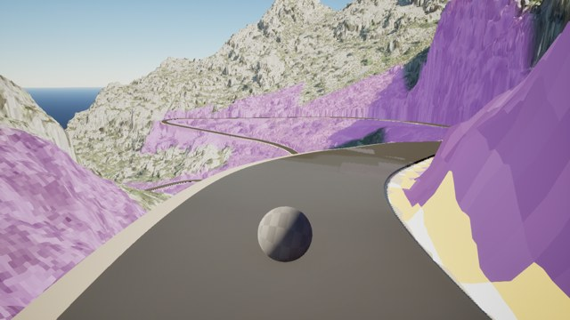](../thumbnails/window-0081-forward-00013.jpg) `frames/window-0081-forward-00013.png` | [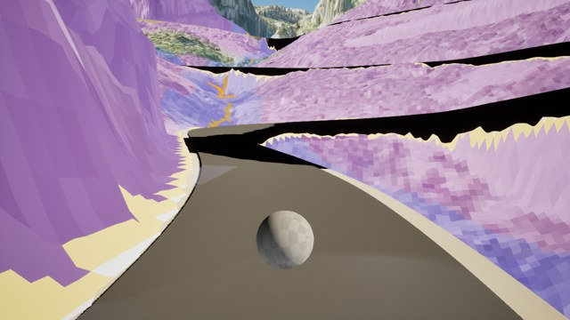](../thumbnails/window-0081-reverse-00003.jpg) `frames/window-0081-reverse-00003.png` |
| 269.26 m | [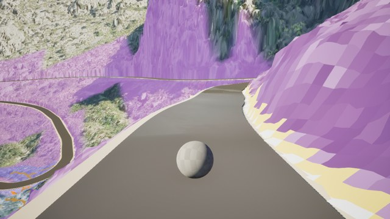](../thumbnails/window-0081-forward-00014.jpg) `frames/window-0081-forward-00014.png` | [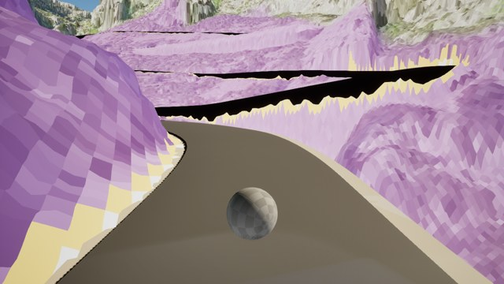](../thumbnails/window-0081-reverse-00002.jpg) `frames/window-0081-reverse-00002.png` |
| 288.50 m | [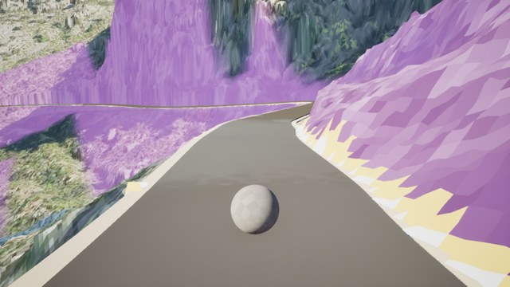](../thumbnails/window-0081-forward-00015.jpg) `frames/window-0081-forward-00015.png` | [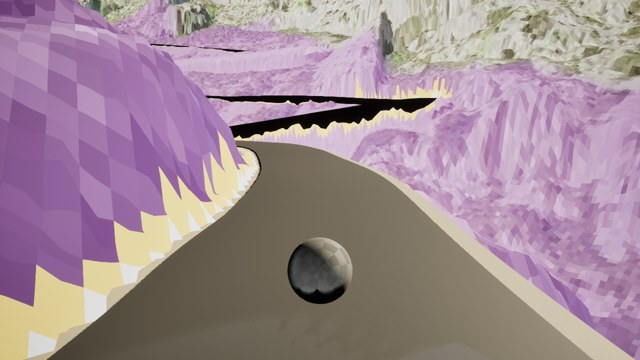](../thumbnails/window-0081-reverse-00001.jpg) `frames/window-0081-reverse-00001.png` |
| 307.73 m | [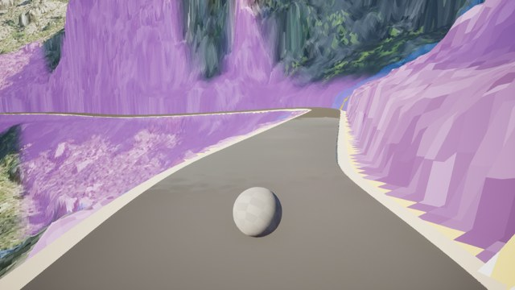](../thumbnails/window-0081-forward-00016.jpg) `frames/window-0081-forward-00016.png` | [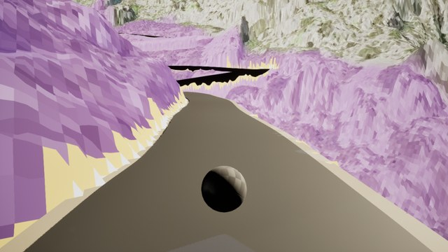](../thumbnails/window-0081-reverse-00000.jpg) `frames/window-0081-reverse-00000.png` |
