# YACS Texture Material Prep foundation

**Tracking:** [Issue #382](https://github.com/karnalooch/YetAnotherCyclingSim/issues/382)

**Status:** offline validation/recipe foundation implemented; UE adapter is pseudocode, Unreal validation pending

**Evidence date:** 2026-10-05

**Inspected main:** `83b5281909c855247335f626ca8698dc06ffc6a8`

**Target:** UE 5.8.2, changelist 56702186, compatible changelist 55116800

## Purpose and authority

Prepare reusable tileable texture candidates independently of the world. The
reviewed `TG_YACS_MaterialPrep` Texture Graph is the sole image-processing
authority inside UE. MCP selects a recipe, sets checked parameters and requests
render/export/validation. It must not implement a second image-processing chain.
Offline code may measure immutable images and assemble diagnostic contact sheets;
those images are evidence, never replacement production textures.

[The documentation index](../README.md) routes authority to the
[World Building Bible](../WORLD_BUILDING_BIBLE.md),
[MCP contract](../UE_MCP_WORLD_GENERATION.md),
[remote editor contract](../YACS_REMOTE_EDITOR_AGENT.md),
[asset ledger](../ASSET_PLAN.md) and
[validation tiers](../CI_VALIDATION_TIERS.md). They remain authoritative.
This supports M3 tooling; it neither starts a later world-finishing step nor
changes the #335 / #363-#374 delivery order.

No existing texture, material, map, scene, Landscape, road, BOB output, geometry,
world mask, PCG graph or runtime consumer is changed. Material assignment and
integration with the Landscape pipeline are separate future work. The first proof
is a texture proof, not world or performance admission.

## Delivery decision and tools-first audit

This PR supplies a version-backed design, implementer runbook, an offline
BaseColor validator and a recipe planner that explicitly blocks UE execution.
It installs no plugin, registers no MCP tool and creates no `.uasset`.
See [commands and adapter pseudocode](TEXTURE_MATERIAL_PREP_EXAMPLES.md) for the
implemented subset and exact limitations.

| Candidate | Evidence and decision |
|---|---|
| Embark `texture-synthesis` | Public example-based synthesis, tiling and inpainting are useful architectural references. Its repository is archived. No source is copied, vendored or executed; it is not the requested UE processing authority. |
| Epic Texture Graph | Selected processor: reusable graph, parameters and output settings. Actual seams, wrap behavior, normal convention and successful export still need a YACS proof. |
| Existing db-lyon `ue-mcp` 1.3.9 | Retain the pinned single orchestration/safety surface. Native routing remains disabled until an isolated integration proof. |
| Epic Toolset Registry | Selected future tool-definition mechanism behind those guards. No second agent-facing MCP server and no `All Toolsets` enablement. |
| Custom YACS code | Limit to recipe validation, namespace guards, parameter/readback adapters and measurements. No custom pixel-processing backend or generic editor-control framework. |

The repository is not ready for activation. Texture Graph is not explicitly
enabled in the inspected project and is disabled by default in the installed
descriptor. Neither the graph nor the named limestone source appears in tracked
main paths. Native MCP/reflection execution is unproven. Open implementation PRs
#338 and #381 occupied the two-branch limit in `AGENTS.md`. On 2026-10-05 the
owner explicitly authorized a **third implementation PR for this task**. That
bounded exception permits this independent offline foundation, not consumption
of unmerged code/assets or changes to the existing world delivery sequence.

## Version and API findings

Official 5.8 documentation establishes capability; the installed Epic sources
establish this host's exact behavior. No engine source is redistributed here.

| Operation | Verified evidence | Adapter requirement / remaining proof |
|---|---|---|
| Input and controls | `UTG_BlueprintFunctionLibrary` has texture, scalar, vector, color and boolean setters/getters | Check parameter existence/type before setting; invalid setters can log and return `void`. Read back every value. |
| Output settings | `SetSettingsParameterValue` accepts dimensions, name, path, format, preset, LOD group, compression and sRGB | Bind an explicit settings parameter per output; reject `Auto` dimensions. Check effective settings after preset application and exported texture readback. |
| Render | `RenderTextureGraph` delegates to `ActivateBlocking` and returns render targets | It can block the game thread. Array order is not a semantic map-name contract. Prove output association and lifetime. |
| Export | `ExportTextureGraph` delegates to `UTG_AsyncExportTask`; installed code calls `ExportAsUAsset` | UE asset export, not a verified PNG/EXR disk API. Return type is `void`; default overwrite is true, save is false, export-all is false. Pass every flag explicitly and inspect results. |
| Async lifecycle | Render task exposes `OnDone` with render targets; export task exposes `OnDone` without a success payload | Keep task/graph references alive; completion alone is insufficient. Prove error handling, job ownership, timeout behavior and postconditions. |
| Reflection | Header/API use `ScriptName="TextureScreptingLibrary"` (the spelling is Epic's) | Do not guess `unreal.TG_BlueprintFunctionLibrary` or Python enum/member names. Probe reflected signatures in a disposable editor first. |
| Tool registration | `UToolsetDefinition` and Python `toolset_registry.tool_call` exist locally | Python discovery, annotations, structured results and routing through YACS guards need a smoke test. |

The installed Texture Graph descriptor says `VersionName: 1.0 Beta` and
`IsExperimentalVersion: false`; Epic's overview still labels it Experimental.
Record this mismatch without claiming production maturity. The official MCP
page's example `ToolsetRegistry/.../core/actor.py` path is absent on this host;
the installed example is under
`Engine/Plugins/Experimental/Toolsets/EditorToolset/Content/Python/editor_toolset/toolsets/actor.py`.
This is a layout difference, not evidence that Toolset Registry is missing.

The installed Blueprint library does not show an export macro on its class,
whereas the async task headers expose selected methods with `TEXTUREGRAPH_API`.
Cross-module direct C++ linking is therefore **unverified**, not a promised drop-in
wrapper. Try verified reflected Blueprint/Python calls first; require a bounded
compile/link proof before selecting a C++ adapter. Do not patch the engine.

## Proposed data flow

```mermaid
flowchart LR
    SRC["INPUT<br/>Immutable source + provenance"] --> PLAN["YACS CONTRACT<br/>Recipe + scale + guards"]
    PLAN --> MCP["CONTROL<br/>YACS Texture Toolset"]
    MCP --> TG["PROCESSING AUTHORITY<br/>TG_YACS_MaterialPrep"]
    TG --> RUN["CANDIDATE<br/>New run outputs"]
    RUN --> QA["VERIFY<br/>Metrics + 2x2 / 4x4"]
    QA --> REVIEW["REVIEW<br/>Human visual acceptance"]
    QA -.->|failure| STOP["HOLD<br/>Unaccepted evidence"]
    REVIEW -.->|separate future task| WORLD["FUTURE CONSUMER<br/>World material integration"]
    classDef input fill:#303846,stroke:#8ea1b8,color:#f7f9fc,stroke-width:2px;
    classDef exec fill:#123f73,stroke:#49a2ff,color:#ffffff,stroke-width:3px;
    classDef tool fill:#4b2f69,stroke:#b77cff,color:#ffffff,stroke-width:2px;
    classDef decision fill:#69470e,stroke:#f0a72f,color:#ffffff,stroke-width:3px;
    classDef danger fill:#6b2429,stroke:#ff6b73,color:#ffffff,stroke-width:3px;
    classDef owned fill:#34373d,stroke:#9da4ae,color:#ffffff,stroke-width:2px;
    classDef evidence fill:#164d5c,stroke:#5bd6ef,color:#ffffff,stroke-width:2px;
    class SRC input;
    class PLAN owned;
    class MCP tool;
    class TG exec;
    class RUN,QA evidence;
    class REVIEW decision;
    class STOP danger;
    class WORLD input;
    linkStyle default stroke-width:2px;
```

### Identity and storage

- Source bytes are immutable. Record SHA-256, actual dimensions, bit depth,
  color profile/transfer, alpha handling, source URI, generation workflow and
  provenance review. Filename alone is not identity. Unknown license/source
  status blocks admission under the existing provenance policy.
- Proposed reviewed template root:
  `/Game/Generated/YACS/TextureMaterialPrep/Templates/`. The template is read-only
  during jobs; use a transient working copy. No template asset exists yet.
- Proposed export root:
  `/Game/Generated/YACS/TextureMaterialPrep/Runs/<run_id>/`.
  `run_id` is a server-generated UUID, never a caller-supplied path. An existing
  package or on-disk destination is a hard collision, including retries.
- Evidence belongs in ignored
  `Saved/RuntimeProof/TextureMaterialPrep/<run_id>/`: request, capability receipt,
  metrics, previews, hashes, export receipt and failure log. Resolve host paths
  through the [workspace contract](LOCAL_WORKSPACE.md).
- A recipe identity hashes canonical parameters, source SHA, graph/dependency
  hashes, engine build and output contract version. A run ID is an attempt;
  identical recipes can have multiple independently verified attempts.
- Reject invalid names, traversal, alternate roots, separators inside IDs,
  unknown fields, NaN/infinity and path-prefix lookalikes. Enumerate every graph
  output before export; a hidden output outside the namespace aborts the job.
  Filesystem evidence paths must resolve inside their run directory, including
  junction/symlink checks. No user code, console string or arbitrary asset path.

## `TG_YACS_MaterialPrep` contract

The names below are **proposed YACS parameters**, not claims about built-in Epic
nodes or a graph already present. Author one reviewed template from installed
Texture Graph examples where applicable; do not build arbitrary graphs per call.

| Parameter | Unit / allowed value | Initial candidate |
|---|---|---|
| `AI_Source` | validated Texture2D handle from the source manifest | required |
| `WorldSizeMeters` | positive finite XY tile coverage, metres | unresolved for limestone; 2 x 2 m is a hypothesis only |
| `OutputResolution` | explicit width/height, each 256/512/1024/2048/4096 px | 512 x 512 smoke |
| `SeamBlendWidth` | fraction of one tile edge, 0..0.25 | 0.05, provisional |
| `DeLightStrength` | 0..1, bounded illumination correction | 0 baseline, then 0.25 trial |
| `ColorGain` | per-channel linear multiplier, 0.5..2 | 1,1,1 |
| `HeightStrength` | 0..1 artistic relief contrast | 0.5, inferred only |
| `NormalStrength` | 0..4 artistic amplitude | 1; orientation proof required |
| `RoughnessMin`, `RoughnessMax` | 0..1 with min <= max | 0.55 / 0.9, uncalibrated |
| `MacroVariation` | 0..1 mask contrast, not automatic albedo multiplication | 0 |
| `Seed` | integer 0..2147483647 | 0; deterministic graph binding must be proven |
| `GenerateAO` | boolean | false; optional later heuristic |

Stage recipe:

1. **Input/decode:** document source transfer and alpha policy; operate on linear
   color for de-light math. Opaque material input requires alpha=1. Reject
   unhandled ICC/profile or HDR inputs instead of silently treating them as sRGB.
2. **Color/de-light:** separate slow luminance variation from local detail;
   apply bounded correction and color gain, preserving source chroma/mean unless
   the recipe explicitly requests otherwise. Candidate math is division by a
   wrap-filtered low-frequency field normalized to mean 1, blended by strength.
   This is a proposed TG subgraph, not a native `DeLight` node. Deep shadows and
   highlights cannot reliably be recovered from one RGB image.
3. **Seam repair:** wrap-offset 0.5/0.5 to reveal seams; use X/Y bands and a joint
   corner mask with an explicit blend/warp recipe, then restore phase. All
   neighbourhood filters must wrap. A simple crossfade can duplicate features;
   neither a half-offset nor equal endpoints proves a good tile. Reject blurred
   crosses, corner defects and repeated distinctive blocks. No assumed native
   `MakeSeamless` or inpainting node. If a TG recipe fails, stop and document the
   gap instead of invoking an undeclared external processor.
4. **Height:** derive a bounded, band-limited artistic relief estimate from the
   repaired image; do not equate brightness with measured geometry or metres.
   Keep the same UV phase as BaseColor. No displacement consumer is activated.
5. **Normal:** use verified `NormalFromHeightMap` behavior or a reviewed TG
   material-function subgraph. Prove periodic gradients and the DirectX tangent
   convention with a known ramp; do not infer the green-channel sign from a name.
6. **Roughness:** map a reviewed feature mask into the declared range. This is an
   artist hypothesis, not measured reflectance and not automatically `1-height`.
7. **Macro mask:** produce a wrap-safe low-frequency mask with deterministic
   variation and the same scale contract. Keep it separate from BaseColor;
   a future consumer may use it to reduce repetition.
8. **Outputs:** run cross-map alignment and seam validation after all stages.
   Every map uses the same UV transform. Optional AO is derived/stylized, never
   asserted as measured occlusion. Channel packing is deferred.

TG Transform, Blend, Levels, HSV, Blur, math and NormalFromHeightMap are documented
building blocks. Exact filtering/wrap, seed and mask behavior above are YACS
requirements requiring node/source inspection and a graph proof. A custom material
function may fill a demonstrated gap **inside TG**, with its hash/version recorded.

### Output contract

Each output has an explicit settings parameter named `Settings_<role>`.
Unverified enum mappings fail capability inspection; do not guess Python enums.

| Role / suffix | Encoding and sRGB | Precision/compression requirement |
|---|---|---|
| `_BaseColor` | RGB color; sRGB true on exported texture | BGRA8 candidate / color compression; check decoded result |
| `_Height` | scalar linear; sRGB false | 16-bit or higher source precision; no automatic 8-bit fallback; exact supported TG format must be probed |
| `_Normal` | tangent-space DirectX XYZ; sRGB false | normal-map compression; read back effective settings and decoded vectors |
| `_Roughness` | scalar linear; sRGB false | mask/data compression; inspect channel and min/max |
| `_MacroMask` | scalar linear; sRGB false | mask/data compression; inspect range and periodicity |
| `_AO` (optional) | scalar linear; sRGB false | separate declared heuristic; excluded from the initial required outputs |

The saved receipt includes per-map asset path, output role, source/dependency
hashes, dimensions, effective format, sRGB, compression, mip/address modes,
graph/recipe version and run SHA. Record native input and output dimensions
separately. `pixels_per_meter = [width/world_size_x, height/world_size_y]`;
upsampling never creates source detail. Scale records include provenance and
`proposed` or `reviewed` status. Missing or merely proposed scale cannot receive
final admission even if numerical texture checks pass.

## Small YACS Texture MCP Toolset

These are proposed domain operations, not installed MCP tools. Use typed,
versioned requests/results and one per-editor job lock. The existing adapter
must retain its guards and routing policy; no guard-bypass Python fallback.

| Operation | Input | Effect / result |
|---|---|---|
| `inspect_capabilities` | none | Read engine/plugin/reflection/template contracts; return supported operations and explicit blockers. |
| `analyze_texture` | registered source ID | Read-only metadata, seam and luminance baseline; never repairs pixels. |
| `prepare_texture` | source ID, preset ID, parameter patch | Validate and freeze a recipe; seam/de-light/height/normal/roughness/macro stages are TG parameters. Returns plan ID and requested stages, not generated images. |
| `render_preview` | immutable plan ID | Start bounded TG render job; return job ID. No persistent asset save. |
| `export_pbr_set` | completed plan/render identity | New run namespace only, explicit no-overwrite, exact expected roles; verify exported assets and save only owned new packages. |
| `validate_texture` | source/run ID | Read pixels/settings and produce metrics, previews and separate technical/visual/scale statuses. |
| `get_job_status` | job ID | Return pending/running/completed/failed/timed-out plus immutable evidence references. |

One `prepare_texture` keeps the toolset small: `make_seamless`, `delight_texture`,
`generate_height`, `generate_normal`, `generate_roughness` and
`generate_macro_variation` are named recipe stages, not independent image engines.

Common result fields: `schema_version`, `status`, `operation`, `job_id`, `plan_id`,
`engine_build`, `graph_hash`, `input_hash`, `evidence`, `warnings`, `error_code`.
Capability failures include `PLUGIN_DISABLED`, `UNSUPPORTED_API`,
`TEMPLATE_MISSING`, `SOURCE_UNRESOLVED` and `ROUTING_NOT_ADMITTED`. Other failures
include `PARAMETER_MISMATCH`, `OUTPUT_COLLISION`, `EXPORT_INCOMPLETE`, `BUSY` and
`TIMEOUT`. Unknown or unsupported states are never converted to success.

### Job and export lifecycle

States: `prepared -> rendering -> preview_ready -> exporting -> validating ->
technical_pass / review_required / failed`. `technical_pass` is not visual,
provenance, scale or production admission. Parameter changes invalidate the
render identity and require a new plan.

The MCP call should acknowledge a bounded asynchronous job rather than invoke a
blocking render on the active session. A client timeout is not engine cancellation:
retain the lock until the task really ends, ignore late promotion, and quarantine
all late/partial output. Do not promise hard cancellation of native TG tasks.
Keep strong references until completion and readback. The first UE smoke must run
in a disposable proof context, not the owner's live editor.

Reserve fresh destinations and enumerate every effective graph output before
starting export. Explicitly set overwrite=false, save=false, export-all=false;
verify only expected outputs are selected. TG export can re-render: re-check
recipe/source identity and compare decoded export to preview before acceptance.
The adapter then validates and saves only the new packages listed in its receipt.
Saving and reopening them must be proved; save=false does not mean no in-memory
assets were created. Never Save All. If precise output selection or package-save
behavior cannot be verified, return `UNSUPPORTED_API` without exporting.

No pre-existing package is overwritten or deleted. A failed run retains its
manifest and any newly owned partial files as unaccepted evidence; cleanup is a
separate explicit operation, not a blanket delete. Check source/template hashes,
pre-existing dirty-package state and current world identity before/after.

See [adapter and measurement examples](TEXTURE_MATERIAL_PREP_EXAMPLES.md).

## Validation and provisional screening policy

Run on source, uncompressed TG outputs and decoded exported assets. Record which
representation was measured; lossless-source metrics do not prove compressed mip
behavior. Reject non-finite values, missing roles, zero dimensions, unsupported
profiles, dimension/settings mismatches and invalid alpha before scoring.

### Tiling and seams

- Produce source/processed **2x2 and 4x4** panels, a half-offset view, seam-band
  crops and corner crops. Label actual source size, output size, meters per tile,
  color space and representation. Preserve full-resolution 1:1 seam crops;
  thumbnail contact sheets must be labelled downsampled. At 4K use bounded crops
  and labelled previews instead of an accidental unbounded 16K working allocation.
- On normalized **linear RGB**, report X/Y boundary absolute difference mean,
  p95 and max. Compare each boundary mean to the corresponding mean absolute
  interior adjacent-pixel step. Use `null` ratio when that interior mean is zero;
  preserve the absolute error. A flat image cannot divide by zero or fabricate
  infinity in JSON.
- Report wrap-gradient mismatch: compare the signed last-to-first step with
  the incoming and outgoing one-pixel steps on each axis. Include p95 and max.
  This catches copied/equal outer rows that hide a derivative kink. Also inspect
  band profiles, central repaired bands and four-corner junctions.
- Evaluate all required maps. For normals, also decode vectors and report angular
  boundary differences. Repeat at representative mips; validate runtime wrap
  addressing in the later UE sample material. Opposite endpoint equality is
  neither mathematically required for adjacent periodic texel samples nor a
  sufficient visual criterion.

Candidate screening limits for linear BaseColor: per-axis seam mean <= 0.025,
p95 <= 0.075, seam/interior ratio <= 1.25 when interior mean >= 0.001, gradient
mismatch p95 <= 0.05. With lower interior variation, use an absolute seam mean
limit of 0.002. Exceeding a limit produces `review_required`; malformed data
produces `failed`. These are **uncalibrated YACS heuristics**, not Epic standards
or a limestone PASS. Calibrate once against reviewed good/bad tiles and version
the policy before admission. Do not auto-adjust limits to make one image pass.
Other maps need role-specific thresholds; until calibrated, their results remain
`review_required` rather than borrowing BaseColor limits.

### Luminance, de-light and material checks

Compute linear luminance `Y = 0.2126 R + 0.7152 G + 0.0722 B`, histogram quantiles
p01/p05/p50/p95/p99, channel/luminance means and fractions near black/white.
Use thresholds 0.001 / 0.999 for reporting clipping, not physical albedo truth.
Report low-frequency variation from a fixed 8x8 grid of mean luminance, row/column
drift and a fitted luminance plane including its explained variance. Compare
before/after at matched resolution, profile and exposure; never compare an sRGB
histogram directly to linear values.

For a de-light trial, report low-frequency variation reduction and mean/chroma
shift, with a mean-luminance relative drift >10% or clipping increase >0.5
percentage point flagged for review. Near-zero source mean uses absolute drift
instead. Lower variance alone is not success: natural strata have broad color
variation, and flattened/blurred stone can score well. Side-by-side review must
preserve continuous limestone character, avoid baked directional shadows and
specular highlights, and retain detail. Illumination vs reflectance remains
ambiguous from a single image; no claim of physically recovered albedo.

Height/roughness/AO remain inferred. Validate height range/precision, roughness
range, mask contrast, UV alignment and normal-vector length/orientation. A known
bump/ramp under a simple isolated preview material must confirm the DirectX
normal convention. Record output memory/mip estimates; performance acceptance
waits for a separately authorized real consumer measurement.

## First proof: `YACS_SC_Limestone_01_BaseColor`

1. Resolve the exact source bytes or source asset. Do not use a chat thumbnail or
   assume a local filename is a production source. Record provenance, generation
   notes, SHA-256, dimensions/profile and rock-type review. The source has not been
   located in tracked main; earlier conversation measurements are unverified data.
2. Review physical coverage. A 2 m square is a candidate assumption only. Record
   unresolved scale and keep final admission blocked until reviewed. Do not
   report 1254 px or 4K as measured without reading these exact bytes.
3. After capacity and plugin/routing entry gates, run a 256/512 px synthetic
   checker/ramp/periodic fixture in a disposable editor. Verify parameters,
   output names/settings, no-overwrite, errors, timeout handling and fresh reopen.
4. Analyze the immutable limestone baseline and record 2x2/4x4 panels. Render
   baseline, seam-only and seam+de-light recipes at 512 px, keeping identical UVs,
   seed and output settings. Preserve all receipts, including rejected trials.
5. Review continuous exposed limestone rather than detached rubble/paving. Inspect
   seam bands/corners, gradients, directional shadows and distinctive repetition.
   Do not solve repetition by changing world geometry or importing into BOB.
6. Produce aligned BaseColor/Height/Normal/Roughness/MacroMask candidates. Compare
   TG outputs with exported Texture2D data, mips and effective settings. Save and
   reopen only this run's new assets in the proof context.
7. Repeat the same recipe and compare decoded pixels with a declared tolerance
   (initial candidate 1/255 per channel for 8-bit outputs). Compare metadata exactly.
   Package-byte identity is not required if serialization metadata differs; record
   package hashes and pixel hashes separately. Any tolerance needs justification.
8. Only after low-resolution proof, evaluate native-resolution/2K/4K candidates
   with source-detail and memory limits. No upsample-based claim of new detail.
   Record separate execution, numerical, scale, provenance and human-review status.
   World assignment remains a separate task after its existing gates.

Expected evidence bundle: `source.json`, `recipe.json`, `capabilities.json`,
`manifest.json`, `metrics-source.json`, `metrics-output.json`, `tiling-2x2.png`,
`tiling-4x4.png`, seam/corner crops, before/after plates, normal-ramp capture,
`export-receipt.json`, `reopen-receipt.json` and an owner-review record. These are
future proof outputs, not files produced by this specification PR.

## Delivery and follow-up gates

Current checks are documentation guards, architecture contract, Python syntax,
synthetic metric/recipe/CLI cases and diff scope. No Unreal build, editor render,
export, LFS fetch, GPU benchmark or network MCP activation is needed for this
offline foundation PR.
Use a draft PR with `Closes #382`. Closing the specification issue must not be
reported as completion of the deferred UE feature.

UE activation starts only after rechecking current main, source/provenance and
the isolated editor plan. First make runtime capability inspection and parameter
round-trip work; then one graph render/export/reopen; then selected
tool routing; then the limestone proof. A remote execution command would need a
separate named allowlist addition and trusted Proof Broker admission. The current
`smoke-cube` transport cannot run texture jobs. Do not expand it in this PR.

Gumball promotion decision: no candidate yet. The potentially reusable invariant
is to bind export acceptance to exact input/recipe identity and verified
postconditions rather than a void API return. Promote only after implementation
and failure-path proof; do not promote YACS-specific paths, thresholds or assets.

## Primary references and reproducible source evidence

- [Epic: Texture Graph overview](https://dev.epicgames.com/documentation/en-us/unreal-engine/getting-started-with-texture-graph-in-unreal-engine).
- [Epic: Blueprint function library](https://dev.epicgames.com/documentation/en-us/unreal-engine/API/Plugins/TextureGraph/UTG_BlueprintFunctionLibrary).
- [Epic: output settings API](https://dev.epicgames.com/documentation/unreal-engine/API/Plugins/TextureGraph/UTG_BlueprintFunctionLibrary/SetSettingsParameterValue).
- [Epic: node reference](https://dev.epicgames.com/documentation/en-us/unreal-engine/texture-graph-node-reference-in-unreal-engine).
- [Epic: async export API](https://dev.epicgames.com/documentation/unreal-engine/API/Plugins/TextureGraph/UTG_AsyncExportTask).
- [Epic: Unreal MCP, UE 5.8](https://dev.epicgames.com/documentation/en-us/unreal-engine/unreal-mcp-in-unreal-editor?application_version=5.8).
- [Embark: texture-synthesis](https://github.com/EmbarkStudios/texture-synthesis), reference only; no copied source or new dependency.

Hashes below are SHA-256 of the installed source bytes inspected on 2026-10-05.
Paths are relative to the configured engine root. Recheck them on the actual
runner; matching documentation titles alone cannot pin a patch-level build.

| File | SHA-256 |
|---|---|
| `Engine/Build/Build.version` | `ff99fc3dd98e7c7fd2f5700334bc792dfb7baced3828cdee32940bb69581a6a4` |
| `Engine/Plugins/TextureGraph/TextureGraph.uplugin` | `a6d8c131be2aefb09ea4b8793de6cdfc71257d1cc1342ab988a80fe752863183` |
| `Engine/Plugins/TextureGraph/Source/TextureGraph/Public/Blueprint/TG_BlueprintFunctionLibrary.h` | `c433c9b4df435b233a62ba0230b53dec1ad195f340a747e3c4ec5c80f4f93e6a` |
| `Engine/Plugins/TextureGraph/Source/TextureGraph/Private/Blueprint/TG_BlueprintFunctionLibrary.cpp` | `cae843cfd0438de02095c91bf56a35c14bfc853ae4c89493127bdb73491eeb1f` |
| `Engine/Plugins/TextureGraph/Source/TextureGraph/Private/Blueprint/TG_AsyncRenderTask.cpp` | `1a5d2d991535b68a45b428a799c480d3ee3d9afccc960277d37a60a636584025` |
| `Engine/Plugins/TextureGraph/Source/TextureGraph/Private/Blueprint/TG_AsyncExportTask.cpp` | `ef0ca29ea64e0c79a63cb0fe5369b9b5d725042e7f2f336a9816f3c146f39c60` |

Additional inspected local contracts: `TG_OutputSettings.h`, async task headers,
`ToolsetRegistry.uplugin`, `ModelContextProtocol.uplugin`,
`ToolsetRegistry/ToolsetDefinition.h` and Python `toolset_registry/__init__.py`.
No PCGEx operation or unmerged texture-audit extension is required by this design.
